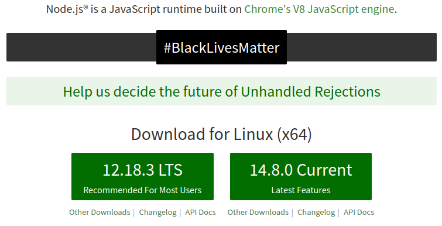
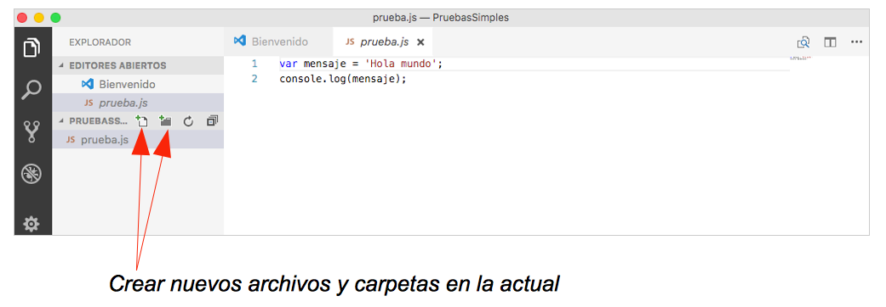
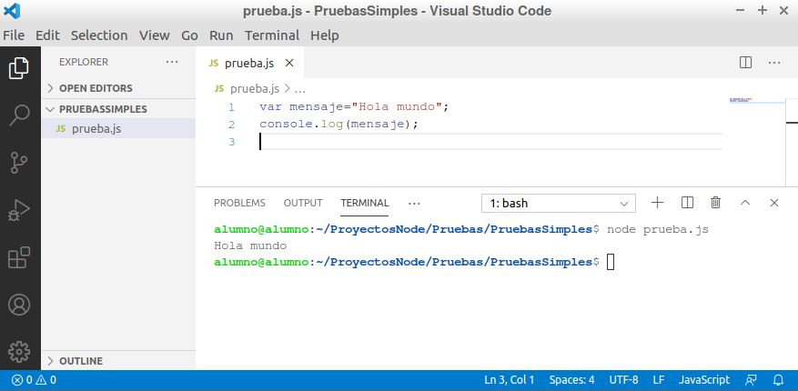
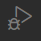
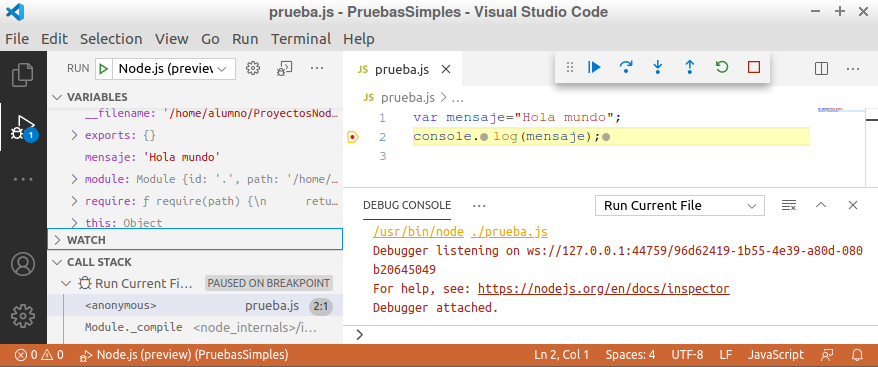
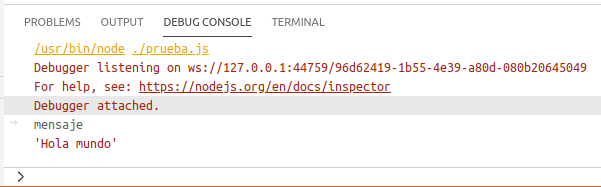
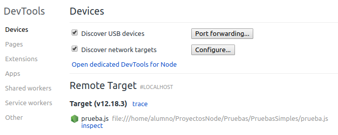
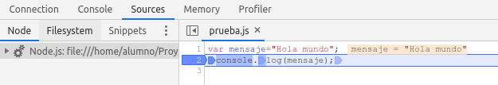
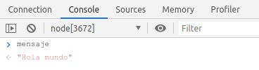
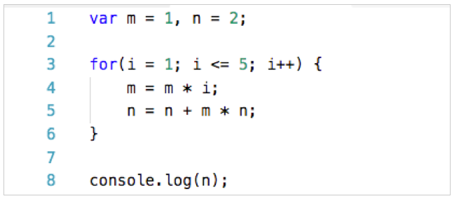

# Tema 1. Introducción a Node.js y Express.js

## 1.3. Introducción a Node.js

### 1.3.1. ¿Qué es Node.js?

Node.js es un entorno de ejecución en el lado del servidor construido utilizando el motor Javascript de Google Chrome, llamado V8. En esta sesión veremos cómo instalarlo y empezar a trabajar con él, pero antes conviene ser conscientes de lo que supone este paso en la historia del desarrollo web.

#### 1.3.1.1. Evolución de Javascript

Como hemos comentado, Node.js es un entorno que emplea el lenguaje de programación Javascript y que se ejecuta en el lado del servidor. Esta afirmación puede resultar mundana, pero en realidad es algo sorprendente. Si echamos la vista atrás, el lenguaje Javascript ha pasado por varias etapas o fases de expansión sucesivas:

1. La primera tuvo lugar con el primer apogeo de la web, allá por los años 90. Se comenzaban a desarrollar webs con HTML, y el Javascript que se empleaba entonces permitía añadir dinamismo a esas páginas, bien validando formularios, abriendo ventanas, o explorando el DOM (estructura de elementos de la página), añadiendo o quitando contenidos del mismo. Era lo que se conocía como HTML dinámico o DHTML.
2. La segunda etapa llegó con la incorporación de las comunicaciones asíncronas, es decir, con AJAX, más o menos a principios del siglo XXI. Se desarrollaron librerías como *Prototype* (primero) o *jQuery* (después) que abrieron todo un mundo nuevo de posibilidades con el lenguaje. Con ellas se podían actualizar fragmentos de la página, llamando desde Javascript a documentos del servidor, recogiendo la respuesta y pegándola en una zona concreta de la página, sin necesidad de recargarla por completo.
3. Una siguiente etapa, vinculada a la anterior, tuvo lugar con la aparición de distintos frameworks Javascript para desarrollo de aplicaciones web en el lado del cliente, o *frontends*. Mediante una serie de funcionalidades incorporadas, y de librerías externas, permiten dotar a la aplicación cliente de una estructura muy determinada con unos añadidos que facilitan, entre otras cosas, la compartición de variables entre vistas o páginas, o la generación dinámica de contenido HTML en la propia vista. Hablamos, fundamentalmente, de frameworks como Angular, React o Vue.
4. La última etapa ha llegado con la expansión de Javascript al lado del servidor. Hasta este momento sólo se utilizaba en la parte cliente, es decir, fundamentalmente en los navegadores, por lo que sólo estábamos utilizando y viendo una versión reducida o restringida del lenguaje. Creíamos que Javascript sólo servía para validaciones, exploración del contenido HTML de una página o carga de contenidos en zonas concretas. Pero la realidad es que Javascript puede ser un lenguaje completo, y eso significa que podemos hacer con él cualquier cosa que se puede hacer con otros lenguajes completos, como Java o C#: acceder al sistema de ficheros, conectar con una base de datos, etc.

#### 1.3.1.2. Javascript en el servidor. El motor V8

Bueno, vayamos asimilando esta nueva situación. Sí, Javascript ya no es sólo un lenguaje de desarrollo en el cliente, sino que se puede emplear también en el servidor. Pero... ¿cómo? En el caso de Node.js, como hemos comentado, lo que se hace es utilizar de manera externa el mismo motor de ejecución que emplea Google Chrome para compilar y ejecutar Javascript en el navegador: el motor V8. Dicho motor se encarga de compilar y ejecutar el código Javascript, transformándolo en código más rápido (código máquina). También se encarga de colocar los elementos necesarios en memoria, eliminar de ella los elementos no utilizados (*garbage collection*), etc.
V8 está escrito en C++, es open-source y de alto rendimiento. Se emplea en el navegador Google Chrome y "variantes" como Chromium (adaptación de Chrome a sistemas Linux), además de en Node.js y otras aplicaciones. Podemos ejecutarlo en sistemas Windows (XP o posteriores), Mac OS X (10.5 o posteriores) y Linux (con procesadores IA-32, x64, ARM o MIPS). 

Además, al estar escrito en C++ y ser de código abierto, podemos extender las opciones del propio Javascript. Como hemos comentado, inicialmente Javascript era un lenguaje concebido para su ejecución en un navegador. No podíamos leer un fichero de texto local, por ejemplo. Sin embargo, con Node.js se ha añadido una capa de funcionalidad extra a la base proporcionada por V8, de modo que ya es posible realizar estas tareas, gracias a que con C++ sí podemos acceder a los ficheros locales, o conectar a una base de datos.

**Requisitos para que Javascript pueda correr en el servidor**

¿Qué características tienen lenguajes como PHP, ASP.NET o JSP que no tenía Javascript hasta la aparición de Node.js, y que les permitían ser lenguajes en entorno servidor? Quizá las principales sean:

* Disponen de mecanismos para acceder al sistema de ficheros, lo que es particularmente útil para leer ficheros de texto, o subir imágenes al servidor, por poner dos ejemplos.
* Disponen de mecanismos para conectar con bases de datos
* Permiten comunicarnos a través de Internet (el estándar ECMAScript no dispone de estos elementos para Javascript)
* Permiten aceptar peticiones de clientes y enviar respuestas a dichas peticiones

Nada de esto era posible en Javascript hasta la aparición de Node.js. Este nuevo paso en el lenguaje le ha permitido, por tanto, conquistar también el otro lado de la comunicación cliente-servidor para las aplicaciones web.

La **consecuencia** lógica de utilizar Node.js en el desarrollo de servidor es que, teniendo en cuenta que Javascript es también un lenguaje de desarrollo en el cliente, nos hará falta conocer un único lenguaje para el desarrollo completo de una aplicación web. Antes de que esto fuera posible, era indispensable conocer, al menos, dos lenguajes: Javascript para la parte de cliente y PHP, JSP, ASP.NET u otro lenguaje para la parte del servidor.

#### 1.3.1.3. Características principales de Node.js

Entre las principales características que ofrece Node.js, podemos destacar las siguientes:

* Node.js ofrece una **API asíncrona**, es decir, que no bloquea el programa principal cuando llamamos a sus métodos esperando una respuesta, y **dirigida por eventos**, lo que permite recoger una respuesta cuando ésta se produce, sin dejar al programa esperando por ella. Comprenderemos mejor estos conceptos más adelante, cuando los pongamos en práctica.
* La ejecución de código es **muy rápida** (recordemos que se apoya en el motor V8 de Google Chrome)
* Modelo **monohilo** pero muy **escalable**. Se tiene un único hilo atendiendo peticiones de clientes, a diferencia de otros servidores que permiten lanzar hasta N hilos en paralelo. Sin embargo, la API asíncrona y dirigida por eventos permite atender múltiples peticiones por ese único hilo, consumiendo muchos menos recursos que los sistemas multihilo.
* Se elimina la necesidad de ***cross-browser***, es decir, de desarrollar código Javascript que sea compatible con todos los navegadores, que es a lo que el desarrollo en el cliente nos tiene acostumbrados. En este caso, sólo debemos preocuparnos de que nuestro código Javascript sea correcto para ejecutarse en el servidor.

### 1.3.1.4. ¿Quién utiliza Node.js?

Es cierto que la mayoría de tecnologías emergentes suelen tardar un tiempo hasta tener buena acogida en nuestro país, salvo algunas pocas empresas pioneras. Pero sí hay varias empresas extranjeras, algunas de ellas de un peso relevante a nivel internacional, que utilizan Node.js en su desarrollo. Por poner algunos ejemplos representativos, podemos citar a Netflix, PayPal, Uber o la NASA, entre otras. En el caso de España, grandes empresas de desarrollo de software como Everis, Accenture o Indra, también solicitan personal cualificado en Node.js para cubrir puestos de trabajo.

### 1.3.2. Instalación y prueba

Antes de comenzar a dar nuestros primeros pasos con Node.js, vamos a instalarlo dependiendo de nuestro sistema operativo, comprobar que la instalación y versión son correctas, y editar un primer programa básico para probar con nuestro IDE.

#### 1.3.2.1. Descarga e instalación de Node.js

Para descargar Node.js, en general debemos acudir a su web oficial [nodejs.org](https://nodejs.org), y hacer clic sobre el enlace de descarga que aparecerá, que ya está preparado para el sistema operativo que estamos utilizando. Actualmente, en la página principal se nos ofrecen dos versiones alternativas: 

<div align="center">
    
</div>

La versión LTS es la recomendada para la mayoría de usuarios. Es una versión algo obsoleta (ya que no es la última), pero ofrece soporte a largo plazo (LTS, *Long Term Support*) y casi todas las funcionalidades añadidas a Node.js, salvo las que aparecen en la última versión disponible, que es la otra opción que se nos ofrece para los que quieran probar las últimas novedades. 

**Instalación en Windows y Mac**

En el caso de querer instalar Node sobre un sistema Windows o Mac, hacemos clic en en el enlace de la página principal para la versión escogida, y descargamos el paquete:

* Para sistemas **Windows** el paquete es un instalador (archivo *.msi*) que podemos directamente ejecutar para que se instale. Aceptamos el acuerdo de licencia, y confirmamos cada paso del asistente con los valores por defecto que aparezcan.
* Para sistemas **Mac OS X**, el paquete es un archivo *.pkg* que podemos ejecutar haciendo doble click en él, y seguir los pasos del asistente como en Windows.

**Instalación en Linux**

Si estamos utilizando un sistema Linux, o la máquina virtual proporcionada para este curso, se recomienda instalar Node.js desde un repositorio. Vamos a suponer que utilizamos una distribución Debian (o Ubuntu, o similares), como la de la máquina virtual que tenéis disponible. En ese caso, podemos escribir estos comandos en un terminal con permisos de superusuario:

```
sudo apt-get install curl
curl -sL https://deb.nodesource.com/setup_12.x | sudo -E bash -
sudo apt-get install -y nodejs
```

> **NOTA:** en el caso de tener el comando `curl` ya previamente instalado, sólo será necesario ejecutar las dos últimas instrucciones.

**Actualizar desde una versión previa**

La actualización desde versiones previas es tan sencilla como descargar el paquete de la nueva versión y ejecutarlo. Automáticamente se sobreescribirá la versión antigua con la nueva. En el caso de Linux, podemos repetir la secuencia de comandos anterior cambiando el paquete (setup_12.x) por el de la versión que sea. 

También podemos instalar un gestor de versiones de Node llamado *nvm*, que nos ayudará a descargar la versión que queramos, e incluso a simultanear varias versiones y elegir en cada momento cuál usar. Esta opción la trataremos más adelante en el curso.

#### 1.3.2.2. Primeras pruebas con Node

Una vez instalado Node.js, podemos comprobar la instalación y la versión instalada desde línea de comandos, con el comando `node`. Para ello, abrimos un terminal en el sistema en que estemos y escribimos este comando:

```
node -v
```

También podemos utilizar `node --version` en su lugar. En ambos casos, nos deberá aparecer la versión que hemos instalado, que en nuestro caso será algo parecido a esto:

```
v12.18.3
```

> **IMPORTANTE:** debemos asegurarnos de que podemos escribir este comando y obtener la salida esperada antes de continuar, ya que de lo contrario tampoco podremos ejecutar nuestros programas Node.

> **Ejercicios propuestos**:
> 
> **1.** Descarga e instala Node para la máquina virtual Linux que se os ha proporcionado, siguiendo los pasos explicados con anterioridad, y prueba a ejecutar después el comando `node -v` para comprobar la versión que se ha instalado (deberá ser la versión 12.x).

El comando `node` también se emplea para ejecutar desde el terminal un archivo fuente Node.js. Por ejemplo, podemos editar un programa llamado `prueba.js` con este contenido:

```javascript
console.log("Hola mundo");
```

Y después ejecutarlo con este comando (desde la misma carpeta donde tengamos el archivo fuente):

```
node prueba.js
```

La salida en este caso será:

```
Hola mundo
```

### 1.3.3. Integración de Node.js y Visual Studio Code

Visual Studio Code es uno de los IDEs más versátiles que existen hoy en día para desarrollo web. Podemos descargarlo para la plataforma deseada desde la [web oficial](https://code.visualstudio.com/).

En el caso de **Linux** (nuestra máquina virtual Lubunto o una distribución similar), descargaremos un archivo *.deb*. Una vez descargado, accedemos por terminal a la carpeta donde esté y ejecutamos este comando para instalarlo:

```
sudo dpkg -i nombre_del_archivo.deb
```

Se creará automáticamente un acceso directo en el menú de inicio, dentro de la sección de *Programación*.

En el caso de **Windows** o **Mac OS X**, descargaremos un archivo auto-instalable, con lo que basta con hacer doble clic sobre él y seguir los pasos para tenerlo instalado.

Este IDE ofrece una integración muy interesante con Node.js, de manera que podemos editar, ejecutar y depurar nuestras aplicaciones desde el propio IDE. Veamos qué pasos seguir para ello.

#### 1.3.3.1. Preparar el espacio de trabajo

Cada proyecto Node que hagamos irá contenido en su propia carpeta y, por otra parte, Visual Studio Code y otros editores similares que podamos utilizar (como Atom o Sublime Text) trabajan por carpetas (es decir, les indicamos qué carpeta abrir y nos permiten gestionar todos los archivos de esa carpeta). Por lo tanto, y para centralizar de alguna forma todo el trabajo del curso, lo primero que haremos será crear una carpeta llamada "**ProyectosNode**" en nuestro espacio de trabajo (por ejemplo, en nuestra carpeta personal). Dentro de esta carpeta, crearemos dos subcarpetas: 

* **Pruebas**, donde guardaremos todos los proyectos de prueba y ejemplo que hagamos durante las sesiones.
* **Ejercicios**, donde almacenaremos los ejercicios propuestos de cada sesión para entregar.

La estructura de carpetas quedará entonces como sigue:

* ProyectosNode
   * Pruebas
   * Ejercicios

#### 1.3.3.2. Crear y editar un proyecto básico

Dentro de la carpeta *ProyectosNode/Pruebas*, vamos a crear otra subcarpeta llamada "*PruebasSimples*" donde definiremos pequeños archivos para probar algunos conceptos básicos, especialmente en las primeras sesiones.

Una vez creada la carpeta, abrimos Visual Studio Code y vamos al menú Archivo > Abrir carpeta (o Archivo > Abrir..., dependiendo de la versión de Visual Studio Code que tengamos). Elegimos la carpeta "*PruebasSimples*" dentro de *ProyectosNode/Pruebas* y se abrirá en el editor. También podemos abrir la carpeta arrastrándola desde algún explorador de carpetas hasta una instancia abierta de Visual Studio Code.

De momento la carpeta está vacía, pero desde el panel izquierdo podemos crear nuevos archivos y carpetas. Para empezar, vamos a crear un archivo "prueba.js" como el de un ejemplo previo, con el código que se muestra a continuación:

<div align="center">
    
</div>

#### 1.3.3.3. Ejecutar un archivo Node desde Visual Studio Code

Si quisiéramos ejecutar el programa anterior con lo visto hasta ahora, deberíamos abrir un terminal, navegar hasta la carpeta del proyecto y ejecutar el comando `node prueba.js`, como hicimos en un ejemplo anterior.

Sin embargo, Visual Studio Code cuenta con un terminal incorporado, que podemos activar yendo al menú *Ver > Terminal integrado*. Aparecerá en un panel en la zona inferior. Observemos cómo automáticamente dicho terminal se sitúa en la carpeta de nuestro proyecto actual, por lo que podemos directamente escribir `node prueba.js` en él y se ejecutará el archivo, mostrando el resultado en dicho terminal:

<div align="center">
    
</div>

> **Ejercicios propuestos**:
> 
> **2.** Crea la estructura de carpetas indicada anteriormente, y crea el archivo `prueba.js` en la carpeta *ProyectosNode/Pruebas/PruebasSimples*. Escribe el código para mostrar el mensaje "Hola mundo" por consola, y prueba a ejecutarlo desde el terminal integrado de VS Code.

### 1.3.4. Depuración de código

Existen diferentes alternativas para depurar el código de nuestras aplicaciones Node.js. En esta sección veremos dos:

* Utilizando nuestro propio IDE (Visual Studio Code)
* Utilizando Google Chrome

#### 1.3.4.1. Depurar desde Visual Studio Code

Visual Studio Code ofrece un depurador para nuestras aplicaciones Node. Para entrar en modo depuración, hacemos clic en el icono de depuración del panel izquierdo (el que tiene forma de bug o chinche).

<div align="center">
    
</div>

Podemos establecer *breakpoints* en nuestro código haciendo clic en la línea en cuestión, en el margen izquierdo (como en muchos otros editores de código). Después, podemos iniciar la depuración con `F5`, o bien con el menú *Depurar > Iniciar depuración*, o con el icono de la flecha azul de play de la barra superior. Al llegar a un breakpoint, podemos analizar en el panel izquierdo los valores de las variables y el estado de la aplicación.

<div align="center">
    
</div>

También podemos continuar hasta el siguiente breakpoint (botón de flecha azul), o ejecutar paso a paso con el resto de botones de la barra de depuración. Para finalizar la depuración, hacemos clic en el icono del cuadrado rojo de stop (si no se ha detenido ya la aplicación), y volvemos al modo de edición haciendo clic en el botón de explorador del panel izquierdo.

<div align="center">
    
</div>

La "consola de depuración" que aparece en el terminal inferior realmente es un terminal REPL (*Read Eval Print Loop*), lo que significa que desde ella podemos acceder a los elementos de nuestro programa (variables, objetos, funciones) y obtener su valor o llamarlos. Por ejemplo, en el caso anterior, podríamos teclear "mensaje" en el terminal y ver cuánto vale esa variable:

<div align="center">
    
</div>

#### 1.3.4.2. Depurar desde Google Chrome

Si tenemos disponible Google Chrome, podemos valernos de las herramientas para desarrolladores que incorpora (*Developer Tools*) para utilizar el depurador. Para ello, desde un terminal ejecutaremos este comando (desde la carpeta donde esté el archivo que queramos depurar):

```
node --inspect-brk archivo.js
```

Una vez hecho esto, la aplicación queda a la espera de ser depurada. Si abrimos Chrome y accedemos a la URL `chrome://inspect`, podemos acceder al depurador desde el enlace *Open dedicated DevTools for Node*.

<div align="center">
    
</div>

Se abrirá una ventana con el depurador. Desde la pestaña *Sources* podemos examinar el código fuente del programa. Podemos establecer *breakpoints* de forma visual haciendo clic izquierdo sobre el número de línea (se marcará en azul, como en la imagen anterior)

<div align="center">
    
</div>

Después, podemos ejecutar la aplicación de forma continuada o paso a paso con los controles de la parte superior derecha. Finalmente, desde la pestaña *Console*, accedemos a un terminal REPL como el que tiene Visual Studio Code, para examinar el valor de variables, objetos, o llamar a funciones. Notar cómo examinamos la variable mensaje en el ejemplo anterior.

<div align="center">
    
</div>


> **Ejercicios propuestos**:
> 
> **3.** Crea una carpeta llamada "**T1_Depuracion**" en la carpeta "*ProyectosNode/Ejercicios*", ábrela con Visual Studio Code y crea un archivo llamado `depuracion.js`. Dentro, introduce este código y guarda el archivo:

<div>
    
</div>

>Utiliza el depurador de cualquiera de las formas explicadas (a través de Visual Studio Code, o con Google Chrome) para averiguar el valor de la variable `n` tras ejecutarse la línea 6 de código (pon un *breakpoint* en la línea 7, por ejemplo). 