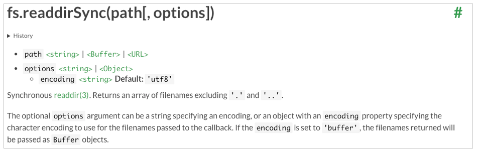
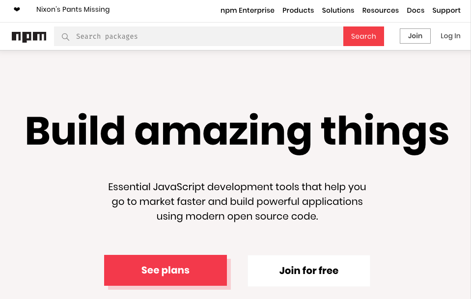
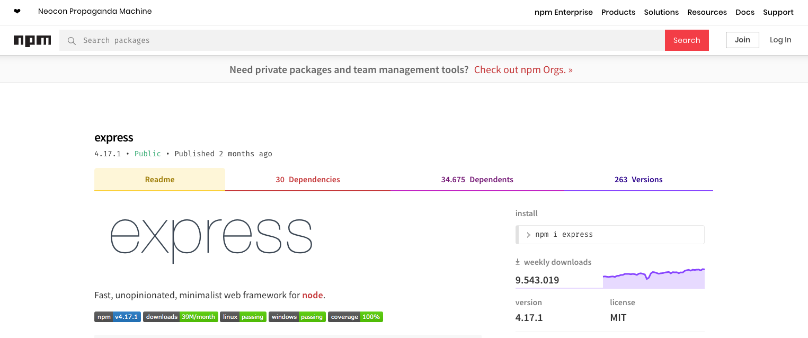
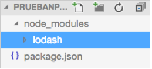

# Tema 1. Introducción a Node.js y Express.js

## 1.4. Uso de módulos con Node.js

### 1.4.1. Los módulos o librerías en Node

Node.js es un framework muy modularizado, es decir, está subdividido en numerosos módulos, librerías o paquetes (a lo largo de estos apuntes utilizaremos estos tres términos indistintamente para referirnos al mismo concepto). De esta forma, sólo añadimos a nuestros proyectos aquellos módulos que necesitemos. 

El propio núcleo de Node.js ya incorpora algunas librerías de uso habitual. Por ejemplo:

* **http** y **https**, para hacer que nuestra aplicación se comporte como un servidor web, o como un servidor web seguro o cifrado, respectivamente.
* **fs** para acceder al sistema de archivos
* **utils**, con algunas funciones de utilidad, tales como formato de cadenas de texto.
* ... etc. Para una lista detallada de módulos, podemos acceder [aquí](https://nodejs.org/api/). Es una API de todos los módulos incorporados en el núcleo de Node.js, con documentación sobre todos los métodos disponibles en cada uno. Por ejemplo, aquí podemos ver la documentación sobre el método `readdirSync` del módulo `fs`, que utilizaremos en un ejemplo a continuación:

<div align="center">
    
</div>

Además, existen numerosos módulos hechos por terceros que pueden ser añadidos y utilizados en nuestras aplicaciones, como por ejemplo el módulo *mongoose* para acceso a bases de datos MongoDB, o el módulo *express* para incorporar el framework Express.js a nuestro proyecto, y desarrollar aplicaciones web con él, como veremos en sesiones posteriores. Estos módulos de terceros se instalan a través del gestor *npm* que explicaremos en breve.

### 1.4.2. Utilizar módulos del núcleo de Node

En primer lugar, vamos a aprender cómo incluir en nuestros proyectos módulos o librerías que ya vienen incorporadas en el núcleo de Node.js, y por tanto, ya tenemos disponibles tras instalarlo. 

Para utilizar cualquier módulo (propio de Node o hecho por terceras partes) en una aplicación es necesario incluirlo en nuestro código con la instrucción `require`. Recibe como parámetro el nombre del módulo a añadir, como una cadena de texto. 

#### 1.4.2.1. Ejemplo sencillo: listar ficheros con *fs*

Por ejemplo, vamos a crear un archivo llamado `listado.js` en nuestro proyecto de "*ProyectosNode/Pruebas/PruebasSimples*". En él vamos a hacer un pequeño programa que utilice el módulo `fs` incorporado en el núcleo de Node para obtener un listado de todos los archivos y subcarpetas de una carpeta determinada. El código de este archivo puede ser más o menos así:

```js
const ruta = '/Users/nacho';
const fs = require('fs');
fs.readdirSync(ruta).forEach(fichero => {console.log(fichero);});
```

Si ejecutamos este programa en el terminal (recordemos que podemos usar el terminal integrado de Visual Studio Code), obtendremos el listado de la carpeta indicada. Antes de ejecutarlo, recuerda cambiar el valor de la constante `ruta` en el código por el de una carpeta válida en tu sistema.

Notar que en el código hemos declarado dos constantes (`const`), en lugar de variables (`var`/`let`), ya que no necesitamos manipular o modificar el código que se almacenará en ellas una vez cargadas (no vamos a cambiar la ruta, ni el contenido del módulo `fs` en nuestro código). En ejemplos que podáis encontrar en Internet, es habitual, no obstante, el uso de `var` o `let` en estos casos.

> **NOTA**: Además de la instrucción `require` para incorporar módulos en aplicaciones Node.js, es muy habitual utilizar la sintaxis `import` en aplicaciones JavaScript en general (especialmente cuando se emplean frameworks cliente, como Angular o React). A lo largo de este curso optaremos por la primera opción, pero dejamos aquí indicado cómo se importarían los módulos con `import` (aunque su uso comporta algunas diferencias con respecto a `require`):

```js
import fs from 'fs';
fs.readdirSync(...);
```

> **Ejercicios propuestos:**
> 
> **1.** Crea una carpeta llamada "**T1_SaludoUsuario**" en tu espacio de trabajo, en la carpeta de "*Ejercicios*". Añade un archivo llamado `saludo.js`. Echa un vistazo en la API de Node al módulo `os`, y en concreto al método `userInfo`. Utilízalo para hacer un programa que salude al usuario que ha accedido al sistema operativo. Por ejemplo, si el usuario es "may", debería decir "Hola may". Ejecuta el programa en el terminal para comprobar su correcto funcionamiento.
> 
> **AYUDA:** el método `console.log` admite un número indefinido de parámetros, y los concatena uno tras otro con un espacio. Así, estas dos líneas son equivalentes:

```js
console.log("Hola " + nombre);
console.log("Hola", nombre);
```

### 1.4.3. Incluir nuestros propios módulos

También podemos utilizar `require` para incluir un archivo nuestro dentro de otro, de forma que podemos (debemos) descomponer nuestra aplicación en diferentes archivos, lo que la hará más fácil de mantener.

Por ejemplo, vamos a crear un proyecto llamado "*PruebasRequire*" en nuestra carpeta de "*Pruebas*", con dos archivos de momento: uno llamado `principal.js` que tendrá el código principal de funcionamiento del programa, y otro llamado `utilidades.js` con una serie de funciones o propiedades auxiliares. Desde el archivo `principal.js`, podemos incluir el de utilidades con la instrucción `require`, del mismo modo que lo hicimos antes, pero indicando la ruta relativa del archivo a incluir. En este caso quedaría así:

```js
const utilidades = require('./utilidades.js');
```

Es posible también suprimir la extensión del archivo en el caso de archivos Javascript, por lo que la instrucción anterior sería equivalente a esta otra (Node sobreentiende que se trata de un archivo Javascript):

```js
const utilidades = require('./utilidades');
```

El contenido del archivo `utilidades.js` debe tener una estructura determinada. Si, por ejemplo, el archivo tiene este contenido:

```js
console.log('Entrando en utilidades.js');
```

Entonces el mero hecho de incluirlo con `require` mostrará por pantalla el mensaje "Entrando en utilidades.js" al ejecutar la aplicación. Es decir, cualquier instrucción directa que contenga el archivo incluido se ejecuta al incluirlo. Lo normal, no obstante, es que este archivo no contenga instrucciones directas, sino una serie de propiedades y métodos que puedan ser accesibles desde el archivo que lo incluye.

Vamos a ello, supongamos que el archivo `utilidades.js` tiene unas funciones matemáticas para sumar y restar dos números y devolver el resultado. Algo así:

```js
let sumar = (num1, num2) => num1 + num2;
let restar = (num1, num2) => num1 – num2;
```

Lo lógico sería pensar que, al incluir este archivo con `require` desde `principal.js`, podamos acceder a las funciones `sumar` y `restar` que hemos definido... pero no es así. 

#### 1.4.3.1. Exportando contenido con *module.exports*

Para poder hacer los métodos o propiedades de un archivo visibles desde otro que lo incluya, debemos añadirlos como elementos del objeto `module.exports`. Así, las dos funciones anteriores se deberían definir de esta forma:

```js
module.exports.sumar = (num1, num2) => num1 + num2;
module.exports.restar = (num1, num2) => num1 – num2;
```

Es habitual definir un objeto en `module.exports`, y añadir dentro todo lo que queramos exportar. De esta forma, tendremos por un lado el código de nuestro módulo, y por otro la parte que queremos exportar. El módulo quedaría así, en este caso:

```js
let sumar = (num1, num2) => num1 + num2;
let restar = (num1, num2) => num1 – num2;

module.exports = {
    sumar: sumar,
    restar: restar
};
```

En cualquier caso, ahora sí podemos utilizar estas funciones desde el programa `principal.js`:

```js
const utilidades = require('./utilidades');
console.log(utilidades.sumar(3, 2));
```

Notar que el objeto `module.exports` admite tanto funciones como atributos o propiedades. Por ejemplo, podríamos definir una propiedad para almacenar el valor del número "pi":

```js
module.exports = {
    pi: 3.1416,
    sumar: sumar,
    restar: restar
};
```

... y acceder a ella desde el programa principal:

```js
console.log(utilidades.pi);
```

#### 1.4.3.2. Incluir carpetas enteras

En el caso de que nuestro proyecto contenga varios módulos, es recomendable agruparlos en carpetas, y en este caso es posible incluir una carpeta entera de módulos, siguiendo una nomenclatura específica. Los pasos a seguir son:

* Añadir todos los módulos (ficheros .js) que queramos dentro de la carpeta deseada
* Crear en esa carpeta un archivo llamado `index.js`. Este será el archivo que se incluirá en nombre de toda la carpeta
* Dentro de este archivo `index.js`, incluir (con `require`) todos los demás módulos de la carpeta, y exportar lo que se considere.

Desde el programa principal (u otro lugar que necesite incluir la carpeta entera), incluir el nombre de la carpeta. Automáticamente se localizará e incluirá el archivo `index.js`, con todos los módulos que éste haya incluido dentro.

Veamos un ejemplo: vamos a nuestra carpeta "*PruebasRequire*" creada en el ejemplo anterior, y crea una carpeta llamada "*idiomas*". Dentro, crea estos tres archivos, con el siguiente contenido:

**Archivo *es.js***

```js
module.exports = {
    saludo : "Hola"
};
```

**Archivo *en.js***

```js
module.exports = {
    saludo : "Hello"
};
```

**Archivo *index.js***

```js
const en = require('./en');
const es = require('./es');

module.exports = {
    es : es,
    en : en
};
```

Ahora, en la carpeta raíz de "*PruebasRequire*" crea un archivo llamado `saludo_idioma.js`, con este contenido:

```js
const idiomas = require('./idiomas');

console.log("English:", idiomas.en.saludo);
console.log("Español:", idiomas.es.saludo);
```

Como puedes ver, desde el archivo principal sólo hemos incluido la carpeta, y con eso automáticamente incluimos el archivo `index.js` que, a su vez, incluye a los demás. Una vez hecho esto, y tal y como hemos exportado las propiedades en `index.js`, podemos acceder al saludo en cada idioma.

#### 1.4.3.3. Incluir archivos JSON

Los archivos JSON son especialmente útiles, como veremos, para definir cierta configuración básica (no encriptada) en las aplicaciones, además de para enviar información entre partes de la aplicación (lo que veremos también más adelante). Por ejemplo, y siguiendo con el ejemplo anterior, podríamos sacar a un archivo JSON el texto del saludo en cada idioma. Añadamos un archivo llamado `saludos.json` dentro de nuestra subcarpeta "idiomas":

```json
{
    "es" : "Hola",
    "en" : "Hello"
}
```

Después, podemos modificar el contenido de los archivos `es.js` y `en.js` para que no pongan literalmente el texto, sino que lo cojan del archivo JSON, incluyéndolo. Nos quedarían así:

**Archivo *es.js***:

```js
const textos = require('./saludos.json');

module.exports = {
    saludo : textos.es
};
```

**Archivo *en.js***:

```js
const textos = require('./saludos.json');

module.exports = {
    saludo : textos.en
};
```

La forma de acceder a los textos desde el programa principal no cambia, sólo lo ha hecho la forma de almacenarlos, que queda centralizada en un archivo JSON, en lugar de en múltiples archivos Javascript. De este modo, ante cualquier errata o actualización, sólo tenemos que modificar el texto en el archivo JSON y no ir buscando archivo por archivo. Además, nos evita el problema de las *magic strings* (cadenas que los programadores ponen a mano donde toca, suponiendo que están bien escritas y que no van a hacer falta desde otra parte de la aplicación).

#### 1.4.3.4. Más sobre inclusión de módulos locales

Para finalizar con este subapartado de inclusión de módulos locales de nuestra aplicación (o división de nuestra aplicación en diversos ficheros fuente, según cómo queramos verlo), conviene tener en cuenta un par de matices adicionales:

**Rutas relativas y *require***:

Hasta ahora, cuando hemos empleado la instrucción `require` para incluir un módulo de nuestro propio proyecto, hemos partido de la carpeta actual. Por ejemplo:

```js
const utilidades = require('./utilidades');
```

Este código funcionará siempre que ejecutemos la aplicación Node desde su misma carpeta:

```
node principal.js
```

Pero si estamos en otra carpeta y ejecutamos la aplicación desde allí...

```
node /Users/nacho/Proyectos/PruebasRequire/principal.js
```

... entonces `require` hará referencia a la carpeta desde donde estamos ejecutando, y no encontrará el archivo "*utilidades.js*", en este caso. 

Para evitar este problema, podemos emplear la propiedad `__dirname`, que hace referencia a la carpeta del módulo que se está ejecutando (`principal.js`, en este caso):

```js
const utilidades = require(__dirname + '/utilidades');
```

**Sobre *module.exports***:

Quizá algunos de vosotros os habréis preguntado... ¿cómo es que puedo tener accesibles variables o métodos que yo no he definido al empezar, como `require`, o `module.exports`? 

Cuando se ejecuta nuestro código, Node.js lo encapsula dentro de una función, y le pasa como parámetros los elementos externos que puede necesitar, como por ejemplo `require`, o `module` (en cuyo interior encontraremos `exports`). Sin embargo, en algunos ejemplos en Internet también podemos encontrar que se hace uso de una propiedad `exports`, en lugar de `module.exports`. Entonces...

* ¿Hay un `exports` por un lado y un `module.exports` por otro? La respuesta es que SI
* ¿Existe diferencia entre ambos? La respuesta también es que SI. A priori, ambos elementos apuntan al mismo objeto en memoria, es decir, `exports` es un atajo para no tener que escribir `module.exports`. Pero... 
   * Si cometemos el error de reasignar la variable (por ejemplo, haciendo `exports = a`), entonces las referencias dejan de ser iguales. 
   * Por otra parte, si queréis ver el código fuente de la función `require`, veréis que lo que devuelve es `module.exports`, por lo que, en caso de reasignar la variable `exports`, no nos serviría de nada.
  
La moraleja de todo esto es que, en principio, `exports` y `module.exports` sirven para lo mismo siempre que no las reasignemos. Pero durante todo este curso seguiremos nuestro propio consejo: usaremos siempre `module.exports` para evitar problemas.

> **Ejercicios propuestos:**
> 
> **2.** Para realizar este ejercicio, nos basaremos en el ejercicio "*T1_Promesas*" de la sesión anterior, donde gestionábamos las personas de un vector mediante unos métodos que insertaban o borraban datos del mismo, y devolvían una promesa con el resultado.
>
> Copia esa carpeta y renómbrala a "**T1_Modularizar**". Lo que vamos a hacer en este ejercicio es dividir el código en dos archivos:
>
> * Un archivo llamado `personas.js` donde definiremos los dos métodos que se encargan de añadir y borrar personas del vector. Recuerda exportar dichos métodos con `module.exports` para poderlos utilizar desde fuera. También necesitarás pasarles como parámetro el vector de personas, ya que dicho vector quedará en otro archivo aparte y no será directamente accesible.
> * Un archivo llamado `index.js` donde incluiremos el módulo anterior. En este archivo definiremos el vector de personas tal y como estaba originalmente, y el programa principal, que utilizará el módulo anterior para insertar o borrar algunas personas de prueba en el vector.
>
> Ejecuta el programa para verificar que las dependencias con el módulo se han establecido correctamente, y los datos se insertan y borran del vector de forma satisfactoria.

### 1.4.4. Módulos de terceros. El gestor *npm*

**npm** (*Node Package Manager*) es un gestor de paquetes para Javascript, y se instala automáticamente al instalar Node.js. Podemos comprobar que lo tenemos instalado, y qué versión concreta tenemos, mediante el comando:

```
npm -v
```

aunque también nos servirá el comando `npm --version`. 

Inicialmente, `npm` se pensó como un gestor para poder instalar módulos en las aplicaciones Node, pero se ha convertido en mucho más que eso, y a través de él podemos también descargar e instalar en nuestras aplicaciones otros módulos o librerías que no tienen que ver con Node, como por ejemplo *Bootstrap* o *jQuery*. Así que actualmente es un enorme ecosistema de librerías open-source, que nos permite centrarnos en las necesidades específicas de nuestra aplicación, sin tener que "reinventar la rueda" cada vez que necesitemos una funcionalidad que ya han hecho otros antes.

El registro de librerías o módulos gestionado por NPM está en la web [npmjs.com](https://npmjs.com). 

<div align="center">
    
</div>

Podemos consultar información sobre alguna librería en particular, consultar estadísticas de cuánta gente se la descarga, e incluso proporcionar nosotros nuestras propias librerías si queremos. Por ejemplo, esta es la ficha de la librería *express*, que emplearemos más adelante:

<div align="center">
    
</div>

La opción más habitual de uso de npm es instalar módulos o paquetes en un proyecto concreto, de forma que cada proyecto tenga sus propios módulos. Sin embargo, en algunas ocasiones también nos puede interesar (y es posible) instalar algún módulo de forma global al sistema. Veremos cómo hacer estas dos operaciones.

#### 1.4.4.1. Instalar módulos locales a un proyecto

En este apartado veremos cómo instalar módulos de terceros de forma local a un proyecto concreto. Haremos pruebas dentro de un proyecto llamado "*PruebaNPM*" en nuestra carpeta de "*ProyectosNode/Pruebas*", cuya carpeta podemos crear ya. 

**El archivo "package.json"**

La configuración básica de los proyectos Node se almacena en un archivo JSON llamado `package.json`. Este archivo se puede crear directamente desde línea de comandos, utilizando una de estas dos opciones (debemos ejecutarla en la carpeta de nuestro proyecto Node):

* `npm init --yes`, que creará un archivo con unos valores por defecto, como éste que se muestra a continuación:

```json
{
    "name": "PruebaNPM",
    "version": "1.0.0",
    "description": "",
    "main": "index.js",
    "scripts": {
        "test": "echo \"Error: no test specified\" && exit 1"
    },
    "keywords": [],
    "author": "",
    "license": "ISC"
}
```

* `npm init`, que iniciará un asistente en el terminal para que demos valor a cada atributo de la configuración. Lo más típico es rellenar el nombre del proyecto (toma como valor por defecto el nombre de la carpeta donde está), la versión, el autor y poco más. Muchas opciones tienen valores por defecto puestos entre paréntesis, por lo que si pulsamos *Intro* se asignará dicho valor sin más.

Al final de todo el proceso, tendremos el archivo en la carpeta de nuestro proyecto. En él añadiremos después (de forma manual o automática) los módulos que necesitemos, y las versiones de los mismos, como explicaremos a continuación. 

> **NOTA**: al generar el archivo `package.json`, podemos observar que el nombre de programa principal (*entry point*) que se asigna por defecto a la aplicación Node es *index.js*. Es habitual que el fichero principal de una aplicación Node se llame así, o también *app.js*, como veremos en posteriores ejemplos, aunque no es obligatorio llamarlos así.

**Añadir módulos al proyecto y utilizarlos**

Para instalar un módulo externo en un proyecto determinado, debemos abrir un terminal y situarnos en la carpeta del proyecto. Después, escribimos el siguiente comando:

```
npm install --save nombre_modulo
```

donde *nombre_modulo* será el nombre del módulo que queramos instalar. Podemos instalar también una versión específica del módulo añadiéndolo como sufijo con una arroba al nombre del módulo. Por ejemplo:

```
npm install --save nombre_modulo@1.1.0
```

Vamos a probar con un módulo sencillo y muy utilizado (tiene millones de descargas semanalmente), ya que contiene una serie de utilidades para facilitarnos el desarrollo de nuestros proyectos. Se trata del módulo `lodash`, que podéis consultar en la web citada anteriormente ([aquí](https://www.npmjs.com/package/lodash)). Para instalarlo, escribimos lo siguiente:

```
npm install --save lodash
```

Algunas puntualizaciones antes de seguir:

* Tras ejecutar el comando anterior, se habrá añadido el nuevo módulo en una subcarpeta llamada `node_modules` dentro de nuestro proyecto.

<div align="center">
    
</div>

* El flag `--save` sirve para que, además de descargar el módulo, se modifique el archivo `package.json` de configuración con el nuevo módulo incluido en el bloque de dependencias. Este parámetro ya no es necesario incluirlo en versiones recientes del comando *npm*, pero se deja comentado por si utilizamos versiones anteriores.

```json
{
    "name": "pruebanpm",
    ...
    "dependencies": {
        "lodash": "^4.17.15"
    }
}
```

* Al instalar cualquier nuevo módulo, se generará (o modificará) un archivo adicional llamado `package-lock.json`. Este archivo es un backup de cómo ha quedado el árbol de carpetas en "*node_modules*" con la nueva instalación, de forma que podamos volver atrás y dejar los módulos como estaban en cualquier paso previo. Es utilizado en repositorios git para estas restauraciones, precisamente. Nosotros no le haremos mucho caso de momento.

Para poder utilizar el nuevo módulo, procederemos de la misma forma que para utilizar módulos predefinidos de Node: emplearemos la instrucción `require` con el nombre original del módulo. Por ejemplo, vamos a editar un archivo `index.js` en la carpeta "*PruebaNPM*" que venimos editando en estos últimos pasos, y añadimos este código que carga el módulo "lodash" y lo utiliza para eliminar un elemento de un vector:

```js
const lodash = require('lodash');
console.log(lodash.difference([1, 2, 3], [1]));
```

> **NOTA:** si buscáis documentación o ejemplos de uso de esta librería en Internet, es habitual que el nombre de variable o constante donde se carga (en la línea `require`) sea un simple símbolo de subrayado (eso es lo que significa *low dash* en inglés), con lo que el ejemplo anterior quedaría así:

```js
const _ = require('lodash');
console.log(_.difference([1, 2, 3], [1]));
```

Si ejecutamos este ejemplo desde el terminal, obtendremos lo siguiente:

```
node index.js
[ 2, 3 ]
```

> **Ejercicios propuestos:**
> 
> **3.** Crea una carpeta llamada "**T1_Lodash**" en tu espacio de trabajo, en la carpeta de "*Ejercicios*". Dentro, crea un archivo `package.json` utilizando el comando `npm init` visto antes. Deja los valores por defecto que te plantea el asistente, y pon tu nombre como autor.
>
> Después, instala el paquete `lodash` como se ha explicado en un ejemplo anterior, y consulta su documentación [aquí](https://lodash.com/docs/4.17.11), para hacer un programa en un archivo `index.js` que, dado un vector de nombres de personas, los muestre por pantalla separados por comas. Deberás definir a mano el array de nombres dentro del código. Por ejemplo, para el array `["Nacho", "Ana", "Mario", "Laura"]`, la salida del programa deberá ser:

```
Nacho,Ana,Mario,Laura
```

> **NOTA:** revisa el método `join` dentro de la documentación de "lodash", puede serte muy útil para este ejercicio.

**Desinstalar un módulo**

Para desinstalar un módulo (y eliminarlo del archivo `package.json`, si existe), escribimos el comando siguiente:

```
npm uninstall --save nombre_modulo
```

Nuevamente, el flag `--save` se emplea para actualizar los cambios en el archivo `package.json`, y en las últimas versiones de npm no es necesario especificarlo.

#### 1.4.4.2. Algunas consideraciones sobre módulos de terceros

Hemos visto los pasos elementales para poder instalar, utilizar, y desinstalar (si es necesario) módulos de terceros localmente en nuestras aplicaciones. Pero hay algunos aspectos referentes a estos módulos, y la forma en que se instalan y distribuyen, que debes tener en cuenta.

**Orden de inclusión de los módulos**

Hemos visto cómo incluir en una aplicación Node tres tipos de módulos:

* Módulos pertenecientes al núcleo de Node
* Módulos de nuestro propio proyecto, si está dividido en varios ficheros fuente
* Módulos hechos por terceros, descargados a través de npm

Aunque no hay una norma obligatoria a seguir al respecto, sí es habitual que, cuando nuestra aplicación necesita incluir módulos de diversos tipos (predefinidos de Node, de terceros y archivos propios), se haga con una estructura determinada. 

Básicamente, lo que se hace es incluir primero los módulos de Node y los de terceros, y después (separados por un espacio del bloque anterior), los archivos propios de nuestro proyecto. Por ejemplo:

```js
const fs = require('fs');
const _ = require('lodash');

const utilidades = require('./utilidades');
```

**Gestión de versiones**

Desde que comenzamos a desarrollar una aplicación hasta que la finalizamos, o en mantenimientos posteriores, es posible que los módulos que la componen se hayan actualizado. Algunas de esas nuevas versiones pueden no ser compatibles con lo que en su día hicimos, o al contrario, hemos actualizado la aplicación y ya no nos sirven versiones demasiado antiguas de ciertos módulos.

Para poder determinar qué versiones o rangos de versiones son compatibles con nuestro proyecto, podemos utilizar la misma sección de "*dependencies*" del archivo `package.json`, con una nomenclatura determinada. Veamos algunos ejemplos utilizando el paquete "*lodash*" del caso anterior:

* `"lodash": "1.0.0"` indicaría que la aplicación sólo es compatible con la versión 1.0.0 de la librería
* `"lodash": "1.0.x"` indica que nos sirve cualquier versión 1.0
* `"lodash": "*"` indica que queremos tener siempre la última versión disponible del paquete. Si dejamos una cadena vacía "", se tiene el mismo efecto. No es una opción recomendable en algunos casos, al no poder controlar lo que contiene esa versión.
* `"lodash": "> = 1.0.2"` indica que nos sirve cualquier versión a partir de la 1.0.2
* `"lodash": "< 1.0.9"` indica que sólo son compatibles las versiones de la librería hasta la 1.0.9 (sin contar esta última).
* `"lodash": "^1.1.2"` indica cualquier versión desde la 1.1.2 (inclusive) hasta el siguiente salto mayor de versión (2.0.0, en este caso, sin incluir este último).
* `"lodash": "~1.3.0"` indica cualquier versión entre la 1.3.0 (inclusive) y la siguiente versión menor (1.4.0, exclusive).

Existen otros modificadores también, pero con éstos podemos hacernos una idea de lo que podemos controlar. Una vez hayamos especificado los rangos de versiones compatibles de cada módulo, con el siguiente comando actualizamos los paquetes que se vean afectados por estas restricciones, dejando para cada uno una versión dentro del rango compatible indicado:

```
npm update --save
```

**Añadir módulos a mano en "package.json"**

También podríamos añadir a mano en el archivo "package.json" módulos que necesitemos instalar. Por ejemplo, así añadiríamos al ejemplo anterior la última versión del módulo "express":

```json
{
    ...
    "dependencies": {
        "lodash": "^4.17.4",
        "express": "*"
    }
}
```

Para hacer efectiva la instalación de los módulos de este archivo, una vez añadidos, debemos ejecutar este comando en el terminal:

```
npm install
```

Automáticamente se añadirán los módulos que falten en la carpeta "node_modules" del proyecto.

**Compartir nuestro proyecto**

Si decidimos subir nuestro proyecto a algún repositorio en Internet como Github o similares, o dejar que alguien se lo descargue para modificarlo después, no es buena idea subir la carpeta "node_modules", ya que contiene código fuente hecho por terceras personas, probado en entornos reales y fiable, que no debería poderse modificar a la ligera. Además, la forma en que se estructura la carpeta "node_modules" depende de la versión de npm que cada uno tengamos instalada, y es posible que ocupe demasiado. De hecho, los propios módulos que descargamos pueden tener dependencias con otros módulos, que a su vez se descargarán en una subcarpeta interna.

Por lo tanto, lo recomendable es no compartir esta carpeta (no subirla al repositorio, o no dejarla a terceras personas), y no es ningún problema hacer eso, ya que gracias al archivo `package.json` siempre podemos (debemos) ejecutar el comando 

```
npm install 
```

y descargar todas las dependencias que en él están reflejadas. Dicho de otra forma, el archivo `package.json` contiene un resumen de todo lo externo que nuestro proyecto necesita, y que no es recomendable facilitar con el mismo.

#### 1.4.4.3. Instalar módulos globales al sistema

Para cierto tipo de módulos, en especial aquellos que se ejecutan desde terminal como Grunt (un gestor y automatizador de tareas Javascript) o JSHint (un comprobador de sintaxis Javascript), puede ser interesante instalarlos de forma global, para poderlos usar dentro de cualquier proyecto.

La forma de hacer esto es similar a la instalación de un módulo en un proyecto concreto, añadiendo algún parámetro adicional, y con la diferencia de que, en este caso, no es necesario un archivo "package.json" para gestionar los módulos y dependencias, ya que no son módulos de un proyecto, sino del sistema. La sintaxis general del comando es:

```
npm install -g nombre_modulo
```

donde el flag `-g` hace referencia a que se quiere hacer una instalación global. 

Es importante, además, tener presente que cualquier módulo instalado de forma global en el sistema no podrá importarse con `require` en una aplicación concreta (para hacerlo tendríamos que instalarlo también de forma local a dicha aplicación).

**Ejemplo: nodemon**

Veamos cómo funciona la instalación de módulos a nivel global con uno realmente útil: el módulo `nodemon`. Este módulo funciona a través del terminal, y nos sirve para monitorizar la ejecución de una aplicación Node, de forma que, ante cualquier cambio en la misma, automáticamente la reinicia y vuelve a ejecutarla por nosotros, evitándonos tener que escribir el comando `node` en el terminal de nuevo. Podéis consultar información sobre nodemon [aquí](https://www.npmjs.com/package/nodemon).

Para instalar `nodemon` de forma global escribimos el siguiente comando (con permisos de administrador):

```
npm install -g nodemon
```

Al instalarlo de forma global, se añadirá el comando `nodemon` en la misma carpeta donde residen los comandos `node` o `npm`. Para utilizarlo, basta con colocarnos en la carpeta del proyecto que queramos probar, y emplear este comando en lugar de `node` para lanzar la aplicación:

```
nodemon index.js
```

Automáticamente aparecerán varios mensajes de información en pantalla y el resultado de ejecutar nuestro programa. Ante cada cambio que hagamos, se reiniciará este proceso volviendo a ejecutarse el programa. 

Para finalizar la ejecución de `nodemon` (y, por tanto, de la aplicación que estamos monitorizando), basta con pulsar Control+C en el terminal.

**Desinstalar módulos globales**

Del mismo modo, para desinstalar un módulo que se ha instalado de forma global, utilizaremos el comando:

```
npm uninstall -g nombre_modulo
```

> **Ejercicios propuestos:**
> 
> **4.** Crea una carpeta llamada "**T1_Moment**" en tu espacio de trabajo, en la carpeta "*Ejercicios*". Dentro, crea un archivo `package.json` con el correspondiente comando `npm init` visto antes. Deja los valores por defecto que te plantea el asistente, y pon tu nombre como autor.
>
> Instala el paquete `moment`, una librería para gestión de fechas y tiempos cuya documentación se puede consultar [aquí](https://momentjs.com/docs/). Define un programa principal en un archivo `index.js` que incluya dicha librería:

```js
const moment = require('moment');
```

> Una vez incluida, haz lo siguiente:
>
> * Guarda en una variable la fecha y hora actuales. Esto puedes hacerlo con:

```js
let ahora = moment();
```

> * Define una fecha anterior a la actual. Puedes especificar el formato de la fecha en una cadena de texto, seguido del patrón de dicha fecha. Por ejemplo:

```js
let antes = moment("07/10/2015", "DD/MM/YYYY");
```

> * Define también una fecha posterior a la actual. Puedes utilizar la misma nomenclatura que para la fecha anterior, pero con una posterior.
> * Imprime por consola cuántos años han pasado desde la fecha vieja a la actual. Para calcular este dato, te puede ser de utilidad el método `duration`:

```js
moment.duration(fechaNueva.diff(fechaVieja)).years()
```

> * Saca por consola, de una forma similar, cuántos años y meses faltan para llegar a la fecha futura desde la actual.
> * Muestra ahora por consola si la fecha vieja es, efectivamente, anterior a la actual. Para ello puedes utilizar el método `isBefore` (o `isAfter`, dependiendo de cómo las compares):

```js
if (fechaVieja.isBefore(fechaReciente))...
if (fechaReciente.isAfter(fechaVieja))...
```

> * Finalmente, crea una fecha que sea exactamente dentro de un mes. Para ello, usa el método `add`, añadiendo un mes a la fecha actual. Saca esta fecha por pantalla, formateada como *DD/MM/YYYY*. Utiliza el método `format` para esto.
>
> Si no lo has hecho aún, instala el módulo `nodemon` de forma global al sistema, como se ha explicado en esta sesión. Ejecuta esta aplicación con dicho módulo, y comprueba que todos los datos que se muestran por consola son los esperados. Después, prueba a cambiar alguna fecha (la pasada y/o la futura), y comprueba cómo se ejecuta de nuevo automáticamente y muestra los nuevos resultados.
