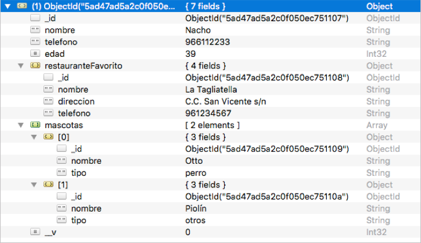

# Tema 2. Acceso a datos con Node.js

## 2.2. Opciones avanzadas de MongoDB y Mongoose

Ahora que ya tenemos unas nociones básicas de qué es una base de datos No-SQL como MongoDB, qué elementos tiene, y cómo manipular las colecciones desde Node mediante la librería Mongoose, vamos a echar un vistazo a algunas opciones algo más avanzadas de manipulación de estas bases de datos.

Por una parte, veremos cómo podemos relacionar colecciones entre sí, lo que sería el equivalente a las relaciones entre tablas en una base de datos SQL. Analizaremos el caso de relaciones simples y múltiples, y veremos una opción propia de las bases de datos No SQL como MongoDB: los subdocumentos.

Por otra parte, y relacionado con lo anterior, estudiaremos qué opciones tenemos de realizar consultas que afecten a varias colecciones relacionadas entre sí, de forma que podamos obtener documentos que cumplan criterios vinculados a distintas colecciones.

Lo que se va a ver en este documento es una muestra de las opciones que ofrece Mongoose para gestionar los datos en MongoDB. Si consultáis la documentación oficial, así como otros ejemplos hechos por desarrolladores, podréis ver que la sintaxis o las opciones para conseguir un determinado resultado son algo laxas, y se admiten diferentes variantes para un mismo fin.

### 2.2.1. Relaciones entre colecciones

Vamos a volver a nuestra base de datos de contactos que venimos utilizando como ejemplo de sesiones anteriores. Es una base de datos muy simple, con una única colección llamada "contactos" cuyos documentos tienen tres campos: nombre, teléfono y edad. Vamos a añadirle más información, y para ello seguiremos trabajando sobre el proyecto "*PruebaMongo*" de nuestra carpeta "*ProyectosNode/Pruebas*". Si quieres, haz una copia de seguridad de esta carpeta antes de continuar, para no perder la versión básica de este proyecto.

#### 2.2.1.1. Definir una relación simple

Supongamos que queremos añadir, para cada contacto, cuál es su restaurante favorito, de forma que varios contactos puedan tener el mismo. Del restaurante en cuestión nos interesa saber su nombre, dirección y teléfono. Para ello, podemos definir este esquema y modelo:

```js
let restauranteSchema = new mongoose.Schema({
    nombre: {
        type: String,
        required: true,
        minlength: 1,
        trim: true
    },
    direccion: {
        type: String,
        required: true,
        minlength: 1,
        trim: true
    },
    telefono: {
        type: String,
        required: true,
        unique: true,
        trim: true,
        match: /^\d{9}$/
    }
});
let Restaurante = mongoose.model('restaurante', restauranteSchema);
```

Y lo asociamos al esquema de contactos con un nuevo campo (omitimos con puntos suspensivos datos ya existentes de ejemplos previos):

```js
let contactoSchema = new mongoose.Schema({
    nombre: {
        ...
    },
    telefono: {
        ...
    },
    edad: {
        ...
    },
    restauranteFavorito: {
        type: mongoose.Schema.Types.ObjectId,
        ref: 'restaurante'
    }
});
let Contacto = mongoose.model('contacto', contactoSchema);
```

Observemos que el tipo de dato de este nuevo campo es `ObjectId`, lo que indica que hace referencia a un *id* de un documento de ésta u otra colección. En concreto, a través de la propiedad ref indicamos a qué modelo o colección hace referencia dicho *id* (al modelo *restaurante*, que se traducirá a la colección *restaurantes* en MongoDB).

#### 2.2.1.2. Definir una relación múltiple

Vamos a dar un paso más, y a definir una relación que permita asociar a un elemento de una colección múltiples elementos de otra (o de esa misma colección). Por ejemplo, vamos a permitir que cada contacto tenga un conjunto de mascotas. Definimos un nuevo esquema para las mascotas, que almacene su nombre y tipo (perro, gato, etc.).

```js
let mascotaSchema = new mongoose.Schema({
    nombre: {
        type: String,
        required: true,
        minlength: 1,
        trim: true
    },
    tipo: {
        type: String,
        required: true,
        enum: ['perro', 'gato', 'otros']
    }
});
let Mascota = mongoose.model('mascota', mascotaSchema);
```

> **NOTA**: como nota al margen, observad cómo se puede utilizar el validador enum en un esquema para forzar a que un determinado campo sólo admita ciertos valores.

Para permitir que un contacto pueda tener múltiples mascotas, añadimos un nuevo campo en el esquema de contactos que será un array de *ids*, asociados al modelo de mascotas definido previamente:

```js
let contactoSchema = new mongoose.Schema({
    nombre: {
        ...
    },
    telefono: {
        ...
    },
    edad: {
        ...
    },
    restauranteFavorito: {
        ...
    },
    mascotas: [{
        type: mongoose.Schema.Types.ObjectId,
        ref: 'mascota' 
    }]
});
let Contacto = mongoose.model('contacto', contactoSchema);
```

En este caso, observad cómo la forma de definir la referencia a la colección de mascotas es la misma (se establece como tipo de dato un `ObjectId`, con referencia al modelo de *mascotas*), pero, además, el tipo de dato de este campo mascotas es un array (especificado por los corchetes al definirlo).

#### 2.2.1.3. Inserciones de elementos relacionados

Si quisiéramos insertar un nuevo contacto y, a la vez, especificar su restaurante favorito y/o sus mascotas, deberíamos hacerlo por partes, como ocurriría en un sistema relacional:

* Primero añadiríamos el restaurante favorito a la colección de restaurantes, y/o las mascotas a la colección de mascotas (salvo que exista previamente, en cuyo caso obtendríamos su *id*):

```js
let restaurante1 = new Restaurante({
    nombre: "La Tagliatella",
    direccion: "C.C. San Vicente s/n",
    telefono: "965678912"
});
restaurante1.save().then(...

let mascota1 = new Mascota({
    nombre: "Otto",
    tipo: "perro"
});
mascota1.save().then(...
```

* Después, añadiríamos el nuevo contacto especificando el *id* de su restaurante favorito, añadido previamente, y/o los *ids* de sus mascotas en un array:

```js
let contacto1 = new Contacto({
    nombre: "Nacho",
    telefono: 677889900,
    edad: 40,
    restauranteFavorito: '5acd3c051d694d04fa26dd8b',
    mascotas: ['5acd3c051d694d04fa26dd90', 
               '5acd3c051d694d04fa26dd91']
});
contacto1.save().then(...
```

#### 2.2.1.4. Sobre la integridad referencial

La integridad referencial es un concepto vinculado a bases de datos relacionales, mediante el cual se garantiza que los valores de una clave ajena siempre van a existir en la tabla a la que hace referencia. Aplicado a una base de datos Mongo, podríamos pensar que los *ids* de un campo vinculado a otra colección deberían existir en dicha colección, pero no tiene por qué ser así.

Siguiendo con el ejemplo anterior, si intentamos insertar un contacto con un *id* de restaurante que no exista en la colección de restaurantes, nos dejará hacerlo, siempre que ese *id* sea válido (es decir, tenga una extensión de 12 bytes). Por lo tanto, corre por cuenta del programador asegurarse de que los *id* empleados en inserciones que impliquen una referencia a otra colección existan realmente. Para facilitar la tarea, existen algunas librerías en el repositorio NPM que podemos emplear, como por ejemplo [ésta](https://www.npmjs.com/package/mongoose-id-validator), aunque su uso va más allá de los contenidos de este curso, y no lo veremos aquí.

En el caso del borrado, podemos encontrarnos con una situación similar: si, siguiendo con el caso de los contactos, queremos borrar un restaurante, deberemos tener cuidado con los contactos que lo tienen asignado como restaurante favorito, ya que el *id* dejará de existir en la colección de restaurantes. Así, sería conveniente elegir entre una de estas dos opciones, aunque las dos requieren un tratamiento manual por parte del programador:

* Denegar la operación si existen contactos con el restaurante seleccionado
* Reasignar (o poner a nulo) el restaurante favorito de esos contactos, antes de eliminar el restaurante seleccionado

> **Ejercicios propuestos:**
> 
> **1.** Vamos a modificar el ejercicio **T2_Libros** iniciado en la sesión anterior. En aquel ejercicio creamos un esquema para almacenar información sobre libros, conectamos con la base de datos correspondiente e hicimos algunas operaciones básicas sobre ella. Haz una copia de ese ejercicio para mantener así su versión anterior, si lo deseas, y llámala *T2_Libros_v1*.
>
> * Vamos a definir ahora un segundo esquema para almacenar información sobre el **autor** de cada libro. Dicho autor tendrá un nombre (obligatorio) y un año de nacimiento (opcional, pero con valores entre 0 y 2000). Define también el modelo para la colección, asociado a este esquema.
> * Después, relaciona la colección de libros con la de autores, añadiendo a la primera un nuevo campo llamado `autor`, que enlazará con el *id* del autor correspondiente en la colección de autores. Dicho campo *autor* no será obligatorio, para respetar así los libros sin autor que tengamos añadidos con anterioridad.
> * Tras la conexión a la base de datos y la definición de esquemas que hemos hecho, elimina el código del ejercicio anterior relativo a inserciones, borrados, modificaciones y consultas, y añade el código para insertar uno o dos nuevos autores, y algún libro vinculado a cada uno de ellos.

### 2.2.2. Subdocumentos

Mongoose ofrece también la posibilidad de definir **subdocumentos**. Veamos un ejemplo concreto de ello, y para eso, vamos a hacer una versión alternativa de nuestro ejemplo de contactos. Podemos copiar y pegar el archivo `index.js` de nuestra carpeta "*PruebaMongo*", y renombrarlo a `index_subdocumentos.js`, por ejemplo, en esa misma carpeta.

Sobre este nuevo archivo `index_subdocumentos.js`, vamos a conectar con una nueva base de datos, que llamaremos `contactos_subdocumentos`, para no interferir con la base de datos anterior:

```js
mongoose.connect('mongodb://localhost:27017/contactos_subdocumentos');
```

Y vamos a reagrupar los tres esquemas que hemos hecho hasta ahora (restaurantes, mascotas y contactos), para unirlos en el de contactos, de esta forma (omitimos con puntos suspensivos parte del código que es el mismo del ejemplo anterior:

```js
// Restaurantes
let restauranteSchema = new mongoose.Schema({
    ...
});

// Mascotas
let mascotaSchema = new mongoose.Schema({
    ...
});

// Contactos
let contactoSchema = new mongoose.Schema({
    nombre: {
        ...
    },
    telefono: {
        ...
    },
    edad: {
        ...
    },
    restauranteFavorito: restauranteSchema,
    mascotas: [mascotaSchema]
});
let Contacto = mongoose.model('contacto', contactoSchema);
```

Observad las líneas que se refieren a las propiedades `restauranteFavorito` y `mascotas`. Es la forma de asociar un esquema entero como tipo de dato de un campo de otro esquema. De este modo, convertimos el esquema en una parte del otro, creando así **subdocumentos** dentro del documento principal. Observad también que no se han definido modelos ni para los restaurantes ni para las mascotas, ya que ahora no van a tener una colección propia.

Un subdocumento, a priori, puede parecer algo equivalente a definir una relación entre colecciones. Sin embargo, la principal diferencia entre un subdocumento y una relación entre documentos de colecciones diferentes es que el subdocumento queda embebido dentro del documento principal, y es diferente a cualquier otro objeto que pueda haber en otro documento, aunque sus campos sean iguales. Por el contrario, en la relación simple vista antes entre restaurantes y contactos, un restaurante favorito podía ser compartido por varios contactos, simplemente enlazando con el mismo *id* de restaurante. Pero, de este otro modo, creamos el restaurante para cada contacto, diferenciándolo de los otros restaurantes, aunque sean iguales. Lo mismo ocurriría con el array de mascotas: las mascotas serían diferentes para cada contacto, aunque quisiéramos que fueran la misma o pudieran compartirse.

#### 2.2.2.1. Inserción de documentos con subdocumentos

Si queremos crear y guardar un contacto que contiene como subdocumentos el restaurante favorito y sus mascotas, podemos crear todo el objeto completo, y hacer un único guardado (`save`).

```js
let contacto1 = new Contacto({
    nombre: 'Nacho',
    telefono: 966112233,
    edad: 39,
    restauranteFavorito: { 
        nombre: 'La Tagliatella', 
        direccion: 'C.C. San Vicente s/n', 
        telefono: 961234567
    }
});
contacto1.mascotas.push({nombre:'Otto', tipo:'perro'});
contacto1.mascotas.push({nombre:'Piolín', tipo:'otros'});
contacto1.save().then(...
```

En este ejemplo se muestran dos formas posibles de rellenar los subdocumentos del documento principal: sobre la marcha cuando creamos dicho documento (caso del restaurante), o a posteriori, accediendo a los campos y dándoles valor (caso de las mascotas).

En la base de datos que se crea, veremos que sólo existe una colección, *contactos*, y al examinar los elementos que insertemos veremos que contienen embebidos los subdocumentos que hemos definido:

<div align="center">
    
</div>

#### 2.2.2.2. ¿Cuándo definir relaciones y cuándo subdocumentos?

La respuesta a esta pregunta puede resultar compleja o evidente, dependiendo de cómo hayamos entendido los conceptos vistos hasta ahora, pero vamos a intentar dar unas normas básicas para distinguir cuándo usar cada concepto:

* Emplearemos **relaciones entre colecciones** cuando queramos poder compartir un mismo documento de una colección por varios documentos de otra. Así, en el caso de los restaurantes favoritos, parece lógico utilizar una relación entre colecciones a partir del *id* del restaurante, y así permitir que varios contactos puedan compartir una misma instancia de un restaurante favorito.
* Emplearemos **subdocumentos** cuando no importe dicha compartición de información, o cuando prime la simplicidad de definición de un objeto frente a la asociatividad entre colecciones. Dicho de otro modo, y aplicado al ejemplo de las mascotas, si queremos acceder de forma sencilla a las mascotas de un contacto, sin importar si otro contacto tiene las mismas mascotas, utilizaremos subdocumentos.

En el caso de los subdocumentos queda, por tanto, una asignatura pendiente: la posible duplicidad de información. Si hay dos personas que tienen la misma mascota, deberemos crear dos objetos iguales para ambas personas, duplicando así los datos de la mascota. Sin embargo, esta duplicidad de datos nos va a facilitar el acceder a las mascotas de una persona, sin tener que recurrir a otras herramientas que veremos a continuación.

> **Ejercicios propuestos:**
> 
> **2.** Sobre el ejercicio anterior, define un nuevo esquema para almacenar comentarios relativos a un libro. Cada comentario tendrá una fecha (tipo `Date`), el nick de quien hace el comentario (`String`) y el comentario en sí (`String`), siendo todos estos campos obligatorios. Además, en el caso de la fecha, estableceremos como valor por defecto (`default`) la fecha actual (`Date.now`).
>
> Esta vez no definas un modelo para este esquema. Vamos a crear un subdocumento dentro del esquema de libros que almacene un array de comentarios para dicho libro, utilizando el esquema de comentarios que acabas de crear.
>
> Una vez hecho esto, crea un nuevo libro con sus datos, y añade a mano un par de comentarios al array, antes de guardar todos los datos.

### 2.2.3. Consultas avanzadas

Ahora que ya sabemos definir distintos tipos de colecciones vinculadas entre sí, veamos cómo definir consultas que se aprovechen de estas vinculaciones para extraer la información que necesitamos.

#### 2.2.3.1. Las poblaciones (*populate*)

El hecho de relacionar documentos de una colección con documentos de otra a través de los *id* correspondientes, permite obtener en un solo listado la información de ambas colecciones, aunque para ello necesitamos de algún paso intermedio. Por ejemplo, si queremos obtener toda la información de nuestros contactos, relacionados con las colecciones de restaurantes y mascotas (archivo `index.js` de nuestro proyecto de "*PruebaMongo*"), podemos hacer algo como esto:

```js
Contacto.find().then(resultado => {
    console.log(resultado);
});
```

Sin embargo, esta instrucción se limita, obviamente, a mostrar el id de los restaurantes favoritos y de las mascotas, pero no los datos completos de las mismas. Para hacer esto, tenemos que echar mano de un método muy útil ofrecido por Mongoose, llamado `populate`. Este método permite incorporar la información asociada al modelo que se le indique. Por ejemplo, si queremos incorporar al listado anterior toda la información del restaurante favorito de cada contacto, haremos algo así:

```js
Contacto.find().populate('restauranteFavorito').then(resultado => {
    console.log(resultado);
});
```

Si tuviéramos más campos relacionados, podríamos enlazar varias sentencias `populate`, una tras otra, para poblarlos. Por ejemplo, así poblaríamos tanto el restaurante como las mascotas:

```js
Contacto.find()
.populate('restauranteFavorito')
.populate('mascotas')
.then(resultado => {
    console.log(resultado);
});
```

Existen otras opciones para poblar los campos. Por ejemplo, podemos querer poblar sólo parte de la información, como el nombre del restaurante nada más. En ese caso, utilizamos una serie de parámetros adicionales en el método `populate`:

```js
Contacto.find()
.populate('restauranteFavorito', 'nombre')
...
```

#### 2.2.3.2. Más sobre las consultas

Establecer una consulta general sobre una colección es sencillo, como hemos visto en sesiones anteriores. Podemos utilizar el método `find` para obtener documentos que cumplan determinados criterios, o alternativas como `findOne` o `findById` para obtener el documento que cumpla el filtrado.

Veremos en este apartado algunas opciones adicionales a la hora de establecer estas consultas simples, además de cómo realizar consultas que vinculen datos de colecciones diferentes.

**Otras opciones en las consultas**

Cuando utilizamos el método `find` o similares, existen opciones adicionales que permiten, por ejemplo, especificar qué campos queremos obtener, o criterios de ordenación, o de límite máximo de resultados a obtener, etc. En la anterior sesión vimos algún ejemplo al respecto, pero veamos ahora con algo más de detalle algunas de estas opciones:

* Si queremos especificar concretamente qué campos queremos obtener en el listado, se especifica como una cadena de texto en los parámetros de `find`. Como alternativa, se puede enlazar la llamada normal a `find` con el método `select`, donde se especifican los campos a obtener. Estos dos ejemplos hacen lo mismo: mostrar el nombre y la edad de los contactos mayores de 30 años:

```js
Contacto.find({edad: {$gt: 30}}, 'nombre edad').then(...
Contacto.find({edad: {$gt: 30}}).select('nombre edad').then(...
```

* Para **ordenar** el listado por algún criterio, se enlaza la llamada a `find` con otra al método `sort`, en el que se especifica el campo por el que ordenar, y el orden (1 para orden ascendente, -1 para orden descendente). El siguiente listado muestra ordenados de mayor a menor edad los contactos. Se indica también una alternativa equivalente, que consiste en anteponer el signo menos `-` al campo por el que ordenar, indicando que se quiere un orden descendente:

```js
Contacto.find().sort({edad: -1}).then(...
Contacto.find().sort('-edad').then(...
```

* Para **limitar el número de resultados a obtener**, se emplea el método `limit`, indicando cuántos documentos obtener. El siguiente ejemplo muestra, de mayor a menor edad, los 5 primeros contactos:

```js
Contacto.find().sort('-edad').limit(5).then(...
```

> **Ejercicios propuestos:**
> 
> **3.** Añade al ejercicio anterior una consulta que muestre el título y precio (junto con el *id*) de los tres libros más baratos, ordenados de menor a mayor precio. En el caso de que haya menos de tres libros en el listado, se mostrarán sólo los libros disponibles, obviamente.

**Consultas que relacionan varias colecciones**

Las bases de datos No-SQL, como es el caso de MongoDB, no están preparadas para consultar información proveniente de varias colecciones, lo que en parte "invita" a utilizar colecciones independientes basadas en subdocumentos para agregarles información adicional.

Supongamos que queremos, por ejemplo, obtener los datos de los restaurantes favoritos de aquellos contactos que sean mayores de 30 años. Si tuviéramos una base de datos SQL, podríamos resolver esto con una query como la siguiente:

```
SELECT * FROM restaurantes 
WHERE id IN 
(SELECT restauranteFavorito FROM contactos 
WHERE edad > 30)
```

Sin embargo, esto no es posible en MongoDB, o al menos, no de forma tan inmediata. Haría falta dividir esta consulta en dos partes: primero obtener los *id* de los restaurantes de las personas mayores de edad, y a partir de ahí obtener con otra consulta los datos de esos restaurantes. Podría quedar más o menos así:

```js
Contacto.find({edad: {$gt: 30}}).then(resultadoContactos => {
    let idsRestaurantes = 
       resultadoContactos.map(contacto => contacto.restauranteFavorito);
    Restaurante.find({_id: {$in: idsRestaurantes}})
    .then(resultadoFinal => {
        console.log(resultadoFinal);
    });
});
```

Observad que la primera consulta obtiene todos los contactos mayores de 30 años. Una vez conseguidos, hacemos un mapeo (`map`) para quedarnos sólo con los *id* de los restaurantes favoritos, y ese listado de *ids* lo utilizamos en la segunda consulta, para quedarnos con los restaurantes cuyo *id* esté en ese listado.

> **Ejercicios propuestos**:
> 
> **4.** Antes de seguir con este ejercicio, procura que haya al menos dos o tres autores en la colección de autores, y al menos tres o cuatro libros con autores diferentes. 
>
> Una vez hecho eso, añade al programa anterior una consulta que muestre los nombres de los autores que tengan algún libro a la venta por menos de 10 euros (únicamente deberán mostrarse los nombres de los autores en el listado).
