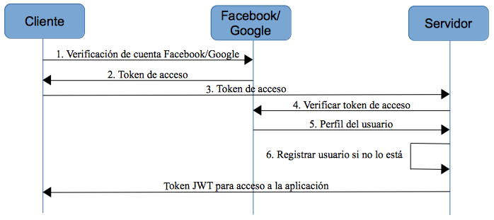

# Tema 3. Opciones avanzadas de Express.js

## 3.3. Autenticaciones con Passport

En la sección anterior hemos tratado con mecanismos de autenticación algo "rudimentarios", donde nos hemos encargado de controlar qué rutas estaban protegidas y pedir al usuario una autenticación mediante token o sesiones para acceder a ellas.

En este apartado haremos uso de un middleware llamado **passport**. Se define a sí mismo como un framework discreto (unobtrusive), es decir, que su inclusión no afecta demasiado a la estructura o al código general de la aplicación. Entre otras ventajas, admite diferentes tipos de autenticación, tales como local contra una base de datos propia, uso de tokens, o contra webs conocidas, como Facebook, Google o Twitter, entre otros mecanismos. En general, si consultamos la [documentación](http://www.passportjs.org/), veremos que ofrece más de 300 formas de autenticación, que se denominan estrategias (*strategies*), y cada una de ellas se instala como un submódulo adicional de *passport* (por lo que sólo instalaremos los que necesitemos utilizar).

### 3.3.1. Autenticación local

Para empezar, vamos a gestionar una autenticación local contra una base de datos propia. Crea una carpeta llamada "PruebaPassport" en tu carpeta de pruebas, e instala en el proyecto los módulos de *mongoose*, *express*, *body-parser* y *passport* (con el correspondiente `npm init` previo):

```
npm install mongoose express body-parser passport
```

#### 3.3.1.1. Definición del modelo de usuarios

Vamos a crear una carpeta `models` en el proyecto, con un archivo `usuario.js` que contendrá el siguiente modelo:

```js
const mongoose = require('mongoose');

let usuarioSchema = new mongoose.Schema({
    login: {
        type: String,
        required: true,
        unique: true,
        minlength: 1,
        trim: true
    },
    password: {
        type: String,
        required: true,
        minlength: 1,
        trim: true
    }
});

let Usuario = mongoose.model('usuario', usuarioSchema);

module.exports = Usuario;
```

Vemos que simplemente definimos un login (único) y un password, ambos requeridos. Para simplificar este ejemplo y no definir un servicio para insertar usuarios, vamos a dejar un par de usuarios ya insertados en la colección correspondiente. Puedes definir un pequeño archivo `generar_usuarios.js` como éste, en la carpeta principal, y ejecutarlo desde el terminal para rellenar la colección:

```js
const mongoose = require('mongoose');
const Usuario = require(__dirname + '/models/usuario');

mongoose.connect('mongodb://localhost:27017/pruebapassport');

Usuario.collection.drop();

let usu1 = new Usuario({
    login: 'nacho',
    password: '1234'
});
usu1.save();

let usu2 = new Usuario({
    login: 'arturo',
    password: '5678'
});
usu2.save();
```

#### 3.3.1.2. Definir el esqueleto del servidor local

Vamos ahora a definir el código de nuestro servidor `app.js` en la carpeta principal del proyecto. Inicialmente, lo que vamos a hacer es definir un mensaje de bienvenida al conectar a la raíz de la aplicación.

```js
const express = require('express');
const mongoose = require('mongoose');
const bodyParser = require('body-parser');

const Usuario = require('./models/usuario');

mongoose.connect('mongodb://localhost:27017/pruebapassport');

let app = express();

app.use(bodyParser.urlencoded());

app.get('/', (req, res) => {
    res.send("Bienvenido/a");
});

app.listen(8080);
```

#### 3.3.1.3. Añadir passport al proyecto

A continuación, añadimos el framework *passport* al proyecto como middleware. Para ello, incorporamos al principio la librería:

```js
const express = require('express');
const mongoose = require('mongoose');
const bodyParser = require('body-parser');
const passport = require('passport');
...
```

Después, añadimos passport como middleware a la aplicación, llamando a su método `initialize`:

```js
let app = express();
app.use(passport.initialize());
```

#### 3.3.1.4. Definir una estrategia de autenticación local

Como hemos comentado, passport ofrece más de 300 estrategias diferentes de autenticación. La de autenticación contra una base de datos local quizá sea la más habitual de ellas, y para ello (como para cualquier otra estrategia) necesitamos instalar e incorporar un nuevo módulo, en este caso llamado *passport-local*.

```
npm install passport-local
```

Lo añadimos al proyecto con su correspondiente `require`. En este caso accedemos al elemento Strategy:

```js
const LocalStrategy = require('passport-local').Strategy;
```

Y con él definimos una estrategia de autenticación local:

```js
passport.use(new LocalStrategy((login, password, done) => {
    Usuario.find({login: login, password: password})
    .then(resultado => {
        if (resultado)
            return done(null, resultado);
        else
            return done(null, false);
    }).catch(error => {
        return done(error, false);
    });
}));
```

Por defecto, *passport* asume que las credenciales del usuario van a llegar en dos campos llamados `username` y `password`. Si no es así, se pueden establecer nuevos campos al definir la estrategia:

```js
passport.use(new LocalStrategy(
    {usernameField: 'usuario', passwordField: 'pass'},
    (login, password, done) => { ... }
```

En cuanto al código de la estrategia en sí, lo que hacemos es buscar el usuario en la colección, y si se encuentra devolvemos con `done` el usuario (`resultado`). Si no se encuentra, devolvemos `false`. El primer parámetro de la función `done` se emplea en caso de excepción (catch), para notificar del error producido.

Una vez hemos definido la estrategia, falta aplicarla a las rutas que la requieran. Si, por ejemplo, queremos proteger el acceso a la raíz de la aplicación, podemos añadir una llamada a `passport.authenticate` en la propia ruta:

```js
app.get('/', passport.authenticate('local', {session: false}), 
(req, res) => ...
```

El parámetro `session` se pone a `false` en el caso de que no queramos almacenar al usuario en sesión (algo útil si empleamos autenticación por token, como haremos después). Si se llega a ejecutar el código de la ruta, es porque la autenticación es exitosa, y en ese caso tendremos en el objeto `req.user` los datos del usuario autenticado, devueltos por la llamada a `done` en la función anterior.

También podemos establecer una URL a la que redirigir en caso de éxito, y otra en caso de error al autenticar:

```js
app.post('/', passport.authenticate('local', 
{session: false, successRedirect: '/ok', 
failureRedirect: '/login'}), 
(req, res) => { ... });
```

Aunque, si lo hacemos de este modo, la URL a la que se redirige en caso de login satisfactorio no recibe el elemento `req.user` con los datos del usuario validado. Si queremos enviarle esta información tendríamos que redirigir desde dentro de la ruta. Por ejemplo:

```js
app.post('/', passport.authenticate('local', {session: false, failureRedirect: '/login'}), (req, res) => {
    res.redirect('/ok/' + req.user.login);
});

app.get('/ok/:login', (req, res) => {
    res.status(200).send("Bienvenido/a " + req.params.login);
});

app.get('/login', (req, res) => {
    res.status(401).send("Usuario incorrecto");
});
```

Para probar el funcionamiento de este ejemplo tal y como está definido, debemos estar continuamente pasando el usuario y el password en cada petición, cosa que no es nada habitual ni deseable. La alternativa a esto sería utilizar sesiones, dejando el atributo `session` a `true` en la llamada a `passport.authenticate`. Esto podremos hacerlo siempre que nuestra aplicación web admita autenticación por sesiones. De lo contrario, es más recomendable utilizar una autenticación por token como la que veremos a continuación.

> **Ejercicios propuestos**
>
> **1.** Modifica el ejemplo *PruebaPassport* hecho antes, y añade estas vistas con Nunjucks (instalando y configurando Nunjucks como motor de plantillas de la aplicación):
> 
> * `login.njk`: mostrará un formulario de login con los campos de `usuario` y `password`. Se mostrará al acceder por GET a `/login`, y su contenido se enviará por POST a esa misma ruta `/login`.
> * `inicio.njk`: con un simple mensaje de bienvenida, se mostrará al acceder por GET a la ruta raíz `/`
> * `protegido.njk`: con un mensaje de "Zona protegida". Se mostrará al acceder por GET a `/protegido`.
> 
> Utilizando la base de datos con la colección de usuarios que ya se ha creado en el ejemplo, deberemos proteger el acceso a la ruta `/protegido`, mostrando el formulario de login en caso de que el usuario no esté validado.

### 3.3.2. Autenticación local por token

Para que la estrategia anterior sea válida, necesitamos o bien estar pasando continuamente el usuario y el password en cada petición (cosa nada frecuente), o bien utilizar sesiones para almacenar el usuario (algo que ya vimos que no es aplicable a ciertos tipos de aplicaciones cliente), o bien combinarlo con algún mecanismo de envío de tokens. Veremos ahora cómo añadir esta característica a la autenticación local con *passport*.

Vamos a basarnos en el mismo proyecto de "PruebaPassport" anterior para poder reutilizar el modelo y algunos elementos, pero vamos a crear un servidor alternativo (llamaremos al archivo `app_jwt.js`) para que no se solape con las pruebas de autenticación local básicas vistas antes.

Para este ejemplo, necesitaremos los siguientes módulos de Node:

* *express* (ya instalado del anterior ejemplo)
* *mongoose* para acceder a la colección de usuarios (ya instalado también)
* *body-parser* para procesar el login y password por POST al hacer login (ya instalado)
* *passport* como base para cualquier estrategia de autenticación que utilicemos (ya instalado)
* *passport-jwt* para definir una estrategia de autenticación basada en tokens JWT
* *jsonwebtoken* para generar tokens una vez el usuario se haya logueado correctamente, como hicimos en sesiones previas.

Por lo tanto, debemos instalar dos módulos nuevos (*passport-jwt* y *jsonwebtoken*). Después, incluimos todo lo necesario en nuestro servidor `app_jwt.js`:

```js
const express = require('express');
const mongoose = require('mongoose');
const bodyParser = require('body-parser');
const passport = require('passport');
const {Strategy, ExtractJwt} = require('passport-jwt');
const jwt = require('jsonwebtoken');
const Usuario = require('./models/usuario');
```

En el caso de la librería *passport-jwt*, incluimos dos cosas: la estrategia y un objeto `ExtractJwt` que permite definir la forma de extraer el token de las peticiones del cliente, como veremos a continuación. 

Definimos también como constante la palabra secreta para cifrar los tokens, y nuestro método `generarToken`, ya utilizado en ejemplos previos, para generar un token una vez validado el usuario. En este caso, incluimos el *id* del usuario en el payload del token.

```js
const secreto = "secretoDAW";

let generarToken = id => {
    return jwt.sign({id: id}, secreto, {expiresIn: "2 hours"});
}
```

Conectamos con la misma base de datos que en el ejemplo anterior:

```js
mongoose.connect('mongodb://localhost:27017/pruebapassport');
```

Y definimos la estrategia de autenticación:

```js
passport.use(new Strategy({secretOrKey: secreto, 
    jwtFromRequest: ExtractJwt.fromAuthHeaderAsBearerToken()}, 
    (payload, done) => {
        if (payload.id) {
            return done(null, {id: payload.id});
        } else {
           return done(new Error("Usuario incorrecto"), null);
        }
}));
```

En este caso, la estrategia recibe dos parámetros de configuración:

* `secretOrKey` con la palabra secreta para cifrar los tokens (y poderlos validar después)
* `jwtFromRequest` con la función que se empleará para extraer el token de la petición. En este caso, utilizamos una función de la propia librería *passport-jwt* que extrae el token de una cabecera *Authorization* con el prefijo "*Bearer* ", según los estándares. Por lo tanto, deberemos enviar este prefijo desde las peticiones del cliente. No será necesario extraer el prefijo desde el servidor, lo hace automáticamente el método indicado. Internamente, la función verifica que se pueda extraer el *id* del payload (lo que indicará que se ha podido descodificar correctamente el token). Si todo es correcto, llamamos a `done` enviando el id extraído (para poder acceder a él desde la ruta, como veremos a continuación). Si ha habido algún error, lo enviamos en el `else` (para anular la autenticación).

Una vez definida la estrategia, añadimos *passport* como middleware de la aplicación, además de *body-parser*:

```js
let app = express();
app.use(passport.initialize());
app.use(bodyParser.json());
```

y llamamos al método de autenticación en cada ruta protegida. En nuestro caso, podemos definir tres rutas: una pública, otra para hacer login y generar el token, y otra protegida que utilice la estrategia anterior para autenticar al usuario que entra:

```js
app.get('/', (req, res) => {
    res.send("Bienvenido/a a la zona pública");
});

app.post('/login', (req, res) => {
    Usuario.findOne({login: req.body.login, 
        password: req.body.password})
    .then(resultado => {
        if (resultado)
            res.send({ok: true, token: generarToken(resultado._id)});
        else
            res.send({ok: false, mensajeError: "Usuario incorrecto"});
    }).catch(error => {
        res.send({ok: false, mensajeError: "Usuario incorrecto"});
    });
});

app.get('/protegido', passport.authenticate('jwt', {session: false}), 
(req, res) => {
    res.status(200).send("Bienvenido/a a la zona protegida " +  
        JSON.stringify(req.user));
});

app.listen(8080);
```

Podemos probar estas tres rutas desde Postman. En el caso del login, enviaremos las credenciales del usuario (login y password) por POST mediante JSON, y obtendremos el token generado. Este token lo deberemos enviar en la cabecera "Authorization" con el prefijo "Bearer " para acceder a la zona protegida.

En el caso de que quisiéramos generar un nuevo token (renovarlo) en cada acceso, deberíamos obtener el *id* del *payload* (o a través de *req.user.id*), y enviar el token por JSON como respuesta. Por ejemplo:

```js
app.get('/protegido', 
    passport.authenticate('jwt', {session: false}), 
    (req, res) => {
    res.send({ok: true, token: generarToken(req.user.id)});
});
```

### 3.3.3. Autenticaciones distribuidas con OAuth

OAuth es un estándar de autenticación de usuarios distribuida, que fue desarrollado por Twitter en el año 2006, y que posteriormente han ido adoptando grandes corporaciones como Facebook, Google, LinkedIn, etc. Lo que se consigue con este estándar es que, con el permiso de estas grandes compañías, los usuarios de nuestras aplicaciones no tengan que registrarse localmente en ellas, sino emplear el usuario que ya tienen creado en esas grandes webs, haciendo un simple clic de ratón. Es típico encontrarnos con pantallas de registro o login como esta en varias aplicaciones:

<div align="center">
    
</div>

De esta forma, el usuario puede crear una cuenta privada en la aplicación, o usar una externa de una de estas compañías, y de este modo evitamos hacerles crear un nuevo usuario y password que recordar.

#### 3.3.3.1. Funcionamiento general de OAuth

Supongamos que tenemos una aplicación web cliente-servidor, y queremos permitir que los usuarios utilicen su cuenta de una de estas grandes compañías para registrarse (y, posteriormente, loguearse) en nuestra aplicación, y no tener que estar proporcionando otro nombre de usuario, contraseña, etc. Los pasos que sigue la aplicación web para lograr la validación del usuario por parte de esa otra compañía, desde que el usuario hace clic en el botón correspondiente, son los siguientes:

1. El cliente (*frontend*) envía a la empresa (Facebook, Google, etc) una petición de verificación del usuario correspondiente. Este paso normalmente no requiere de más información, si el usuario ya tiene una sesión creada e iniciada en su navegador o dispositivo móvil para esa aplicación (Facebook, Google, etc). Es posible, eso sí, que tras hacer clic en el botón de Facebook o Google veamos un popup o ventana modal para indicarnos si permitimos que la aplicación web acceda a nuestros datos de Facebook/Google, respectivamente.
2. La compañía responde a nuestra aplicación cliente con un token de acceso
3. El cliente envía al servidor (Express, en nuestro caso) dicho token de acceso
4. El servidor envía a la compañía el token de acceso para ser verificado
5. A cambio se obtiene el perfil del usuario, donde, entre otras cosas, podemos acceder a la cuenta de e-mail que empleó para registrarse, o al id que le ha asignado la compañía. 
6. En este punto, el servidor comprueba si ese usuario está registrado ya en el sistema con esa cuenta de e-mail o id, y en caso contrario la da de alta (sólo el id o la cuenta de e-mail, de forma transparente al usuario, para tenerlo "fichado" en caso de volver a conectar).
7. Una vez verificado todo, el servidor envía al cliente el token de acceso al sistema. Este es el token que deberá ser re-enviado por el cliente para cada petición que haga.

Puesto en forma de diagrama de secuencia, los pasos quedarían de la siguiente forma: 

<div align="center">
    
</div>

Veremos a continuación cómo emplear OAuth para autenticar usuarios usando sus cuentas de Facebook o Google. Cada una de estas empresas ofrece una API diferente para comunicarse con ellas y obtener los datos del usuario que pretende acceder a nuestra aplicación, así que no hay unas pautas generales para funcionar al respecto. Pero sí hay una serie de pasos comunes a seguir en todos los casos, como por ejemplo solicitar permiso como desarrolladores para que Facebook o Google nos faciliten los datos de los usuarios que se conecten desde nuestra aplicación. Lo veremos a continuación.

#### 3.3.3.2. Ejemplo: Google

