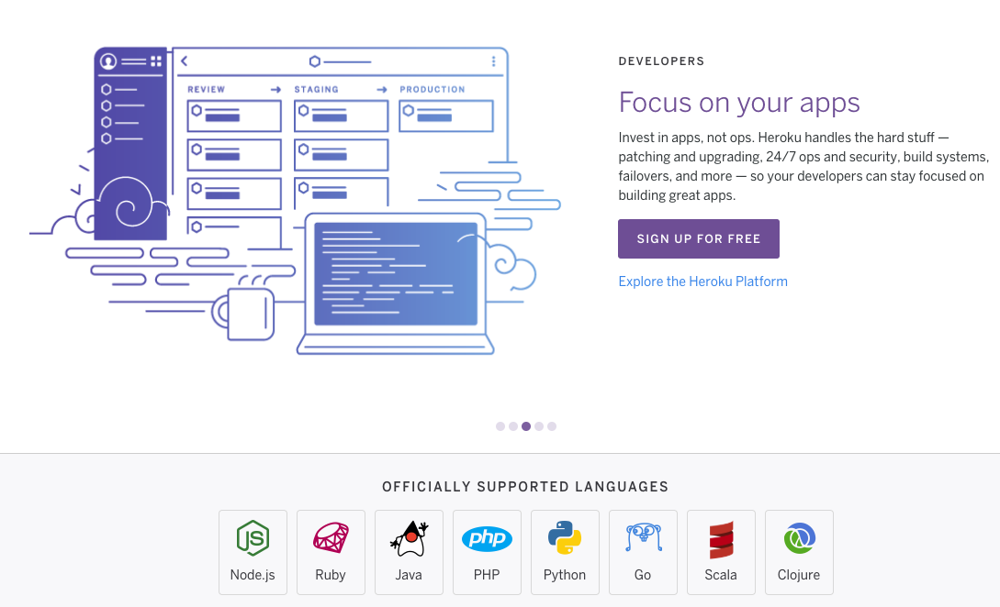
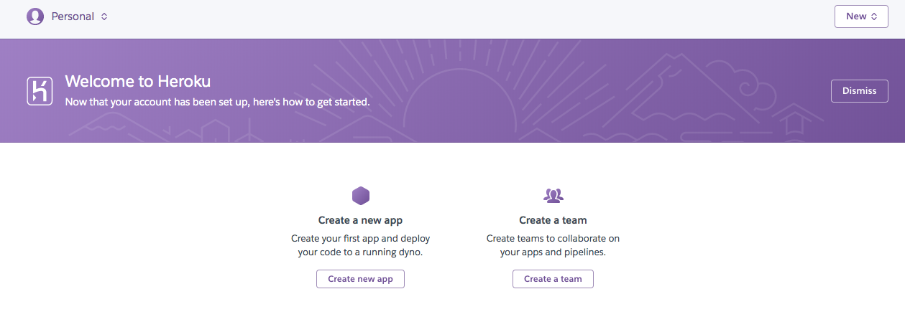
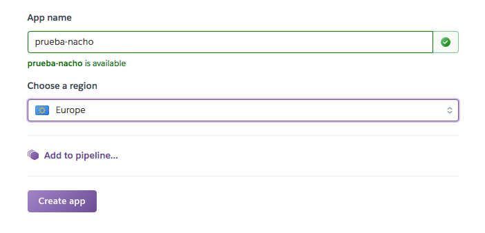
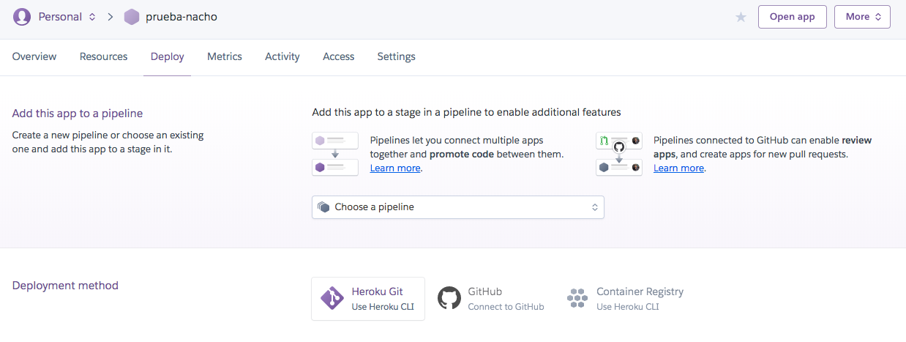
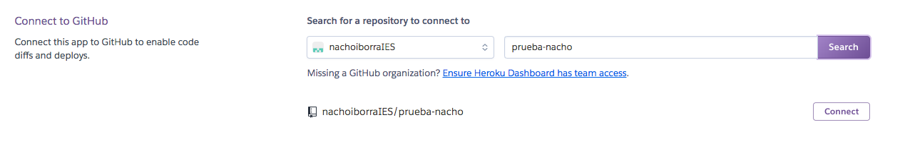
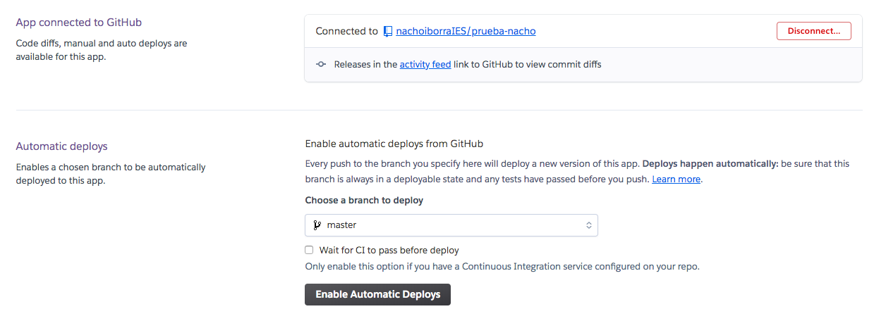
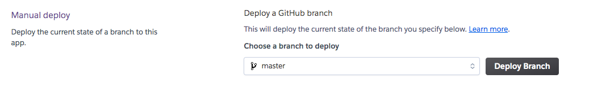
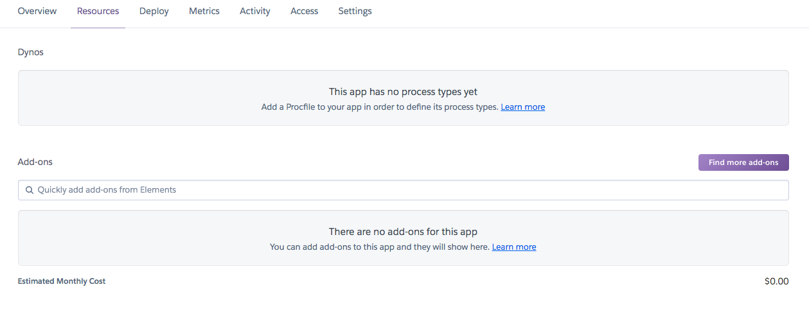
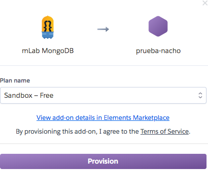
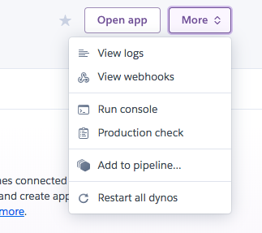

# Tema 4. Despliegue de aplicaciones

## 4.3. Introducción al "*cloud computing*"

> **NOTA**: parte de los contenidos aquí mencionados se han extraído de material proporcionado por *cloud@iesmarenostrum.com*, a través de un curso de formación del profesorado (CEFIRE).

La computación en la nube o *cloud computing* permite ofrecer servicios de computación a través de la red (normalmente Internet), y permite a muchas empresas abaratar costes y maximizar su disponibilidad y tiempo de respuesta, delegando en esta nube sus infraestructuras a mayor o menor nivel, desde infraestructuras hardware hasta simples aplicaciones distribuidas en la nube para su acceso remoto.

### 4.3.1. Características principales

Veremos a continuación qué características principales definen el paradigma del *cloud computing*: tipos de servicios ofrecidos, ventajas e inconvenientes, y ejemplos de proveedores de servicios que podemos encontrar.

#### 4.3.1.1. Niveles de servicios ofrecidos

Actualmente el *cloud computing* ofrece servicios a tres niveles diferentes.

**Software como servicio (SaaS, *Software as a Service*)**

Es un modelo de distribución de software, en el que las aplicaciones se alojan en un proveedor de servicios en la nube, quedando disponibles para sus usuarios. Como **ejemplos** más significativos encontramos aplicaciones como Dropbox, Slideshare, PayPal...

La principal **ventaja** de este nivel es su **facilidad** de uso (sólo tenemos que acceder y utilizar la aplicación), y la principal **desventaja** es su **limitación** (sólo podemos realizar las tareas que permite la aplicación utilizada).

**Plataforma como servicio (PaaS, *Platform as a Service*)**

Permite abastecer al usuario de sistemas operativos y servicios asociados. Por lo tanto, los *PaaS* son contenedores de aplicaciones, donde podemos albergar nuestras aplicaciones para su uso. Algunos **ejemplos** son Heroku o Joyent.

La principal **ventaja** de este nivel es su idoneidad para desarrolladores, que pueden desplegar allí sus aplicaciones, y su **desventaja** mayor es que están restringidas a lo que está disponible (dependientes de ciertos lenguajes, o ciertas tecnologías en algunos casos).

**Infraestructura como servicio (IaaS, *Infrastructure as a Service*)**

También conocido como *HaaS* (*Hardware as a Service*), se refiere al uso de equipos de terceros, o en otras palabras, al uso de equipos hardware proporcionados por estos proveedores de servicios. Ofrecen también capas de virtualización hardware y/o software, de forma que se pueden desplegar contenedores, o máquinas virtuales, que a su vez incorporen dentro servidores u otras aplicaciones.

Los principales **ejemplos** de proveedores de servicios a este nivel son AWS (*Amazon Web Services*), Azure (Microsoft), Google Compute Engine, etc.

#### 4.3.1.2. Escenarios posibles

A la hora de migrar o utilizar los servicios de *cloud computing*, las empresas emplean uno de estos tres posibles escenarios:

* *Todo en la nube*: se suele emplear en proyectos nuevos, ya que migrar todo un proyecto existente a la nube puede ser más costoso.
* *Híbridos*: donde una parte del proyecto está en la nube y otra no. Los servicios se van migrando poco a poco, en la medida en que sea posible, pero hay una infraestructura local actual delicada, que debe quedar en la organización.
* *Nube privada o local*: consiste en desarrollar un servicio propio de *cloud computing* para la empresa. No es demasiado habitual porque suele ser más costosa que utilizar la nube global, pero a veces es necesaria para cumplir ciertos estándares de conformidad.

#### 4.3.1.3. Ventajas e inconvenientes

**Ventajas**

El *cloud computing* ofrece una serie de ventajas sobre la computación tradicional:

* Ahorro de **espacio**, ya que no necesitamos albergar la infraestructura hardware con la que vamos a trabajar en la empresa.
* **Planificación** menos costosa, ya que, ante cualquier cambio en el modelo de negocio (por ejemplo, que necesitamos expandir la empresa y contratar más recursos y servidores), el proveedor de servicios nos proporcionará lo que necesitemos.
* Mayor **seguridad** ante ataques informáticos, o incluso acciones gubernamentales, ya que los servicios están distribuidos en diversas plataformas por todo el mundo.
* En general, menor **coste**, al no tener que mantener ni comprar una infraestructura local. Se paga sólo por lo que se está utilizando.
* Capacidad de **almacenamiento** ilimitada.

**Desventajas**

Las principales desventajas del *cloud computing* son:

* Requiere una conexión a Internet continua
* En escenarios híbridos (con parte de la infraestructura local en la empresa) puede ofrecer bastante latencia (tiempo de respuesta de los servicios alojados en la nube).
* Falta de confianza, e incluso problemas legales: se están almacenando datos en servidores remotos que no controlamos del todo.
* Dependencia tecnológica en otras compañías. Si se pierden los datos en la nube, la compañía tendrá problemas motivados por causas ajenas.

#### 4.3.1.4. Principales proveedores de servicios

Amazon fue la empresa pionera en *cloud computing*. La enorme tienda online en la que se estaba convirtiendo necesitaba de una enorme infraestructura para albergarla, y optaron por desarrollar su propia infraestructura y ahorrar en costes a largo plazo, vendiendo después sus servicios a terceros. Esta plataforma cloud comenzó a estabilizarse y ampliarse a partir de 2006.

Como se puede comprobar, esta idea fue todo un éxito. En 2018, la división **AWS** (*Amazon Web Services*), dentro de la compañía de Amazon, obtuvo 26.000 millones de dólares de beneficio. En los últimos años, otras compañías se han unido a este fenómeno, y la cuota de mercado se va dividiendo, aunque con bastante predominancia aún de AWS (en torno a un 30 o 35%).

El otro gran competidor actualmente de AWS es **Azure**, de Microsoft, con aproximadamente un 15 o 20% de cuota de mercado. Inicialmente (año 2008) se concibió como un proveedor *PaaS*, pero posteriormente amplió sus horizontes para ser un proveedor *IaaS*. A partir de 2014 aproximadamente, Microsoft considera prioritario reforzar su orientación al *cloud computing*.

Tras estos dos gigantes, podemos encontrar otros proveedores importantes, como Google o IBM, aunque con mucha menor cuota de mercado.

**¿Quién utiliza AWS?**

Podemos encontrar ejemplos significativos de clientes, como Netflix, Spotify, LinkedIn, Instagram... También Apple tiene alojado en Amazon su contenido iCloud. Se estima que aproximadamente el 25 o 30% del tráfico de Internet pasa por los servidores AWS.

**¿Quién utiliza Azure?**

También algunas grandes empresas emplean Azure como su proveedor de servicios *cloud*. Es el caso de MediaMarkt o Mercedes, entre otros.

**Servicios implementados**

Todos los grandes proveedores de servicios *cloud* ofrecen una serie de servicios básicos a sus clientes: desde el uso de bases de datos convencionales, a servicios de Big Data, contenerización, almacenamiento de archivos, etc. Esto hace que, en mayor o menor medida, dé igual el proveedor que seleccionemos, puesto que todos ellos implementan servicios equivalentes en categorías equivalentes.

Por ejemplo, para dar soporte a contenerización a través de Docker o Kubernetes, AWS dispone del *EC2 Container Service*, mientras que Azure cuenta con el *Azure Container Service (AKS)*. Para la computación *serverless*, AWS cuenta con *AWS Lambda*, y Azure con *Azure Functions*.

**¿Cuál elegir?**

Los motivos que pueden llevar a elegir un proveedor u otro están más relacionados con los costes, fiabilidad, o posibilidad de integrar lo que ya se tiene con la infraestructura proporcionada en la nube. Así, por ejemplo, los antiguos usuarios de tecnologías Microsoft pueden adaptarse mejor a las infraestructuras proporcionadas por Azure que a las de otros proveedores.

#### 4.3.1.5. Algunos ejemplos reales

Para concluir esta introducción al *cloud computing* veremos un par de casos de éxito de empresas que decidieron migrar a *cloud*.

**Meneame**

Meneame es el mayor agregador de noticias en castellano a nivel mundial. Su portal tiene cientos de miles de visitas diarias, y necesita una infraestructura web que les dé soporte y sea flexible, para poderse adaptar a que ese flujo de visitas crezca o decrezca.

En 2010 decidieron migrar a AWS, y redujeron los costes a la décima parte, gastando en cada momento sólo lo necesario, y con la capacidad de crecer dinámicamente en un futuro de forma sencilla.

**Securitas Direct**

Securitas Direct es una multinacional con millones de clientes, que dispone de toda clase de dispositivos de seguridad que generan señales y multimedia por todo el mundo: más de 300 millones de señales al día y más de 42 millones de vídeos, que es necesario que circulen por su infraestructura para la monitorización de las viviendas e instalaciones que protegen.

En 2010, se comenzó con la grabación de vídeo, para lo que las infraestructuras existentes en la empresa eran insuficientes. Nuevamente, se apoyaron en AWS para esta expansión, empleando tecnologías *serverless* para el procesamiento de señales multimedia.

### 4.3.2. Despliegue de aplicaciones en la nube

En este apartado veremos cómo desplegar aplicaciones web en algunos de los proveedores de servicios cloud más conocidos.

#### 4.3.2.1. Heroku

Como se ha comentado anteriormente, Heroku es un proveedor de servicios *cloud* que entra dentro de la categoría de *PaaS* (*Platform as a Service*), es decir, ofrece servicios para desplegar aplicaciones sobre sus sistemas. Ofrece un servicio gratuito de despliegue para aplicaciones pequeñas, y además permite integrar una serie de servicios que tiene incorporados, como por ejemplo bases de datos Mongo. [Aquí](https://www.heroku.com) podemos acceder a su web inicial.

<div align="center">
    
</div>

Como puede verse en la captura de pantalla de su página de inicio, Heroku permite desplegar aplicaciones desarrolladas en un conjunto limitado (aunque amplio) de lenguajes: Node.js, Ruby, PHP, Python...

**Registro**

Podemos registrarnos en la plataforma de forma gratuita a través del botón *Sign up for free*. Después, en nuestra zona de usuario nos dará la opción de crear una nueva app (tanto desde el botón *Create new app* en la parte central como desde el botón *New* en la esquina superior derecha), o bien crear un equipo (es decir, añadir a otros usuarios de Heroku para colaborar en un mismo proyecto, al estilo de GitHub, por ejemplo).

<div align="center">
    
</div>

**Crear y borrar aplicaciones**

Si elegimos crear una aplicación, nos pedirá que indiquemos el nombre de la misma (uno que no esté siendo ya utilizado), y dónde queremos poner en marcha la aplicación (Estados Unidos o Europa).

<div align="center">
    
</div>

A continuación veremos el panel de control de la app que hemos decidido crear. 

<div align="center">
    
</div>

Desde ese mismo panel de control, podemos **borrar** la aplicación actual, yendo a la pestaña *Settings* y eligiendo al final de todo la opción *Delete app*.

**Configurar opciones de despliegue**

Comenzaremos analizando la pestaña **Deploy**, donde configuramos el modo de despliegue de nuestra aplicación. En la parte superior indica si queremos unirla a un *pipeline*. Esta funcionalidad permite enlazar aplicaciones entre sí, aunque en este tutorial no lo vamos a emplear. 

Además, debajo de esta sección nos permite indicar cómo vamos a desplegar la aplicación sobre Heroku. Una opción es utilizar una herramienta de línea de comandos propia de Heroku (Heroku CLI), que permite enviar los cambios mediante comandos similares a los de *git*. También ofrece la opción de comunicar Heroku con GitHub, y tomar de los repositorios de GitHub las aplicaciones. Elegiremos esta última opción en nuestro caso, y nos pedirá permiso para conectar con GitHub desde Heroku. Después, veremos un formulario para que indiquemos con qué repositorio de GitHub queremos conectar. Es decir, primero deberemos tener un repositorio creado y relleno en GitHub.

<div align="center">
    
</div>

Cuando pulsemos el botón de *Connect* se intentará establecer la conexión con dicho repositorio. Si todo es correcto (es decir, si hemos obtenido el permiso previo de GitHub y la URL del repositorio es correcta y contiene datos), aparecerá un panel inferior para configurar un despliegue automático si queremos. Esto hará que cada vez que subamos datos a GitHub (con un *push*), se desplieguen automáticamente en Heroku. Basta con hacer clic en el botón de *Enable Automatic Deploys*.

<div align="center">
    
</div>

Es posible, no obstante, que los despliegues automáticos no lo sean tanto, y en ocasiones debamos hacer un despliegue manual. Basta con ir a la pestaña *Deploy*, y en la parte inferior, elegir la opción de *Manual Deploy*, pulsando el botón *Deploy Branch* (y eligiendo la rama que queremos desplegar, que por defecto será la rama *master*).

<div align="center">
    
</div>

**Configurar los recursos de la aplicación**

Ahora vamos a la pestaña de **Resources** de nuestro repositorio Heroku. Aquí podemos configurar los *Dynos* y los *Add-ons*.

<div align="center">
    
</div>

Los **Dynos** son la forma que tiene Heroku de llamar a sus contenedores. Las aplicaciones que se despliegan en Heroku se ejecutan sobre *dynos*, y debemos especificar qué proceso(s) debe(n) ejecutarse. Para ello, se debe crear un archivo llamado `Procfile` en la raíz del proyecto, indicando en la propiedad `web` el comando a ejecutar por Heroku. Por ejemplo, este puede ser el contenido de nuestro archivo `Procfile` para una aplicación Node.js:

```
web: node index.js
```

Es IMPORTANTE también recalcar que Heroku instalará todas las dependencias que estén incluidas en la sección *dependencies* de nuestro archivo `package.json` (no así las dependencias de *devDependencies*, que se entiende que son útiles sólo para desarrollo, pero no para puesta en producción).

Por otra parte, los **Add-ons** son elementos adicionales que puede necesitar nuestra aplicación para funcionar. En este campo entran, por ejemplo, bases de datos en MongoDB. Si ponemos en el buscador "MongoDB", aparecerá la opción de *mLab MongoDB*. Este *add-on* permite utilizar una base de datos pequeña para pruebas simples, eligiendo la opción gratuita *Sandbox*. Para proyectos más grandes, también se puede contratar un cluster de mayor o menor tamaño, por una cantidad mensual.

<div align="center">
    
</div>

Sin embargo, es posible que nos solicite datos de la tarjeta de crédito, aunque hayamos elegido un plan gratuito, para prevenir futuros cambios de plan. En nuestro caso, no vamos a necesitar una base de datos en Heroku para los ejemplos que vamos a realizar, puesto que conectaremos con otra base de datos remota.

Otro aspecto importante que debemos tener en cuenta en la aplicación para desplegarla en Heroku es el **puerto** por el que escuchará. Por defecto, las aplicaciones en Heroku se lanzan bajo HTTPS, es decir, se utilizará el puerto 443. Puede ser una buena práctica intentar asignar la variable de entorno PORT, si está establecida, y si no elegir otra (443, por defecto, en Heroku):

```js
let app = express();
...
let puerto = process.env.PORT || 443;
app.listen(puerto);
```

**Acceder a la aplicación y revisar los *logs***

Para poder acceder a la aplicación una vez desplegada, basta con hacer clic en el botón *Open app* que aparece en la parte superior derecha de nuestro panel de control del repositorio Heroku (sobre las pestañas de *Deploy*, *Resources*, etc).

Si se produce cualquier error, el botón *More* que hay junto a *Open app* nos permite, entre otras cosas, ver los archivos de log (*View logs*).

<div align="center">
    
</div>

**Precios**

Si accedemos a la web de [precios](https://www.heroku.com/pricing) de Heroku, veremos que nuestra cuenta gratuita soporta un límite de horas de funcionamiento al mes. Existen otras versiones de pago algo más avanzadas, para desplegar proyectos pequeños o más profesionales, sin límite de horas de conexión. En nuestro caso, haremos unas pruebas simples con la versión gratuita.

**Caso particular: despliegue de aplicaciones Nest**

Si estamos desarrollando una aplicación con el framework Nest.js, existen varias formas de desplegarla sobre Heroku. Veamos aquí una forma sencilla, siguiendo estos pasos. Supondremos, no obstante, que ya tenemos la aplicación desarrollada (al menos parcialmente) en local.

1. Debemos modificar el archivo `main.ts` para que tome el puerto de la variable de entorno. También utilizaremos el método `enableCors` para activar las CORS (*Cross Origin Resource Sharing*), de forma que podamos acceder a la aplicación desde clientes externos, como Angular.

```js
async function bootstrap() {
  const app = await NestFactory.create...
  ...
  app.enableCors();
  await app.listen(process.env.PORT || 443);
}
bootstrap();
```

2. Editamos (o creamos, si no lo tenemos) el archivo `.gitignore` para indicarle que omita la carpeta `node_modules` al subirla a GitHub, pero que sí tenga en cuenta la carpeta `dist`:

```
# /dist
/node_modules
```

3. Editamos la sección "scripts" del archivo `package.json` para crear una nueva tarea que ejecute el archivo `dist/main.js`, ya que lo que vamos a hacer es construir (*build*) la aplicación para que se ejecute ya empaquetada.

```
"start:dist": "node dist/main.js",
```

4. Crearemos un archivo `Procfile` en la raíz del proyecto, indicando que lo que se va a ejecutar es justamente la tarea definida anteriormente:

```
web: npm run start:dist
```

5. En nuestra máquina local, construimos la aplicación con el comando `npm run build`, y después subimos los cambios a GitHub.

6. Ahora ya podemos desplegar la aplicación en Heroku y acceder a ella.

#### 4.3.2.2. AWS y Azure

A continuación se dan algunas pinceladas de las opciones que ofrecen los dos principales proveedores *cloud* actuales: AWS y Azure.

**AWS**

Lo primero que debemos hacer para poder utilizar los servicios en la nube de Amazon es crear una cuenta gratuita a través del [enlace de registro](https://aws.amazon.com/es/account/). Tiene el inconveniente de que nos solicita datos de nuestra tarjeta de crédito para confirmar el registro, aunque luego no se harán cargos realmente. Pero por este motivo no vamos a emplearlo realmente en estos apuntes.

Podemos consultar la web [aws.amazon.com/es/free](https://aws.amazon.com/es/free) para analizar qué elementos son gratuitos y por cuánto tiempo. Por ejemplo, la capa EC2 para despliegue de máquinas virtuales es gratuita durante los primeros 12 meses, con un uso de 750 horas al mes. Otras capas, como por ejemplo DynamoDB para almacenar bases de datos, o AWS Lambda para desplegar servicios sencillos, son gratuitas para siempre, incluyendo un número de horas gratuitas o de peticiones al mes.

**Azure**

En el caso de Azure, [aquí](https://azure.microsoft.com/es-es/free/) podemos acceder para registrarnos de forma gratuita, aunque con las mismas limitaciones que AWS: nos pedirá una tarjeta de crédito para validar la cuenta, aunque luego no se vayan a hacer cargos. Por este motivo, tampoco lo emplearemos en este tutorial.

De forma similar a lo que ocurre con AWS, el registro con Azure ofrece 12 meses de uso gratuito de ciertos servicios, como máquinas virtuales de Linux o Windows, o servicios de almacenamiento de datos. También existen multitud de servicios gratuitos para siempre, como *App Service*, que permite desplegar hasta 10 aplicaciones empleando distintas tecnologías (entre las que se incluyen Node o PHP, por ejemplo), Functions (algo similar a AWS Lambda, para desarrollar código *serverless*), etc.
