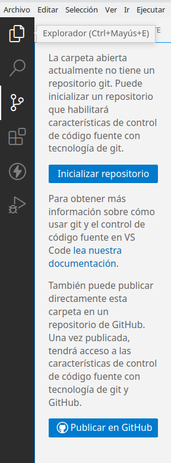

# Tema 1. Introducción a Node.js y Express.js

## 1. Anexo I: Funcionamiento de git

Git es el sistema de control de versiones más utilizado hoy en día. Es un proyecto de código abierto desarrollado inicialmente por Linus Torvalds. 

En esta sesión veremos cómo instalar Git y cómo utilizalo tanto desde consola como desde el Visual Studio Code.

### 1. Instalación de Git

#### 1.1. Cómo **instalar git en Linux**:

```
    $ sudo apt update && sudo apt install git
```
Comprobaremos que se ha instalado correctamente: 

```
    $ git -v
```

#### 1.2. Cómo **instalar git en Windows**:
Iremos a la web de git: https://gitforwindows.org/ nos lo descargamos y seguimos el asistente del instalador.

#### 1.3. Cómo **instalar git en MacOS**:
En el caso de tener instalado Homebrew como gestor de paquetes en OSX: 

```
    $ brew install git
```

De no ser así, la forma más fácil sería descargar el instalador desde: https://sourceforge.net/projects/git-osx-installer/files/

### 2. Configuración de un repositorio

El primer paso que debemos hacer es configurar el nombre y email del autor.

Para ello desde el terminal escribimos:
```
$ git config --global user.email "nuestroEmail"
$ git config --global user.name "nuestro nombre"
```

#### 2.1. Configuración de un repositorio desde vscode
Si tenemos vscode instalado, podemos usar git sin tener que abrir la consola. Para ello, nos iremos al menú de la izquierda y pulsaremos sobre Publicar en GitHub.
<div align="center">
    
</div>
Nos pedirá que iniciemos sesión en la web de github. Una vez tenemos la sesión inicializada, nos preguntará si queremos publicar el repositorio de forma pública o privada. Y qué archivos queremos subir a nuestro repositorio.
<div align="center">
    
</div>

En nuestro caso, marcaremos todos menos el directorio de node_modules. Y pulsamos sobre el botón ok.
<div align="center">
    
</div>

Una vez hemos hecho esto podemos pasar a realizar nuestro primer commit. Para ello en el recuadro de message, insertaremos el mensaje y pulsamos sobre commit.

<div align="center">
    
</div>

#### 2.2. Configuración de un repositorio desde consola
Para crear un nuevo repositorio debmos utilizar el comando ``git init`` es un comando que se utiliza una sola vez y es durante la configuración inicial. Este comando se debe ejecutar en el directorio del proyecto con el que vayamos a trabajar.

```
$ git init
```

Una vez hecho init, podemos pasar a trabajar. Para guardar los cambios que vayamos haciendo de nuestro proyecto en el repositorio, deberemos hacer un ``git add`` con los archivos y/o directorios que tenga nuestro proyecto y ``git commit``

```
$ git add files/directorios
$ git commit -m "mensaje"
```

El siguiente paso será indicar en qué rama vamos a trabajar, que será por defecto en la principal(main).
```
$ git branch -M main
```

Pasaremos a indicarle la url del directorio remoto en donde vamos a subir los cambios efectuados.
```
$ git remote add origin <url>
```
Y por último publicamos los cambios con ``push ``.

```
$ git push -u origin main
```