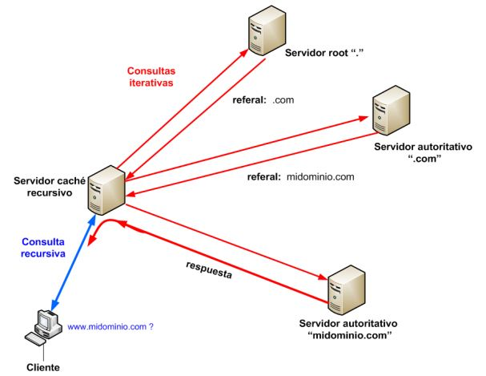

# Tema 1. Introducción a Node.js y Express.js

## 1.1. Introducción a las aplicaciones web

### 1.1.1. Tipos de aplicaciones

Cuando estamos utilizando un ordenador, una tablet o un teléfono móvil, ¿qué tipos de aplicaciones o programas podemos estar utilizando? Básicamente distinguimos dos grandes grupos:

* Aquellas aplicaciones que no necesitan ninguna conexión a Internet o a una red de ordenadores para funcionar. Este tipo de aplicaciones suelen llamarse **aplicaciones de escritorio**, y podemos encontrar ejemplos muy variados: un procesador de textos, un lector de libros electrónicos, un reproductor de música o vídeo, e incluso videojuegos que tengamos instalados.
* Aquellas aplicaciones que sí necesitan conexión, bien sea a Internet o a un ordenador de su red local. En este otro grupo también tenemos ejemplos variados de aplicaciones. Por ejemplo, si compartimos un documento de texto en Google Drive, o si abrimos el navegador para acceder a una plataforma de un curso online, o incluso si jugamos a videojuegos junto con otras personas de otros lugares. Aquí distinguimos varios subtipos de aplicaciones. Algunos de los más habituales son: 
  
    * Las **aplicaciones P2P** (*peer-to-peer*), donde todos los elementos conectados a la red tienen el mismo "rango", por así decirlo, y comparten información entre ellos. Es el mecanismo en el que se basan varios programas de descarga, como los de archivos tipo *torrent*.
    * Las **aplicaciones cliente-servidor**, llamadas así porque consisten en que un conjunto de ordenadores (llamados *clientes*) se conectan a uno central (llamado *servidor*) que es el que les proporciona la información y los servicios que solicitan. En el caso de videojuegos donde nos conectamos a otro lugar para jugar con otras personas, estamos utilizando aplicaciones cliente-servidor, donde nuestro ordenador (uno de los clientes), tiene instalada una parte de la aplicación y el servidor al que se conecta le proporciona la información de los escenarios y del resto de jugadores y personajes.  
       
        * Dentro del tipo de aplicaciones cliente-servidor, las **aplicaciones web** son un subtipo, quizá el más numeroso. Es en este subtipo en el que nos vamos a centrar.

#### 1.1.1.1. ¿Qué es una aplicación web?

Podemos encontrar diversas definiciones de aplicación web buscando en Internet. Una de las más habituales hace referencia a aplicaciones que se cargan o ejecutan desde un navegador web, accediendo a un servidor.

Sin embargo, el avance experimentado en este sector durante los últimos años hace que podamos definir un concepto más amplio. Así, una **aplicación web** sería aquella realizada a partir de lenguajes y tecnologías de desarrollo web, tales como HTML, CSS, Javascript, PHP... Pueden ejecutarse en un navegador convencional, o un motor de navegador embebido en otro sistema, como el *webview* de Android o iOS, por ejemplo. WebView es un componente que permite a las aplicaciones mostrar contenido web sin tener que abrir un navegador. Tiene un uso más limitado que éste pero, al estar pensado para consultas puntuales desde la propia aplicación, la carga de páginas es más rápida. Lo usan aplicaciones como Facebook, Instagram, etc.   

De este modo, además de las aplicaciones web "tradicionales", también tendrían cabida las llamadas aplicaciones *híbridas* (desarrolladas con tecnologías web pero exportadas a formato nativo de diversos dispositivos), y aplicaciones de escritorio que emplean tecnologías web, como por ejemplo el framework Electron de Javascript.

### 1.1.2. Arquitectura de una aplicación web

#### 1.1.2.1. ¿Qué es "la web"?

Podemos ver la web como una especie de plataforma mundial donde tenemos disponibles gran cantidad de recursos (documentos, videojuegos, redes sociales, foros, etc.). Se hizo popular a principios de los años 90 gracias a aplicaciones como el correo electrónico, los chats, etc. y con la aparición de la web 2.0 vinieron otra serie de aplicaciones que la potenciaron aún más, como los blogs o las redes sociales. Poco a poco se han ido añadiendo funcionalidades, hasta el punto de que hace pocos años era impensable poder ver vídeos o películas en Internet, y hoy es algo muy habitual.

#### 1.1.2.2. Elementos de una aplicación web

En una aplicación web podemos distinguir en primer lugar dos grandes lados: el **cliente**, donde está el usuario, que utiliza normalmente un navegador web (Google Chrome, Firefox, etc.) para acceder a la aplicación, y el **servidor**, donde está ubicada la aplicación (el foro, la red social, el blog, el curso online, etc.), y que se encarga de atender las peticiones de los clientes y proporcionales la información que solicitan.

#### 1.1.2.3. Funcionamiento de una aplicación web

Como hemos comentado, las aplicaciones web son un tipo de aplicaciones cliente-servidor. Este tipo de arquitecturas distribuyen las tareas entre quienes prestan los recursos y servicios (los servidores) y quienes los solicitan (los clientes). 

Los pasos que se siguen en la comunicación cliente-servidor, son, normalmente:
1. El cliente inicia sesión en el servidor
2. El cliente solicita al servidor el recurso o servicio que quiere utilizar (una página web, un documento, subir información, etc.)
3. El servidor recibe la petición del cliente, la procesa y decide qué programa debe darle servicio, enviando la petición a dicho programa.
4. El programa responsable procesa la petición, prepara la respuesta y la entrega al servidor.
5. El servidor envía la respuesta al cliente
6. El cliente puede volver al paso 2 y realizar una nueva petición, o bien
7. El cliente termina la sesión en el servidor.

En general, el servidor no tiene por qué ejecutarse solo, sino que podemos tener diferentes aplicaciones en diferentes equipos (o en el mismo), lo que se conoce como **arquitectura multicapa o multinivel**. Por ejemplo, un servidor de bases de datos en una máquina, un servidor web en otra (o en la misma que el de bases de datos), un servidor de correo electrónico... y así distribuir los procesos y el trabajo a realizar, e incluso configurar opciones de seguridad y rendimiento separadas para cada servidor.

**Ejemplo: arquitectura de dos o tres niveles**

Por ejemplo, si el cliente conectara con el servidor para pedir un listado de noticias almacenadas en una base de datos, expresado como un diagrama de secuencia, el funcionamiento básico de esta petición (y de la arquitectura cliente-servidor en general) puede verse como algo así:

<div align="center">
    
</div>

En este ejemplo, el servidor web y el servidor de bases de datos podrían estar instalados en la misma máquina o en máquinas separadas, cada una con su hardware específico y control de acceso de usuarios específico. En cualquier caso, estamos hablando de una arquitectura de **tres niveles** (cliente, servidor web y servidor de base de datos), que es algo bastante habitual en las aplicaciones web, pues casi todas cuentan con una base de datos con información que consultar y modificar.

Sin el servidor de base de datos, estaríamos ante una arquitectura de **dos niveles**, donde el servidor es polivalente, y puede responder directamente a las peticiones de los clientes sin consultar con otros servidores o aplicaciones. Esta opción es menos flexible, menos segura y puede ofrecer peor rendimiento en sistemas congestionados, al no poder dividir el trabajo entre distintos tipos de servidores.

#### 1.1.2.4. Dominios y URLs

**Hostings y nombres de dominio**

El servidor es el componente de una aplicación web que se encarga de recibir peticiones de todos los clientes que se conecten a él y enviarles la información que solicitan. Para poder hacer esto, el servidor debe estar accesible en un lugar conocido, para que los usuarios puedan conectarse a él. Por ejemplo, cuando escribimos la dirección *www.google.es*, de alguna forma hay "algo" en Internet que sabe dónde está el servidor para el buscador Google en español, y envía la petición allí.

Por tanto, en primer lugar, debemos localizar nuestro servidor en Internet en el que alojar nuestro sitio web. Esto puede hacerse de varias formas. Por ejemplo:

* Disponer de un servidor (o servidores) propios y una dirección IP pública fija a la que acceder. Esta opción es poco habitual hoy en día

* Contratando un espacio (o una máquina entera, si el proyecto es grande y se dispone de presupuesto suficiente) en una empresa de alojamiento o **hosting**. Esta opción es mucho más habitual, y de ahí que proliferen las empresas que se dedican al hosting, tales como OVH, Hostinger, Hostalia, 1&1, etc.

Además, debemos reservar (comprar) un **nombre de dominio** para nuestra empresa o web. El nombre de dominio es el nombre único y exclusivo que se le da a un sitio web en Internet. En el caso anterior, el dominio sería *google.es*. El precio de mantener dicho dominio puede variar, pero ronda los 10 o 15 euros al año.

La adquisición de un dominio en Internet se llama **registro de dominio**. Para ello, el usuario o registrador ha de contactar con la empresa registradora autorizada por **ICANN** (*Internet Corporation for Assigned Names and Numbers*) en su país y se comprueba en primer lugar que el dominio deseado no pertenece a nadie. Una vez aceptadas las condiciones, la empresa registradora contacta con la ICANN y realiza los trámites. De este modo, en unas horas el dominio estará disponible.

**La ICANN**
  
La ICANN es la organización responsable de asignar el espacio de las direcciones numéricas de protocolo de Internet (*IP*), y coordinar el **sistema de nombres de dominio** (*DNS*), algo que es fundamental para la evolución y expansión de Internet. Para ello delega la responsabilidad a distintas organizaciones que se dividen en dos niveles: 
* Un **Registry** es la entidad en la que ICANN delega la responsabilidad de la gestión de una extensión de dominio concreta. El Registry, se encarga de conservar y disponer de toda la información relativa a su extensión de dominio, al igual que de pagar anualmente a ICANN para poder seguir siendo el representante del mismo. Un ejemplo de Registry es la empresa *VeriSign* quien está a cargo de la extensión *“.com”*.
* Los **Registradores** son los encargados del comercio de los nombres de dominio, utilizando como proveedores de las distintas extensiones de dominio a los Registry aprobados por la ICANN. Las empresas acreditadas como registradores de dominio deben competir entre ellas para ofrecer los precios más bajos o las mejores promociones. Para esto se debe tomar en cuenta que existen muchas otras empresas que ofrecen estos mismos servicios en cuestión de calidad, pero que no cuentan con el valor agregado de estar acreditados por ICANN.

**URLs**

Hemos visto que, en el esquema de funcionamiento de una aplicación web, el cliente solicita recursos al servidor. La forma en que los solicita es mediante URLs. Una URL (*Uniform Resource Locator*) es una secuencia de caracteres que sigue un estándar y que permite denominar recursos dentro de Internet para que puedan ser localizados. Por ejemplo, cuando escribimos en un navegador una dirección como *http://www.miweb.com/paginas/pagina.html*, estamos introduciendo una URL para localizar un recurso (en este caso, una página HTML).

Una URL se compone de:

<div align="center">
    <p class="centrado"> protocolo://subdominio.dominio.com/carpeta/pagina?param=valor </p>
</div>

* El **protocolo**, que indica las reglas que se van a seguir para comunicarse cliente y servidor. Veremos más adelante algunos ejemplos de protocolos, pero para lo que nos importa, en una URL el protocolo va al principio, hasta los dos puntos y el delimitador //. En nuestro ejemplo, el protocolo sería **http** (*HiperText Transfer Protocol*)
  
* El **subdominio**, que es opcional, es una forma de tener un sitio web relacionado, como anexo, a una web principal. Es habitual que las empresas de hosting permitan registrar subdominios, aunque algunas lo ofrezcan con ciertas restricciones, ya sea por el número de subdominios permitidos o por el servicio que prestan. Por ejemplo, si tienes un sitio web y una tienda online y blog relacionado con dicho sitio, podrías diseñar tu presencia en Internet con subdominios de la siguiente forma:
    * URL de tu espacio web: *http://www.miweb.com* 
    * URL de tu tienda online: *http://tienda.miweb.com*
    * URL de tu blog: *http://blog.miweb.com* 
  
* El **nombre de dominio**, que ya hemos explicado anteriormente. Identifica al servidor y la empresa/web a la que vamos a conectar. Va justo detrás del protocolo, hasta la siguiente barra. Normalmente termina en *.com, .es, .net*, etc. En nuestro ejemplo sería *www.miweb.com*
  
* La **ruta hacia el recurso**, que comprende todas las carpetas y subcarpetas (si las hay) y el nombre de archivo que queremos obtener. En nuestro ejemplo, la ruta sería */paginas/pagina.html*
  
* Unos **parámetros** opcionales, que sirven a los programadores para incluir información adicional que utilizan las páginas web para enviar información a los servidores, de forma que es posible dar órdenes o añadir información de un formulario.

Llegados a este punto, resaltar que no debemos confundir los términos URL y nombre de dominio. El siguiente ejemplo muestra la diferencia entre uno y otro:
* URL: *http://www.miweb.com/index.html*
* Nombre de dominio registrado: *miweb.com*

> **Ejercicios propuestos:**
> 
> **1.** Como hemos visto los agentes registradores de dominio se encargan de dar de alta los nombres de dominio en Internet con distintos planes de pago para el servicio. Busca en Internet una lista de agentes registradores de dominio oficial para España y consulta los precios que tienen algunos de ellos.

### 1.1.3. Protocolos más utilizados

A la hora de comunicar clientes y servidores, es necesario establecer un **protocolo** de comunicación, es decir, una serie de reglas que indiquen qué tipo de mensajes se van a intercambiar, en qué orden y qué contenido va a tener cada tipo de mensaje, de forma que los dos extremos de la comunicación (cliente y servidor) puedan entenderse.

Todas las comunicaciones en una red (o en Internet) se basan en el protocolo **TCP/IP** para funcionar. Este protocolo está basado en dos partes: el protocolo TCP (que establece cómo debe estructurarse y fraccionarse la información para ser enviada) y el protocolo IP (que establece cómo se identifican los equipos en la red, mediante direcciones IP).

Sobre esa base de TCP/IP, se establecen una serie de protocolos que se emplean según el tipo de aplicación que se vaya a utilizar (web, correo electrónico, subida de archivos, etc). Al trabajar con aplicaciones web, los protocolos de comunicación más empleados son:

* **HTTP** (*HyperText Transfer Protocol*), un protocolo existente desde 1990 y que permite la transferencia de archivos en general, aunque principalmente de archivos HTML (es decir, documentos web). Se sigue un esquema de peticiones y respuestas entre cliente y servidor como el visto anteriormente.
* **HTTPS**, versión segura del protocolo anterior, donde los datos de las peticiones y las respuestas se envían encriptados, para que nadie que intercepte la comunicación pueda descrifrar el contenido de la misma. Este tipo de protocolos se suele utilizar en sistemas bancarios, plataformas de pago (Paypal, por ejemplo), y otras aplicaciones que manejen información delicada (DNIs, números de tarjetas de crédito, etc.).

Normalmente, los navegadores web cambian automáticamente del protocolo “normal” HTTP a HTTPS al conectar con páginas que necesitan ser más seguras (login, datos de pago, etc.). Se puede comprobar el cambio mirando la barra de dirección del navegador: al acceder al protocolo seguro se mostrará el protocolo *https* en la barra, o bien el icono de un candado. Sin embargo, sí deberemos configurar nuestro servidor web para aceptar comunicaciones HTTPS, si fuese el caso.

Otros protocolos son menos utilizados a la hora de trabajar con aplicaciones web, pero sí se utilizan igualmente en otras aplicaciones que requieran de Internet. Por ejemplo, para el envío y recepción de correo electrónico se emplean los protocolos **SMTP** o **POP3/IMAP**, respectivamente. Para enviar archivos a un servidor remoto se puede emplear (además del propio protocolo HTTP) el protocolo **FTP**. Este último protocolo también es habitual a la hora de trabajar con aplicaciones web, especialmente cuando las estamos desarrollando, para subir las actualizaciones de la aplicación al servidor.

#### 1.1.3.1. Más sobre HTTP/HTTPS

El protocolo sobre el que se basan las aplicaciones web para funcionar es, por tanto, HTTP (o su versión segura, HTTPS). En ambos casos, se trata de un protocolo para aplicaciones cliente-servidor, donde los datos que se envían uno y otro tienen un formato determinado.

**Peticiones HTTP**

Por un lado, están los datos que el cliente envía al servidor, y que se denominan **peticiones** (en inglés, *requests*). Estas peticiones se componen, a grandes rasgos, de:

* La **URL** del recurso solicitado
* Unas **cabeceras de petición** que dan información sobre el recurso solicitado y el cliente que lo solicita. Por ejemplo, podemos obtener el navegador que se está utilizando en el cliente, el idioma, etc.
* Unos **datos** adicionales, en caso de que sean necesarios. Por ejemplo, en el caso de enviar un formulario o subir un fichero al servidor, estos datos pueden consistir en la información introducida en el formulario, o en los propios bytes del fichero a subir, respectivamente.

Todos estos datos, a bajo nivel, se encapsulan en paquetes y se fragmentan de acuerdo al protocolo TCP para ser enviados al servidor.

**Respuestas HTTP**

Por su parte, el servidor, cuando recibe una petición de un cliente, emite una **respuesta** (en inglés, *response*) con la información solicitada, o con algún código de error en caso de que hubiera sucedido alguno. Las respuestas se componen de estos elementos:

* Un **código de estado**, que indica si se ha podido atender correctamente la petición o no. Estos códigos están agrupados en categorías, de forma que, por ejemplo: 
    * Los códigos 2xx indican una respuesta satisfactoria. Lo normal es recibir un código 200 si todo ha ido bien
    * Los códigos 3xx indican que ha habido algún tipo de redirección: el recurso solicitado estaba en otra URL y se nos ha redirigido a ella
    * Los códigos 4xx indican un error por parte del cliente. Por ejemplo, el error 404 es muy típico, e indica que la URL indicada no existe. El error 403 es también típico, e indica que el cliente no tiene permiso para acceder al recurso solicitado.
    * Los códigos 5xx indican un error por parte del servidor. Por ejemplo, que esté colapsado y exceda el tiempo de espera para atender la petición.
* Unas **cabeceras de respuesta**, que dan información sobre la respuesta que se envía. Por ejemplo, el tamaño de la respuesta, el tipo de contenido (si es un documento web, un archivo ZIP, etc... es lo que se conoce como *tipo MIME*), la última fecha de modificación, etc.
* El **contenido** solicitado, si no ha habido error al tramitar la petición. Por ejemplo, el contenido de la web que se ha solicitado, o de un archivo que se ha pedido descargar.

**Monitorización con Google Chrome**

Si tenemos a mano el navegador Google Chrome, podemos comprobar lo que cliente (navegador) y servidor se envían en un proceso HTTP. Para ello, vamos al menú de Herramientas para desarrolladores, y más concretamente a la sección Network. Desde ahí, accedemos a una web conocida (por ejemplo, *ceice.gva.es*), y podemos comprobar la información enviada y recibida:

<div align="center">
    
</div>

> **Ejercicios propuestos:**
> 
> **2.** Utiliza Google Chrome (opción de *Herramientas para desarrolladores*, pestaña *Network*) para ver el esquema de petición y respuesta HTTP hacia alguna web conocida, como por ejemplo *stackoverflow.com*. Identifica el código de estado, las cabeceras de respuesta (trata de identificar algunas de ellas) y el contenido.

### 1.1.4 Sistema de nombres de dominio o DNS

En las comunicaciones en redes TCP/IP, cuando un equipo envía un paquete de datos a otro, es necesario identificar tanto el origen como el destino. Las aplicaciones que inician la transmisión deben incorporar valores obligatorios tales como: dirección MAC de origen y de destino, dirección IP de origen y de destino y puerto de origen y de destino. Estos campos siempre deben tener un valor asignado. Esto significa que, cuando se quiere visitar una página web que está alojada en un equipo (por ejemplo, el equipo con el nombre www.google.es), el cliente debe saber cuál es la dirección IP de destino para incorporarla en el paquete.

De hecho, cuando se abre un navegador web es posible acceder a un recurso tanto por su nombre como por su dirección IP. Siguiendo con el ejemplo anterior, si accedemos a una ventana de terminal y ejecutamos el comando *ping www.google.es*, obtendremos en la primera línea su dirección IP. Si se coloca esa misma dirección IP en un navegador web, se puede comprobar que devuelve la misma página web de inicio. Sin embargo, como usuarios, nos resulta más fácil dirigirnos a un equipo (host, servidor web, servidor de correo, etc.) utilizando su nombre que recordar su dirección IP correspondiente.

El **DNS** (*Domain Name System*) ó **Sistema de Nombres de Dominio** es el encargado de proporcionar un mecanismo eficaz para la  traducción de direcciones IP de recursos de red a nombres fácilmente legibles y memorizables por las personas, y viceversa. A esta acción se la conoce como *resolución DNS*. Para ello, utiliza una base de datos distribuida y jerárquica que asocia direcciones IP de hosts, servicios o cualquier recurso conectado a internet o red privada con información de diverso tipo.
* **Jerárquica** porque se organiza en una estructura de dominios, los cuales se componen de subdominios, que a su vez se pueden dividir en otros subdominios y
así hasta 127 niveles.
* **Distribuida** porque la información de la base de datos no está toda en un solo
servidor central, sino que la información se encuentra repartida por partes en diferentes servidores DNS de Internet. 

Soporta tanto IPv4 como IPv6, y la información se almacena en forma de registros de recursos, en inglés *Resource Records* (RR), de distintos tipos los cuales
pueden almacenar direcciones IP u otro tipo de información. Esta información se agrupa en zonas, que corresponden a un espacio de nombres o dominio concretos y que son mantenidas por el servidor DNS autoritativo de la misma. A continuación, profundizaremos un poco más en estos y otros conceptos.

#### 1.1.4.1 Elementos integrantes del DNS

El DNS se estructura en tres componentes principales: *espacio de nombres de dominio*, *servidores de nombres* y *resolvers*.

**Espacio de nombres de dominio**

El **espacio de nombres de dominio** consiste en una estructura jerárquica de árbol invertido donde cada nodo contiene **registros de recursos** (*Resource Record, RR*) que proporcionan información sobre los componentes hardware y software que respaldan dicho dominio, como por ejemplo, los hosts, los servidores de nombres, los servidores web, los servidores de correo, etc. Del nodo raíz, situado en el nivel más alto, parten las ramas que conforman las zonas. Éstas, a su vez, pueden contener uno o más nodos o dominios que a su vez pueden dividirse en subdominios según se baja en la jerarquía. 

<div align="center">
    
</div>

   * Cada nodo del árbol se llama dominio y recibe una etiqueta o nombre. El nivel más alto de toda la jerarquía es el dominio raíz o root, y se representa por “.” (punto). El nombre de dominio de un nodo se crea mediante la concatenación de todas las etiquetas, comenzando por dicho nodo y terminando en el nodo raíz. Por ejemplo, *www.google.es.*. En el sistema DNS un nodo puede tener un nombre de hasta 63 caracteres. La profundidad de nodos está limitada a 127 niveles.
  
   * Justo un nivel por debajo se encuentran los *Top Level Domains* o TLDs, los cuales están alojados en lo que se conoce como **servidores raíz**. Actualmente existen 13 servidores raíz ubicados en diferentes continentes. Se identifican con las trece primeras letras del alfabeto, varios de ellos se encuentran divididos físicamente y dispersos geográficamente con el fin de aumentar su rendimiento. Sus nombres son de la forma *letra.root-servers.org*. Son gestionados por organizaciones independientes. Por ejemplo, *a.root-servers.org* está gestionado por *VeriSign, Inc*. Puedes encontrar más información sobre estos servidores en *https://root-servers.org/*. 
   * Respecto a los TLDs, existen 3 tipos: 
      * **Dominios de nivel superior geográficos (*ccTLD*)**: son aquellos TLDs que representan a países. Utilizan los códigos de país de dos letras definidos en estándar ISO-31663. Por ejemplo, *.es* para España, *.fr* para Francia, *.pt* para Portugal, etc.
      * **Dominios de nivel superior genéricos (*gTLD*)**: aquellos TLD que están abiertos a cualquier persona u organización. Están formados por tres o más caracteres. Por ejemplo, *.biz* para negocios, *.com* para propósitos comerciales, *.info* para información general, etc.
      * **Dominios de nivel superior de infraestructura (*uTLD*)**: esta categoría tiene un único TLD, *.arpa*, que se utiliza exclusivamente para la gestión de la infraestructura.
* Los TLDs, a su vez, son nodos padre de otros niveles inferiores que se conocen como TLDs de segundo nivel. Sucesivamente, la jerarquía continúa hasta llegar a un nodo final que representa un recurso. El nombre formado por toda la cadena se conoce como *Fully Qualified Domain Name* (*FQDN*). Por tanto,  todo dominio completo termina en un punto final “.” que indica el final del espacio en la zona raíz. Por ejemplo “*www.miweb.com*” realmente es “*www.miweb.com.*”, donde el punto final más a la derecha representa la zona raíz, aunque éste último normalmente no se muestra.

Es importante no confundir los conceptos de **zona** y **dominio**. Un dominio se divide en subdominios para facilitar su administración, y cada parte administrada por uno o más servidores DNS es una zona. El dominio es el árbol del espacio de nombres y la zona es la parte del árbol administrada por un servidor de nombres de dominio concreto.

<div align="center">
    
</div>

En la figura anterior hay tantos dominios como recuadros de letras agrupados en 4
zonas delimitadas por las líneas discontinuas. El nombre de dominio correspondiente a cada zona (se nombran según su nodo superior) es A, B.A, C.A, I.C.A. Cada una de estas cuatro zonas tendrá uno o más servidores DNS para gestionarla.

**Servidores de nombres**

Los **servidores de nombres** son servidores encargados de mantener y proporcionar información del espacio de nombres o dominios. 

Por una parte, existen servidores que almacenan información completa para una o varias zonas y de las cuales es responsable. Se dice que son **servidores autoritativos** de esas zonas en cuestión, y por tanto, proporcionan respuestas de los dominios para los que han sido configurados. El estándar que define el DNS establece que toda zona debe tener, al menos, dos servidores autoritativos: el **primario**, que guarda y administra las versiones definitivas de los registros de recursos de la zona, y el **secundario** que guarda una copia que es actualizada cada vez que se produce un cambio. Esta actualización se conoce como **transferencia de zona**. El motivo es proporcionar un mecanismo de redundancia, robustez, rendimiento y copia de seguridad, ya que si el servidor de nombres falla y es único, la red quedará inoperativa. 

Por otro lado, hay otro tipo de servidor que almacena conjuntos de registros de distintas zonas que obtiene consultando a los correspondientes servidores autoritativos de las mismas (búsquedas recursivas). Esta información la almacenan localmente de forma temporal (caché) y la renuevan periódicamente. Son los llamados **servidores caché**, y sirven para descongestionar servidores que reciben grandes cantidades de peticiones. Con esta organización de servidores de nombres, y su intercomunicación, se consigue la distribución y redundancia del espacio de dominios.

**Resolvers**

Un **resolver** es una rutina del sistema operativo que funciona como intermediaria entre las aplicaciones, el sistema operativo y los servidores DNS. Cuando una aplicación necesita una resolución, ya sea de un nombre o de una dirección IP, llama a esta rutina devolviendo la información deseada de forma compatible para que el host la entienda.

#### 1.1.4.2 Protocolo DNS y proceso de resolución

**Protocolo DNS**

El protocolo DNS es un protocolo de la capa de aplicación, el cual se encuentra definido en las RFC 1034 y RFC 1035. Usa para las comunicaciones el puerto 53 y, en general, usa datagramas UDP ya que requieren menos recursos de proceso y de red, aunque eso supone, por otro lado, ser más susceptible a ciertas amenazas, como puede ser el falseo de direcciones IP (*IP Spoofing*) y la suplantación de mensajes consulta/respuesta, entre otros. 

**Proceso de resolución en una consulta DNS**

La actividad principal de un servidor DNS es contestar consultas, tanto de un cliente como de otro servidor DNS. Dependiendo de quién resuelva la petición, existen dos tipos principales de consulta:

* **Consulta recursiva**: en la que un resolver requiere al servidor DNS devolver la mejor respuesta basada en sus ficheros de zona o caché. Si el recurso solicitado
no se encuentra en el propio servidor, éste en su respuesta devolverá un puntero al servidor autoritativo del nivel más bajo del dominio solicitado, al que debe dirigirse a continuación para seguir la iteración. Por ejemplo, si se pregunta al servidor A, por el dominio *www.midominio.com*, y el servidor A no dispone de esa información, le contestará con el puntero al servidor autoritativo del dominio root “.” para que le solicite el nombre. A continuación, el resolver continuará la consulta iterativamente, donde preguntará por el dominio al servidor raíz, el cual le devolverá el puntero al servidor autoritativo del dominio .com. El resolver repite (itera) el proceso hasta que llega al servidor autoritativo del dominio deseado donde obtendrá la respuesta o un error (si no existe el registro). Normalmente el resolver final solicita consulta recursiva al servidor DNS que actúa como resolver intermediario (caché recursivo) evitando al cliente realizar la iteración.
  
* **Consulta iterativa**: es aquella en que el resolver solicita del servidor DNS una respuesta final o un error (si el recurso no existe). En este caso el servidor DNS actúa de intermediario realizando las consultas iterativas necesarias para obtener la respuesta o el error.

Por tanto, las consultas recursivas suelen generarlas los clientes DNS, mientras que las iterativas suelen crearlas los servidores DNS cuando preguntan a otro
servidor.

<div align="center">
    
</div>

En términos generales, el proceso que se sigue en una resolución DNS es el siguiente. 

* El cliente (resolver) hace llegar la consulta a su servidor DNS.

* Si el servidor DNS está configurado como autoritativo y recibe una consulta DNS sobre un dominio sobre su zona, devolverá la respuesta consultando los registros almacenados en su configuración. 
  
* Si el servidor DNS es autoritativo y no es recursivo, y recibe una consulta sobre un dominio sobre el que no es autoritativo, responderá un mensaje informando al resolver que no proporciona recursión y dónde debe dirigir su consulta para obtener la información autoritativa del dominio solicitado.
  
* Si el servidor DNS no es autoritativo, pero está configurado como recursivo y recibe una consulta, éste inicia consultas iterativas (recursión) para encontrar el servidor autoritativo del dominio. Una vez obtiene respuesta devuelve el registro al cliente (resolver) indicando que se trata de una respuesta no autoritativa. La información la guarda en caché, de modo que si vuelve a ser preguntado por el mismo recurso, contestará consultando la caché. 

Veamos a continuación un ejemplo concreto de resolución de nombres, para terminar de comprender mejor todo el proceso. Supongamos que un cliente DNS necesita localizar el equipo *www.educacion.gob.es* y para ello realiza una petición a su servidor DNS. Supondremos también que su servidor no conoce ese dominio y así veremos cómo se realiza la resolución completa. 

<div align="center">
    
</div>

1. Un cliente, mediante un navegador web, realiza la petición de resolución de nombres del equipo *www.educacion.gob.es*. Esta petición se hace a través del *resolver*, que consulta su caché para ver si lo tiene almacenado.
2. Si no lo tiene almacenado, el resolver inicia una *consulta recursiva* al *servidor DNS primario o local* que tenga configurado. Este servidor puede ser local (dentro de la empresa), o remoto (en Internet). Dicho servidor mira en su caché y, en caso de encontrarlo, devolverá la dirección IP correspondiente. 
3. Si el servidor DNS primario no puede resolver la consulta, éste comienza una serie de *consultas iterativas* para encontrar el servidor autoritativo del dominio. Empieza buscando en el servidor raíz. Si el servidor raíz es autoritativo para esa zona, devolverá la dirección IP correspondiente; sin embargo, si no lo es, devolverá el nombre del servidor responsable para el dominio de primer nivel (.es). 
4. A continuación, se consulta a ese servidor si es autoritativo para la zona educacion*.gob.es.* Si no lo es, devolverá el nombre del servidor responsable para el dominio de segundo nivel (.gob.es). Y así, mediante estas respuestas parciales, se llega al servidor autoritativo, el cual devuelve la IP de www.educacion.gob.es al servidor DNS local, el cual actualiza su caché.
5. Una vez actualizada su caché, el servidor DNS local envía la respuesta al resolver del cliente, el cual actualiza también su caché, y finalmente la respuesta llega en el formato adecuado a la aplicación que ha solicitado la resolución. 
 
Como se puede comprobar, es un proceso que consume bastante ancho de banda, por eso
hay que intentar implementar una solución DNS interna que almacene en caché todas las resoluciones que se puedan en redes donde exista un gran tráfico hacia el exterior, como puede ser el caso de colegios, universidades, bibliotecas o grandes empresas, de forma que obtengamos un tiempo de respuesta pequeño y, por tanto, una experiencia de navegación web más rápida.

**Herramienta DIG**

**DIG** (*Domain Information Gopher*) es una herramienta de línea de comandos que realiza búsquedas en los registros DNS, a través de los nombres de servidores, y te muestra el resultado. Se puede ejecutar tanto en Linux como en Windows, aunque, en este último, es posible que sea necesaria su instalación previa.

**Cómo instalar DIG en Windows 10**

DIG forma parte del servidor DNS **BIND** (*Berkeley Internet Name Domain*) patrocinado por el ISC (*Internet System Consortium*), una organización sin ánimo de lucro que se dedica a apoyar el desarrollo de la infraestructura de Internet. BIND es el servidor DNS más extendido en Internet. 

Puedes descargar BIND desde la página oficial: *https://www.isc.org/bind/*. Haz clic en *“Download”* en la versión *”Current-Stable"*. 

<div align="center">
    
</div>

Después elige tu versión de Windows (normalmente Win64bits).

<div align="center">
    
</div>

Una vez descargado el programa, extrae la carpeta en algún directorio temporal y ejecuta como administrador en **BINDInstall.exe**. Al arrancar el instalador, deja las opciones que aparecen por defecto en cuanto a ruta, usuario y contraseña. Asegurate de que solo esté marcada la opción *"Tools only"* en las opciones de instalación.

<div align="center">
    
</div>

El programa intenta instalar Visual C++ Redistributable. Si ya lo tienes dará error en ese paso, no pasa nada. Si no puede instalarlo, puedes hacerlo desde [aquí](https://support.microsoft.com/es-es/help/2977003/the-latest-supported-visual-c-downloads).

Sólo queda agregar el directorio de BIND al Path de Windows, para que se pueda ejecutar desde cualquier sitio en el CMD. Para ello tienes que ir a *“Editar las variables de entorno del sistema”*. Puedes buscarlo en el buscador de Windows, o buscar Path o pinchar con botón derecho en *Mi Equipo*, *Propiedades* y *Configuración Avanzada del Sistema*.

En la pestaña *Opciones Avanzadas*, al final, hay un botón que pone *Variables de Entorno*. Si haces clic sobre él puedes ver la variable Path, pinchar en ella, *Editar* y añadir en una línea libre la ruta de la carpeta bin del programa BIND que, por defecto es (depende de la versión) *C:\Program Files\ISC BIND 9\bin*

Comprueba que funciona correctamente abriendo una ventana de línea de comandos con CMD e intenta ejecutar dig seguido de un dominio, por ejemplo, *dig www.gva.es*

<div align="center">
    
</div>

Para entender un poco la salida:
* Todas las líneas que inician con ";" son comentarios.
  
* La primera línea nos devuelve la versión del comando dig que estamos utilizando. DIG 9.16.5, en el caso del ejemplo.
  
* Luego muestra la sección de consulta con nuestra consulta (*question section*).
  
* A continuación, la sección de la respuesta (*answer section*). Por defecto la respuesta está asociada al *registro de recurso de dirección A (RR A)*, y dependiendo del caso, también con el *registro de recurso de nombre canónico (RR CNAME)*, pero no es la única opción. Es posible consultar cualquier otro registro de recurso (RR) del DNS. Nos vamos a centrar en los dos registros anteriores, que son los que aparecen en la respuesta del ejemplo:
    *  El **registro de dirección A** (*RR A*) asocia nombres de dominio (FQDN) a direcciones IPv4. El registro A tiene la estructura siguiente: *NombreDominio IN A IP*. 
  
    *  El **registro de recurso nombre canónico** (*RR CNAME*) enlaza el nombre de dominio con un alias, es decir, con otro nombre que también redirige al mismo contenido. El verdadero nombre, por lo tanto, es el que se conecta a través del registro A con la dirección IP. La ventaja de este sistema es que, si la dirección IP cambia, solo es necesario modificar el registro A. Puesto que todos los alias se guían según este registro A. Su estructura es la siguiente: *NombreDominio IN CNAME Nombre canónico o IP*
  
    *  Si nos fijamos en la respuesta dada, vemos que primero muestra el registro CNAME y después dos registros A. En los tres casos, los registros empiezan con el nombre completo del dominio, incluyendo el punto final, seguido del tiempo en segundos que permanecerá el registro en la memoria caché antes de que la información tenga que ser solicitada de nuevo. En el caso del *registro CNAME*, se muestra además el alias de *www.gva.es*, y en el caso de los *registros A* se obtiene la IP del alias, que en este caso podemos observar que el dominio *www.gva.es* tiene asociadas varias dirección IP.
   
<div align="center">
    
</div>    

* Y por último, muestra estadísticas de la consulta.

Si se ejecuta DIG especificando la opción **+trace** se muestra una traza por los servidores que pasa hasta llegar al autoritario, lo que permite ver la lista completa de nodos y pasos de resolución de un nombre, muy útil para entender cómo funciona un sistema de nombres de dominio. Otra opción interesante es **@IP_server**, donde podemos indicar que se haga la petición de resolución a un servidor específico. Por ejemplo, *dig @8.8.8.8 www.gva.es*, donde 8.8.8.8 es la dirección IP del servidor público de Google.

> **Ejercicios propuestos:**
> 
>**3**. Ejecuta la herramenta dig para comprobar el proceso de resolución del nombre *www.icann.org* y responde a las siguientes cuestiones.<br>
> a) ¿A qué servidor de nombres ha interrogado y por qué? <br>
> b) ¿Qué respuesta has obtenido? <br>
> c) Repite la petición pero esta vez sobre el servidor DNS de Google. Compara los tiempos de respuesta. ¿Qué servidor ha contestado antes? <br>
> d) Muestra la traza completa, indicando el comando que has utilizado.<br>
> e) ¿Qué TLD gestiona el dominio .org? <br> 

### 1.1.5. Patrones de diseño software

Un patrón de diseño o arquitectura software comprende un conjunto de pautas a seguir, elementos a desarrollar, jerarquías y orden que dotan a una aplicación de una estructura preestablecida, que la hace más propicia para funcionar como debe. Sus principales objetivos son, por un lado, estandarizar la forma en que se desarrollan las aplicaciones, y por otro, elaborar elementos o componentes reutilizables entre diversas aplicaciones, al ajustarse todos a un mismo patrón.

En el ámbito de las aplicaciones web, existen patrones de diseño específicos que nos guían a la hora de estructurar, diseñar y programar estas aplicaciones. Uno de los más utilizados (o quizá el más utilizado) es el patrón MVC, que comentaremos a continuación, pero también han surgido otros (muchos a partir de éste), que han querido dar una vuelta de tuerca más, o adaptarse a las necesidades de aplicaciones web más específicas o concretas. Veremos también algunos de estos patrones en este apartado.

#### 1.1.5.1. El patrón MVC

MVC son las siglas de *Modelo-Vista-Controlador* (o en inglés, *Model-View-Controller*), y es, como decíamos antes, el patrón por excelencia ahora mismo en el mundo de las aplicaciones web, e incluso muchas aplicaciones de escritorio. 

Como su nombre indica, este patrón se basa en dividir el diseño de una aplicación web en tres componentes fundamentales:

* El **modelo**, que podríamos resumir como el conjunto de todos los datos o información que maneja la aplicación. Típicamente serán variables u objetos extraídos de una base de datos o cualquier otro sistema de almacenamiento, por lo que el código del modelo normalmente estará formado por instrucciones para conectar con la base de datos, recuperar información de ella y almacenarla en algunas variables o clases determinadas. Por tanto, no tendrá conocimiento del resto de componentes del sistema.
* La **vista**, que es el intermediario entre la aplicación y el usuario, es decir, lo que el usuario ve en pantalla de la aplicación. Por lo tanto, la vista la compondrán las diferentes páginas, formularios, etc, que la aplicación mostrará al usuario para interactuar con él.
* El **controlador** (o controladores), que son los fragmentos de código encargados de coordinar el funcionamiento general de la aplicación. Ante peticiones de los usuarios, las recogen, las identifican, y acceden al modelo para actualizar o recuperar datos, y a su vez, deciden qué vista mostrarle al usuario a continuación de la acción que acaba de realizar.

Es un patrón de diseño muy conciso y bien estructurado, lo que le ha valido la fama que tiene hoy en día. Entre sus muchas ventajas, permite aislar el código de los tres elementos involucrados (vista, modelo y controlador), de forma que el trabajo es mucho más modular y divisible, pudiendo encargarse de las vistas, por ejemplo, un diseñador web que no tenga mucha idea de programación en el servidor, y del controlador un programador PHP que no tenga muchas nociones de HTML.

En forma de esquema, podríamos representarlo así:

<div align="center">
    
</div>

#### 1.1.5.2. Otras alternativas a MVC

Como alternativas al patrón MVC, y a raíz de este mismo patrón, surgieron otros algo más específicos. Casi todos ellos tienen como base la parte del *modelo* (es decir, el acceso y gestión de los datos o información de la aplicación) y la parte de la *vista* (es decir, la presentación al usuario). Así, podríamos decir que el único punto "discordante" sería el controlador, que en otros patrones se ha sustituido por otros elementos. De hecho, al conjunto de patrones que siguen esta filosofía (es decir, centrarse en la vista y el modelo, y añadir algo más), se les suele llamar en general MVW (en inglés, *Movel-View-Whatever*, en español, *Modelo-Vista-Cualquier cosa*).
La finalidad de esto es, en algunos casos, descomponer el trabajo realizado por los controladores en varios submódulos, y en otros casos, prescindir directamente del controlador. Veamos algunos de los patrones más populares.

**El patrón MVVM**

El patrón MVVM, como recogen sus siglas, se centra exclusivamente en los componentes del modelo y de la vista (*Modelo-Vista-Vista-Modelo*), y prescinde del controlador. De esta forma, el usuario interactúa directamente con la vista, y las acciones o cambios que introduzca en ella afectan directamente al modelo, y viceversa (los cambios en el modelo se reflejan de forma automática en la vista). 

Este patrón está cobrando especial relevancia en las llamadas SPA (*Single Page Applications*), aplicaciones web con una sola página que recarga parcialmente sus contenidos ante las acciones del usuario. En estos casos, no es necesario un controlador que diga qué vista cargar, porque sólo hay una vista principal (que puede estar compuesta por subvistas), y si la estructura es lo suficientemente sencilla, vista y modelo pueden estar intercomunicados sin intermediarios. Algunos frameworks surgidos últimamente han dado aún más peso a este patrón, como es el caso de Angular.

**El patrón MOVE**

El patrón MOVE sustituye el controlador del patrón MVC por dos elementos. Uno que denomina **operaciones** (que sería la O de sus siglas), y que englobaría todo el conjunto de acciones que la aplicación es capaz de realizar, y otro que serían los **eventos** (que sería la E de sus siglas), y que representarían todos aquellos sucesos que desencadenan que se ejecute una operación determinada. Así, las acciones de los usuarios son eventos sobre la aplicación que provocan que se ejecuten determinadas operaciones. Estas operaciones, a su vez, pueden acceder al modelo para obtener o actualizar información, y pueden generar o llamar a una vista que mostrar al usuario como respuesta. Se divide así la tarea de los controladores entre los eventos y las operaciones.

**El patrón MVP**

El patrón MVP sustituye el controlador (o controladores) del MVC por lo que se denominan **presentadores**. Estos presentadores son una especie de intermediarios entre el modelo y la vista, de forma que cada vista tiene el suyo propio, y actúa tras la vista para comunicarse con el modelo, obtener los datos, y cargarlos en ella para mostrarlos al usuario. Se tiene así encapsulado con cada vista su presentador, y la aplicación puede considerarse un conjunto de pares *vista-presentador*, que se encargan de comunicarse con el modelo, que queda por detrás.

### 1.1.6. Recursos necesarios

Para implantar una aplicación web y que los clientes puedan utilizarla, necesitamos contar con una serie recursos hardware y software.

* En el lado del **cliente**, simplemente habrá que contar con un equipo con el hardware necesario (dependiendo de la aplicación web que sea, podrá ser un móvil, una tablet, portátil, PC...), y, típicamente, un navegador web instalado (aunque también podría tratarse de una aplicación híbrida para móvil, o de escritorio, en cuyo caso haría falta la aplicación en sí).
* En el lado del **servidor**, normalmente necesitaremos al menos un PC servidor con un hardware relativamente potente (en cuanto a procesador, memoria RAM y capacidad de disco duro). En él, necesitaremos tener instalado:
    * Un **servidor web**, o servidor de aplicaciones, donde tendremos alojada nuestra aplicación web, y atenderá las peticiones de los clientes. Normalmente se tendrá un servidor web localizable en Internet donde instalar la aplicación web definitiva (llamado *servidor de producción*), y otro en algún ordenador local donde irla desarrollando y probando hasta terminarla (*servidor de pruebas*).
    * Adicionalmente, si nuestra aplicación web lo requiere, un **servidor de base de datos** o sistema gestor de bases de datos (SGBD). Esta opción es muy común en las aplicaciones web, pues la mayoría acceden a cierta información que, por lo general, está almacenada en una base de datos. 

#### 1.1.6.1. Lenguajes

Al hablar de aplicaciones web, es importante determinar el lenguaje o lenguajes de programación en que se desarrollan. En el ámbito de las aplicaciones web, distinguimos dos tipos de lenguajes:

* Lenguajes en el entorno cliente o **lenguajes cliente**: son los que permiten que el cliente interactúe con la aplicación web. Para ello, el cliente debe poder ver la aplicación web en el navegador, e interactuar con ella (pinchar en enlaces, rellenar formularios, etc.). En este lado, normalmente se habla de **HTML** y **CSS** para el diseño de las páginas (aunque no son lenguajes de programación propiamente dichos), y de **Javascript** para poder facilitar la interacción entre el usuario y el navegador. También existen otros frameworks y herramientas que facilitan o amplían las posibilidades de desarrollo en el cliente, tales como SASS (un compilador CSS que permite introducir algo de programación en los documentos CSS), y muchos frameworks o librerías Javascript, como jQuery o, más recientemente, Angular, React, Vue...
* Lenguajes en el entorno servidor o **lenguajes servidor**: son los que permiten que el servidor realice ciertas tareas cuando le llegan las peticiones de los clientes, como por ejemplo consultar una base de datos, guardar información en un fichero, o cargar una foto que el usuario está subiendo al servidor. En este otro lado, existen varias familias de lenguajes que podemos elegir, dependiendo del servidor web que queramos utilizar. Por ejemplo, podemos utilizar lenguaje **ASP .NET** (para servidores de Microsoft y entornos Windows), o el lenguaje **JSP** (lenguaje Java para aplicaciones web), o el lenguaje **PHP**, entre otros. También últimamente se ha hecho un hueco en este grupo el lenguaje **Javascript**, a través del framework Node.js.

#### 1.1.6.2. Ejemplos de software

Hemos visto a grandes rasgos el hardware y software que necesitaremos tanto en los clientes como en el servidor. ¿Qué software concreto vamos a utilizar en este curso?

En el caso del **navegador** para el **cliente**, existen varias opciones dependiendo del sistema operativo del cliente: Mozilla Firefox, Google Chrome, Internet Explorer / Edge (sólo para Windows), Safari (sólo en Windows y Macintosh), Opera... Posiblemente los dos primeros (Chrome y Firefox) sean las mejores opciones.

En el caso del **servidor web**, dependerá del tipo de lenguaje servidor que vayamos a utilizar para hacer nuestra página, y del sistema operativo del servidor. En nuestro caso, emplearemos lenguaje PHP, y también Javascript con el framework Node.js. Para el primero, emplearemos el servidor **Apache**, que instalaremos a través de algún sistema *XAMPP* o similar, que integra Apache con un servidor MySQL/MariaDB y el lenguaje PHP preinstalados. Para lo segundo, instalaremos el framework **Node.js** para construir con él el servidor, y algunos módulos adicionales para facilitar la tarea del desarrollo de la aplicación en sí, como veremos en unidades posteriores.

Si vamos a emplear lenguaje Java (JSP, servlets, etc.), podemos instalar algún servidor sencillo y gratuito como Tomcat, o servidores de aplicaciones más pesados y complejos como Glassfish. También funcionan en todo tipo de sistemas Si optamos por tecnología .NET (ASP.NET), podemos utilizar  IIS (Internet Information Services), un servidor web disponible para Windows, ya que esta tecnología sólo funciona en sistemas operativos Windows.

Para el **servidor de base de datos**, podemos emplear diferentes alternativas, como MySQL/MariaDB, PostreSQL, Oracle, o SQL Server. También podemos optar por sistemas No-SQL, como MongoDB. Todas ofrecen versiones gratuitas (algunas de ellas con recursos limitados para uso personal) y comerciales (más potentes). MySQL, PostgreSQL y Oracle funcionan en diversos sistemas, pero SQL Server es propiedad de Microsoft, y funciona en sistemas Windows. En nuestro caso, optaremos por un servidor **MySQL/MariaDB** para la comunicación con PHP y Apache (a través del mencionado XAMPP), y por un servidor **MongoDB** para las aplicaciones que hagamos con Node.js.

**IDEs**

Para el desarrollo de aplicaciones es necesario contar con un buen entorno de desarrollo o IDE con el que editar el código, depurar y probar las aplicaciones.

Existen multitud de opciones disponibles, la mayoría de ellas gratuitas. Desde entornos de propósito general válidos para muchos lenguajes (Atom, Sublime, Visual Studio Code...) a otros más específicos y orientados a algún lenguaje en concreto, como PhpStorm.

En nuestro caso, optaremos por **Visual Studio Code**, por su versatilidad y popularidad creciente. Permite instalar multitud de extensiones para trabajar con distintos tipos de lenguajes y frameworks, y nos permite también una fácil integración con PHP y Node.js.

**Algunos frameworks útiles**

También es conveniente conocer algunos frameworks populares y realmente útiles para el desarrollo de aplicaciones web. Estos frameworks se pueden clasificar dependiendo de si se emplean para la parte del cliente o la del servidor. En el primer caso, podemos hablar de Angular, React, Vue y algunos otros (aunque éstos son hoy por hoy los más populares), pero para el apartado que nos interesa, que son los frameworks en el lado del servidor, nos centraremos en:

* Un framework para desarrollo de aplicaciones PHP. En este apartado, los más relevantes son **Laravel** y **Symfony** hoy en día.
* Un framework para el desarrollo de aplicaciones Javascript. Actualmente sólo existe el framework **Node.js** que, a su vez, permite instalar otros frameworks sobre él para facilitar el desarrollo de aplicaciones. Por ejemplo, utilizaremos el framework **Express**.

#### 1.1.6.3. Webs de interés

A continuación se enumeran algunas webs donde consultar o descargar los recursos indicados en este tema, para el desarrollo de aplicaciones en entorno servidor.

* [XAMPP - https://www.apachefriends.org/es/index.html](https://www.apachefriends.org/es/index.html)
* [Apache - https://www.apache.org](https://www.apache.org)
* [Node.js - https://nodejs.org](https://nodejs.org)
* [MongoDB - https://www.mongodb.com](https://www.mongodb.com)
* [Express - https://expressjs.com](https://expressjs.com)
* [Laravel - https://laravel.com](https://laravel.com)
* [Symfony - https://symfony.com](https://symfony.com)

> **Ejercicios propuestos:**
> 
> **4.** Descarga la máquina virtual que se os proporcionará e instala Visual Studio Code en ella. Para ello, accede a la web oficial (*https://code.visualstudio.com*), descarga el paquete *.deb* para Debian/Ubuntu, e instálalo ejecutando este comando desde la carpeta donde se haya descargado:

```
sudo dpkg -i nombre_archivo.deb
```

> Después del comando, tendrás el IDE disponible en la sección de *Programación*
> 
> **5.** Utiliza la herramienta *Google Trends* (*https://trends.google.es*) para buscar los términos de *Laravel*, *Symfony* y *Node.js*. Deduce a partir de las búsquedas cuál de ellos crees que es más popular actualmente. 
> 
> Después, acude a la web de InfoJobs (*https://www.infojobs.net*) y busca ofertas de trabajo con estos tres frameworks, para determinar cuál es el más demandado en la actualidad.
> 

