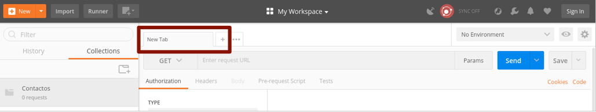

# Tema 1. Introducción a Node.js y Express.js

## 1.5. Primeros pasos con Express

En esta sesión aprenderemos cómo construir nuestro propio servidor web con Node.js. Comenzaremos por ver cómo se podría construir uno utilizando sólo las librerías del núcleo de Node (es decir, sin instalar ningún módulo externo con *npm*), viendo las desventajas que esto ofrece en cuanto al código que es necesario escribir para gestionar la lectura de los ficheros solicitados, procesamiento de datos de formularios, etc.

Posteriormente, analizaremos las ventajas que aporta el framework Express.js para construir servidores Node más sencillos, modulares y robustos.

### 1.5.1. Creación de un servidor web básico

A lo largo de este módulo, la principal utilidad que le daremos a Node.js es hacerlo funcionar como un servidor web, que atenderá las peticiones de múltiples clientes, enviando respuestas de diversos tipos: cargar una vista determinada, acceder a una fuente de datos y enviar datos en formato JSON al cliente, recibir un archivo binario (por ejemplo, una imagen) y subirlo a alguna carpeta del servidor, etc.

Notar que, a priori, el tener que programar nosotros desde cero un servidor web con Node.js nos puede hacer pensar que nos va a llevar más trabajo la web que utilizando otro lenguaje de servidor, como por ejemplo PHP, que ya se instala sobre un servidor web completo como Apache. Sin embargo, veremos rápidamente que crear un servidor web con Node.js no es nada complicado, y puede valer la pena.

Para poder llegar a todo esto, vamos a empezar con los fundamentos que hacen que una aplicación Node.js pueda comportarse como un servidor web y atender peticiones simples. Sobre esta base, iremos añadiendo cuestiones algo más elaboradas como el enrutamiento, los eventos, o cómo atender peticiones de diversos tipos.

#### 1.5.1.1. Creación de un servidor con la librería *http*

Vamos a crear un archivo llamado `servidor_basico.js` en nuestra carpeta de "*PruebasSimples*". Para poder utilizar Node.js como servidor web, haremos uso del módulo `http` que viene incluido por defecto en el núcleo de módulos de Node, y que permite gestionar peticiones y respuestas HTTP. Así que un primer paso será incluir con `require` dicho módulo:

```js
const http = require('http');
```

El siguiente paso es crear una instancia del servidor:

```js
http.createServer().listen(8080);
```

El parámetro del método `listen` indica por qué puerto quedará escuchando el servidor web a la espera de que los clientes le pidan cosas. En este caso hemos especificado el puerto 8080, ya que, en un entorno de pruebas, es posible que el puerto por defecto para comunicaciones HTTP (puerto 80), esté ocupado, pero lo normal será dejar el servidor escuchando en dicho puerto 80.

Si ejecutamos el archivo `servidor_basico.js` con estas dos instrucciones, y después abrimos un navegador y accedemos a la URL *http://localhost:8080*, veremos que el navegador se queda esperando una respuesta del servidor. Si cerramos el servidor (cerramos la aplicación Node.js con `Control+C`, por ejemplo), el navegador mostrará un mensaje de que no se puede acceder al sitio web. Es decir, mientras el servidor ha estado en marcha, se ha establecido una conexión con él, pero no se han obtenido datos que mostrar.

Lo que nos ha ocurrido parece obvio si analizamos el (poco) código que hemos escrito. Nos hemos limitado a crear un servidor y decirle que se quede escuchando peticiones en el puerto 8080. Pero una vez obtenga una conexión... ¿qué?

Lo siguiente que debemos hacer es definir un *callback*, una función que se llamará cada vez que se acepte una conexión, y que contendrá el código a ejecutar para atenderla. En el caso del servidor HTTP, la función debe tener dos parámetros: un objeto con los datos de la petición (típicamente se le suele llamar `request`, "petición" en inglés), y otro que contendrá los datos de la respuesta que enviará el servidor (típicamente se le suele llamar `response`, "respuesta" en inglés).
El esqueleto básico de nuestro callback quedaría así:

```js
let atenderPeticion = (request, response) => {
    // Código para atender la petición
}
```

Hemos empleado una *arrow function*, pero también podemos emplear una función tradicional o una función anónima si preferimos. 

```js
// Función tradicional
function atenderPeticion(request, response)
{
    // ...
}

// Función anónima
let atenderPeticion = function(request, response)
{
    // ...
}
```

Dentro del código de la misma, lo que haremos será procesar la petición y emitir una respuesta acorde a la misma. Para empezar, vamos a ignorar los datos de la petición, y a emitir una respuesta de bienvenida, sea quien sea el origen.

```js
let atenderPeticion = (request, response) => {
    response.writeHead(200, {"Content-Type": "text/plain"});
    response.write("Bienvenido/a");
    response.end();
}
```

Analicemos un poco el código que hemos generado:

* La primera línea envía un código de estado HTTP (`200`, es decir que todo ha ido bien), y unas cabeceras de respuesta. En esta caso sólo se envía una cabecera `Content-Type` que indica que lo que se va a enviar es texto plano (tipo MIME). Para enviar documentos web, emplearíamos `text/html` como tipo MIME.
* Después, generamos el contenido de dicho documento. En este caso, un simple texto "Bienvenido/a".
* Para terminar, finalizamos la respuesta.

Nos falta, por último, enlazar esta función callback con el servidor que está escuchando en el puerto 8080. Para ello, pasamos esta función como parámetro al método `createServer`:

```js
http.createServer(atenderPeticion).listen(8080);
```

Si ahora ejecutamos el servidor Node y conectamos a la URL anterior desde un navegador, obtendremos el mensaje de bienvenida como respuesta.

Como vemos, la creación de un servidor web en Node.js que acepte peticiones y emita mensajes de respuesta es bastante sencilla. Pero el código puede complicarse innecesariamente con cosas tan triviales como:

* Mostrar el contenido de un archivo HTML determinado. Por ejemplo, si quisiéramos mostrar el contenido de un archivo `index.html` al conectar con el servidor, el código sería algo así:

```js
const http = require('http');
const fs = require('fs');

let atenderPeticion = (request, response) => {
    response.writeHead(200, {"Content-Type": "text/html"});
    // Leemos con la librería fs la página en cuestión
    var contenido = fs.readFileSync('./index.html', 'utf8');
    // Enviamos el contenido leído
    response.write(contenido);
    response.end();
}

http.createServer(atenderPeticion).listen(8080);
```

* Recoger datos que haya enviado el cliente en un formulario. Si queremos recoger los bytes de datos (en el formato que estén) que ha enviado el cliente desde un formulario, tendríamos que añadir un fragmento de código como éste en nuestro *callback*, y después convertir el array de bytes leído al formato que sea (JSON, por ejemplo):

```js
let body = [];
request.on('data', (chunk) => {
    body.push(chunk);
}).on('end', () => {
    body = Buffer.concat(body).toString();
    // Aquí ya tendríamos el array de datos completo
}); 
```

* Si, por ejemplo, queremos diferenciar distintas URLs para mostrar una u otra respuesta, tendríamos que añadir algunas cláusulas `if..else` dentro de nuestro callback `atenderPeticion`, y mostrar una u otra respuesta en cada caso:

```js
let atenderPeticion = (request, response) => {
    response.writeHead(200, {"Content-Type": "text/plain"});

    if (request.url === '/') {
        response.write("Página principal");
    } else if (request.url == '/bienvenida') {
        response.write("Bienvenido/a");
    } else if (request.url == '/despedida') {
        response.write("Hasta pronto");
    }

    response.end();
}
```

Además, en este último caso nos resultaría también complicado distinguir partes variables en las URL. Por ejemplo, si quisiéramos acceder a la ficha de un libro con `/libro/id`, siendo *id* el código del libro, tendríamos que parsear manualmente la URL para extraer el *id*, y luego hacer la búsqueda con él. 

Veremos en breve que, gracias al framework Express.js, estas y otras prácticas habituales al desarrollar una aplicación web son mucho más sencillas de incorporar.

#### 1.5.1.2. Creación de un servidor con Express

**Express** es un framework ligero y, a la vez, flexible y potente para desarrollo de aplicaciones web con Node. En primer lugar, se trata de un framework ligero porque no viene cargado de serie con toda la funcionalidad que un framework podría tener, a diferencia de otros frameworks más pesados y autocontenidos como Symfony o Ruby on Rails. Pero, además, se trata de un framework flexible y potente porque permite añadirle, a través de módulos Node y de *middleware*, toda la funcionalidad que se requiera para cada tipo de aplicación. De este modo, podemos utilizarlo en su versión más ligera para aplicaciones web sencillas, y dotarle de más elementos para desarrollar aplicaciones muy complejas.

Como veremos, con Express podemos desarrollar tanto servidores típicos de contenido estático (HTML, CSS y Javascript), como servicios web accesibles desde un cliente, y por supuesto, aplicaciones que combinen ambas cosas. Con Express, la información de las peticiones de los clientes se pueden procesar de forma sencilla, y las respuestas se pueden definir de forma separada y modular (recordemos nuestro *callback* anterior, con un conjunto de instrucciones `if..else` para distinguir cada tipo de petición). 

Podéis encontrar información actualizada sobre Express, tutoriales y demás información en su [página oficial](http://expressjs.com/).

Para utilizar Express, basta con instalarlo en nuestro proyecto Node como cualquier otro módulo de terceros (recordemos crear el archivo *package.json* con `npm init` si no existe ya):

```
npm install express
```

A partir de aquí, un servidor básico de Express que quede escuchando por el puerto 8080 sin emitir ninguna respuesta, similar al anterior que hemos hecho con el módulo `http`, sería así:

```js
const express = require('express');

let app = express();
app.listen(8080);
```

Lo que hemos hecho ha sido inizializar un objeto Express (lo guardamos en una variable llamada `app`, típicamente), y ponerlo a escuchar por el puerto 8080.

Crea un proyecto llamado "*PruebaExpressSimple*" en la carpeta de "*ProyectosNode/Pruebas*", instala Express en él y define un archivo `index.js` con el código anterior, para probarlo. Pon en marcha la aplicación, y accede a *http://localhost:8080* para comprobar la respuesta:

```
Cannot GET /
```

En este caso, lo que nos dice es que no hay definida ninguna respuesta para la ruta raíz de la aplicación. Si queremos definir una respuesta a esa ruta, llamamos al método `get` del objeto `app`, indicando la ruta a la que queremos responder (`/` en este caso), y el *callback* de respuesta. Nuevamente, dicho callback tiene dos parámetros: la petición (que se suele denominar `req`, de forma abreviada), y la respuesta a emitir (que se suele denominar `res`). Una posible función de bienvenida asociada a la ruta raíz podría ser así:

```js
const express = require('express');

let app = express();

app.get('/', (req, res) => {
    res.send("Bienvenido/a");
});

app.listen(8080);

```

Si ahora accedemos nuevamente a *http://localhost:8080* (tras reiniciar el servidor Express), obtendremos el mensaje "Bienvenido/a" en el navegador.

Si queremos asociar más URIs o rutas a nuestra aplicación, basta con definir más métodos `get`, cada uno con su ruta asociada. Por ejemplo:

```js
app.get('/libros', (req, res) => { ... });
app.get('/usuarios', (req, res) => { ... });
```

> **Ejercicios propuestos:**
> 
> **1.** Crea una carpeta llamada "**T1_ExpressBasico**" en tu espacio de trabajo, en la carpeta "*Ejercicios*". Instala Express en dicho proyecto, y utilízalo para definir un servidor que responda a estas URI a través del comando `get`:
>
> * `/fecha`: el servidor enviará al cliente la fecha y hora actuales. Puedes emplear la librería "moment" vista en sesiones anteriores, o apoyarte simplemente en las funciones de fecha estándar de JavaScript.
> * `/usuario`: el servidor enviará al cliente el nombre (login) del usuario que accedió al sistema operativo. Deberás utilizar la librería `os` del núcleo de Node.js, que ya hemos empleado en algún ejercicio anterior, para obtener dicho usuario.

#### 1.5.1.3. Elementos básicos: aplicación, petición y respuesta

Existen tres elementos básicos sobre los que se sustenta el desarrollo de aplicaciones en Express: la aplicación en sí, el objeto con la petición del cliente, y el objeto con la respuesta a enviar.

**La aplicación**

La aplicación es una instancia de un objeto Express, que típicamente se asocia a una variable llamada `app` en el código:

```js
const express = require('express');
let app = express();
```

Toda la funcionalidad de la aplicación (métodos de respuesta a peticiones, inclusión de middleware, etc) se asienta sobre este elemento. Cuenta con una serie de métodos útiles, que iremos viendo en futuros ejemplos, como son:

* `use(middleware)`: para incorporar middleware al proyecto
* `set(propiedad, valor)` / `get(propiedad)`: para establecer y obtener determinadas propiedades relativas al proyecto
* `listen(puerto)`: para hacer que el servidor se quede escuchando por un puerto determinado.
* `render(vista, [opciones], callback)`: para mostrar una determinada vista como respuesta, pudiendo especificar opciones adicionales y un callback de respuesta.
* ...

**La petición**

El objeto de petición (típicamente lo encontraremos en el código como `req`) se crea cuando un cliente envía una petición a un servidor Express. Contiene varios métodos y propiedades útiles para acceder a información contenida en la petición, como:

* `params`: la colección de parámetros que se envía con la petición
* `query`: con la query string enviada en una petición GET
* `body`: con el cuerpo enviado en una petición POST
* `files`: con los archivos subidos desde un formulario en el cliente
* `get(cabecera)`: un método para obtener distintas cabeceras de la petición, a partir de su nombre
* `path`: para obtener la ruta o URI de la petición
* `url`: para obtener la URI junto con cualquier *query string* que haya a continuación
* ...

**La respuesta**

El objeto respuesta se crea junto con el de la petición, y se completa desde el código del servidor Express con la información que se vaya a enviar al cliente. Típicamente se representa con la variable o parámetro `res`, y cuenta, entre otros, con estos métodos y propiedades de utilidad:

* `status(codigo)`: establece el código de estado de la respuesta
* `set(cabecera, valor)`: establece cada una de las cabeceras de respuesta que se necesiten
* `redirect (estado, url)`: redirige a otra URL, con el correspondiente código de estado
* `send([estado], cuerpo)`: envía el contenido indicado, junto con el código de estado asociado (de forma opcional, si no se envía éste por separado).
* `json([estado], cuerpo)`: envía contenido JSON específicamente, junto con el código de estado asociado (opcional)
* ...

### 1.5.2. Servicios de consulta

Como veremos más adelante, los métodos `get` se utilizan como servicios de consulta, es decir, ante peticiones de clientes que, normalmente, buscan obtener información sobre algún aspecto: puede ser un contenido web, o datos que cumplan algún criterio de búsqueda, y se envíen al cliente en un formato determinado, como JSON por ejemplo.

Vamos a crear una carpeta llamada "*PruebaContactosJSON*" en nuestra carpeta de "*ProyectosNode/Pruebas*". Instalamos dentro Express, y definimos un archivo `index.js`. Inicialmente, lo que vamos a hacer es incorporar Express y definir un array fijo de contactos, con una serie de datos, como su nombre, edad y número de teléfono:

```js
const express = require('express');

let contactos = [
    {nombre: "Nacho", edad: 41, telefono: "611223344"},
    {nombre: "Ana", edad: 37, telefono: "699887766"},
    {nombre: "Juan", edad: 70, telefono: "965661564"},
    {nombre: "Fina", edad: 68, telefono: "965262861"},
    {nombre: "Enrique", edad: 12, telefono: "965262861"},
    {nombre: "Pepe", edad: 15, telefono: "966555555"}
];

let app = express();
app.listen(8080);
```

#### 1.5.2.1. Servicio de consulta básico

Después, vamos a definir un servicio que, asociado a la ruta `/contactos`, muestre por pantalla el array de contactos entero. Este método lo incorporamos antes de poner en marcha el servidor con `listen`:

```js
app.get('/contactos', (req, res) => {
    res.send(contactos);
})
```

Podemos probar a poner en marcha ahora el servidor, y acceder a *http://localhost:8080/contactos*, para ver si se muestran los contactos de la lista.

#### 1.5.2.2. Consultas parametrizadas

Es también habitual que las propias rutas o URIs tengan una parte variable, que indiquen, por ejemplo, algún criterio de búsqueda. Estas partes variables se especifican anteponiendo dos puntos `:` a la parte de la ruta que sea variable. Por ejemplo, la ruta `/contactos/:texto` respondería a cualquier URL que comience por `/contactos`, seguida de cualquier texto, que se almacenaría automáticamente en el array asociativo `req.params`.

Veamos un ejemplo concreto: el siguiente método muestra todos los contactos cuyo teléfono sea el indicado en la ruta:

```js
app.get('/contactos/telefono/:numero', (req, res) => {
    let resultado = contactos.filter(
        contacto => contacto.telefono == req.params['numero']
    );
    res.send(resultado);
});
```

Si reiniciamos el servidor tras añadir este método, y accedemos a la URL *http://localhost:8080/contactos/telefono/965262861*, obtendremos como resultado los dos contactos que comparten dicho teléfono.

> **Ejercicios propuestos**:
> 
> **2.** Crea una carpeta llamada **T1_Libros** en tu espacio de trabajo, en la carpeta "*Ejercicios*". Instala Express en dicho proyecto, y define un archivo `index.js` que haga lo siguiente:
>
> * Incorporar (`require`) la librería Express
> * Definir un array de libros con una serie de datos predefinidos: código, título, autor y precio. Por ejemplo, puedes añadir este array:

```js
let libros = [
    {codigo: 1, titulo: "El juego de Ender",
     autor: "Orson Scott Card", precio: 7.95},
    {codigo: 2, titulo: "El Señor de los Anillos",
     autor: "J.R.R. Tolkien", precio: 19.90},
    {codigo: 3, titulo: "La tabla de Flandes",
     autor: "Arturo Pérez Reverte", precio: 8.50},
    {codigo: 4, titulo: "La historia interminable",
     autor: "Michael Ende", precio: 12.35}
];
```

> * Definir dos servicios de consulta:
>    * Uno que responda a la URI `/libros` mostrando todo el catálogo de libros
>    * Otro que responda a la URI `/libros/:id` mostrando el libro con el *id* indicado. En este caso, deberás tener en cuenta que el método `filter` devuelve un array con todos los objetos que pasan el filtro (aunque sólo sea uno, o ninguno), por lo que deberás extraer y devolver del array sólo el libro afectado, no el array. En el caso de que no exista el libro con el código indicado, devolverás el mensaje "Libro no encontrado".
> 
> Prueba a poner en marcha el servidor cuando lo tengas listo, y acceder a estas dos URIs para probar su funcionamiento.

#### 1.5.2.3. Uso de la *query string* para pasar parámetros

En el caso de querer pasar los parámetros en la *query string* (es decir, por ejemplo, `/contactos?telefono=XXX`) no hay forma de establacer dichos parámetros en la URI del método `get`. En ese caso deberemos comprobar si existe el parámetro correspondiente dentro del objeto `req.query`:

```js
app.get('/contactos', (req, res) => {
    if(req.query.telefono) {
        // Buscar por telefono
    }
    else {
        // Listado general de contactos
    }); 
});
```

### 1.5.3. Herramientas para probar los servicios

Ya hemos visto que probar unos servicios de listado (GET) es sencillo a través de un navegador. Sin embargo, pronto aprenderemos a hacer otros servicios (inserciones, modificaciones y borrados) que no son tan sencillos de probar con esta herramienta. Así que conviene ir entrando en contacto con otras más potentes, que nos permita probar todos los servicios que vamos a desarrollar. Existen varias alternativas al respecto, como por ejemplo **Postman**. Si queremos evitar depender de más aplicaciones externas, podemos utilizar la extensión **ThunderClient** de *Visual Studio Code*. 

#### 1.5.3.1 Uso de Postman

Postman es una aplicación gratuita y multiplataforma que permite enviar todo tipo de peticiones de clientes a un servidor determinado, y examinar la respuesta que éste produce. De esta forma, podemos comprobar que los servicios ofrecen la información adecuada antes de ser usados por una aplicación cliente real.

Para descargar e instalar Postman, debemos ir a su web oficial, a la [sección de descargas](https://www.getpostman.com/downloads/), y descargar la aplicación (versión gratuita). Es un archivo portable, que se descomprime y dentro está la aplicación lista para ejecutarse.

La primera vez que la ejecutemos nos preguntará si queremos registrarnos, de forma que podamos compartir los proyectos que hagamos entre los distintos equipos en que estemos registrados, pero podemos saltar este paso haciendo clic en el enlace inferior.

Tras iniciar la aplicación, veremos un diálogo para crear peticiones simples o colecciones de peticiones (conjuntos de pruebas para una aplicación). Lo que haremos habitualmente será esto último.

<div align="center">
    
</div>

Si elegimos crear una colección, le deberemos asociar un nombre (por ejemplo, "ContactosJSON"), y guardarla. Entonces podremos ver la colección en el panel izquierdo de Postman:

<div align="center">
    
</div>

Desde el botón "New" en la esquina superior izquierda podemos crear nuevas peticiones (también nuevas colecciones) y asociarlas a una colección. Existe una forma alternativa (quizá más cómoda) de crear esas peticiones, a través del panel de pestañas, añadiendo nuevas:

<div align="center">
    
</div>

 **Añadir peticiones GET** 

Para añadir una petición, habitualmente elegiremos el tipo de comando bajo las pestañas (GET, POST, PUT, DELETE) y la URL asociada a dicho comando. Por ejemplo:

<div align="center">
    
</div>

Entonces, podemos hacer clic en el botón "Save" en la parte derecha, y guardar la petición para poderla reutilizar. Al guardarla, nos pedirá que le asignemos un nombre (por ejemplo, "GET /contactos" en este caso), y la colección en la que se almacenará (nuestra colección de "ContactosJSON"). 

<div align="center">
    
</div>

Después, podremos ver la prueba asociada a la colección, en el panel izquierdo:

<div align="center">
    
</div>

Si seleccionamos esta prueba y pulsamos en el botón azul de "Send" (parte derecha), podemos ver la respuesta emitida por el servidor en el panel inferior de respuesta:

<div align="center">
    
</div>

Siguiendo estos mismos pasos, podemos también crear una nueva petición para obtener un contacto a partir de su teléfono, por GET:

<div align="center">
    
</div>

Bastaría con reemplazar el teléfono de la URL por el que queramos consultar realmente. Si probamos esta petición, obtendremos la respuesta correspondiente:

<div align="center">
    
</div>

 **Exportar/Importar colecciones**

Podemos exportar e importar nuestras colecciones en Postman, de forma que podemos llevarlas de un equipo a otro. Para **exportar** una colección, hacemos clic en el botón de puntos suspensivos (...) que hay junto a ella en el panel izquierdo, y elegimos Export.

<div align="center">
    
</div>

Nos preguntará para qué versión de Postman queremos exportar (normalmente la recomendada es la mejor opción). Se creará un nuevo archivo Postman en la ubicación que elijamos.

Si queremos **importar** una colección previamente exportada, podemos hacer clic en el botón *Import* de la esquina superior izquierda en la ventana principal:

<div align="center">
    
</div>

> **Ejercicios propuestos**:
> 
> **3.** Crea una nueva colección en Postman llamada **LibrosJSON**, y define dentro dos peticiones (*requests*):
> 
> * Una llamada **GET /libros** que conecte con la URI `/libros`, y obtenga por tanto el listado de todos los libros.
> * Otra llamada **GET /libros/id** que conecte con la URI `/libros/:id` y obtenga el libro cuyo *id* se especifique, o el mensaje "Libro no encontrado" si es un *id* incorrecto.
> 
> Cuando pruebes el funcionamiento de ambas peticiones, exporta la colección a un archivo con el nombre por defecto que te proponga Postman (será algo así como *LibrosJSON.postman_collection.json*).

#### 1.5.3.2 Uso de ThunderClient de Visual Studio Code

Esta herramienta sirve, al igual que Postman, para simular peticiones a servidores web, y recoger y analizar la respuesta. La buscamos en el panel de extensiones y la instalamos:

<div align="center">
    
</div>

Para utilizar esta extensión deberemos seleccionar su icono asociado en la barra izquierda:

<div align="center">
    
</div>

Es aconsejable que nuestras peticiones las agrupemos en colecciones (*collections*) de forma que cada colección se centre en un proyecto o aplicación concreta. Para ello vamos a la pestaña de colecciones y elegimos crear una, con el nombre que queramos (por ejemplo, Contactos)

<div align="center">
    
</div>

Desde el botón de puntos suspensivos junto al nombre de la colección podremos añadir nuevas peticiones asociadas a dicha colección (*New Request*), y después le pondremos un nombre.

<div align="center">
    
</div>

**Añadir peticiones GET**

Para añadir una petición GET, podemos en primer lugar identificarla con su nombre (por ejemplo, *GET /contactos*), y en el panel que se abrirá definimos la URL de acceso (también podemos elegir el tipo de comando: GET, POST, etc). Por ejemplo:

<div align="center">
    
</div>

Si pulsamos en el botón de Send, podemos ver la respuesta emitida por el servidor en el panel de respuesta:

<div align="center">
    
</div>

Siguiendo estos mismos pasos, podemos también crear una nueva petición para obtener un contacto a partir de su id, por GET:

<div align="center">
    
</div>

Bastaría con reemplazar el id de la URL por el que queramos consultar realmente.

**Exportar/Importar colecciones**

Podemos exportar e importar nuestras colecciones en *ThunderClient*, de forma que podemos llevarlas de un equipo a otro. Para **exportar** una colección, hacemos clic en el botón de puntos suspensivos (…) que hay junto a ella en el panel izquierdo, y elegimos *Export*.

<div align="center">
    
</div>

Si queremos **importar** una colección previamente exportada, podemos hacer clic en el botón para crear colecciones, y elegimos la opción *Import*:

<div align="center">
    
</div>

En cualquiera de los dos casos, las colecciones se exportan/importan a/desde un archivo en formato JSON que contiene la información de cada petición.

> **Ejercicios propuestos**:
> 
> **4.** Crea una nueva colección en **ThunderClient** llamada **LibrosJSON**, y define dentro dos peticiones (*requests*):
> 
> * Una llamada **GET /libros** que conecte con la URI `/libros`, y obtenga por tanto el listado de todos los libros.
> * Otra llamada **GET /libros/id** que conecte con la URI `/libros/:id` y obtenga el libro cuyo *id* se especifique, o el mensaje "Libro no encontrado" si es un *id* incorrecto.
