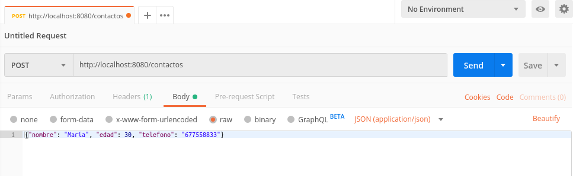
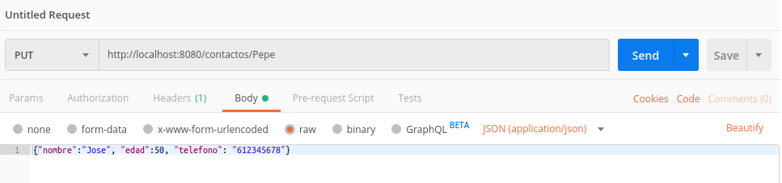
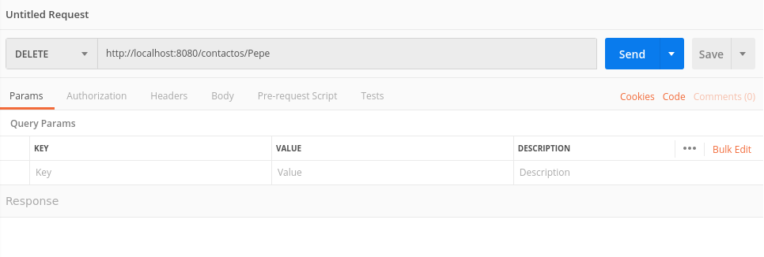

# Tema 1. Introducción a Node.js y Express.js

## 1.6. Express como proveedor de servicios REST

Uno de los principales usos que se le da a Node.js es el de proveedor de servicios REST, por la facilidad con la que se desarrollan este tipo de servicios con este framework. 

Veremos en esta sesión en qué consisten los servicios REST, qué tipos de servicios son los más habituales y cómo se implementan en Express. Para almacenar los datos con los que vamos a trabajar, y dado que aún no hemos visto cómo acceder a bases de datos con Node, emplearemos archivos de texto, y almacenaremos los datos en formato JSON. En esta sesión veremos qué estructura tienen los datos JSON, y cómo podemos almacenar y recuperar información en este formato.

### 1.6.1. Introducción a los servicios REST

**REST** son las siglas de *REpresentational State Transfer*, y designa un estilo de arquitectura de aplicaciones distribuidas, como las aplicaciones web. En un sistema REST, identificamos cada recurso a solicitar con una URI (identificador uniforme de recurso), y definimos un conjunto delimitado de comandos o métodos a realizar, que típicamente son:

* **GET**: para obtener resultados de algún tipo (listados completos o filtrados por alguna condición)
* **POST**: para realizar inserciones o añadir elementos en un conjunto de datos
* **PUT**: para realizar modificaciones o actualizaciones del conjunto de datos
* **DELETE**: para realizar borrados del conjunto de datos

Existen otros tipos de comandos o métodos, como por ejemplo *PATCH* (similar a PUT, pero para cambios parciales), *HEAD* (para consultar sólo el encabezado de la respuesta obtenida), etc. Nos centraremos de momento en estos cuatro métodos, de los cuales ya hemos hecho algunas pruebas con el primero (GET), en sesiones anteriores.

Por lo tanto, identificando el recurso a solicitar y el comando a aplicarle, el servidor que ofrece esta API REST proporciona una respuesta a esa petición. Esta respuesta típicamente viene dada por un mensaje en formato JSON o XML (aunque éste cada vez está más en desuso).

Veremos cómo podemos identificar los diferentes tipos de comandos de nuestra API, y las URIs de los recursos a solicitar, para luego dar una respuesta en formato JSON ante cada petición. 

### 1.6.2. Gestión de datos JSON

**JSON** son las siglas de *JavaScript Object Notation*, una sintaxis propia de JavaScript para poder representar objetos como cadenas de texto, y poder así serializar y enviar información de objetos a través de flujos de datos (archivos de texto, comunicaciones cliente-servidor, etc).

Como ya deberíamos saber, un objeto JavaScript se define mediante una serie de propiedades y valores. Por ejemplo, los datos de una persona (como nombre y edad) podríamos almacenarlos así:

```js
let persona = {
    nombre: "Nacho",
    edad: 41
};
```

Este mismo objeto, convertido a JSON, formaría una cadena de texto con este contenido:

```json
{"nombre":"Nacho","edad":41}
```

Del mismo modo, si tenemos una colección (vector) de objetos como ésta:

```js
let personas = [
    { nombre: "Nacho", edad: 41},
    { nombre: "Mario", edad: 4},
    { nombre: "Laura", edad: 2},
    { nombre: "Nora", edad: 10}
];
```

Transformada a JSON sigue la misma sintaxis, pero entre corchetes:

```json
[{"nombre":"Nacho","edad":42}, {"nombre":"Mario","edad":4},  
 {"nombre":"Laura","edad":2}, {"nombre":"Nora","edad":10}]
```

#### 1.6.2.1. Conversión a y desde JSON

JavaScript proporciona un par de métodos muy útiles para convertir desde JSON a objetos JavaScript y viceversa. Veamos el ejemplo con el vector de personas anterior; podemos crear un archivo llamado `prueba_json.js` en nuestra carpeta de "PruebasSimples" con dicho vector:

```js
let personas = [
    { nombre: "Nacho", edad: 42},
    { nombre: "Mario", edad: 4},
    { nombre: "Laura", edad: 2},
    { nombre: "Nora", edad: 10}
];
```

Si queremos convertir este vector en una cadena JSON, empleamos el método `JSON.stringify`. Recibe como parámetro un objeto JavaScript, y devuelve la cadena JSON resultado. Si imprimimos por consola o pantalla esta cadena, veremos el formato JSON resultante (el mismo que se ha visto anteriormente):

```js
let personasJSON = JSON.stringify(personas);
console.log(personasJSON);
```

La operación inversa también es posible, mediante el método `JSON.parse`, que recibe como parámetro una cadena JSON y devuelve un objeto (o vector de objetos, según sea el caso) con los datos procesados. Por ejemplo, si creamos una nueva variable parseando la cadena JSON anterior, tendremos un objeto igual que el original:

```js
let personas2 = JSON.parse(personasJSON);
console.log(personas2);
```

#### 1.6.2.2. JSON y ficheros de texto

Una vez visto en qué consiste el formato JSON, podemos deducir que puede ser muy sencillo almacenar un objeto o conjunto de objetos JSON en un fichero de texto, y leerlo y volcarlo de vuelta a un objeto JavaScript. Para ello, emplearemos los métodos de lectura y escritura proporcionados por el módulo `fs` del núcleo de Node.js.

Para poder leer y escribir contenido en un archivo de texto, el módulo `fs` proporciona métodos muy útiles, como por ejemplo `readFileSync` (para leer) y `writeFileSync` (para escribir). También están disponibles las correspondientes versiones asíncronas de estas funciones, `readFile` y `writeFile`, respectivamente, que reciben los mismos parámetros que las síncronas, añadiendo al final la función *callback* a la que llamar cuando la operación termine.

Vamos a hacer un pequeño ejemplo llamado `prueba_fs_texto.js` en nuestra carpeta de "*PruebasSimples*". Dentro de este archivo, definiremos dos funciones, una que generará un contenido predefinido en un archivo de texto, y la otra que leerá dicho contenido:

```js
const fs = require('fs');

const archivo = "datos.txt";
const textoPredefinido = "En un lugar de la mancha\n"+
                         "de cuyo nombre no quiero acordarme";

let guardarDatos = () => {
    fs.writeFileSync(archivo, textoPredefinido);
};

let leerDatos = () => {
    return fs.readFileSync(archivo, 'utf-8');
};
```

Podemos probar cómo funciona este programa con algo así:

```js
guardarDatos();
console.log("Texto del fichero:");
console.log(leerDatos());
```

y veremos que se muestra por pantalla el contenido del fichero tal cual está.

Del mismo modo que se lee o escribe un archivo de texto con un formato arbitrario, o sin un formato específico, podemos leer y escribir datos JSON. Basta con combinar las dos funciones vistas antes (`JSON.parse` y `JSON.stringify`) con la funciones proporcionadas por `fs` para leer y escribir archivos de texto. Así, por ejemplo, para leer un conjunto de objetos de un archivo de texto y almacenarlo en una variable JavaScript, haríamos esto:

```js
let objetoJavaScript = 
    JSON.parse(fs.readFileSync(nombre_archivo, 'utf8'));
```

Mientras que para almacenar un objeto (o vector) JavaScript en un archivo de texto en formato JSON, haríamos esto otro:

```js
fs.writeFileSync(nombreArchivo, JSON.stringify(objetoJavaScript));
```

Podemos añadir estas líneas en nuestro archivo `prueba_json.js` (junto con la librería `fs`), para ver cómo funciona con el vector de personas:

```js
fs.writeFileSync("personas.txt", JSON.stringify(personas));
let personasFichero = JSON.parse(fs.readFileSync("personas.txt", 'utf8'));
console.log(personasFichero);
```

#### 1.6.2.3. JSON y servicios REST

Como comentábamos antes, JSON es hoy en día el formato más utilizado para dar respuesta a peticiones de servicios REST. Su otro "competidor", el formato XML, está cada vez más en desuso para estas tareas.

A la hora de emitir una respuesta a un servicio utilizando formato JSON, es habitual que ésta tenga un formato determinado. En general, en las respuestas que emitamos a partir de ahora para servicios REST, utilizaremos una estructura general basada en:

* Un dato booleano (podemos llamarlo `ok`, por ejemplo), que indique si la petición se ha podido atender satisfactoriamente o no.
* Un mensaje de error (podemos llamarlo `error`, por ejemplo), que estará presente únicamente si el anterior dato booleano es falso, o indica que la petición no se ha podido resolver.
* Los datos de respuesta, que estarán presentes sólo si el dato booleano es verdadero, o indica que la petición se ha podido atender satisfactoriamente. Notar que estos datos de respuesta pueden ser un texto, un objeto simple JavaScript, o un array de objetos.

Adicionalmente, como veremos en los ejemplos a continuación, también es recomendable añadir a la respuesta un código de estado HTTP, que indique si se ha podido servir satisfactoriamente o ha habido algún error.

### 1.6.3. Servicios GET

En la sesión anterior vimos cómo definir servicios básicos de consulta con Express. Hicimos un ejemplo que obtenía datos de una lista de contactos, y un ejercicio que hacía lo mismo con una colección de libros. Sin embargo, la información que se emite como respuesta no cumple con lo que se espera en una respuesta REST. Vamos a intentar adaptarla al formato que hemos visto aquí.

Comencemos con el ejemplo de los contactos "*PruebaContactosJSON*". La ruta `GET /contactos` devuelve el array de contactos, que automáticamente Express envía en formato JSON. Hasta aquí todo correcto, pero debemos enviar algo más de información en la respuesta: indicar si ha ido bien o no, el mensaje de error pertinente... 

Adicionalmente, podemos enviar un código de estado previo al mensaje en sí. Típicamente, éste será un código 200 si ha ido todo bien, o un código 400 o 500 si ha ido mal, dependiendo de si ha sido por un error en la petición del cliente, o un fallo en el servidor. También pueden emitirse otros códigos de error, como por ejemplo 401 en el caso de peticiones a zonas de acceso restringido sin la correspondiente autorización, o 404 si la URL solicitada no existe, entre otros. El ejemplo de `GET /contactos` comentado antes podría quedar así:

```js
app.get('/contactos', (req, res) => {
    if (contactos && contactos.length > 0) {
        res.status(200)
           .send({ ok: true, contactos: contactos});
    } else {
        // Si algo falla es porque el servidor no ha podido recuperar la
        // lista de contactos, fallo del servidor (500)
        res.status(500)
           .send({ ok: false, error: "No se encontraron contactos"});
    }
})
```

En cuanto al servicio que buscaba contactos a partir de su teléfono, lo podemos modificar para que quede de este modo:

```js
app.get('/contactos/telefono/:numero', (req, res) => {
    let resultado = contactos.filter(
        contacto => contacto.telefono == req.params['numero']
    );
    if (resultado && resultado.length > 0) {
        res.status(200)
           .send({ ok: true, resultado: resultado});
    } else {
        // En este caso, si no se encuentra nada es porque el teléfono
        // indicado en la URL es equivocado, fallo del cliente (400)
        res.status(400)
           .send({ ok: false, error: "No se encontraron contactos"});
    }
});
```

> **Ejercicios propuestos:**
> 
> **1.** Modifica ahora el ejercicio **T1_Libros** que comenzaste en la sesión anterior, y adapta las respuestas de los dos servicios GET para que tengan el formato visto en el ejemplo anterior, incluyendo los códigos de estado pertinentes.

### 1.6.4. Servicios POST

Los servicios de tipo POST se emplean para tareas de inserción. Típicamente van asociados al envío de un formulario por parte del cliente, con datos que se quieren añadir a alguna base de datos.

Para responder a una petición de tipo POST, se debe emplear el método `post` del objeto Express (en lugar del método `get`), con los mismos parámetros (la ruta a la que responder, y el *callback* de respuesta). Por ejemplo, si queremos poder dar de alta un nuevo contacto en nuestra colección de contactos, deberíamos definir un método como éste:

```js
app.post('/contactos', (req, res) => {
    // Código del método
});
```

Como vemos, estamos respondiendo a la misma ruta que nuestro primer servicio `GET /contactos`, pero esta vez empleamos el método POST, con lo que no interfieren entre sí.

Dentro del código del *callback*, lo que se suele hacer es recoger los datos que se envían desde el cliente para insertar, validarlos y, si son correctos, añadirlos a la base de datos en cuestión. Sin embargo, comentábamos en sesiones anteriores que, una de las desventajas que tiene utilizar Node.js para definir servidores es que ese procesamiento de datos enviados desde el cliente es bastante manual: tenemos que leer los bytes a mano, almacenarlos en un array y luego procesarlo y convertirlo. El uso de Express automatiza este proceso, que será más o menos fácil de implmentar dependiendo de la versión de Express que estemos usando.

Si estamos usando una versión de Express inferior a la 4.16, debemos utilizar una librería adicional llamada `body-parser`. Lo primero que debemos hacer es instalarla con `npm install`...

```
npm install body-parser
```

... y añadirla en nuestro fichero fuente, junto con Express:

```js
const express = require('express');
const bodyParser = require('body-parser');
```

Después, y una vez inicializado el objeto `app` de Express, utilizamos un método llamado `use` que lo que hace es añadir *middleware* sobre el framework. Más adelante veremos con más detalle qué es eso del *middleware*, de momento nos conformaremos con saber que es un software que sirve para preprocesar la petición antes de emitir la respuesta. En concreto, añadiremos esta línea, que permite preprocesar datos de la petición enviados en formato JSON, para extraer la información que contienen:

```js
let app = express();
app.use(bodyParser.json());
```
Si por el contrario estamos usando la versión 4.16 o superior, ya no es necesario instalar previamente el módulo body-parser, ya que Express lo lleva incluido por defecto. Bastará con llamar al método `express.json()` como middleware tal y como se ha visto antes, con el metodo `use`: 

```js
let app = express();
app.use(express.json());
```
Finalmente, en el código de los *callbacks* donde vayamos a recoger datos de la petición enviados en el cuerpo de la misma (*body*), simplemente accedemos a la propiedad `body` de la petición, seguida del nombre del campo que queramos recuperar. Suponiendo que el nombre, edad y teléfono del nuevo contacto se envían en tres campos del mismo nombre, podemos recogerlos así:

```js
app.post('/contactos', (req, res) => {
    let nombre = req.body.nombre;
    let edad = req.body.edad;
    let telefono = req.body.telefono;
});
```

También podemos construir un objeto sobre la marcha con estos tres datos:

```js
app.post('/contactos', (req, res) => {
    let nuevoContacto = {
        nombre: req.body.nombre,
        edad: req.body.edad,
        telefono: req.body.telefono
    };
});
```

A continuación, validamos los datos. En este ejemplo, podemos simplemente comprobar que no exista ya un contacto con el mismo nombre. Si no existe, lo añadimos al array y enviamos una respuesta satisfactoria. Si ya existe, enviamos un mensaje de error.

```js
app.post('/contactos', (req, res) => {
    let nuevoContacto = {
        nombre: req.body.nombre,
        edad: req.body.edad,
        telefono: req.body.telefono
    };
    let existe = contactos.filter(
        contacto => contacto.nombre == nuevoContacto.nombre
    );

    if (existe.length == 0) {
        // No existe contacto. Añadimos y enviamos OK
        contactos.push(nuevoContacto);
        res.status(200).send({ok: true});
    } else {
        // El contacto ya existe. Enviamos error
        res.status(400).send({ok: false, 
                              error: "Contacto duplicado"});
    }
});
```

#### 1.6.4.1. Prueba de servicios POST con Postman

Para probar este nuevo servicio con la aplicación Postman, añadimos una nueva petición (*request*) a nuestra colección de peticiones *ContactosJSON*. Será de tipo POST, con la URL *http://localhost:8080/contactos*. En el cuerpo (*Body*) de la petición, indicamos que vamos a enviar datos de tipo JSON, y especificamos el objeto JSON con los datos a enviar. Por ejemplo:

<div align="center">
    
</div>

Observad cómo, en la sección *Body* elegimos tipo **raw**, y especificamos más a la derecha que lo que vamos a enviar son datos en formato JSON.

Guardamos la petición y la podremos probar, para comprobar que inserta el contacto en la base de datos (si el nombre no existía ya) o da el correspondiente mensaje de error si es un contacto duplicado.

> **Ejercicios propuestos:**
> 
> **2.** Añade un servicio POST al ejercicio **T1_Libros** que reciba en el cuerpo de la petición los datos de un nuevo libro (id, título, autor y precio), en formato JSON, y los dé de alta en la colección siempre que el *id* no exista ya. Deberá devolver una respuesta similar a la del ejemplo de contactos, dependiendo de si se ha podido añadir o no el nuevo libro.
> 
> Añade también a la colección de Postman una nueva petición para probar este servicio.

### 1.6.5. Servicios PUT

Los servicios de tipo PUT se emplean para tareas de modificación de datos. Típicamente, en la URL de acceso se indica la clave del elemento a modificar. En el ejemplo de contactos, podría ser el nombre del contacto, que es lo único que no admite duplicados, pero por lo general suele ser un *id* numérico o alfanumérico, como veremos más adelante.

Después, en el cuerpo (*body*) de la petición, se envían, igual que con POST, los datos del elemento a modificar en este caso. Para dar respuesta a esta petición, definiremos un método `put` en Express, que recoja la URL y active el correspondiente *callback* de respuesta.

```js
app.put('/contactos/:nombre', (req, res) => {
    // Código del método
});
```

Notar que en este caso usamos una ruta parametrizada, para añadir la clave (nombre, en este caso), del elemento a modificar. Dentro del código, haremos algo similar al método `post` anterior: recogeremos los datos del cuerpo de la petición, pero ahora, en lugar de insertar el nuevo contacto, buscaremos el que coincida con el nombre de la URL y, si existe, modificaremos sus datos por los nuevos que se envían.

```js
app.put('/contactos/:nombre', (req, res) => {
    let existe = contactos.filter(
        contacto => contacto.nombre == req.params['nombre']
    );

    if (existe.length > 0) {
        // El contacto existe. Lo modificamos y enviamos OK
        let contacto = existe[0];
        contacto.nombre = req.body.nombre;
        contacto.edad = req.body.edad;
        contacto.telefono = req.body.telefono;

        res.status(200).send({ok: true});
    } else {
        res.status(400).send({ok: false, 
                              error: "Contacto no encontrado"});
    }
});
```

#### 1.6.5.1. Prueba de servicios PUT con Postman

Para probar un servicio PUT con Postman, creamos la nueva petición, de tipo PUT, escribimos la URL (indicando la clave del dato a buscar, que será el nombre del contacto en este caso), y en el *Body* de la petición enviamos el objeto JSON con los nuevos datos.

<div align="center">
    
</div>

Guardamos la petición y la podremos probar, para comprobar que modifica el contacto en la base de datos (si el nombre existe), o da el correspondiente error si no lo encuentra.

> **Ejercicios propuestos:**
> 
> **3.** Añade un servicio PUT al ejercicio **T1_Libros** que reciba en la URL el id del libro a modificar, y en el cuerpo de la petición los nuevos datos del libro (sin incluir el id, que no se podrá cambiar), en formato JSON. Si el id del libro existe en la colección, modificará sus datos y devolverá una respuesta positiva, similar a la del ejemplo de contactos. En caso contrario, enviará una respuesta negativa.
> 
> Añade también a la colección de Postman una nueva petición para probar este servicio.

### 1.6.6. Servicios DELETE

Finalmente, los servicios de tipo DELETE se emplean para eliminar información de alguna base de datos. Emplearemos el método `delete` de Express, con los mismos parámetros de siempre. En este caso, en la ruta también indicaremos, como en PUT, la clave del elemento que estamos buscando.

```js
app.delete('/contactos/:nombre', (req, res) => {
    // Código del método
});
```

El código del método se suele limitar a buscar el elemento en cuestión. Si existe, se elimina y se da una respuesta satisfactoria (en ocasiones también se devuelve el objeto eliminado, por si se quiere recuperar). Si no existe, se envía un mensaje de error. 

En nuestro caso, y dado que estamos trabajando con un array JavaScript directamente, lo que vamos a hacer es filtrar del array todos los elementos que NO coincidan con la clave buscada. Si el array resultado tiene el mismo tamaño que el original, quiere decir que el elemento buscado no existía. Si es de menor tamaño, quiere decir que algo hemos filtrado, y entonces sí existía. En este caso, reemplazamos el array original por el filtrado, para confirmar el borrado. El código puede quedar así:

```js
app.delete('/contactos/:nombre', (req, res) => {
    let filtrado = contactos.filter(
        contacto => contacto.nombre != req.params['nombre']
    );

    if (filtrado.length != contactos.length) {
        // El contacto existe. Reemplazamos el array y OK
        contactos = filtrado;
        res.status(200).send({ok: true});
    } else {
        // No se ha filtrado nada. El contacto no existe
        res.status(400).send({ok: false,
                              error: "Contacto no encontrado"});
    }
});
```

#### 1.6.6.1. Prueba de servicios DELETE con Postman

La prueba de una petición DELETE con Postman es sencilla, muy similar a una petición GET: creamos la nueva petición (de tipo DELETE), con la URL, incluyendo la clave del elemento a eliminar, y ya está.

<div align="center">
    
</div>

Finalmente, podemos probar la petición con una clave existente y otra que no exista, para comprobar ambos funcionamientos.

> **Ejercicios propuestos:**
> 
> **4.** Añade un servicio DELETE al ejercicio **T1_Libros** que reciba en la URL el código del libro a eliminar. Si existe, se eliminará de la colección y se enviará una respuesta positiva al cliente, y si no existe, una respuesta negativa, similar al ejemplo de los contactos.
> 
> Añade también a la colección de Postman una nueva petición para probar este servicio.


### 1.6.7. Persistencia de los datos JSON

Para concluir esta sesión, vamos a combinar los servicios desarrollados con los mecanismos de persistencia en archivos de texto que hemos visto antes para datos en formato JSON. Podemos definir dos métodos auxiliares en nuestro servidor, para almacenar y recuperar la colección de contactos, y eliminar (podemos dejarlo comentado) el array de contactos predefinido.

```js
/*
let contactos = [
    { nombre: "Nacho", edad: 42, telefono: "611223344"},
    ...
];
*/

let cargarContactos = () => {
    let contactos = [];
    if (fs.existsSync('contactos.json'))
        contactos = 
            JSON.parse(fs.readFileSync('contactos.json', 
                                       'utf8'));
    return contactos;
};

let guardarContactos = (contactos) => {
    fs.writeFileSync('contactos.json', JSON.stringify(contactos));
};
```

Al iniciar el servidor, cargamos el array de personas del fichero (si hay algo almacenado). Después, ante cada llamada satisfactoria a POST, PUT o DELETE, guardamos el array de personas en fichero.

```js
let app = express();
let contactos = cargarContactos();

...

app.post('/contactos', (req, res) => {
    ...
    guardarContactos(contactos);
    res.status(200).send({ok: true});
    ...
});

app.put('/contactos/:nombre', (req, res) => {
    ...
    guardarContactos(contactos);
    res.status(200).send({ok: true});
    ...
});

app.delete('/contactos/:nombre', (req, res) => {
    ...
    guardarContactos(contactos);
    res.status(200).send({ok: true});
    ...
});
```

> **Ejercicios propuestos:**
> 
> **5.** Añade los métodos de gestión de archivos del ejemplo anterior en el ejercicio **T1_Libros**, y empléalos para cargar y guardar el catálogo de libros en fichero, actualizando los cambios ante cada petición exitosa de tipo POST, PUT o DELETE.
> 
> **6.** Opcionalmente, prueba a modularizar el código del proyecto **T1_Libros**. Saca a un archivo aparte llamado `fichero_utils.js` los métodos de gestión de fichero, e incorpora dicho fichero con `require` desde el servidor principal para hacer uso de sus métodos.
