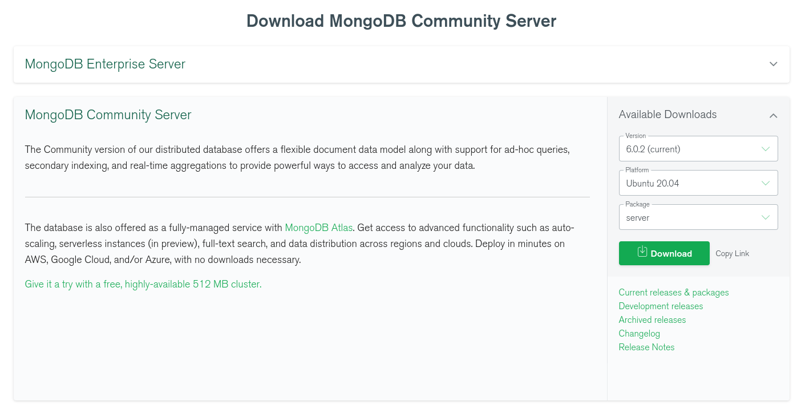

# Tema 2. Acceso a datos con Node.js

## 2.1. Primeros pasos con MongoDB y Mongoose

### 2.1.1. Introducción a MongoDB

En esta sesión daremos unas nociones básicas de cómo conectar y gestionar una base de datos MongoDB desde Node. Para los no iniciados en el tema, MongoDB es el principal representante, actualmente, de los sistemas de bases de datos No-SQL. Estos sistemas se han vuelto muy populares en los últimos años, y permiten dotar de persistencia a los datos de nuestra aplicación de una forma diferente a los tradicionales sistemas SQL.

En lugar de almacenar la información en tablas con sus correspondientes campos y registros, lo que haremos será almacenar estructuras de datos en formato BSON (similar a JSON), lo que facilita la integración con ciertas aplicaciones, como las aplicaciones Node.

#### 2.1.1.1. Algunos conceptos de bases de datos No-SQL

Las bases de datos No-SQL tienen algunas similitudes y diferencias con las tradicionales bases de datos SQL. Entre las similitudes, las dos trabajan con bases de datos, es decir, lo que creamos en uno u otro gestor es siempre una base de datos, pero la principal diferencia radica en cómo se almacenan los datos. En una base de datos SQL, la información se almacena en forma de tablas, mientras que en una No-SQL lo que se almacena se denominan **colecciones** (arrays de objetos en formato BSON, en el caso de Mongo). Las tablas están compuestas de registros (cada fila de la tabla), mientras que las colecciones se componen de **documentos** (cada objeto de la colección). Finalmente, cada registro de una tabla SQL tiene una serie de campos fijos (todos los registros de la tabla tienen los mismos campos), mientras que en una colección No-SQL, cada documento puede tener un conjunto diferente de **propiedades** (que también se suelen llamar campos). En cualquier caso, lo habitual es que los documentos de una misma colección compartan las mismas propiedades.

#### 2.1.1.2. Instalar y configurar MongoDB

Como decíamos, el ejemplo más representativo de los sistemas No-SQL actualmente vigentes es MongoDB, un sistema de bases de datos de código abierto y multiplataforma, que podemos instalar en sistemas Windows, Mac OSX o Linux.

Veremos cómo instalar MongoDB manualmente en estos tres sistemas, y también veremos cómo podemos configurarlo como un servicio en nuestra máquina virtual. En el caso de querer hacer esto último, podemos saltarnos estos pasos que vienen a continuación, e ir directamente al apartado en cuestión.

**Instalación y arranque manual**

Para proceder a descargar e instalar MongoDB, accedemos a su [web oficial](https://www.mongodb.com/es), y en concreto a la sección de *Productos*, arriba a la izquierda.

<div align="center">
    
</div>

Nos interesa descargar la versión *Community* en la sección *Servidor*, que es gratuita y no requiere registro. Elegiremos la correspondiente a nuestro sistema operativo:

<div align="center">
    
</div>

En el caso de **Mac OSX** o **Linux**, podemos descargar un archivo TGZ, y descomprimirlo en la carpeta que queramos. Normalmente se suele ubicar en una carpeta llamada `mongo` en la carpeta personal del usuario (por ejemplo, `/home/alumno/mongo`, en el caso de la máquina virtual que usamos para el curso).

También podemos descargar el `.deb`e instalarlo desde consola con el comando. `$ sudo dpkg -i nombrePaquete.deb` para ubuntu > 20.04 se requiere tener instalada la librería [libssl1.1](http://archive.ubuntu.com/ubuntu/pool/main/o/openssl/libssl1.1_1.1.1f-1ubuntu2_amd64.deb), o tener añadido el repositorio `focal-security`: 
```
$ echo "deb http://security.ubuntu.com/ubuntu focal-security main" | sudo tee /etc/apt/sources.list.d/focal-security.list
```

En el caso de **Windows**, podemos descargar un archivo ZIP y proceder como en el caso anterior (descomprimirlo donde queramos), o bien utilizar el instalador MSI y seguir los pasos del asistente (elegir instalación *Completa*). Convendrá recordar la carpeta donde se instale MongoDB en este caso (por ejemplo, `C:\Archivos de programa\MongoDB\Server\X.Y`, siendo *X.Y* la versión descargada). Deberemos acceder a esta carpeta después para arrancar el servidor manualmente.

Una vez tengamos instalado/descomprimido MongoDB, deberemos crear una carpeta que será donde se almacenen las bases de datos. Esta carpeta se suele llamar `mongo-data`, y se suele ubicar paralela a la carpeta donde reside MongoDB (por ejemplo, `home/alumno/mongo-data`, en el caso de nuestra máquina virtual).

Para iniciar el servidor MongoDB en cualquier sistema, debemos acceder desde un terminal a la subcarpeta `bin` de la carpeta de instalación de MongoDB, y ejecutar desde el propio terminal el comando `mongod`, indicando en el parámetro `--dbpath` la ruta hacia la carpeta que hemos creado para almacenar los datos. Por ejemplo, desde Mac OS X o Linux podríamos poner algo como esto:

```
./mongod --dbpath /home/alumno/mongo-data
```
**Nota**: En el caso de no saber dónde se ha instalado mongo, usad el comando `$ whereis mongod`

En el caso de Windows, deberemos ejecutar el comando `mongod.exe` desde el terminal con los mismos parámetros. 

En cualquier caso, se mostrarán unos cuantos mensajes por la consola, y uno de ellos indicará que MongoDB queda a la espera de conexiones en el puerto por defecto, el 27017:

```
2022-10-11T01:12:27.195+0100 I NETWORK  
[thread1] waiting for connections on port 27017
```

**Instalación y arranque como servicio**

Existe la posibilidad de instalar MongoDB como un servicio que se inicie de forma automática, tanto en Linux como en Mac o Windows, aunque para estos últimos existe alguna traba adicional. En el caso de Mac, tenemos que tener instalado el programa *Homebrew*, que no viene por defecto en el sistema, y en el caso de Windows hay que definir a mano algunos parámetros del servicio. Al no ser el objetivo principal de este curso, y dado que podemos ponerlo en marcha sin problemas con las indicaciones anteriores, no trataremos estas dos opciones aquí, pero sí veremos cómo instalarlo como servicio en nuestra máquina virtual Linux (Versiones de Ubuntu anteriores a 20.10).

Para instalar MongoDB como servicio en Linux, y como alternativa a la instalación manual vista anteriormente, podemos ejecutar estos comandos, como usuario root:

```
$ sudo apt update && sudo apt install mongodb
```

Tras estos comandos, ya tendremos el servidor disponible, y podremos iniciarlo, detenerlo o reiniciarlo con estos comandos:

```
/etc/init.d/mongodb start
/etc/init.d/mongodb stop
/etc/init.d/mongodb restart
```

La carpeta donde se almacenan las bases de datos también se crea en una ubicación predefinida, y no tenemos que preocuparnos por ella. En el archivo de configuración `/etc/mongod.conf` tenemos información sobre cuál es esa carpeta (atributo `dbPath`). En el caso de que no exista dicho atributo, la carpeta por defecto donde se almacenarán es `/data/db`, según la documentación oficial.

#### 2.1.1.3. Plugin MongoDB para VS Code

Aunque podemos emplear el terminal para conectar con MongoDB y hacer la mayoría de las operaciones habituales de gestión de una base de datos, utilizar el terminal puede resultar tedioso en ocasiones.

Para una gestión más amigable, podemos instalar y utilizar el plugin como MongoDB for vscode, pudiéndolo descargar desde su [marketplace](https://marketplace.visualstudio.com/items?itemName=mongodb.mongodb-vscode).

<div align="center">
    
</div>


**Puesta en marcha y conexión con la base de datos**

Desde la paleta de herramientas del vscode tenemos acceso directo a mongodb:

<div align="center">
    
</div>

Aquí debemos configurar la conexión a nuestro servidor MongoDB (suponiendo que lo tengamos iniciado como se ha explicado anteriormente). Pulsamos en el enlace *Add Connection* de la parte superior izquierda y configuramos los parámetros de conexión (también podemos editar conexiones o borrarlas desde estos enlaces):

<div align="center">
    
</div>

* Verificamos la dirección y puerto por defecto: localhost y 27017.

Nos conectamos a la base de datos, pulsando en el botón *Connect*. Tras conectar, en el panel izquierdo tendremos el explorador para examinar los elementos del servidor Mongo. Cuando creemos una base de datos, aparecerá en el listado, junto con las tablas o colecciones que contiene. Haciendo clic en una colección, podemos ver a la derecha los documentos que contiene.

<div align="center">
    
</div>


### 2.1.2. La librería *mongoose*

Existen varias librerías en el repositorio oficial de NPM para gestionar bases de datos MongoDB, pero la más popular es Mongoose. Permite acceder de forma fácil a las bases de datos y, además, definir esquemas, una estructura de validación que determina el tipo de dato y rango de valores adecuado para cada campo de los documentos de una colección. Así, podemos establecer si un campo es obligatorio o no, si debe tener un valor mínimo o máximo, etc. En la [web oficial de Mongoose](https://mongoosejs.com/) podemos consultar algunos ejemplos de definición de esquemas y documentación adicional. 

#### 2.1.2.1. Primeros pasos

A lo largo de este apartado vamos a hacer algunas pruebas con Mongoose en un proyecto que llamaremos "*PruebaMongo*". Podemos crearlo ya en nuestra carpeta "*ProyectosNode/Pruebas*". Después, definiremos el archivo `package.json` con el comando `npm init`, y posteriormente instalaremos mongoose en el proyecto con el comando `npm install`.

```
npm i mongoose
```

Una vez instalado, necesitamos incorporarlo al código del proyecto con la correspondiente instrucción `require`. Crea un archivo fuente `index.js` en este proyecto de pruebas, e incorpora la librería de este modo:

```js
const mongoose = require('mongoose');
```

#### 2.1.2.2. Conectar al servidor

Para conectar con el servidor Mongo (y suponiendo que lo tenemos iniciado, siguiendo los pasos indicados anteriormente en esta sesión), necesitamos llamar a un método llamado `connect`, dentro del objeto `mongoose` que hemos incorporado. Le pasaremos la URL de la base de datos. En las anteriores versiones de Mongoose era necesario incluir objeto con distintas propiedades de la conexión de nuestra base de datos. Actualmente (versión 6.6.5), sólo debemos  indicarle la URL de la base de datos.

Por ejemplo, con esta instrucción conectamos con una base de datos llamada *Contactos* en el servidor local:

```js
mongoose.connect('mongodb://localhost:27017/contactos');
```

No os preocupéis por que la base de datos no exista. Se creará automáticamente tan pronto como añadamos datos en ella.

#### 2.1.2.3. Modelos y esquemas

Como comentábamos antes, la librería Mongoose permite definir la estructura que van a tener los documentos de las distintas colecciones de la base de datos. Para ello, se definen esquemas (*schemas*) y se asocian a modelos (las colecciones correspondientes en la base de datos).

**Definir los esquemas**

Para definir un esquema, necesitamos crear una instancia de la clase `Schema` de Mongoose. Por lo tanto, crearemos este objeto, y en esa creación definiremos los atributos que va a tener la colección correspondiente, junto con el tipo de dato de cada atributo.

En el caso de la base de datos de contactos propuesta para estas pruebas, podemos definir un esquema para almacenar los datos de cada contacto: nombre, número de teléfono y edad, por ejemplo. Esto lo haríamos de esta forma:

```js
let contactoSchema = new mongoose.Schema({
    nombre: String,
    telefono: String,
    edad: Number
});
```

Los tipos de datos disponibles para definir el esquema son:

* Textos (`String`)
* Números (`Number`)
* Fechas (`Date`)
* Booleanos (`Boolean`)
* Arrays (`Array`)
* Otros (veremos algunos más adelante): `Buffer`, `Mixed`, `ObjectId`

**Aplicar el esquema a un modelo**

Una vez definido el esquema, necesitamos aplicarlo a un modelo para asociarlo así a una colección en la base de datos. Para ello, disponemos del método `model` en Mongoose. Como primer parámetro, indicaremos el nombre de la colección a la que asociar el esquema. Como segundo parámetro, indicaremos el esquema a aplicar (objeto de tipo `Schema` creado anteriormente):

```js
let Contacto = mongoose.model('contactos', contactoSchema);
```

> **NOTA:** si indicamos un nombre de modelo en singular, Mongoose automáticamente creará la colección con el nombre en plural. Este plural no siempre será correcto, ya que lo que hace es simplemente añadir una "s" al final del nombre del modelo, si no se la hemos añadido nosotros.

**Restricciones y validaciones**

Si definimos un esquema sencillo como el ejemplo de contactos anterior, permitiremos que se añada cualquier tipo de valor a los campos de los documentos. Así, por ejemplo, podríamos tener contactos sin nombre, o con edades negativas. Pero con Mongoose podemos proporcionar mecanismos de validación que permitan descartar de forma automática los documentos que no cumplan las especificaciones.

En la [documentación oficial](https://mongoosejs.com/docs/validation.html) de Mongoose podemos encontrar una descripción detallada de los diferentes validadores que podemos aplicar. Aquí nos limitaremos a describir los más importantes o habituales:

* El validador `required` permite definir que un determinado campo es obligatorio.
* El validador `default` permite especificar un valor por defecto para el campo, en el caso de que no se especifique ninguno.
* Los validadores `min` y `max` se utilizan para definir un rango de valores (mínimo y/o máximo) permitidos para datos de tipo numérico.
* Los validadores `minlength` y `maxlength` se emplean para definir un tamaño mínimo o máximo de caracteres, en el caso de cadenas de texto.
* El validador `unique` indica que el campo en cuestión no admite duplicados (sería una clave alternativa, en un sistema relacional).
* El validador `match` se emplea para especificar una expresión regular que debe cumplir el campo ([aquí](https://developer.mozilla.org/en-US/docs/Web/JavaScript/Reference/Global_Objects/RegExp) tenéis más información al respecto).
* ...

Volvamos a nuestro esquema de contactos. Vamos a establecer que el nombre y el teléfono sean obligatorios, y sólo permitiremos edades entre 18 y 120 años (inclusive). Además, el nombre tendrá una longitud mínima de 1 carácter, y el teléfono estará compuesto por 9 dígitos, empleando una expresión regular, y será una clave única. Podemos emplear algún validador más, como por ejemplo `trim`, para limpiar los espacios en blanco al inicio y final de los datos de texto. Con todas estas restricciones, el esquema queda de esta forma:

```js
let contactoSchema = new mongoose.Schema({
    nombre: {
        type: String,
        required: true,
        minlength: 1,
        trim: true
    },
    telefono: {
        type: String,
        required: true,
        unique: true,
        trim: true,
        match: /^\d{9}$/
    },
    edad: {
        type: Number,
        min: 18,
        max: 120
    }
});
```

Ya tenemos establecida la conexión a la base de datos, y el esquema de los datos que vamos a utilizar. Podemos empezar a realizar algunas operaciones básicas contra dicha base de datos.

> **Ejercicios propuestos:**
> 
> **1.** Crea una carpeta llamada "**T2_Libros**" en tu espacio de trabajo, en la carpeta "*Ejercicios*". Aquí iremos desarrollando los ejercicios que se proponen en esta sesión. Verás que se trata de un ejercicio incremental, donde poco a poco iremos añadiendo código sobre un mismo proyecto.
>
> Para empezar, instala Mongoose en dicho proyecto "T2_Libros" siguiendo los pasos indicados anteriormente, y crea un archivo `index.js` que conecte con una base de datos llamada "libros", en el servidor Mongo local. Recuerda que, aunque la base de datos aún no exista, no es problema para establecer una conexión, hasta que se añadan colecciones y documentos a ella.
>
> A continuación, vamos a definir un esquema para almacenar la información que nos interese de los libros. En concreto, almacenaremos su título, editorial y precio en euros. El título y el precio son obligatorios, el título debe tener una longitud mínima de 3 caracteres, y el precio debe ser positivo (mayor o igual que 0). Define estas reglas de validación en el esquema, y asócialo a un modelo llamado "libro" (con lo que se creará posteriormente la colección "libros" en la base de datos). 

#### 2.1.2.4. Añadir documentos

Si queremos insertar o añadir un documento en una colección, debemos crear un objeto del correspondiente modelo, y llamar a su método `save`. Este método devuelve una promesa, por lo que emplearemos: 

* Un bloque de código `then` para cuando la operación haya ido correctamente. En este bloque, recibiremos como resultado el objeto que se ha insertado, pudiendo examinar los datos del mismo si se quiere.
* Un bloque de código `catch` para cuando la operación no haya podido completarse. Recibiremos como parámetro un objeto con el error producido, que podremos examinar para obtener más información sobre el mismo.

Este mismo patrón *then-catch* lo emplearemos también con el resto de operaciones más adelante (búsquedas, borrados o modificaciones), aunque el resultado devuelto en cada caso variará.

Así añadiríamos un nuevo contacto a nuestra colección de pruebas:

```js
let contacto1 = new Contacto({
    nombre: "Nacho",
    telefono: "966112233", 
    edad: 41
});
contacto1.save().then(resultado => {
    console.log("Contacto añadido:", resultado);
}).catch(error => {
    console.log("ERROR añadiendo contacto:", error);
});
```

Añade este código al archivo `index.js` de nuestro proyecto "*PruebaMongo*", tras la conexión a la base de datos y la definición del esquema y modelo. Ejecuta la aplicación, y echa un vistazo al resultado que se devuelve cuando todo funciona correctamente. Será algo parecido a esto:

```js
{ __v: 0,
  nombre: 'Nacho',
  telefono: '966112233',
  edad: 41,
  _id: 5a12a2e0e6219d68c00c6a00 }
```

Observa que obtenemos los mismos campos que definimos en el esquema (nombre, teléfono y edad), y dos campos adicionales que no hemos especificado:

* `__v` hace referencia a la versión del documento. Inicialmente, todos los documentos parten de la versión 0 cuando se insertan, y luego esta versión puede modificarse cuando hagamos alguna actualización del documento, como veremos después.
* `_id` es un código autogenerado por Mongo, para cualquier documento de cualquier colección que se tenga. Analizaremos en qué consiste este id y su utilidad en breve.

Vayamos ahora a MongoDB y examinemos las bases de datos en el panel izquierdo.  Si clicamos en la colección de "contactos", veremos el nuevo contacto añadido en el panel derecho:

<div align="center">
    
</div>

> **Ejercicios propuestos:**
> 
> **2.** Continuamos con el ejercicio "**T2_Libros**" creado anteriormente. Vamos a hacer un par de inserciones sobre la base de datos y modelo creados en el ejercicio anterior. Bajo el código que ya deberás tener implementado (conectar con la base de datos y definir el modelo), haz lo siguiente:
>
> * Crea un libro con estos datos:
>    * Título: "El capitán Alatriste"
>   * Editorial: "Alfaguara"
>    * Precio: 15 euros
> * Crea otro libro con estos otros datos:
>    * Título: "El juego de Ender"
>    * Editorial: "Ediciones B"
>    * Precio: 8.95 euros
>
> Inserta los dos libros en la base de datos. Deberán aparecer en la colección "libros". Al insertar, muestra por pantalla con `console.log` el resultado de la inserción, y si algo falla, muestra el error completo.
>
> **NOTA:** si ejecutas la aplicación más de una vez, se añadirán los libros nuevamente a la colección, ya que no hemos puesto ninguna regla de validación para eliminar duplicados. No es problema. Siempre puedes eliminar los duplicados a mano desde Robo 3T.

Si intentamos insertar un contacto incorrecto, saltaremos al bloque `catch`. Por ejemplo, este contacto es demasiado viejo, según la definición del esquema:

```js
let contacto2 = new Contacto({
    nombre: "Matuzalem",
    telefono: "965123456",
    edad: 200
});
contacto2.save().then(resultado => {
    console.log("Contacto añadido:", resultado);
}).catch(error => {
    console.log("ERROR añadiendo contacto:", error);
});
```

Si echamos un vistazo al error producido, veremos mucha información, pero entre toda esa información hay un atributo llamado `ValidationError` con la información del error:

```
ValidationError: contacto validation failed: edad: 
Path `edad` (200) is more than maximum allowed value (120)
```

**Sobre el id automático**

Como has podido ver en las pruebas de inserción anteriores, cada vez que se añade un documento a una colección se le asigna automáticamente una propiedad llamada `_id` con un código autogenerado. A diferencia de otros sistemas de gestión de bases de datos (como MariaDB/MySQL, por ejemplo), este código no es autonumérico, sino que es una cadena. De hecho, es un texto de 12 bytes que almacena información importante:

* El tiempo de creación de documento (*timestamp*), con lo que podemos obtener el momento exacto (fecha y hora) de dicha creación
* El ordenador que creó el documento. Esto es particularmente útil cuando queremos escalar la aplicación y tenemos distintos servidores Mongo accediendo a la misma base de datos. Podemos identificar cuál de todos los servidores fue el que creó el documento.
* El proceso concreto del sistema que creó el documento
* Un contador aleatorio, que se emplea para evitar cualquier tipo de duplicidad, en el caso de que los tres valores anteriores coincidan en el tiempo.

Existen métodos específicos para extraer parte de esta información, en concreto el momento de creación, pero no los utilizaremos por el momento.

A pesar de disponer de esta enorme ventaja con este id autogenerado, podemos optar por crear nuestros propios ids y no utilizar los de Mongo (aunque ésta no es una buena idea):

```js
let contactoX = new Contacto({_id:2, nombre:"Juan", 
    telefono:"611885599"});
```

#### 2.1.2.5. Buscar documentos

Si queremos buscar cualquier documento, o conjunto de documentos, en una colección, podemos emplear diversos métodos.

**Búsqueda genérica con *find***

La forma más general de obtener documentos consiste en emplear el método estático `find` asociado al modelo en cuestión. Podemos emplearlo sin parámetros (con lo que obtendremos todos los documentos de la colección como resultado de la promesa):

```js
Contacto.find().then(resultado => {
    console.log(resultado);
}).catch (error => {
    console.log("ERROR:", error);
});
```

**Búsqueda parametrizada con *find***

Podemos también pasar como parámetro a find un conjunto de criterios de búsqueda. Por ejemplo, para buscar contactos cuyo nombre sea "Nacho" y la edad sea de 29 años, haríamos esto:

```js
Contacto.find({nombre: 'Nacho', edad: 29}).then(resultado => {
    console.log(resultado);
}).catch (error => {
    console.log("ERROR:", error);
});
```

> **NOTA:** cualquier llamada a `find` devolverá un **array de resultados**, aunque sólo se haya encontrado uno, o ninguno. Es importante tenerlo en cuenta para luego saber cómo acceder a un elemento concreto de dicho resultado. El hecho de no obtener resultados no va a provocar un error (no se saltará al catch en ese caso).

También podemos emplear algunos operadores de comparación en el caso de no buscar datos exactos. Por ejemplo, esta consulta obtiene todos los contactos cuyo nombre sea "Nacho" y las edades estén comprendidas entre 18 y 40 años:

```js
Contacto.find({nombre:'Nacho', edad: {$gte: 18, $lte: 40}})
.then(resultado => {
    console.log('Resultado de la búsqueda:', resultado);
})
.catch(error => {
    console.log('ERROR:', error);
});
```

[Aquí](https://docs.mongodb.com/manual/reference/operator/query/) podéis encontrar un listado detallado de los operadores que podéis utilizar en las búsquedas.

Además, la búsqueda parametrizada con `find` admite otras variantes de sintaxis, como el uso de métodos enlazados `where`, `limit`, `sort`... hasta obtener los resultados deseados en el orden y cantidad deseada. Por ejemplo, esta consulta muestra los 10 primeros contactos mayores de edad, ordenados de mayor a menor edad:

```js
Contacto.find()
.where('edad')
.gte(18)
.sort('-edad')
.limit(10)
.then(...
```

**Otras opciones: *findOne* o *findById***

Existen otras alternativas que podemos utilizar para buscar documentos concretos (y no un conjunto o lista de ellos). Se trata de los métodos `findOne` y `findById`. El primero se emplea de forma similar a `find`, con los mismos parámetros de filtrado, pero sólo devuelve un documento que concuerde con esos criterios (no un array). Por ejemplo:

```js
Contacto.findOne({nombre:'Nacho', edad: 39})
.then(resultado => {
    console.log('Resultado de la búsqueda:', resultado);
})
.catch(error => {
    console.log('ERROR:', error);
});
```

El método `findById` se emplea, como su nombre indica, para buscar un documento dado su *id* (el autogenerado por Mongo). Por ejemplo:

```js
Contacto.findById('5ab2dfb06cf5de1d626d5c09')
.then(resultado => {
    console.log('Resultado de la búsqueda por ID:', resultado);
})
.catch(error => {
    console.log('ERROR:', error);
});
```

En estos casos, si la consulta no produce ningún resultado, obtendremos `null` como respuesta, pero tampoco se activará la cláusula catch por ello.

> **Ejercicios propuestos:**
> 
> **3.** Continuamos con el ejercicio "**T2_Libros**" creado anteriormente. Sobre los libros que hemos insertado previamente, vamos a mostrar dos búsquedas:
>
> * En primer lugar, utiliza el método genérico `find` para buscar los libros cuyo precio oscile entre los 10 y los 20 euros (inclusive)
> * A continuación, utiliza `findById` para mostrar la información del libro que quieras (averigua el id de alguno de los libros y saca su información).
>
> **NOTA**: Puedes dejar comentado el código que hace las inserciones del ejercicio anterior, para que no esté continuamente insertando nuevos libros cada vez que hagas las consultas.

#### 2.1.2.6. Borrar documentos

Para eliminar documentos de una colección, podemos emplear los métodos estáticos. 

**El método *remove***

Este método elimina los documentos que cumplan los criterios indicados como parámetro. Estos criterios se especifican de la misma forma que hemos visto para el método `find`. Si no se especifican parámetros, se eliminan TODOS los documentos de la colección.

```js
// Eliminamos todos los contactos que se llamen Nacho
Contacto.remove({nombre: 'Nacho'}).then(resultado => {
    console.log(resultado);
}).catch (error => {
    console.log("ERROR:", error);
});
```

El resultado que se obtiene en este caso contiene múltiples propiedades. En la propiedad `result` podemos consultar el número de filas afectadas (`n`), y el resultado de la operación (`ok`).

```js
CommandResult {
  result: { n: 1, ok: 1 },
  connection:
  ...
```

**Los métodos *findOneAndRemove* y *findByIdAndRemove***

El método `findOneAndRemove` busca el documento que cumpla el patrón especificado (o el primero que lo cumpla) y lo elimina. Además, obtiene el documento eliminado en el resultado, con lo que podríamos deshacer la operación a posteriori, si quisiéramos, volviéndolo a añadir.

```js
Contacto.findOneAndRemove({nombre: 'Nacho'})
.then(resultado => {
    console.log("Contacto eliminado:", resultado);
}).catch (error => {
    console.log("ERROR:", error);
});
```

Observad que, en este caso, el parámetro `resultado` es directamente el objeto eliminado.

El método `findByIdAndRemove` busca el documento con el *id* indicado y lo elimina. También obtiene como resultado el objeto eliminado.

```js
Contacto.findByIdAndRemove('5a16fed09ed79f03e490a648')
.then(resultado => {
    console.log("Contacto eliminado:", resultado);
}).catch (error => {
    console.log("ERROR:", error);
});
```

En el caso de estos dos últimos métodos, si no se ha encontrado ningún elemento que cumpla el criterio de filtrado, se devolverá `null` como resultado (es decir, no se activará la cláusula `catch` por este motivo).

#### 2.1.2.7. Modificaciones o actualizaciones de documentos

Para realizar modificaciones de un documento en una colección, también podemos emplear distintos métodos estáticos.

**El método *findByIdAndUpdate***

El método `findByIdAndUpdate` buscará el documento con el *id* indicado, y reemplazará los campos atendiendo a los criterios que indiquemos como segundo parámetro. 

En [este enlace](https://docs.mongodb.com/manual/reference/operator/update/) podéis consultar los operadores de actualización que podemos emplear en el segundo parámetro de llamada a este método. El más habitual de todos es `$set`, que recibe un objeto con los pares clave-valor que queremos modificar en el documento original. Por ejemplo, así reemplazamos el nombre y la edad de un contacto con un determinado id, dejando el teléfono sin modificar:

```js
Contacto.findByIdAndUpdate('5a0e1991075e9407c4da8b0a', 
    {$set: {nombre:'Nacho Iborra', edad: 40}}, {new:true})
.then(resultado => {
    console.log("Modificado contacto:", resultado);
}).catch (error => {
    console.log("ERROR:", error);
});
```
Como alternativa al código anterior, podemos omitir la palabra reservada `$set:` de modo que el código se nos quedaría:

```js
Contacto.findByIdAndUpdate('5a0e1991075e9407c4da8b0a', 
    { nombre: 'Nacho Iborra', edad: 40 } , { new: true })
.then(resultado => {
    console.log("Modificado contacto:", resultado);
}).catch (error => {
    console.log("ERROR:", error);
});
```

El tercer parámetro que recibe `findByIdAndUpdate` es un conjunto de opciones adicionales. Por ejemplo, la opción `new` que se ha usado en este ejemplo indica si queremos obtener como resultado el nuevo objeto modificado (`true`) o el antiguo antes de modificarse (`false`, algo útil para operaciones de deshacer). También podemos pasarle como tercer parámetro la opción `runValidators`, que nos permite validar los campos que modificamos, por defecto esta opción está desactivada y para poder validar los campos debemos darle el valor a `true`.

Al intentar modificar un contacto con una edad incorrecta, salta al bloque `catch`. Por ejemplo, este contacto es demasiado viejo, según la definición del esquema:

```js
Contacto.findByIdAndUpdate('5a0e1991075e9407c4da8b0a', 
    { nombre: 'Mario Iborra', edad: 10 } , { new: true, runValidators: true })
.then(resultado => {
    console.log("Modificado contacto:", resultado);
}).catch (error => {
    console.log("ERROR:", error);
});
```

> **NOTA:** Por defecto, la validación en los [métodos update](https://mongoosejs.com/docs/validation.html#update-validators) están desactivada, y cada vez que queramos modificar uno o varios campos debemos poner la opción de runValidators si queremos que ese campo se valide y cumplir los requisitos especificados en nuestro schema.


**El método *updateMany* y *updateOne*** 

El método *updateOne* actualiza sólo el primer documento que cumple con el filtro indicado. El métido *updateMany* actualiza de golpe todos los documentos que cumplan el filtro indicado. Por ejemplo, la siguiente instrucción pone a 20 los años de todos los contactos llamados "Nacho":

```js
Contacto.updateMany({nombre: 'Nacho'}, { edad: 20 })
.then(...
```


**Actualizar la versión del documento**

Hemos visto que, entre los atributos de un documento, además del id autogenerado por Mongo, se crea un número de versión en un atributo `__v`. Este número de versión alude a la versión del documento en sí, de forma que, si posteriormente se modifica (por ejemplo, con una llamada a `findByIdAndUpdate`), se pueda también indicar con un cambio de versión que ese documento ha sufrido cambios desde su versión original.
Si quisiéramos hacer eso con el ejemplo anterior, bastaría con añadir el operador `$inc` (junto al `$set` utilizado antes) para indicar que incremente el número de versión, por ejemplo, en una unidad:

```js
Contacto.findByIdAndUpdate('5a0e1991075e9407c4da8b0a', 
    {$set: {nombre:'Nacho Iborra', edad: 40}, 
    $inc: {__v: 1}}, {new:true})
.then(...
```

> **Ejercicios propuestos:**
> 
> **4.** Vamos a realizar finalmente algunas operaciones de borrado y modificación sobre nuestra colección de libros, en el mismo proyecto "**T2_Libros**" de ejercicios anteriores.
>
> * Localiza uno de los libros que deberías tener insertados de ejercicios anteriores. Quédate con su id, y bórralo de la colección empleando el método `findByIdAndRemove`. Muestra por pantalla los datos del libro borrado, cuando todo haya ido correctamente.
> * Localiza otro de los libros que hayas insertado, quédate con su id y modifica su precio al valor que quieras. Muestra por pantalla los datos del nuevo libro modificado, una vez se haya completado la operación. Opcionalmente, prueba también a incrementar su versión (campo `__v`) en una unidad.

#### 2.1.2.8. Mongoose y las promesas

Hemos indicado anteriormente que operaciones como `find`, `save` y el resto de métodos que hemos empleado con Mongoose devuelven una promesa, pero eso no es del todo cierto. Lo que devuelven estos métodos es un *thenable*, es decir, un objeto que se puede tratar con el correspondiente método `then`. Sin embargo, existen otras formas alternativas de llamar a estos métodos, y podemos emplear una u otra según nos convenga.

**Llamadas como simples funciones asíncronas**

Los métodos facilitados por Mongoose son simplemente tareas asíncronas, es decir, podemos llamarlas y definir un *callback* de respuesta que se ejecutará cuando la tarea finalice. Para ello, añadimos como parámetro adicional al método el *callback* en cuestión, con dos parámetros: el error que se producirá si el método no se ejecuta satisfactoriamente, y el resultado devuelto si el método se ejecuta sin contratiempos. Si, por ejemplo, queremos buscar un contacto a partir de su *id*, podemos hacer algo así:

```js
Contacto.findById('35893ad987af7e87aa5b113c',
(error, contacto) => {
    if (error)
        console.log("Error:", error);
    else
        console.log(contacto);
});
```

Pensemos ahora en algo más complejo: buscamos el contacto por su *id*, una vez finalizado, incrementamos en un año su edad y guardamos los cambios. En este caso, el código puede quedar así:

```js
Contacto.findById('35893ad987af7e87aa5b113c',
(error, contacto) => {
    if (error)
        console.log("Error:", error);
    else {
        contacto.edad++;
        contacto.save((error2, contacto2) => {
            if (error2)
                console.log("Error:", error2);
            else
                console.log(contacto2);
        });
    }
});
```

Como podemos ver, al enlazar una llamada asíncrona (`findById`) con otra (`save`), lo que se produce es un anidamiento de *callbacks*, con sus correspondientes estructuras `if..else`. Este fenómeno se conoce como *callback hell* o *pyramid of doom*, porque produce en la parte izquierda del código una pirámide girada (cuyo pico apunta hacia la derecha), que será más grande cuantas más llamadas enlacemos entre sí.

**Llamadas como promesas**

Volvamos ahora a lo que sabemos hacer. ¿Cómo enlazaríamos usando promesas las dos operaciones anteriores? Recordemos: buscar un contacto por su *id* e incrementarle su edad en un año.

Podríamos también cometer un *callback hell* anidando cláusulas `then`, con algo así:

```js
Contacto.findById('35893ad987af7e87aa5b113c')
.then(contacto => {
    contacto.edad++;
    contacto.save()
    .then(contacto2 => {
        console.log(contacto2);
    }).catch(error2 => {
        console.log("Error:", error2);
    });
}).catch (error => {
    console.log("Error:", error);
});
```

Sin embargo, las promesas permiten concatenar cláusulas `then` sin necesidad de anidarlas, dejando un único bloque `catch` al final para recoger el error que se produzca en cualquiera de ellas. Para ello, basta con que dentro de un `then` se devuelva (`return`) el resultado de la siguiente promesa. El código anterior podríamos reescribirlo así:

```js
Contacto.findById('35893ad987af7e87aa5b113c')
.then(contacto => {
    contacto.edad++;
    return contacto.save()
.then(contacto => {
    console.log(contacto);
}).catch (error => {
    console.log("Error:", error);
});
```

Esta forma es más limpia y clara cuando queremos hacer operaciones complejas. Sin embargo, puede simplificarse mucho más empleando *async/await*.

**Llamadas con *async/await***

La especificación *async/await* permite llamar de forma síncrona a una serie de métodos asíncronos, y esperar a que finalicen para pasar a la siguiente tarea. El único requisito para poder hacer esto es que estas llamadas deben hacerse desde dentro de una función que sea asíncrona, declarada con la palabra reservada `async`.

Para hacer el ejemplo anterior, debemos declarar una función asíncrona con el nombre que queramos (por ejemplo, `actualizarEdad`), y dentro llamar a cada función asíncrona precedida de la palabra `await`. Si la llamada va a devolver un resultado (en este caso, el resultado de la promesa), se puede asignar a una constante o variable. Con esto, el código lo podemos reescribir así, y simplemente llamar a la función `actualizarEdad` cuando queramos ejecutarlo:

```js
async function actualizarEdad() {
    let contacto = await Contacto.findById('35893...');
    contacto.edad++;
    let contactoGuardado = await contacto.save();
    console.log(contactoGuardado);
}

actualizarEdad();
```

Nos faltaría tratar el apartado de los errores: en los dos casos anteriores existía una cláusula `catch` o un parámetro `error` que consultar y mostrar el mensaje de error correspondiente. ¿Cómo lo gestionamos con *async/await*. Al utilizar `await`, estamos convirtiendo un código asíncrono en otro síncrono, y por tanto, la gestión de errores es una simple gestión de excepciones con `try..catch`:

```js
async function actualizarEdad() {
    try {
        let contacto = await Contacto.findById('35893...');
        contacto.edad++;
        let contactoGuardado = await contacto.save();
        console.log(contactoGuardado);
    } catch (error) {
        console.log("Error:", error);
    }
}

actualizarEdad();
```

**¿Cuál elegir?**

Se puede emplear en cualquier situación cualquiera de estas tres opciones, según convenga. En este curso utilizaremos el tratamiento mediante promesas para tareas simples, ya que permiten separar de forma clara el código de ejecución correcto del incorrecto, y emplearemos la especificación *async/await* para tareas complejas o enlazadas, donde un método dependa del resultado del anterior para iniciarse.
