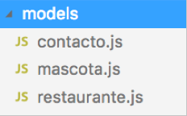
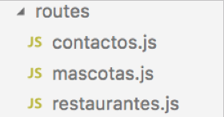

# Tema 2. Acceso a datos con Node.js

## 2.3. Desarrollo de una API REST con Express y MongoDB

En el primer tema ya vimos qué era un proveedor de servicios REST, y cómo podíamos desarrollar uno de forma sencilla con Express. En aquellos ejemplos empleábamos ficheros de texto como almacenes de datos.

Aprovechando los conceptos vistos en este segundo tema sobre el acceso a bases de datos MongoDB, vamos a desarrollar ahora una API REST que combine lo visto con Express con lo aprendido sobre MongoDB y Mongoose. Además, aprovecharemos para empezar a estructurar nuestra aplicación de una forma más apropiada.

### 2.3.1. Estructurando una API REST en Express

Los ejemplos hechos hasta ahora de aplicaciones son bastante monolíticos: en un solo archivo fuente hemos ubicado los modelos de datos y las operaciones a realizar, o la aplicación Express en sí y las rutas a las que responderá.

A pesar de que el propio framework Express se define en su [web oficial](http://expressjs.com/) como *unopinionated*, es decir, sin opinión acerca de cómo debe ser una arquitectura de aplicación Express, sí conviene seguir ciertas normas mínimas de modularidad en nuestro código. Consultando ejemplos en Internet podemos encontrar distintas formas de estructurar aplicaciones Express, y podríamos considerar correctas muchas de ellas, desde el punto de vista de modularidad del código. Aquí vamos a proponer una estructura que seguir en nuestras aplicaciones, basándonos en otros ejemplos vistos en Internet, pero que no tiene por qué ser la mejor ni la más universal.

#### 2.3.1.1. Los modelos de datos

Es habitual encontrarnos con una carpeta `models` en las aplicaciones Express donde se definen los modelos de las diferentes colecciones de datos. En nuestro ejemplo de contactos, dentro de esa carpeta "models" vamos a definir los archivos para nuestros tres modelos de datos: `contacto.js`, `restaurante.js` y `mascota.js`:

<div align="center">
    
</div>

En el archivo `contacto.js` definimos el esquema y modelo de nuestra colección de contactos. Necesitaremos incluir con `require` la librería "*mongoose*" para hacer uso de los esquemas y modelos. En el siguiente código, omitimos con puntos suspensivos partes que ya se tienen de sesiones previas, para no dejar el código demasiado largo en estos apuntes:

```js
const mongoose = require('mongoose');

// Definición del esquema 
let contactoSchema = new mongoose.Schema({
    nombre: {
        ...
    },
    telefono: {
        ...
    },
    edad: {
        ...
    },
    restauranteFavorito: {
        type: mongoose.Schema.Types.ObjectId,
        ref: 'restaurante'
    },
    mascotas: [{
        type: mongoose.Schema.Types.ObjectId,
        ref: 'mascota' 
    }]
});

// Asociación con el modelo (colección contactos)
let Contacto = mongoose.model('contacto', contactoSchema);

module.exports = Contacto;
```

De forma similar, definimos el código del modelo `restaurante.js`:

```js
const mongoose = require('mongoose');

// Definición del esquema
let restauranteSchema = new mongoose.Schema({
    nombre: {
        ...
    },
    direccion: {
        ...
    },
    telefono: {
        ...
    }
});

// Asociación con el modelo
let Restaurante = mongoose.model('restaurante', restauranteSchema);

module.exports = Restaurante;
```

Y también para `mascota.js`:

```js
const mongoose = require('mongoose');

// Definición del esquema
let mascotaSchema = new mongoose.Schema({
    nombre: {
        ...
    },
    tipo: {
        ...
    }
});

// Asociación con el modelo
let Mascota = mongoose.model('mascota', mascotaSchema);

module.exports = Mascota;
```

#### 2.3.1.2. Las rutas y enrutadores

Imaginemos que la gestión de contactos en sí (alta / baja / modificación / consulta de contactos) se realizará mediante servicios englobados en una URI que empieza por `/contactos`. Para el caso de restaurantes y mascotas, utilizaremos las URIs `/restaurantes` y `/mascotas`, respectivamente. Vamos a definir tres enrutadores diferentes, uno para cada cosa. Lo normal en estos casos es crear una subcarpeta `routes` en nuestro proyecto, y definir dentro un archivo fuente para cada grupo de rutas. En nuestro caso, definiríamos un archivo `contactos.js` para las rutas relativas a la gestión de contactos, otro `restaurantes.js` para los restaurantes, y otro `mascotas.js` para las mascotas.

<div align="center">
    
</div>

> **NOTA**: es también habitual que la carpeta `routes` se llame `controllers` en algunos ejemplos que podemos encontrar por Internet, ya que lo que estamos definiendo en estos archivos son básicamente controladores, que se encargan de comunicarse con el modelo de datos y ofrecer al cliente una respuesta determinada.

Vamos a definir el código de estos tres enrutadores que hemos creado. En cada uno de ellos, utilizaremos el modelo correspondiente de la carpeta "*models*" para poder manipular la colección asociada. 

Comencemos por la colección más sencilla de gestionar: la de **mascotas**. Definiremos únicamente servicios para listar (GET), insertar (POST) y borrar (DELETE). El código del enrutador `routes/mascotas.js` quedaría así (se omite el código interno de cada servicio, que sí puede consultarse en los ejemplos de código de la sesión):

```js
const express = require('express');

let Mascota = require(__dirname + '/../models/mascota.js');

let router = express.Router();

// Servicio de listado
router.get('/', (req, res) => {
    ...
});

// Servicio de inserción
router.post('/', (req, res) => {
    ...
});

// Servicio de borrado
router.delete('/:id', (req, res) => {
    ...
});

module.exports = router;
```

Notar que utilizamos un objeto `Router` de Express para gestionar los servicios, a diferencia de lo que veníamos haciendo en sesiones anteriores, donde nos basábamos en la propia aplicación (objeto `app`) para gestionarlos. De esta forma, definimos un router para cada grupo de servicios, que se encargará de su procesamiento. Lo mismo ocurrirá para los dos enrutadores siguientes (restaurantes y contactos).

Notar también que las rutas no hacen referencia a la URI `/mascotas`, sino que apuntan a una raíz `/`. El motivo de esto lo veremos en breve.

De forma análoga, podríamos definir los servicios GET, POST y DELETE para los **restaurantes** en el enrutador `routes/restaurantes.js`:

```js
const express = require('express');

let Restaurante = require(__dirname + '/../models/restaurante.js');

let router = express.Router();

// Servicio de listado
router.get('/', (req, res) => {
    ...
});

// Servicio de inserción
router.post('/', (req, res) => {
    ...
});

// Servicio de borrado
router.delete('/:id', (req, res) => {
    ...
});

module.exports = router;
```

Quedan, finalmente, los servicios para **contactos**. Adaptaremos los que ya hicimos en sesiones anteriores, copiándolos en el enrutador `routes/contactos.js`. El código quedaría así:

```js
const express = require('express');

let Contacto = require(__dirname + '/../models/contacto.js');

let router = express.Router();

// Servicio de listado general
router.get('/', (req, res) => {
    ...
});

// Servicio de listado por id
router.get('/:id', (req, res) => {
    ...
});

// Servicio para insertar contactos
router.post('/', (req, res) => {
    ...
});

// Servicio para modificar contactos
router.put('/:id', (req, res) => {
    ...
});

// Servicio para borrar contactos
router.delete('/:id', (req, res) => {
    ...
});

module.exports = router;
```

#### 2.3.1.3. La aplicación principal

El servidor principal ve muy aligerado su código. Básicamente se encargará de cargar las librerías y enrutadores, conectar con la base de datos y poner en marcha el servidor:

```js
// Librerías externas
const express = require('express');
const mongoose = require('mongoose');

// Enrutadores
const mascotas = require(__dirname + '/routes/mascotas');
const restaurantes = require(__dirname + '/routes/restaurantes');
const contactos = require(__dirname + '/routes/contactos');

// Conexión con la BD
mongoose.connect('mongodb://localhost:27017/contactos',
    {useNewUrlParser: true});

let app = express();

// Carga de middleware y enrutadores
app.use(express.json());
app.use('/mascotas', mascotas);
app.use('/restaurantes', restaurantes);
app.use('/contactos', contactos);

// Puesta en marcha del servidor
app.listen(8080);
```

Los enrutadores se cargan como *middleware*, empleando `app.use`. En esa instrucción, se especifica la ruta con la que se mapea cada enrutador, y por este motivo, dentro de cada enrutador las rutas ya hacen referencia a esa ruta base que se les asigna desde el servidor principal; por ello todas comienzan por `/`.

> **Ejercicios propuestos:**
> 
> **1.** Crea una carpeta llamada "**T2_LibrosExpress**" en tu espacio de trabajo, en la carpeta "*Ejercicios*". Vamos a combinar en él lo visto en el ejercicio *T2_Libros* de sesiones previas, y parte de los servicios desarrollados en el tema 1 sobre la aplicación de libros en ficheros JSON.
> 
> Crea una subcarpeta **models** y añade dentro, en los archivos `libro.js` y `autor.js` los modelos de las colecciones de libros y autores que hemos definido en sesiones previas. Expórtalos adecuadamente para poderlos utilizar en otros archivos del proyecto.
> 
> Crea también una subcarpeta **routes** y añade dentro los enrutadores para trabajar tanto con libros (archivo `libros.js`) como con autores (archivo `autores.js`). Añade dentro de cada uno los servicios necesarios para poder manipular ambas colecciones. En el caso de los libros, añade todos los servicios que ya hicimos en el tema 1 (adaptados ahora al esquema de Mongoose que hemos hecho). En el caso de los autores, añade simplemente operaciones GET, POST y DELETE para poder ver, insertar y borrar los autores.
> 
> Define un programa principal que cargue las librerías adecuadas, prepare los enrutadores y responda a las peticiones sobre libros sobre la URI base `/libros`, y a las peticiones sobre autores en la URI base `/autores`.
> 
> **2.** Crea una colección Postman llamada **Libros** que acceda y pruebe cada uno de los servicios desarrollados, y expórtala cuando hayas verificado su funcionamiento.

### 2.3.2. Otros conceptos adicionales 

#### 2.3.2.1. Más sobre los datos de la petición

Existen otras posibilidades de uso del *middleware* para el procesamiento de las peticiones POST y PUT. En los ejemplos anteriores lo hemos empleado para procesar cuerpos con formato JSON. Pero es posible también que empleemos formularios tradicionales HTML, que envían los datos como si fueran parte de una *query-string*, pero por POST. Por ejemplo:

```
nombre=Nacho&telefono=911223344&edad=39
```

Para procesar contenidos de este otro tipo, basta con añadir de nuevo la librería como *middleware*, indicando en este caso otro método:

```js
app.use(express.json());
app.use(express.urlencoded({extended:false}));
```

En este caso, el servidor Express aceptaría datos de la petición tanto en formato JSON como en formato *query-string*. El parámetro `extended` indica qué tipo de *parser* queremos utilizar para procesar los datos de la petición: si lo dejamos a `false`, emplearemos la librería *querystring*, y si está a `true`, se empleará la librería *qs*, con algunas opciones algo más avanzadas para incluir objetos más complejos.

En cualquier caso, deberemos asegurarnos desde el cliente (incluso si usamos Postman) de que el tipo de contenido de la petición se ajusta al *middleware* correspondiente: para peticiones en formato JSON, el contenido deberá ser `application/json`, mientras que para enviar los datos del formulario en formato *query-string*, el tipo deberá ser `application/x-www-form-urlencoded`. Si añadimos los dos middlewares (tanto para JSON como para `urlencoded`), entonces se activará uno u otro automáticamente, dependiendo del tipo de petición que llegue desde el cliente.
