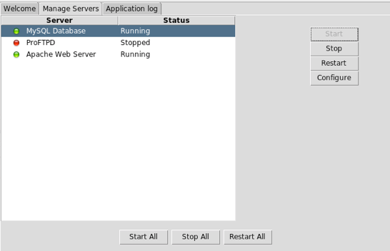

# Tema 2. Acceso a datos con Node.js

## 2.4. Acceso a bases de datos relacionales

En esta sesión trataremos cómo conectar con un sistema SQL tradicional, como MariaDB/MySQL. En primer lugar, daremos unas nociones básicas sobre cómo instalar y acceder a MySQL a través de la herramienta *phpMyAdmin*, y después veremos qué librería(s) utilizar en Node.js para acceder a estos sistemas de bases de datos.

### 2.4.1. Instalando y configurando MariaDB/MySQL

Para empezar con la sesión actual, debemos tener MySQL correctamente instalado en nuestro sistema, y también es conveniente disponer de algún tipo de herramienta que nos permita crear y estructurar las bases de datos de forma gráfica.

Para aunar estos dos conceptos, trabajaremos con un sistema XAMPP, paquetes que integran en una sola instalación un servidor Apache, un servidor MySQL y el lenguaje PHP. El ejemplo más conocido de estos sistemas es **XAMPP**, aunque existen otros como WAMPP. La principal ventaja que ofrecen es que, además de instalar el servidor de bases de datos MySQL, nos ofrece un cliente web llamado **phpMyAdmin** para poder administrarla desde Apache. Esto nos vendrá bien para crear o importar las bases de datos de los distintos ejercicios.

#### 2.4.1.1. Instalación y puesta en marcha

Para instalar XAMPP, basta con descargarlo de su [web oficial](https://www.apachefriends.org/es/index.html) y seguir los pasos del asistente. Nos basta con tener instalado Apache, MySQL y PHP, así que podemos descartar otras opciones que nos ofrezca, si nos da a elegir.  

Una vez descargado e instalado, en la carpeta de instalación tendremos un manager que nos permitirá lanzar o detener cada servidor. Para las pruebas que haremos deberemos tener iniciados tanto Apache como MySQL:

<div align="center">
    
</div>

> **NOTA**: en el caso de **Linux**, debemos ejecutar el archivo *.run* que descarguemos desde algún terminal, con permisos de administrador (*sudo*). Después, el *manager* de XAMPP se encuentra en */opt/lampp/manager-linux-x64.run*. Podemos acceder a la carpeta desde el terminal para ejecutarlo, o bien crear algún acceso directo en otra ubicación que nos resulte más cómoda. Tenemos otra opción que es ejecutar el siguiente comando `$sudo /opt/lampp/xampp start`, el cual nos arranca *Apache, MySQL y ProFTPD*. Si queremos ejecutar sólo un servicio o dos deberíamos usar en lugar de la acción *start* la opción *startapache* para iniciar Apache, *startmysql* para iniciar MySQL, o *startftp* para iniciar ProFTPD.

Por defecto, Apache estará escuchando en el puerto 80 (o 443 para conexiones SSL), y MySQL en el 3306. Podemos modificar estos puertos en los respectivos archivos de configuración ("*httpd.conf*" y "*my.cnf*"), dentro de las carpetas de la instalación de XAMPP (la ubicación concreta de estos archivos varía entre versiones y entre sistemas operativos).

#### 2.4.1.2. Uso básico de *phpMyAdmin*

El objetivo de esta sesión no es dar una visión general de cómo utilizar MariaDB/MySQL y el gestor *phpMyAdmin*, sino dar las pautas necesarias para el trabajo que vamos a hacer con este SGBD: crear bases de datos, añadir tablas y campos, y exportar/importar bases de datos ya hechas. 

Si accedemos a la URL *http://localhost/phpMyAdmin* veremos el cliente web para gestionar las bases de datos MySQL:

<div align="center">
    
</div>

En la parte izquierda aparecerán las bases de datos que tengamos ya creadas en el sistema, y un enlace "Nueva" para crear nuevas bases de datos. Después, podemos definir nuevas tablas, y los campos de cada tabla:

<div align="center">
    
</div>

También podemos importar una base de datos ya hecha, desde el botón "*Importar*" de la barra de herramientas superior. Con el botón de "*Exportar*" podemos crear un *backup* de nuestra base de datos en un archivo de texto con extensión `.sql`, que luego podremos importar con *phpMyAdmin* en otro servidor (o el mismo).

### 2.4.2. La librería *mysql*

Conviene tener presente que la combinación de Node.js y MySQL no es demasiado habitual. Es bastante más frecuente el uso de bases de datos MongoDB empleando este framework, ya que la información que se maneja, en formato BSON, es muy fácilmente exportable entre los dos extremos.

Sin embargo, también existen herramientas para poder trabajar con MySQL desde Node.js. Una de las más populares es la librería `mysql`, disponible en el repositorio NPM. Para ver cómo utilizarla, comenzaremos por crear un proyecto llamado "*PruebaMySQL*" en nuestra carpeta de "*ProyectosNode/Pruebas*". Crea dentro un archivo `index.js`, y ejecuta el comando `npm init` para inicializar el archivo `package.json`. Después, instalamos la librería con el correspondiente comando `npm install`:

```
npm i mysql
```

#### 2.4.2.1. Conexión a la base de datos

Una vez instalado el módulo, en nuestro archivo `index.js` lo importamos (con `require`), y ejecutamos el método `createConnection` para establecer una conexión con la base de datos, de acuerdo a los parámetros de conexión que facilitaremos en el propio método:

* `host`: nombre del servidor (normalmente `localhost`)
* `user`: nombre del usuario para conectar
* `password`: password del usuario para conectar
* `database`: nombre de la base de datos a la que acceder, de entre las que haya disponibles en el servidor al que conectamos.
* `port`: un parámetro opcional, a especificar si la base de datos está escuchando por un puerto que no es el puerto por defecto
* `charset`: también opcional, para indicar un juego de codificación de caracteres determinado (por ejemplo, "utf8").

En el caso de *phpMyAdmin*, salvo que creemos otro usuario, el que viene por defecto es "*root*" con contraseña vacía (""). Para las pruebas que haremos en este proyecto de prueba, utilizaremos una base de datos llamada "*contactos*" que puedes descargar e importar desde los recursos de esta sesión. Teniendo en cuenta todo lo anterior, podemos dejar los parámetros de conexión así:

```js
const mysql = require('mysql');

let conexion = mysql.createConnection({
    host: "localhost",
    user: "root",
    password: "",
    database: "contactos"
});
```

Después, podemos establecer la conexión con:

```js
conexion.connect((error) => {
    if (error)
        console.log("Error al conectar con la BD:", error);
    else
        console.log("Conexión satisfactoria");
});
```

En el caso de que se produzca algún error de conexión, lo identificaremos en el parámetro `error` y podremos actuar en consecuencia. En este caso se muestra un simple mensaje por la consola, pero también podemos almacenarlo en algún *flag* booleano o algo similar para impedir que se hagan operaciones contra la base de datos, o se redirija a otra página.

#### 2.4.2.2. Consultas

La base de datos "contactos" tiene una tabla del mismo nombre, con los atributos id, nombre y teléfono.

<div align="center">
    
</div>

Vamos a definir una consulta para obtener resultados y recorrerlos. Por ejemplo, mostrar todos los contactos:

```js
conexion.query("SELECT * FROM contactos",
    (error, resultado, campos) => {
        if (error)
            console.log("Error al procesar la consulta");
        else {
            resultado.forEach((contacto) => {
                console.log(contacto.nombre, ":", contacto.telefono);
            });
        }
    }
);
```

Notar que el método `query` tiene dos parámetros: la consulta a realizar, y un *callback* que recibe otros tres parámetros: el error producido (si lo hay), el conjunto de resultados (que se puede procesar como un vector de objetos), e información adicional sobre los campos de la consulta.

Notar también que el propio método `query` nos sirve para conectar (dispone de su propio control de error), por lo que no sería necesario el paso previo del método `connect`. En cualquier caso, podemos hacerlo si queremos asegurarnos de que hay conexión, pero cada *query* que hagamos también lo puede verificar.

Existen otras formas de hacer consultas, como son:

* Utilizando marcadores (*placeholders*) en la propia consulta. Estos marcadores se representan con el símbolo `?`, y se sustituyen después por el elemento correspondiente de un vector de parámetros que se coloca en segunda posición. Por ejemplo:

```js
conexion.query("SELECT * FROM contactos WHERE id = ?", [1], 
    (error, resultado, campos) => {
        ...
```

* Utilizando un objeto con diferentes propiedades de la consulta, de forma que podemos proporcionar información adicional como *timeout*, conversión de tipos, etc.

```js
conexion.query({
    sql: "SELECT * FROM contactos WHERE id = ?",
    values: [1], 
    timeout: 4000
}, (error, resultado, campos) => {
    ...
```

#### 2.4.2.3. Actualizaciones (inserciones, borrados, modificaciones)

Si lo que queremos es realizar alguna modificación sobre los contenidos de la base de datos (INSERT, UPDATE o DELETE), estas operaciones se realizan desde el mismo método `query` visto antes. La diferencia está en que en el parámetro `resultado` del callback ya no están los registros de la consulta, sino datos como el número de filas afectadas (en el atributo `affectedRows`), o el *id* del nuevo elemento insertado (atributo `insertId`), en el caso de inserciones con id autonumérico.

Por ejemplo, si queremos insertar un nuevo contacto en la agenda y obtener el *id* que se le ha asignado, lo podemos hacer así:

```js
conexion.query("INSERT INTO contactos (nombre, telefono) " +
        "VALUES ('Fernando', '966566556')", 
        (error, resultado, campos) => {
    if (error)
        console.log("Error al procesar la inserción");
    else
        console.log("Nuevo id = ", resultado.insertId);
});
```

También podemos pasar un objeto JavaScript como dato a la consulta, y automáticamente se asigna cada campo del objeto al campo correspondiente de la base de datos (siempre que los nombres de los campos coincidan). Esto puede emplearse tanto en inserciones como en modificaciones:

```js
conexion.query("INSERT INTO contactos SET ?", 
    {nombre: 'Nacho C.', telefono: '965771111'}, 
    (error, resultado, campos) => {
        ...
});
```

Si hacemos un borrado o actualización, podemos obtener el número de filas afectadas, de esta forma:

```js
conexion.query("DELETE FROM contactos WHERE id > 4", 
    (error, resultado, campos) => {
        if (error)
            console.log("Error al realizar el borrado");
        else
            console.log(resultado.affectedRows, "filas afectadas");
});
```

#### 2.4.2.4. Transacciones

Las transacciones son un elemento muy útil en operaciones de modificación de la base de datos, ya que permiten agrupar un conjunto de ellas y asegurarnos de que, o se ejecutan todas satisfactoriamente, o no se ejecuta ninguna. Es algo típico en operaciones como reserva de viajes (donde hay que reservar alojamiento, vuelo, etc. y nos interesa que si algo falla se anulen las demás opciones de reserva).

Para definir una transacción, empezamos con el método `beginTransaction`, y dentro de este método englobamos todas las operaciones (`query`) que queramos realizar. Si alguna de ellas falla, acudimos al método `rollback` para deshacer la transacción. En caso contrario, si todo va correctamente, al finalizar la transacción llamamos al método `commit` para confirmarla.

```js
conexion.beginTransaction((error) => {
    if (error)
        console.log("Error al iniciar transacción");
    else {
        conexion.query("INSERT INTO ...", 
        (error, resultado, campos) => {
            if (error)
                return conexion.rollback(() => { 
                    console.log("Error al deshacer"); 
                });
            else {
                conexion.query("INSERT INTO...", 
                (error, resultado, campos) => {
                    if (error)
                        return conexion.rollback(() => { 
                            console.log("Error al deshacer"); 
                        });
                    else {
                        conexion.commit((error) => {
                            if (error)
                                console.log("Error confirmando");
                        });
                    }
                });
            }
        });
    }
});
```

> **NOTA:** los mensajes de log que se muestran en estos ejemplos cuando sucede un error son sólo orientativos del punto del programa donde se detecta el error. Dependiendo del programa, se deberá hacer una u otra cosa: enviar datos de error en formato JSON al usuario, redirigir a otra página, etc.

> **NOTA:** notar que este tipo de estructura es propensa a definir un *callback hell*, es decir, una secuencia de anidamientos de llamadas que provocan que el código se indente en forma de pirámide con la punta hacia la derecha. Ante esta situación, también podemos emplear la especificación *async/await* vista en sesiones previas.

### 2.4.3. Definiendo una API REST con Express y MySQL

Vamos a aprovechar el ejemplo de *PruebaMySQL* que hemos iniciado en los apartados anteriores para construir una API REST contra la base de datos de contactos en MySQL. Puedes renombrar el archivo `index.js` a `pruebas.js`, y crear un nuevo archivo `index.js` que contendrá el servidor Express con los servicios.

En primer lugar, debemos instalar *express* y *body-parser* en el proyecto, hacer los correspondientes `require` e inicializar el servidor y las opciones de conexión a la base de datos:

```js
const express = require('express');
const mysql = require('mysql');
const bodyParser = require('body-parser');

let conexion = mysql.createConnection({
    host: 'localhost',
    user: 'root',
    password: '',
    database: 'contactos'
});

let app = express();
app.use(bodyParser.json());

app.listen(8080);
```

#### 2.4.3.1. Servicios de consulta

Definiremos ahora dos servicios GET para mostrar el listado de todos los contactos y la ficha de un contacto a partir de su *id*. En ambos casos, llamaremos al método `query` de la conexión, indicando la instrucción `SELECT` a ejecutar y recogiendo el resultado en el correspondiente *callback*. Después, en función de si ha habido error o no, enviaremos una respuesta u otra (en formato JSON).

En el caso del listado general, el servicio puede quedar así:

```js
app.get('/contactos', (req, res) => {
    conexion.query("SELECT * FROM contactos", 
    (error, resultado, campos) => {
        if (error)
            res.status(500)
               .send({ ok: false, 
                       error: "Error listando contactos"});
        else
            res.status(200)
               .send({ ok: true, 
                       resultado: resultado});
    });
});
```

Para la consulta parametrizada para buscar por *id*, el código es el siguiente:

```js
app.get('/contactos/:id', (req, res) => {
    conexion.query("SELECT * FROM contactos WHERE id = ?", 
    req.params['id'], (error, resultado, campos) => {
        if (error || !resultado || resultado.length == 0)
            res.status(400)
               .send({ ok: false, 
                       error: "Error buscando contacto"});
        else
            res.status(200)
               .send({ ok: true, 
                       resultado: resultado[0]});
    });
});
```

En este caso, distinguimos si el array `resultado` es nulo o no tiene elementos, para mostrar en este caso un mensaje de error. Sólo en el caso de que tenga elementos, mostraremos una respuesta exitosa, devolviendo el primero (y único) de esos elementos.

#### 2.4.3.2. Servicios de actualización

Vamos ahora con los servicios de inserción, modificación y borrado. En el caso de la **inserción**, recibiremos en el cuerpo de la petición los datos del contacto a insertar (nombre y teléfono, puesto que el *id* es autonumérico), en formato JSON, y construiremos un nuevo contacto con él, empleando previamente el *middleware body-parser*:

```js
app.post('/contactos', (req, res) => {
    let nuevoContacto = {
        nombre: req.body.nombre,
        telefono: req.body.telefono
    };
    conexion.query("INSERT INTO contactos SET ?", 
    nuevoContacto, (error, resultado, campos) => {
        if (error)
            res.status(400)
               .send({ ok: false, 
                       error: "Error insertando contacto" });
        else
            res.status(200)
               .send({ ok: true, 
                       resultado: resultado });
    });
});
```

Notar que en este caso pasamos como parámetro a la *query* el objeto JavaScript con todos los campos necesarios (nombre y teléfono), y se asignará cada cosa automáticamente al campo equivalente del registro en la tabla MySQL.

Para la **modificación** se hace algo similar, y además se le pasa como parámetro en la URI el *id* del contacto a modificar:

```js
app.put('/contactos/:id', (req, res) => {
    let datosModificados = {
        nombre: req.body.nombre,
        telefono: req.body.telefono
    };
    conexion.query("UPDATE contactos SET ? WHERE id = ?", 
    [datosModificados, req.params['id']], 
    (error, resultado, campos) => {
        if (error)
            res.status(400)
               .send({ ok: false, 
                       error: "Error modificando contacto" });
        else
            res.status(200)
               .send({ ok: true, 
                       resultado: resultado });
    });
});
```

Notar que, en este caso, la *query* tiene dos parámetros `?`: el objeto JavaScript con los nuevos datos del contacto, y el *id* del contacto a buscar. Estos dos parámetros se pasan como segundo parámetro de la llamada a `query`, en forma de array (entre corchetes).

Finalmente, el servicio de **borrado** quedaría así:

```js
app.delete('/contactos/:id', (req, res) => {
    conexion.query("DELETE FROM contactos WHERE id = ?", 
    req.params['id'], (error, resultado, campos) => {
        if (error)
            res.status(400)
               .send({ ok: false, 
                       error: "Error eliminando contacto" });
        else
            res.status(200)
               .send({ ok: true, 
                       resultado: resultado });
    });
});
```

Puedes definir una colección en Postman llamada "ContactosMySQL" para probar estos servicios.

> **Ejercicios propuestos:**
> 
> **1.** Crea una carpeta llamada "**T2_LibrosMySQL**" en tu espacio de trabajo, en la carpeta "*Ejercicios*". Crea también una base de datos llamada "libros" con *phpMyAdmin* e importa el *backup* que tienes disponible en los recursos de esta sesión.
> 
> En el proyecto, inicializa el archivo `package.json` con `npm init`, e instala los módulos de *express*, *mysql* y *body-parser*. Crea un proveedor de servicios REST que dé respuesta a estos servicios:
> 
> * `GET /libros`: listado de todos los libros
> * `GET /libros/:id`: obtener la ficha de un libro
> * `POST /libros`: inserción de libro
> * `PUT /libros/:id`: modificación de libro (se pueden modificar todos los campos salvo el *id*).
> * `DELETE /libros/:id`: borrado de un libro a partir de su *id*.
>
> Los datos a devolver por cada servicio deben ser similares a los del ejemplo visto para contactos, pero tendrás que tener en cuenta algo adicional que no hemos visto en el ejemplo anterior: si el número de filas afectadas en una inserción, borrado o modificación es 0, será síntoma de que dicha operación no ha sido exitosa, y en ese caso también se deberá considerar un error.
> 
> Crea además una colección Postman llamada "LibrosMySQL" con pruebas para cada servicio 
