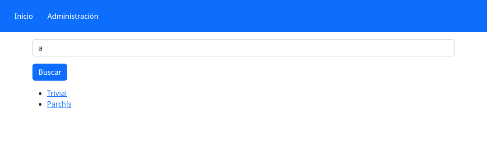
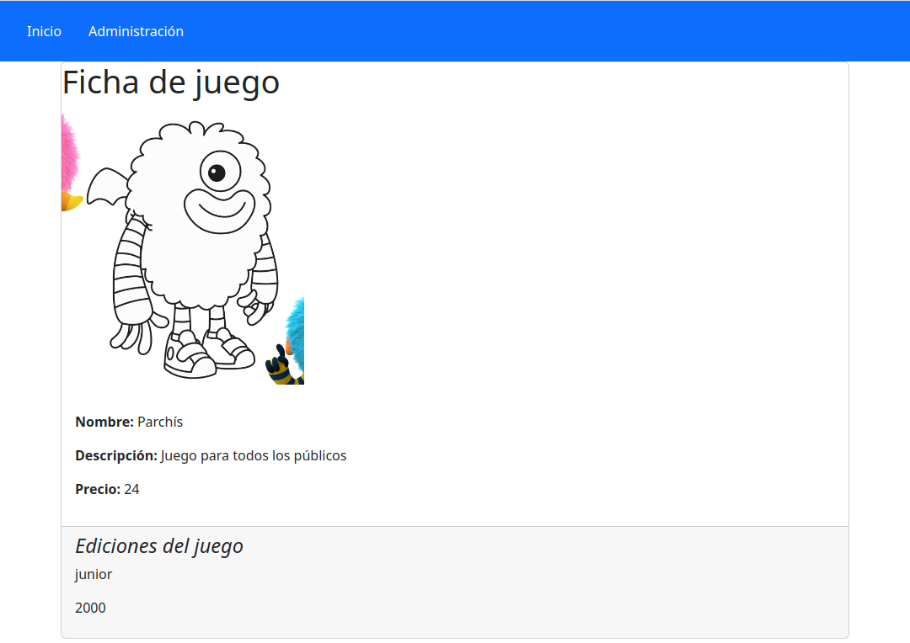

# Práctica Tema 3

## Desarrollo de una aplicación web Express para el catálogo de una plataforma de juegos de mesa

Siguiendo con la temática de prácticas anteriores, vamos a desarrollar una aplicación web completa para gestión y visualización de una serie de juegos de mesa, aprovechando gran parte de la lógica implementada en la práctica del tema anterior.

### 1. Estructura de la aplicación

Crearemos una aplicación llamada **playREST_V3**, e instalaremos dentro los módulos siguientes:

* *express*
* *mongoose* 
* *body-parser* (para versiones de Express inferiores a 4.16)
* *nunjucks* como motor de plantillas
* *express-session* para autenticación basada en sesiones
* *method-override* para simular peticiones PUT y DELETE
* *bootstrap* para los estilos generales de la aplicación
* *multer* para subidas de imágenes de juegos
* ... cualquier otro módulo que quieras utilizar

Recuerda primero inicializar el archivo `package.json` con `npm init`, y después instala los módulos con `npm install`.

Internamente, la aplicación estará compuesta de:

* Archivo `index.js` en la raíz del proyecto, donde irá el servidor principal.
* Carpeta `models` donde almacenaremos los esquemas y modelos de la aplicación. Serán una versión reducida de los de la práctica anterior, como se comentará a continuación.
* Carpeta `routes` con los distintos enrutadores que se detallarán más adelante.
* Carpeta `views` con las vistas que definiremos, y que se explicarán más adelante.
* Carpeta `public` con cierto contenido estático. En concreto, habrá un archivo CSS en `public/css/estilos.css` con los estilos propios que queráis definir, y una carpeta `public/uploads` para subir las imágenes de los juegos.
* Carpeta `utils` con algunos ficheros de utilidad que se comentarán más adelante.

### 2. Definiendo esquemas y modelos

En la carpeta `models` almacenaremos la definición de esquemas y modelos de nuestra base de datos. 

#### 2.1. Los juegos de mesa

Habrá un archivo `juego.js` con la siguiente información. Se deben respetar los nombres de los campos, que se marcan en negrita, incluyendo mayúsculas o minúsculas si procede:

**Esquema y modelo *juego***

El esquema de datos de cada juego contendrá los siguientes campos:

* El **nombre** del juego (obligatorio, de tipo texto, con una longitud mínima de 6 caracteres).
* La **descripcion** del juego (texto largo obligatorio, sin tamaño mínimo).
* La **edad** recomendada en años (numérico obligatorio, mayor que 0 y menor que 100)
* El número de **jugadores** permitido (numérico obligatorio)
* El **tipo** de juego (tipo enum con las siguientes categorías: rol, escape, dados, fichas, cartas y tablero)
* El **precio** del juego (numérico obligatorio, mayor a 0)
* La **imagen** del juego (texto con la ruta relativa, no obligatoria).
* Las **ediciones**  más modernas o temáticas, para jugar partidas diferentes pero sin perder la esencia del juego original. Por ejemplo, del Cluedo podemos encontrar diferentes versiones como la edición Juego de Tronos, la edición Big Bang Theory o la edición Junior. Este campo será un array de subdocumentos del tipo de esquema que comentaremos a continuación.

**Esquema de las ediciones del juego**

Para las ediciones del juego, definiremos un esquema que contendrá estos campos:

* El nombre de la **edicion** del juego. Será del tipo texto obligatorio.
* El **anyo** de lanzamiento de la edición. Será de tipo numérico (mayor que 2000 y menor que el año actual).
  
Recuerda exportar el modelo.

#### 2.2. Los usuarios registrados

Además, habrá un archivo `usuario.js` que definirá un esquema y modelo para los usuarios registrados en la aplicación. Los campos a almacenar de cada usuario serán:

* El **login** del usuario, de tipo texto, con tamaño mínimo de 5 caracteres, obligatorio y que no admite duplicados (*unique*). 
* El **password** del usuario, de tipo texto, con tamaño mínimo de 8 caracteres, que se guardará encriptado. Puedes utilizar para ello la librería [bcrypt](https://www.npmjs.com/package/bcrypt) o bien usar el módulo [crypto] de node (https://nodejs.org/api/crypto.html#crypto). En este último caso, puedes utilizar un encriptado SHA256.

Para dejar unos usuarios previamente almacenados y que la aplicación no tenga que ocuparse de registrar usuarios, puedes definir un archivo auxiliar llamado `generar_usuarios.js`, en la carpeta `utils` de la aplicación, con un par de usuarios de prueba, y ejecutarlo para que se inserten. Por ejemplo, el contenido puede ser parecido a éste (aunque encriptando los passwords al insertar):

```js
const mongoose = require('mongoose');
const Usuario = require(__dirname + '/../models/usuario');

mongoose.connect('mongodb://127.0.0.1:27017/playrest_v3');

Usuario.collection.drop();

let usu1 = new Usuario({
    login: 'maycalle',
    password: '12345678'
});
usu1.save();

let usu2 = new Usuario({
    login: 'rosamaria',
    password: '87654321'
});
usu2.save();
```

### 3. Los enrutadores

En la carpeta `routes` definiremos los enrutadores asociados a cada modelo.

#### 3.1. La parte pública

En el enrutador `publico.js` se definirán estas rutas GET:

* `/` (raíz de la aplicación): renderizará la vista `publico_index` de la carpeta de vistas, sin parámetros.
* `/buscar`: buscará todos los juegos cuyo nombre contenga el texto que se le pasará en el cuerpo de la petición, y renderizará la vista `publico_index` de la carpeta de vistas, pasándole como parámetro el conjunto de resultados obtenido, o el mensaje "No se encontraron juegos" si no hay resultados coincidentes.
* `/juegos/:id`: renderizará la vista `publico_juego` de la carpeta de vistas, pasándole como parámetro los datos del juego cuyo *id* le llegue como parámetro en la ruta. Si no se encuentra el juego, se renderizará la vista `publico_error` con el mensaje "Juego no encontrado".

Si se produce algún error no contemplado en cualquiera de las rutas (es decir, si se salta a la cláusula `catch` correspondiente), se renderizará la vista `publico_error`, sin mensaje de error, para que muestre el mensaje por defecto de "Error en la aplicación".

#### 3.2. La administración de juegos

En el enrutador `juegos.js` se definirán las siguientes rutas:

* `GET /`: renderizará la vista `admin_juegos` pasándole como parámetro el listado de juegos.
* `GET /juegos/nuevo`: renderizará la vista `admin_juegos_form`.
* `GET /juegos/editar/:id`: renderizará la vista `admin_juegos_form` pasándole como parámetro el juego con el *id* indicado. Si no se encuentra el juego, se renderizará la vista `admin_error` con el mensaje "Juego no encontrado".
* `POST /juegos`: recogerá de la petición los datos del juego, hará la inserción y, si todo ha sido correcto, redirigirá a la ruta base de este enrutador.
* `PUT /juegos/:id`: recogerá de la petición los datos del juego cuyo *id* se pasa en la URL, y hará la modificación de sus campos. Si todo ha sido correcto, redirigirá a la ruta base de este enrutador.
  * Como caso particular de esta ruta, si no se recibe el campo con la imagen del juego, se entenderá que se quiere dejar la imagen anterior. El resto de campos del juego debe enviarse para poderse modificar.
* `DELETE /juegos/:id`: eliminará el juego cuyo *id* se pasa en la URL, redirigiendo si todo es correcto a la ruta base de este enrutador.
* Además, podéis añadir las rutas adicionales que os puedan servir para la gestión de los juegos, tales como añadir o quitar ediciones de un juego.

Si se produce algún error no contemplado en cualquiera de las rutas (es decir, si se salta a la cláusula `catch` correspondiente), se renderizará la vista `admin_error`, sin mensaje de error, para que muestre el mensaje por defecto de "Error en la aplicación".

En el caso de los métodos POST y PUT, si se sube alguna imagen del juego, se utilizará la librería `multer` para copiarla en la carpeta `public/uploads`, con el prefijo de la fecha actual.

#### 3.3. La autenticación de usuarios

En el enrutador `auth.js` se definirán las siguientes rutas:

* `GET /login`: renderizará la vista `auth_login`.
* `POST /login`: recogerá de la petición el login y password del usuario que intenta acceder y comprobará si son válidos. Si lo son, almacenará en sesión el login del usuario, y redirigirá a la ruta base del enrutador de juegos. Si falla, renderizará el formulario de `auth_login` pasándole el mensaje de error de "Usuario incorrecto", para que se muestre en dicho formulario.
* `GET /logout`: destruirá la sesión del usuario actual y redirigirá a la raíz de la parte pública.

#### 3.4. Definiendo la zona de acceso restringido

Todas las rutas de `routes/juegos.js` deberán estar protegidas. Para ello, se deberá crear un archivo `auth.js` en la carpeta `utils` del proyecto. En dicho archivo se definirá un middleware de autenticación que verificará si existe un usuario almacenado en sesión antes de dejar pasar. De lo contrario, redirigirá al formulario de login.

Se deberá importar este archivo desde donde corresponda (enrutador `routes/juegos.js`), y aplicar el middleware en las rutas que se quieran proteger.

### 4. Las vistas

En la carpeta de vistas `views` se definirán las siguientes vistas con el contenido que se describe para cada una.

#### 4.1. Parte pública

En lo que respecta a la parte pública, se definirán tres vistas:

* `publico_index.njk`: Mostrará en su contenido un formulario de búsqueda, que se enviará por GET a la URL `/buscar`. Si recibe un listado de juegos, los mostrará bajo el formulario, con un enlace para ir a cada juego.
* `publico_juego.njk`: Mostrará la ficha de un juego, indicando toda su información: nombre, descripción, edad mínima, número de jugadores, tipo, precio, imagen y las ediciones del juego.
* `publico_error.njk`: Mostrará el mensaje de error que se le indique, o el mensaje genérico "Error en la aplicación" si no recibe ningún mensaje específico.

Estas tres vistas heredarán de una plantilla común llamada `publico_base.njk`, que definirá, al menos:

* La cabecera (`head`) con los estilos Bootstrap y un bloque para el título (`title`) de la página
* El cuerpo (`body`) con:
  * Un menú de navegación con un enlace para ir al inicio de la web ('/') y otro para ir a la zona de administración (a la ruta raíz de dicha zona)
  * Un bloque para el contenido de la página

Aquí podéis ver cómo puede quedar la vista `publico_index.njk` si no recibe ningún listado de juegos que buscar:

<div align="center">
    
</div>

Y así podría quedar si buscamos juegos que contengan el texto "de":

<div align="center">
    
</div>

La ficha de un juego, una vez lo seleccionemos desde el buscador, puede ser más o menos así:

<div align="center">
    
</div>


#### 4.2. Parte de administración

En lo que respecta a la gestión de juegos (parte protegida), se definirán estas vistas:

* `admin_juegos.njk`: mostrará un listado con los nombres de los juegos, y enlaces/botones para editarlos o borrarlos
* `admin_juegos_form.njk`: mostrará un formulario para editar los datos de un juego, bien para insertar o bien para editar. Se tendrán todos los campos del juego. 
  * Si se le pasa como parámetro un juego, se entenderá que es para editarlo, y en ese caso se dejarán los campos del formulario rellenos, y se añadirá un campo *hidden* para cambiar el método del formulario a PUT.
  * Se deja a vuestro criterio el determinar cómo añadir y quitar ediciones a los juegos. Podéis añadir más vistas adicionales para ello si lo creéis conveniente.
* `admin_error.njk`: mostrará una página de error con el mensaje que se le indique, o con el texto "Error en la aplicación" si no recibe ningún mensaje.

Estas vistas heredarán de una plantilla común llamada `admin_base.njk`, que definirá, al menos:

* La cabecera (`head`) con los estilos Bootstrap y un bloque para el título (`title`) de la página
* El cuerpo (`body`) con:
    * Un menú de navegación común definido en la vista `admin_menu.njk`, con enlaces para ir a la raíz de la zona de administración y para crear un nuevo juego.
    * Un bloque para el contenido de la página

#### 4.3. Parte de autenticación

En lo que respecta al apartado de autenticación de usuarios, sólo será necesario definir la vista `auth_login.njk`, con un formulario de login que se enviará por POST a la correspondiente ruta del enrutador `routes/auth.js`.

### 5. El servidor principal

El servidor principal deberá:

* Cargar (`require`) las librerías necesarias 
* Cargar (`require`) los enrutadores 
* Conectar a una base de datos "playrest_v3" de MongoDB
* Inicializar Express
* Configurar la autenticación basada en sesiones
* Configurar el motor de plantillas Nunjucks, apuntando a la carpeta `views`
* Aplicar el middleware siguiente (al menos):
  * *body-parser* para procesar datos en formato *urlencoded*
  * *method-override* para preprocesar las peticiones adecuadamente y poder utilizar PUT y DELETE cuando corresponda.
  * *multer* para que se suban las imágenes a la carpeta `public/uploads`, anteponiéndoles como prefijo la fecha actual.
  * Asociar el enrutador `routes/publico.js` con el prefijo `/` (ruta raíz)
  * Asociar el enrutador `routes/juegos.js` con el prefijo `/admin`
  * Asociar el enrutador `routes/auth.js` con el prefijo `/auth`
* Poner en marcha el servidor Express por el puerto que queráis (por ejemplo, el puerto 8080).

### 6. Entrega y calificación

Deberéis entregar un archivo ZIP o similar, con vuestro nombre y el prefijo "PracT3". Por ejemplo, si os llamáis José Pérez, el archivo de entrega deberá ser `PracT3_Jose_Perez.zip`. Dentro, deberá contener el proyecto **playREST_V3** de Node, sin que contenga la carpeta `node_modules`.

#### 6.1. Calificación de la práctica

Los criterios para calificar esta práctica son los siguientes:

* Estructura correcta del proyecto, con las carpetas y nombres de archivos indicados en el enunciado, archivo `package.json` correctamente definido con las dependencias incorporadas: **0,25 puntos**
* Modelo de datos: **0,5 puntos**, repartidos así:
   * Esquema y modelo para los **usuarios**: **0,1 puntos**
   * Esquemas y modelo para las **juegos**: **0,4 puntos**
* Enrutadores: **5 puntos**, repartidos así:
   * Parte pública (`routes/publico.js`): **1 punto** (0,5 puntos la página de inicio y buscador, y 0,5 puntos la ficha del juego)
   * Parte de administración de juegos (`routes/juegos.js`): **3 puntos** (0,5 puntos por cada una de las 6 rutas exigidas, independientemente de que luego podáis añadir más rutas si os son necesarias).
   * Parte de autenticación de usuarios: **1 punto** (0,5 puntos para el POST de login, y 0,25 puntos cada una de las otras dos rutas)
* Vistas: **3 puntos**, repartidos así:
   * Vistas de la parte pública: **1,25 puntos** (0,25 por vista: inicio, ficha del juego, página de error, vista base y menú de navegación)
   * Vistas de la parte de administración:  **1,5 puntos** (0,25 puntos por vista: listado de juegos, error, vista base, menú de navegación, y luego 0,5 puntos el formulario conjunto de inserción y edición, independientemente de otras vistas que podáis necesitar añadir)
   * Vistas de autenticación (formulario de login): **0,25 puntos**
* Archivo principal `index.js`: **0,5 puntos**
* Protección adecuada de las rutas de administración desde el archivo `utils/auth.js`: **0,5 puntos**
* Claridad y limpieza del código, y uso de un comentario inicial en cada fichero fuente explicando qué hace: **0,25 puntos**.

**Penalizaciones a tener en cuenta**

* La no eliminación de la carpeta `node_modules` en el archivo ZIP de entrega se penalizará con 2 puntos menos de nota global de la práctica. 

* Si se sigue una estructura de proyecto, código y/o nombres de archivo distinta a la propuesta, y no se justifica debidamente, o dicha justificación no es satisfactoria, se penalizará la calificación global de la práctica con hasta el 50% de la nota de la misma.

* En el apartado de calificación de los **enrutadores**, se deberán obtener **al menos 2,5 puntos** del total de 5 para considerar aprobada la práctica (además de llegar a la nota mínima exigible).

* En el apartado de calificación de las **vistas**, se deberán obtener al menos **1,5 puntos**, del total de 3, para considerar aprobada la práctica (además de llegar a la nota mínima exigible).
