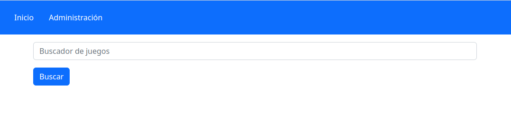

# Pràctica Tema 3

## Desenvolupament d'una aplicació web Express per al catàleg d'una plataforma de jocs de taula

Seguint amb la temàtica de pràctiques anteriors, desenvoluparem una aplicació web completa per a gestió i visualització d'una sèrie de jocs de taula, aprofitant gran part de la lògica implementada en la pràctica del tema anterior.

Opcionalment, adaptant el que s'explica en l'enunciat, si es desenvolupa la pràctica amb Nest, es podran obtindre fins a 2 punts extra en la qualificació final.

### 1. Estructura de l'aplicació

Crearem una aplicació anomenada **playREST_V3**, i instal·larem dins els mòduls següents:

* *express*
* *mongoose* 
* *nunjucks* com a motor de plantilles
* *express-session* per a autenticació basada en sessions
* *method-override* per a simular peticions PUT y DELETE
* *bootstrap* per als estils generals de l'aplicació
* *multer* per a pujades d'imatges de jocs
* ... qualsevol altre mòdul que vulgues utilitzar.

Recorda primer inicialitzar l'arxiu `package.json` amb `npm init`, i després instal·la els mòduls amb `npm install`.

Internament, l'aplicació estarà composta de:

* Arxiu `index.js` en l'arrel del projecte, on anirà el servidor principal.
* Carpeta `models` on emmagatzemarem els esquemes i models de l'aplicació. Seran una versió reduïda dels de la pràctica anterior, com es comentarà a continuació.
* Carpeta `routes` amb els diferents encaminadors que es detallaran més endavant.
* Carpeta `views` amb les vistes que definirem, i que s'explicaran més endavant.
* Carpeta `public` amb un cert contingut estàtic. En concret, hi haurà un arxiu CSS en  `public/css/estilos.css` amb els estils propis que vulgueu definir, i una carpeta `public/uploads` per a pujar les imatges dels jocs. Si ho realitzaràs el projecte amb **també** hauràs de tindre aquest directori
* Carpeta `utils` amb alguns fitxers d'utilitat que es comentaran més endavant. 

### 2. Definint esquemes i models

En la carpeta `models` emmagatzemarem la definició d'esquemes i models de la nostra base de dades. 

#### 2.1. Els jocs de taula

Hi haurà un arxiu `juego.js` amb la següent informació. S'han de respectar els noms dels camps, que es marquen en negreta, incloent-hi majúscules o minúscules si escau:

**Esquema i model *juego***

L'esquema de dades de cada joc contindrà els següents camps:

* El **nombre** del joc (obligatori, de tipus text, amb una longitud mínima de 6 caràcters).
* La **descripcion** del joc (text llarg obligatori, sense grandària mínima).
* La **edad** recomanada en anys (numèric obligatori, major que 0 i menor que 100)
* El número de **jugadores** permés (numèric obligatori)
* El **tipo** de joc (tipus enum amb les següents categories: rol, fuita, daus, fitxes, cartes i tauler)
* El **precio** del joc (numèric obligatori, major a 0)
* La **imagen** del joc (text amb la ruta relativa, no obligatòria).
* Las **ediciones**  més modernes o temàtiques, per a jugar partides diferents però sense perdre l'essència del joc original. Per exemple, del Cluedo podem trobar diferents versions com l'edició Joc de Trons, l'edició Big bang Theory o l'edició Júnior. Aquest camp serà un array de subdocumentos del tipus d'esquema que comentarem a continuació.

**Esquema de les edicions del juego**

Per a les edicions del joc, definirem un esquema que contindrà aquests camps:

* El nombre de l' **edicion** del joc. Serà del tipus text obligatori.
* El **anyo** de llançament de l'edició. Serà de tipus numèric (major que 2000 i menor que l'any actual).
  
Recorda exportar el model.

#### 2.2. Els usuaris registrats

A més, hi haurà un arxiu `usuario.js` que definirà un esquema i model per als usuaris registrats en l'aplicació. Els camps a emmagatzemar de cada usuari seran:

* El **login** de l'usuari, de tipus text, amb grandària mínima de 5 caràcters, obligatori i que no admet duplicats (*unique*). 
* El **password** de l'usuari, de tipus text, amb grandària mínima de 8 caràcters, que es guardarà encriptat. Pots utilitzar per a això la llibreria [bcrypt](https://www.npmjs.com/package/bcrypt) o bé usar el mòdul [crypto] de node (https://nodejs.org/api/crypto.html#crypto). En aquest últim cas, pots utilitzar un encriptat SHA256.

Per a deixar uns usuaris prèviament emmagatzemats i que l'aplicació no haja d'ocupar-se de registrar usuaris, pots definir un arxiu auxiliar anomenat `generar_usuarios.js`, en la carpeta `utils` de l'aplicació, amb un parell d'usuaris de prova, i executar-lo perquè s'inserisquen. Per exemple, el contingut pot ser semblant a aquest (encara que encriptant els passwords en inserir):

```js
const mongoose = require('mongoose');
const Usuario = require(__dirname + '/../models/usuario');

mongoose.connect('mongodb://127.0.0.1:27017/playrest_v3');

Usuario.collection.drop();

let usu1 = new Usuario({
    login: 'maycalle',
    password: '12345678'
});
usu1.save();

let usu2 = new Usuario({
    login: 'rosamaria',
    password: '87654321'
});
usu2.save();
```

### 3. Els encaminadors

En la carpeta `routes` definirem els encaminadors associats a cada model.

#### 3.1. La parte pública

En l'encaminador `publico.js` es definiran aquestes rutes GET:

* `/` (raíz de l'aplicación): renderitzarà la vista `publico_index` de la carpeta de vistes, sense paràmetres.
* `/buscar`: buscarà tots els jocs el nom dels quals continga el text que se li passarà en el cos de la petició, i renderitzarà la vista `publico_index` de la carpeta de vistes, passant-li com a paràmetre el conjunt de resultats obtingut, o el missatge "No es van trobar jocs" si no hi ha resultats coincidents.
* `/juegos/:id`: renderitzarà la vista `publico_juego` de la carpeta de vistes, passant-li com a paràmetre les dades del joc que el seu *id* li arribe com a paràmetre en la ruta. Si no es troba el joc, es renderitzarà la vista `publico_error` amb el missatge "Juego no encontrado".

Si es produeix algun error no contemplat en qualsevol de les rutes (és a dir, si se salta a la clàusula `catch` corresponent), es renderitzarà la vista `publico_error`, sense missatge d'error, perquè mostre el missatge per defecte de "Error en la aplicación".

#### 3.2. L'administració de jocs

En l'encaminador `juegos.js` es definiran les següents rutes:

* `GET /juegos`: renderitzarà la vista `admin_juegos` passant-li com a paràmetre el llistat de jocs.
* `GET /juegos/nuevo`: renderitzarà la vista `admin_juegos_form`.
* `GET /juegos/editar/:id`: renderitzarà la vista `admin_juegos_form` passant-li com a paràmetre el joc amb el *id* indicat. Si no es troba el joc, es renderitzarà la vista `admin_error` amb el missatge "Juego no encontrado".
* `POST /juegos`: recollirà de la petició les dades del joc, farà la inserció i, si tot ha sigut correcte, redirigirà a la ruta base d'aquest encaminador.
* `PUT /juegos/:id`: recollirà de la petició les dades del joc que el seu *id* es passa en la URL, i farà la modificació dels seus camps. Si tot ha sigut correcte, redirigirà a la ruta base d'aquest encaminador.
  * Com a cas particular d'aquesta ruta, si no es rep el camp amb la imatge del joc, s'entendrà que es vol deixar la imatge anterior. La resta de camps del joc ha d'enviar-se per a poder-se modificar.
* `DELETE /juegos/:id`: eliminarà el joc que el seu *id* es passa en la URL, redirigint si tot és correcte a la ruta base d'aquest encaminador.
* A més, podeu afegir les rutes addicionals que us puguen servir per a la gestió dels jocs, com ara afegir o llevar edicions d'un joc.

Si es produeix algun error no contemplat en qualsevol de les rutes (és a dir, si se salta a la clàusula `catch` corresponent), es renderitzarà la vista `admin_error`, sense missatge d'error, perquè mostre el missatge per defecte de "Error en la aplicación".

En el cas dels mètodes POST i PUT, si es puja alguna imatge del joc, s'utilitzarà la llibreria `multer` per a copiar-la en la carpeta `public/uploads`, amb el prefix de la data actual.

#### 3.3. L'autenticació d'usuaris

* `GET /auth/login`: renderitzarà la vista `auth_login`.
* `POST /auth/login`: recollirà de la petició el login i password de l'usuari que intenta accedir i comprovarà si són vàlids. Si ho són, emmagatzemarà en sessió el login de l'usuari, i redirigirà a la ruta base de l'encaminador de jocs. Si falla, renderitzarà el formulari de `auth_login` passant-li el missatge d'error de "Usuario incorrecto", perquè es mostre en aquest formulari.
* `GET /auth/logout`: destruirà la sessió de l'usuari actual i redirigirà a l'arrel de la part pública.


#### 3.4. Definint la zona d'accés restringit

Totes les rutes de `routes/juegos.js` hauran d'estar protegides. Per a això, s'haurà de crear un arxiu `auth.js` en la carpeta `utils` del projecte. En aquest arxiu es definirà un middleware d'autenticació que verificarà si existeix un usuari emmagatzemat en sessió abans de deixar passar. En cas contrari, redirigirà al formulari de login.

S'haurà d'importar aquest arxiu des d'on corresponga (encaminador `routes/juegos.js`), i aplicar el middleware en les rutes que es vulguen protegir.

### 4. Les vistes

En la carpeta de vistes `views` es definiran les següents vistes amb el contingut que es descriu per a cadascuna.

#### 4.1. Parte pública

Pel que fa a la part pública, es definiran tres vistes:

* `publico_index.njk`: Mostrarà en el seu contingut un formulari de cerca, que s'enviarà per GET a la URL `/buscar`. Si rep un llistat de jocs, els mostrarà sota el formulari, amb un enllaç per a anar a cada joc.
* `publico_joc.njk`: Mostrarà la fitxa d'un joc, indicant tota la seua informació: nom, descripció, edat mínima, nombre de jugadors, tipus, preu, imatge i les edicions del joc.
* `publico_error.njk`: Mostrarà el missatge d'error que se li indique, o el missatge genèric "Error en la aplicación" si no rep cap missatge específic.

Aquestes tres vistes heretaran d'una plantilla comuna crida `publico_base.njk`, que definirà, almenys:

* La capçalera (`head`) amb els estils Bootstrap i un bloc per al títol (`title`) de la pàgina
* El cos (`body`) amb:
 * Un menú de navegació amb un enllaç per a anar a l'inici de la web ('/') i un altre per a anar a la zona d'administració (a la ruta arrel d'aquesta zona)
 * Un bloc per al contingut de la pàgina

Ací podeu veure com pot quedar la vista `publico_index.njk` si no rep cap llistat de jocs que buscar:

<div align="center">
    
</div>

I així podria quedar si busquem jocs que continguen el text "de":

<div align="center">
    
</div>

La fitxa d'un joc, una vegada el seleccionem des del cercador, pot ser més o menys així:

<div align="center">
    
</div>


#### 4.2. Parte d'administració

Pel que fa a la gestió de jocs (part protegida), es definiran aquestes vistes:

* `admin_juegos.njk`: mostrarà un llistat amb els noms dels jocs, i enllaces/botons per a editar-los o esborrar-los
* `admin_juegos_form.njk`: mostrarà un formulari per a editar les dades d'un joc, bé per a inserir o bé per a editar. Es tindran tots els camps del joc. 
 * Si se li passa com a paràmetre un joc, s'entendrà que és per a editar-lo, i en aqueix cas es deixaran els camps del formulari farcits, i s'afegirà un camp *hidden* per a canviar el mètode del formulari a PUT.
 * Es deixa al vostre criteri el determinar com afegir i llevar edicions als jocs. Podeu afegir més vistes addicionals per a això si ho creieu convenient.
* `admin_error.njk`: mostrarà una pàgina d'error amb el missatge que se li indique, o amb el text "Error en l'aplicació" si no rep cap missatge.

Aquestes vistes heretaran d'una plantilla comuna anomenada `admin_base.njk`, que definirà, almenys:


* La capçalera (`head`) amb els estils Bootstrap i un bloc per al títol (`title`) de la pàgina
* El cos (`body`) amb:
 * Un menú de navegació comuna definit en la vista `admin_menu.njk`, amb enllaços per a anar a l'arrel de la zona d'administració i per a crear un nou joc.
 * Un bloc per al contingut de la pàgina

#### 4.3. Part d'autenticació

Pel que fa a l'apartat d'autenticació d'usuaris, només serà necessari definir la vista `auth_login.njk`, amb un formulari de login que s'enviarà per POST a la corresponent ruta de l'encaminador `routes/auth.js`.

### 5. El servidor principal

El servidor principal deurà:

* Carregar (`require`) les llibreries necessàries  
* Carregar (`require`) els encaminadors  
* Connectar a una base de dades "playrest_v3" de MongoDB
* Inicialitzar Express
* Configurar l'autenticació basada en sessions
* Configurar el motor de plantilles *Nunjucks, apuntant a la carpeta `views`
* Aplicar el middleware següent (almenys):
  * *body-parser* per a processar dades en format *urlencoded*
  * *method-override* per a preprocesar les peticions adequadament i poder utilitzar PUT i DELETE quan corresponga.
  * *multer* perquè es pugen les imatges a la carpeta `public/uploads`, anteposant-los com a prefix la data actual.
  * Associar l'encaminador `routes/publico.js` amb el prefix `/` (ruta raíz)
  * Associar l'encaminador `routes/juegos.js` amb el prefix `/admin`
  * Associar l'encaminador `routes/auth.js` amb el prefix `/auth`
* Posar en marxa el servidor Express pel port que vulgueu (per exemple, el port 8080).

### 6. Lliurament i qualificació

Haureu d'entregar un arxiu ZIP o similar, amb el vostre nom i el prefix "PracT3". Per exemple, si us dieu José Pérez, l'arxiu de lliurament haurà de ser `PracT3_Jose_Perez.zip`. Dins, haurà de contindre el projecte **playREST_V3** de Node, sense que continga la carpeta `node_modules`.

#### 6.1. Qualificació de la pràctica

Els criteris per a qualificar aquesta pràctica són els següents:

* Estructura correcta del projecte, amb les carpetes i noms d'arxius indicats en l'enunciat, arxiu `package.json` correctament definit amb les dependències incorporades: **0,25 punts**
* Model de dades: **0,5 punts**, repartits així:
   * Esquema i model per als **usuaris**: **0,1 punts**
 * Esquemes i model per a les **jocs**: **0,4 punts**
* Encaminadors: **5 punts**, repartits així:
 * Part pública (`*routes/publique.*js`): **1 punt** (0,5 punts la pàgina d'inici i cercador, i 0,5 punts la fitxa del joc)
 * Part d'administració de jocs (`*routes/jocs.*js`): **3 punts** (0,5 punts per cadascuna de les 6 rutes exigides, independentment que després pugueu afegir més rutes si us són necessàries).
 * Part d'autenticació d'usuaris: **1 punt** (0,5 punts per al POST de login, i 0,25 punts cadascuna de les altres dues rutes)
* Vistes: **3 punts**, repartits així:
 * Vistes de la part pública: **1,25 punts** (0,25 per vista: inici, fitxa del joc, pàgina d'error, vista base i menú de navegació)
 * Vistes de la part d'administració: **1,5 punts** (0,25 punts per vista: llistat de jocs, error, vista base, menú de navegació, i després 0,5 punts el formulari conjunt d'inserció i edició, independentment d'altres vistes que pugueu necessitar afegir)
 * Vistes d'autenticació (formulari de login): **0,25 punts**
* Arxiu principal `index.js`: **0,5 punts**
* Protecció adequada de les rutes d'administració des de l'arxiu `utils/auth.js`: **0,5 punts**
* Claredat i neteja del codi, i ús d'un comentari inicial en cada fitxer font explicant què fa: **0,25 punts**.

**Penalitzacions a tindre en compte**

* La no eliminació de la carpeta `node_modules` en l'arxiu ZIP de lliurament es penalitzarà amb 2 punts menys de nota global de la pràctica. 

* Si se segueix una estructura de projecte, codi i/o noms d'arxiu diferent a la proposta, i no es justifica degudament, o aquesta justificació no és satisfactòria, es penalitzarà la qualificació global de la pràctica amb fins al 50% de la nota d'aquesta.

* En l'apartat de qualificació dels **encaminadors**, s'hauran d'obtindre **almenys 2,5 punts** del total de 5 per a considerar aprovada la pràctica (a més d'arribar a la nota mínima exigible).

* En l'apartat de qualificació de les **vistes**, s'hauran d'obtindre almenys **1,5 punts**, del total de 3, per a considerar aprovada la pràctica (a més d'arribar a la nota mínima exigible).
