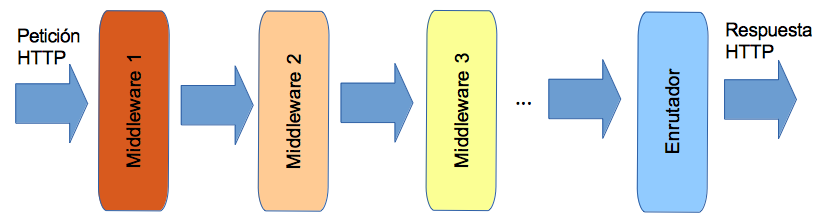
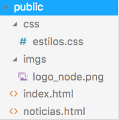
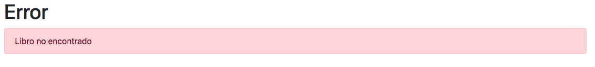
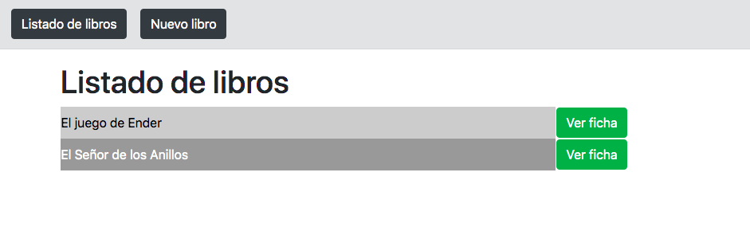
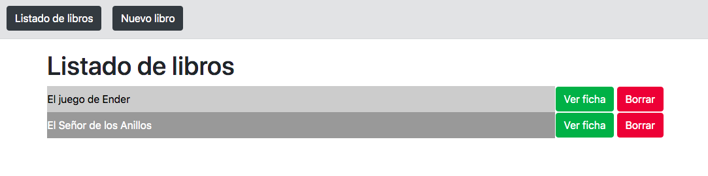

# Tema 3. Opciones avanzadas de Express.js

## 3.1. Desarrollo de aplicaciones completas con Express

En las sesiones anteriores hemos visto cómo estructurar una aplicación express para desarrollar un proveedor de servicios REST. Hemos almacenado los esquemas y modelos de datos en una carpeta `models`, y los enrutadores que dan respuesta a las distintas URLS en una carpeta `routes`, dejando la aplicación principal en la raíz del proyecto.

Esta estructura es la que normalmente se sigue para desarrollar una API REST (recuerda, Express es un framework *unopinionated*, lo que significa que podemos elegir cualquier otra estructura que nos parezca adecuada). Sin embargo, en este puzzle faltan algunas piezas para poder desarrollar aplicaciones web más completas, que permitan servir contenido HTML, más allá de los simples datos JSON. Veremos en esta sesión qué otros elementos intervienen cuando desarrollamos webs más complejas y completas, y cómo estructurarlos en nuestra aplicación Express.

### 3.1.1. Uso del *middleware*

El término *middleware* ha sido mencionado algunas veces con anterioridad, pero aún no habíamos explicado de qué se trata. En el ámbito en que lo estamos tratando, un **middleware** es una función que gestiona peticiones y respuestas HTTP, de forma que puede manipularlas y pasarlas al siguiente *middleware* para que las siga procesando, o bien terminar el proceso y enviar por sí misma una respuesta al cliente.

Existen diferentes *middlewares* disponibles en los módulos de Node, tales como *body-parser*, que ya hemos empleado en ejemplos previos para procesar el cuerpo de peticiones POST y poder acceder a su contenido de forma más cómoda. El *middleware* se aplica sobre una aplicación a través del método `use` de la misma. Por eso, cuando hacíamos:

```js
app.use(bodyParser.json());
```

Estábamos activando el *middleware body-parser* para que, ante cada petición que llegue al servidor, acceda al cuerpo de la petición y, si hay datos en formato JSON, los deje preparados para poder ser accedidos desde los métodos enrutadores que lo requieran.

Además de este y otros ejemplos de *middleware* hecho por terceras partes y que podemos incorporar a nuestros proyectos, también podemos definir nuestra propia función de *middleware*, y mediante el método `use` de la aplicación, incluirla en la cadena de procesamiento de la petición y la respuesta. Por ejemplo, el siguiente middleware saca por consola la dirección IP del cliente que hace la petición:

```js
app.use((req, res, next) => {
    console.log("Petición desde", req.ip);
    next();
});
```

Como vemos, el *middleware* no es más que una función que acepta tres parámetros: la petición, la respuesta, y una referencia al siguiente *middleware* que debe ser llamado (`next`). Cualquier *middleware* puede finalizar la cadena enviando algo en la respuesta al cliente, pero si no lo hace, debe obligatoriamente llamar al siguiente eslabón (`next`).

Podemos emplear diversas llamadas a `use` para cargar distintos *middlewares*, y el orden en que hagamos estas llamadas es importante, porque marcará el orden en que se ejecutarán dichos *middlewares*.

```js
app.use(bodyParser);
app.use(function(...) { ... });
app.use(...);
```

#### 3.1.1.1. Flujo básico de una petición y respuesta

Teniendo en cuenta todo lo visto anteriormente, el flujo elemental de una petición cliente que llega a un servidor Express es el siguiente:

<div align="center">
    
</div>

Existen algunos *middlewares* realmente útiles, como el ya citado *body-parser*, o el servidor de contanido estático, o el enrutador (*router*), que ya hemos utilizado con anterioridad para configurar diferentes rutas de petición disponibles, y la respuesta para cada una de ellas.

#### 3.1.1.2. Añadir middleware a enrutadores concretos

Cuando definimos enrutadores independientes en archivos separados, podemos añadir middleware por separado también a cada enrutador, empleando el método `use` del propio enrutador. Por ejemplo, podemos añadir un middleware en el archivo `routes/contactos.js` que muestre por consola la fecha actual:

```js
let router = express.Router();

router.use((req, res, next) => {
    console.log(new Date().toString());
    next();
});

...
```

> **Ejercicios propuestos:**
> 
> **1.** Haz una copia del proyecto *T2_LibrosExpress* desarrollado con Express y Mongoose en el tema anterior, y llama a la nueva copia **T3_Middleware**. Deberá contener la API REST dividida en distintos archivos y carpetas (modelos, enrutadores, etc.). Vamos a definir dos middlewares propios en esta aplicación:
>
> * Uno lo definiremos únicamente para el enrutador de libros (`routes/libros.js`), de forma que cada vez que accedamos a un servicio de ese enrutador, se mostrará por consola la fecha, método (GET, POST, etc) y URI solicitada. Para obtener estos dos últimos datos, deberás utilizar las propiedades `req.method` y `req.url` del objeto de la petición (`req`). También puedes usar `req.baseUrl` para obtener la URL base, en el caso de que utilices enrutadores con URL base, como en este ejercicio.
> * El otro será global (en `index.js` o `app.js`, dependiendo de cómo hayas llamado al programa principal), y deberá enviar por JSON un mensaje de "En mantenimiento", sin permitir acceder a ningún servicio (es decir, que no llame al método `next`). Siempre que este middleware esté activo, la aplicación no funcionará (sólo enviará "En mantenimiento" para cada solicitud que le llegue). Cuando se desactive/comente, la aplicación funcionará con normalidad.

### 3.1.2. Servir contenido estático

Una de las cosas más elementales que tiene una aplicación web que se dedica a "algo más" que proporcionar servicios REST es contenido estático. Con esto nos referimos a elementos como imágenes, estilos CSS, archivos JavaScript para ejecutar en el lado del cliente, o páginas HTML. 

Veremos que con Express la gestión del contenido estático es muy sencilla, a través del correspondiente *middleware* que incorporaremos a nuestros proyectos que lo requieran. Para ello, haremos una prueba en un proyecto llamado "*PruebaExpressEstatico*" en nuestra carpeta de "*ProyectosNode/Pruebas*".

#### 3.1.2.1. Ubicación del contenido estático

A la hora de ubicar el contenido estático de nuestra aplicación, es habitual dejarlo todo en una única subcarpeta, que típicamente se suele llamar "public". Imaginemos que esta subcarpeta tiene esta estructura:

<div align="center">
    
</div>

La imagen "logo_node.png" puede ser cualquiera que queráis. En este ejemplo usaremos un logo de Node buscado en Internet:

<div align="center">
    
</div>

La hoja de estilos tiene algunos estilos básicos (tipo de letra y color de fondo):

```css
body
{
    background-color:rgb(245, 244, 201);
    font-family: Arial;
}
```

La página `index.html` es muy simple, incorporando la hoja de estilos, la imagen, un encabezado de primer nivel y un enlace a la otra página:

```html
<!doctype html>
<html>
    <head>
        <link href="css/estilos.css" rel="stylesheet">
    </head>
    <body>
        <div align="center">
            
        </div>
        <h1>Bienvenido a Node.js</h1>
        <p><a href="noticias.html">Noticias de node</a></p>
    </body>
</html>
```

La página de "noticias.html" es similar a la anterior, mostrando un enlace a la página principal y un listado de ejemplo:

```html
<!doctype html>
<html>
    <head>
        <link href="css/estilos.css" rel="stylesheet">
    </head>
    <body>
        <div align="center">
            
        </div>
        <h1>Bienvenido a Node.js</h1>
        <p><a href="index.html">Página de inicio</a></p>
        <ul>
            <li>Concurso Javascript para adictos a Node.js</li>
            <li>LinkedIn migra desde Rails hacia Node</li>
            <li>Conferencia Node.js en Italia</li>
        </ul>
    </body>
</html>
```

#### 3.1.2.2. Procesamiento del contenido estático

Si queremos que se sirvan automáticamente estos contenidos al acceder a una URI concreta (que puede ser la propia uri "/public" u otra), empleamos el *middleware* `static`, integrado en Express. Como primer parámetro, le indicamos qué URI queremos utilizar para servir contenido estático (la que nosotros queramos), y en segundo lugar, indicamos en qué carpeta están realmente dichos contenidos (carpeta `/public` en nuestro caso):

```js
const express = require('express');

let app = express();
app.use('/public', express.static(__dirname + '/public'));

app.listen(8080);
```

Opcionalmente, también podemos definir una ruta que redirija a la página de inicio (`index.html`) si se intenta acceder a la raíz de la aplicación:

```js
app.get('/', (req, res) => {
    res.redirect('/public/index.html');
});
```

Esta forma de servir contenido estático, como podemos deducir, se queda muy corta. No hay casi ninguna web que ofrezca un contenido sin cierto dinamismo; el propio listado de noticias podría extraerse de una base de datos y volcarse en la página... pero para eso necesitamos hacer uso de plantillas, que veremos en esta sesión.

#### 3.1.2.3. Incluir estilos predefinidos: Bootstrap

Es posible también incluir los estilos de frameworks de diseño web, como por ejemplo Bootstrap, directamente en nuestra aplicación Express, siguiendo estos sencillos pasos:

1. En primer lugar, descargamos Bootstrap como un módulo más de nuestro proyecto:

```
npm install bootstrap
```

2. Después, aplicamos el *middleware* de contenido estático para que cargue por defecto los contenidos de la carpeta `dist` de instalación de Bootstrap, donde se encuentran, entre otras cosas, los estilos.

```js
app.use(express.static(__dirname + '/node_modules/bootstrap/dist'));
```

En este caso, los contenidos de Bootstrap se cargarán asociados a la ruta raíz del proyecto. Por lo tanto, si queremos incluir estilos Bootstrap en cualquier página HTML o vista de nuestro proyecto, podemos hacerlo así:

```html
<link rel="stylesheet" href="/css/bootstrap.min.css"/>
```

### 3.1.3. Introducción a los motores de plantillas

Una plantilla es un documento estático (típicamente HTML, si hablamos de documentos web), en el que se intercalan o embeben ciertas marcas para agregar algo de dinamismo. Por ejemplo, podemos dejar una estructura HTML hecha con un hueco para mostrar un listado de noticias, y que ese listado de noticias se extraiga de una base de datos y se añada a la plantilla dinámicamente, antes de mostrarla.

#### 3.1.3.1. Motores de plantillas

Existen varios motores de plantillas que podemos emplear en Express, y que facilitan y automatizan el procesamiento de estos ficheros y el reemplazo de las correspondientes marcas por el contenido dinámico a mostrar. Algunos ejemplos son:

* **Jade**, un motor bastante habitual con una sintaxis específica basada en HAML, una abstracción del propio lenguaje HTML. Recientemente, este motor de plantillas ha cambiado a otro llamado Pug. En la propia documentación de Express se indica que se puede seguir utilizando Jade, pero que las actualizaciones más recientes afectarán ya a Pug.
* **Mustache**, un motor que combina HTML con código Javascript embebido con cierta sintaxis especial. A partir de este motor, se han creado otros muy similares, como *HBS*, también conocido como Handlebars.
* **EJS**, siglas de Effective Javascript templating, un motor de plantillas bastante sencillo de utilizar e integrar con contenido HTML.
* etc.

**Instalación del motor de plantillas**

Una vez hayamos elegido nuestro motor de plantillas, lo instalaremos en nuestra aplicación como un módulo más de NPM, y lo enlazaremos con Express a través del método `app.set`, como una propiedad de la aplicación. En estos apuntes, haremos uso del motor **Nunjucks**, un motor de plantillas desarrollado por Mozilla, muy similar a *Handlebars* en su sintaxis, y adaptado a su uso con Express. Podéis consultar más información en su [web oficial](https://mozilla.github.io/nunjucks/).

Lo primero que haremos será descargarlo e instalarlo en nuestro proyecto con su correspondiente comando (desde la carpeta del proyecto Node):

```
npm install nunjucks
```

Lo deberemos incluir en la aplicación principal, junto con el resto de módulos necesarios...

```js
const express = require('express');
const nunjucks = require('nunjucks');
...
```

Después, lo establecemos como motor de plantillas en el archivo principal de nuestra aplicación, una vez inicializada la aplicación Express:

```js
let app = express();
...
app.set('view engine', 'njk');
```

Finalmente, también es necesario establecer unos parámetros de configuración del motor de plantillas, empleando para ello su método `configure`. En concreto, estableceremos que auto-escape los caracteres que se muestren (para evitar ataques por código embebido, por ejemplo), y le indicaremos qué objeto contiene la aplicación Express. Por tanto, esta instrucción deberemos indicarla *después* de inicializar la variable `app`:

```js
nunjucks.configure('views', {
    autoescape: true,
    express: app
});
```

**Ubicación de las plantillas**

Por defecto, en una aplicación Express las plantillas se almacenan en una subcarpeta llamada `views` dentro del proyecto Node. Así lo hemos configurado con la instrucción anterior para Nunjucks. En nuestro caso, hemos establecido que dichas plantillas tendrán extensión `.njk`, como por ejemplo `index.njk`. Es la extensión habitual en plantillas Nunjucks.

#### 3.1.3.2. Primeros pasos con Nunjucks

Vamos a definir algunas plantillas con Nunjucks y comprobar cómo muestran la información dinámica, y cómo se les puede pasar dicha información desde los enrutadores.

**Preparando el servidor principal**

Para ello, nos basaremos en nuestro ejemplo de contactos que hemos venido desarrollando en sesiones previas. Podemos copiar la carpeta del proyecto "PruebaContactosExpress" del tema anterior (la que hicimos con toda la estructura de carpetas para modelos y enrutadores), y renombrarla a "*PruebaContactosExpress_Web*". Dentro, instalamos Nunjucks y lo dejamos configurado en la aplicación principal como motor de plantillas para la aplicación. También podemos instalar y configurar Bootstrap si queremos, para poder aplicar sus estilos. El archivo principal `index.js` quedará más o menos así:

```js
// Librerías
const express = require('express');
const mongoose = require('mongoose');
const bodyParser = require('body-parser');
const nunjucks = require('nunjucks');

// Enrutadores
const mascotas = require(__dirname + '/routes/mascotas');
const restaurantes = require(__dirname + '/routes/restaurantes');
const contactos = require(__dirname + '/routes/contactos');

// Conexión con la BD
mongoose.connect('mongodb://localhost:27017/contactos', 
    {useNewUrlParser: true});

// Servidor Express
let app = express();

// Configuramos motor Nunjucks
nunjucks.configure('views', {
    autoescape: true,
    express: app
});

// Asignación del motor de plantillas
app.set('view engine', 'njk');

// Middleware body-parser para peticiones POST y PUT
// Middleware para estilos Bootstrap
// Enrutadores para cada grupo de rutas
app.use(bodyParser.json());
app.use(express.static(__dirname + '/node_modules/bootstrap/dist'));
app.use('/mascotas', mascotas);
app.use('/restaurantes', restaurantes);
app.use('/contactos', contactos);

// Puesta en marcha del servidor
app.listen(8080);
```

**Vista para listado general**

Vamos ahora a crear la carpeta `views`, y dentro definimos una vista llamada `contactos_listado.njk`. Dentro de esta vista definiremos el código HTML que va a tener, dejando un hueco para mostrar el listado de contactos:

```html
<html>
    <head>
        <link rel="stylesheet" href="/css/bootstrap.min.css"/>
    </head>
    <body>
        <div class="container">
            <h1>Listado de contactos</h1>
            <div>
                <!-- Aquí mostraremos el listado -->
            </div>
        </div>
    </body>
</html>
```

Para poder mostrar el listado de contactos, necesitamos proporcionar dicho listado a la vista. Esto lo haremos desde la ruta de consulta de contactos. En la sesión anterior, habíamos establecido esta ruta en el archivo `routes/contactos.js`, bajo la URI `GET /contactos`. En esa sesión devolvía los contactos en formato JSON, pero ahora vamos a decirle simplemente que muestre (renderice) la vista del listado de contactos. Así nos quedará ahora este enrutador:

```js
router.get('/', (req, res) => {
    res.render('contactos_listado');
});
```

Notar que, para mostrar una vista, basta con que indiquemos el nombre del archivo, sin la extensión. Nunjucks ya se encarga de localizar el archivo, procesar el contenido dinámico que tenga y enviar el resultado.

Sin embargo, nos falta algo en el enrutador anterior. Necesitamos poder facilitarle a la vista el listado de contactos. Para ello, utilizaremos Mongoose para obtener dicho listado, y una vez obtenido, renderizaremos la vista con `render`, pasando como segundo parámetro los datos que necesita la vista para trabajar (el listado de contactos, en este caso).

```js
router.get('/', (req, res) => {
    Contacto.find().then(resultado => {
        res.render('contactos_listado', {contactos: resultado});
    }).catch(error => {
        // Aquí podríamos renderizar una página de error
    });
});
```

Finalmente, en la plantilla, podemos reemplazar el comentario que hemos dejado de "*Aquí mostraremos el listado*" con el listado efectivo, con este código:

<!--  -->
```html
<ul>
    
        <li>{{ contacto.nombre }}</li>
    
</ul>
```
<!--  -->

Hemos empleado la cláusula `for` de Nunjucks para iterar sobre una colección de elementos (la colección `contactos` que recibimos del enrutador). Para cada elemento, mostramos un item de lista, y el nombre de cada contacto en él. Observad la notación de la doble llave `{{ ... }}` para mostrar información de los objetos con los que estamos trabajando (en este caso, cada contacto de la lista que recibimos del enrutador).

**Algunas cuestiones adicionales**

La cláusula `for` que hemos empleado antes dispone de algunas utilidades más. Dentro del elemento `loop`, disponemos de algunas propiedades que podemos consultar en cada iteración, como por ejemplo:

* `index`: que obtiene la posición en la colección del elemento que se está explorando actualmente, comenzando por 1.
* `index0`: similar al anterior, pero comenzando a contar por 0.
* `first`: una propiedad booleana que es cierta cuando estamos en el primer elemento de la colección
* `last`: una propiedad booleana que es cierta cuando estamos en el último elemento de la colección
* `length`: que obtiene el número total de elementos de la colección

Se tiene disponible también una cláusula `if` para comprobar condiciones, y los operadores `and` y `or` para enlazar condiciones. Además, se tiene una clásula `elif` para enlazar con `if` y comprobar otras condiciones, y también una cláusula `else` que sirve tanto para mostrar un último camino en secuencias *if..elif..*, como para mostrar qué hacer en un `for` si no hay elementos.

Por ejemplo, así podríamos mostrar el listado de contactos con estilos distintos para los items pares e impares, y con un mensaje personalizado si no hay elementos que mostrar.

<!--  -->
```html
<ul>
    
        {% if loop.index % 2 == 0 %}
            <li class="par">
        
            <li class="impar">
        
        {{ contacto.nombre }}</li>
    
        <li>No hay contactos que mostrar.</li>
    
</ul>
```
<!--  -->

> **Ejercicios propuestos**:
> 
> **2.** Haz de nuevo una copia del ejercicio *T2_LibrosExpress* del tema anterior, y esta vez renombra la carpeta como **T3_LibrosWeb**. Instala Nunjucks y Bootstrap en el nuevo proyecto, y deja un archivo principal `index.js` similar al del ejemplo de contactos, cargando las librerías, los enrutadores que haya, etc, y configurando Nunjucks como el motor de plantillas de la aplicación.
>
> Vamos a definir dos vistas, asociadas a los dos enrutadores de listado de libros y ficha de libros, que vamos a modificar. Recuerda que deberás crear los archivos de las vistas en la carpeta `views` del proyecto:
>
> * `libros_listado.njk`: recibirá del enrutador GET para `/libros` el listado completo de libros, y mostrará el listado de libros por pantalla. Se deberá mostrar el título del libro, y a su lado, un enlace para ir a la ficha detallada del libro. Esta vista puede quedarte más o menos así. Puedes usar `class="btn btn-success"` en el enlace para mostrarlo con esa apariencia de botón en verde, gracias a Bootstrap:

<div align="center">
    
</div>

> * `libros_ficha.njk`: recibirá del enrutador GET para `/libros/:id` los datos del libro a mostrar. Se mostrarán sus datos con un formato como el que se indica a continuación

<div align="center">
    
</div>

> **NOTA:** recuerda que los antiguos enrutadores que devolvían datos JSON deberán modificarse para renderizar las vistas correspondientes en este ejercicio. El resto de enrutadores que aún no hemos tocado (inserción o borrado de libros, por ejemplo), déjalos como estaban del tema anterior, y ya iremos modificándolos más adelante.
> 
> **3.** Sobre el ejercicio anterior, añade un par de mejoras:
>
> * Crea una hoja de estilos propia, llamada `estilos.css`, en una carpeta `/public/css`, y define en ella estilos distintos para filas pares o impares de un listado. Puede ser simplemente cambiar el color de texto, o de fondo. Aplica estos estilos (junto con los de Bootstrap) al listado de libros. Deberás añadir el *middleware* para cargar contenido estático en la aplicación.
> * Crea una nueva vista llamada `error.njk` en la carpeta de vistas, que recibirá como parámetro un mensaje de error y lo mostrará por pantalla con el formato que se indica a continuación. En caso de no recibir ningún mensaje de error, mostrará el mensaje genérico "Error en la aplicación". 
> * Modifica el enrutador de la ficha de libros (GET `/libros/:id`) para que, en caso de no encontrar el libro buscado, se renderice la vista de error con el mensaje "Libro no encontrado".
>
> Este es el estilo que puedes utilizar para mostrar el mensaje de error en la vista `error.njk`:

```html
<h1>Error</h1>
<div class="alert alert-danger">
    Libro no encontrado
</div>
```

<div align="center">
    
</div>

### 3.1.4. Definición de vistas jerárquicas e inclusiones

A medida que la aplicación crece y necesitamos ir definiendo más y más vistas, podemos deducir que la forma en que lo hemos hecho en los pasos anteriores tiene algunas desventajas importantes. Por ejemplo, y sobre todo, su modularidad. Si, por ejemplo, tenemos 20 vistas definidas como la del listado de contactos anterior y decidimos cambiar el menú de enlaces, tendríamos que editarlo en las 20 vistas. Lo mismo ocurriría si queremos cambiar la información del encabezado o el pie, entre otras cosas, que suele ser común a todas las páginas.

Para evitar este inconveniente, Nunjucks (y muchos otros motores de plantillas) permiten realizar un **diseño jerárquico** de las mismas. Es decir, podemos crear una o varias plantillas base con el contenido general que van a tener un conjunto de vistas, y hacer que estas vistas "hereden" de estas plantillas para definir únicamente aquel contenido que les es propio, incluyendo automáticamente el contenido heredado.

#### 3.1.4.1. Herencia de plantillas

Vamos a hacer un ejemplo con la aplicación de contactos "*PruebaContactosExpress_Web*". Creamos en la carpeta `views` una plantilla llamada `base.njk`, que va a tener el contenido general de cualquier vista de la aplicación: el encabezado (*head*) con los estilos y archivos JavaScript para la parte cliente, el menú de la aplicación, y el pie de página, si lo hay. Cada vista va a cambiar el título de página, y el contenido principal de dicha vista. Para dejar estas dos secciones abiertas y que se puedan modificar en cada vista se definen *bloques*, asociando a cada bloque un nombre. Así, nuestra plantilla `base.njk` puede quedar así:

<!--  -->
```html
<!doctype html>
<html>
    <head>
        <title> </title>
        <link rel="stylesheet" href="/css/bootstrap.min.css"/>
    </head>
    <body>
        <div class="container">
            

            
        </div>
    </body>
</html>
```
<!--  -->

Como podemos ver, con la estructura `block` definimos bloques de contenidos, asociados a un nombre, de forma que todo lo que queda fuera de esos bloques es fijo para todas las vistas que hereden de la plantilla.

Ahora, nuestra página de `contactos_listado.njk` sólo debe limitarse a heredar de esta plantilla, y definir el contenido de los dos bloques. Puede quedar así:

<!--  -->
```html


Contactos | Listado



    <h1>Listado de contactos</h1>

    <ul>
        
            <li>{{ contacto.nombre }}</li>
        
    </ul>


```
<!--  -->

Del mismo modo, podríamos definir otras vistas, como por ejemplo la ficha de un contacto (`contacto_ficha.njk`):

<!--  -->
```html


Contactos | Ficha



    <h1>Ficha de un contacto</h1>

    <p><strong>Nombre:</strong> {{ contacto.nombre }}</p>
    <p><strong>Edad:</strong> {{ contacto.edad }}</p>
    <p><strong>Teléfono:</strong> {{ contacto.telefono }}</p>


```
<!--  -->

#### 3.1.4.2. Inclusión de plantillas

Otra funcionalidad realmente útil que proporcionan muchos motores de plantillas es la posibilidad de incluir el contenido de una plantilla directamente en otra, como si pudiéramos hacer un "copia-pega" directamente de una en otra. Esto evita tener que duplicar el código HTML en las plantillas y, nuevamente, facilitar la posibilidad de posteriores cambios.

Para incluir una vista o plantilla dentro de otra, emplearemos la instrucción `include`. Por ejemplo, si queremos incluir una vista con el menú de navegación de la web, podemos hacer esto, justo en el lugar donde queremos ubicar el menú:

<!--  -->
```html

```
<!--  -->

> **Ejercicios propuestos**:
> 
> **4.** Sobre el ejercicio **T3_LibrosWeb** creado en ejercicios anteriores, vamos a hacer lo siguiente:
>
> * Crea una plantilla llamada `base.njk` que incorpore los elementos comunes a las vistas que has realizado: encabezado *head* con la inclusión de estilos, pie de página, etc. Deja dos bloques (*block*) editables llamados "titulo" y "contenido", como en el ejemplo de contactos.
> * Haz que las vistas `libros_listado.njk` y `libros_ficha.njk` hereden de esa base, y rellenen los bloques de "titulo" y "contenido" con sus propios datos.
> * Define una nueva vista llamada `menu.njk` que muestre un menú de navegación con dos enlaces: uno para ir al listado de libros (URL `/libros`), y otro para ir al formulario de inserción de libros que implementaremos más adelante (URL `/libros/nuevo`). Incluye con `include` esta vista en la plantilla base, justo antes del bloque de "contenido".
>
> Esta es la apariencia que puede tener más o menos la vista de listado ahora:

<div align="center">
    
</div>

> El estilo de la barra de menú superior puede ser el que quieras, no tiene que ser necesariamente como en la imagen. También el estilo de los items del listado puede variar según tus propios gustos.

### 3.1.5. Formularios y operaciones

Vamos a añadir distintos tipos de formularios a la aplicación para insertar, borrar y modificar elementos de colecciones.

#### 3.1.5.1. Formularios de inserción

Comenzaremos por el formulario para insertar contactos en nuestra aplicación de contactos, y las correspondientes rutas para, por un lado, mostrar este formulario, y por otro, recoger la petición y hacer la inserción propiamente dicha.

**La vista del formulario de inserción**

En primer lugar, crearemos una vista llamada `contactos_nuevo.njk` en nuestra carpeta de `views`. Esta vista, como las anteriores, heredará de `base.njk` y definirá el formulario en su bloque de contenido:

<!--  -->
```html


Contactos | Nuevo



    <h1>Inserción de nuevo contactos</h1>

    <form action="/contactos" method="post">
        <div class="form-group">
            <label for="nombre">Nombre:</label>
            <input type="text" class="form-control" name="nombre" 
                placeholder="Nombre del contacto..." />
        </div>
        <div class="form-group">
            <label for="edad">Edad:</label>
            <input type="number" class="form-control" name="Edad"
                placeholder="Edad del contacto..." />
        </div>
        <div class="form-group">
            <label for="telefono">Teléfono:</label>
            <input type="text" class="form-control" name="telefono"
                placeholder="Teléfono del contacto..." />
        </div>
        <button type="submit" class="btn btn-primary">
            Enviar
        </button>
    </form>


```
<!--  -->

Para mostrar esta vista, habrá un enlace "Nuevo contacto" en el menú de navegación de la aplicación (vista `menu.njk`), que enviará a la ruta `/nuevo_contacto`:

```html

<div class="alert alert-secondary">
    <a href="/contactos">Listado de contactos</a>
    &nbsp;&nbsp;
    <a href="/contactos/nuevo">Nuevo contacto</a>
</div>
```

**La ruta para mostrar el formulario**

En segundo lugar, vamos a definir una ruta en el enrutador de contactos (`routes/contactos.js`) que, atendiendo una petición GET normal a la ruta `/contactos/nuevo`, renderizará la vista anterior:

```js
router.get('/contactos/nuevo', (req, res) => {
    res.render('nuevo_contacto');
})
```

> **NOTA**: esta nueva ruta deberemos ubicarla ANTES de la ruta de ficha del contacto, ya que, de lo contrario, el patrón de esta ruta coincide con `/contactos/loquesea`, que es lo que espera `/contactos/:id`, y en ese caso intentará mostrar la ficha del contacto. Como alternativa, podemos renombrarla a `/contactos/nuevo/contacto` para que no tenga el mismo patrón.

***La ruta para realizar la inserción***

Finalmente, el formulario se enviará por POST a la ruta `/contactos`. Nos falta definir (o redefinir, porque ya la teníamos de ejemplos previos) esta ruta para que recoja los datos de la petición, haga la inserción y, por ejemplo, renderice el listado de contactos como resultado final, para poder comprobar que el nuevo contacto se ha añadido satisfactoriamente. En caso de error al insertar, podemos renderizar una vista de error, como la que dejamos en un ejercicio anterior.

Hay que tener en cuenta, no obstante, que los datos del formulario no los vamos a enviar en formato JSON esta vez. Para ello tendríamos que utilizar algún mecanismo en el cliente que, mediante JavaScript, construyera la petición con los datos añadidos en formato JSON antes de enviar el formulario, pero no lo vamos a hacer. En su lugar, vamos a utilizar el *middleware body-parser* para que procese la petición también cuando los datos lleguen desde un formulario normal. Para ello, además de habilitar el procesado JSON, habilitamos el procesado `urlencoded`, de esta forma (en el archivo `index.js`, justo después o antes de habilitar el procesado JSON):

```js
app.use(bodyParser.json());
app.use(bodyParser.urlencoded());
...
```

Ahora ya podemos añadir nuestra ruta POST para insertar contactos, en el archivo `routes/contactos.js`:

```js
router.post('/', (req, res) => {
    let nuevoContacto = new Contacto({
        nombre: req.body.nombre,
        telefono: req.body.telefono,
        edad: req.body.edad
    });
    nuevoContacto.save().then(resultado => {
        res.redirect(req.baseUrl);
    }).catch(error => {
        res.render('error', 
            {error: "Error añadiendo contacto"});
    });
});
```

Lo que hacemos es similar al caso de los servicios REST: recogemos los datos del contacto de la petición, creamos uno nuevo, insertamos en la base de datos y, si todo ha ido bien (y aquí está la diferencia con el servicio REST), renderizamos la vista del listado de contactos (en realidad, redirigimos a la ruta que la muestra, para que cargue los datos del listado). Si ha habido algún error, renderizamos la vista de error con el error indicado.

> **Ejercicios propuestos**:
> 
> **5.** Sobre el ejercicio anterior, vamos a añadir la operación de inserción de nuevos libros. Para ello, seguiremos estos pasos:
> 
> * Define una vista llamada `libros_nuevo.njk` en la carpeta `views`, con un formulario que permita rellenar los datos de un nuevo libro. Puedes basarte en la vista hecha para insertar nuevos contactos, y modificar los campos del formulario para que sean los del libro. Haz que el formulario se envíe por POST a `/libros`.
> * Define una ruta en `routes/libros.js` que responda a `/libros/nuevo` por GET, y renderice la vista `libros_nuevo` creada en el paso anterior.
> * Define otra ruta en `routes/libros.js` que, con POST, responda a la URL `/libros`, recogiendo los datos del libro de la petición (recuerda configurar *bodyParser* como `urlencoded`), dé de alta el nuevo libro y redirija al listado de libros, o a la página de error, según sea el caso.

#### 3.1.5.2. Borrados y modificaciones

Vamos ahora con el borrado. En este caso, añadiremos un formulario con un botón de "Borrar" en el listado de contactos, asociado a cada contacto. Dicho botón se enviará a la URL `/contactos`, pero como los formularios no aceptan un método DELETE, tenemos que añadir algún mecanismo para que el formulario llegue a la ruta correcta en el servidor.

**Redefinir el método DELETE**

Igual que en el caso anterior, podríamos recurrir a utilizar JavaScript en el cliente para simular una petición AJAX que encapsule los datos necesarios y convierta la petición en DELETE, pero para evitar cargar librerías adicionales en la parte cliente, vamos a instalar un módulo llamado *method-override*, de NPM, que permite emparejar formularios del cliente con métodos del servidor de forma sencilla. Lo añadimos a nuestro proyecto como cualquier otro:

```
npm install method-override
```

Y vamos a configurarlo para que, si le llega en el formulario un campo (normalmente oculto) llamado `_method`, que utilice ese método en lugar del propio del formulario. Así, podemos emplear ese campo oculto para indicar que en realidad queremos hacer un DELETE (o un PUT, si fuera el caso), y que omita el atributo `method` del formulario. Lo primero que haremos será incluir el módulo en el servidor principal `index.js`, junto con el resto de módulos:

```js
const methodOverride = require('method-override');
```

Después, añadimos estas líneas más abajo, justo cuando se añade el resto de middleware, como *body-parser* y demás:

```js
app.use(methodOverride(function (req, res) {
    if (req.body && typeof req.body === 'object' 
        && '_method' in req.body) {
      let method = req.body._method;
      delete req.body._method;
      return method;
    } 
}));
```

**El formulario de borrado**

Ahora, en la vista de `contactos_listado.njk`, definimos un pequeño formulario junto a cada contacto, con un botón para borrarlo a partir de su *id*. En dicho formulario, incluimos un campo *hidden* (oculto) cuyo nombre sea `_method`, donde indicaremos que la operación que queremos realizar en el servidor es DELETE:

```html
<ul>
    
        <li>{{ contacto.nombre }} 
            <a href="/contactos/{{ contacto.id }}">Ficha</a>
            <form action="/contactos/{{ contacto.id }}" method="post">
                <input type="hidden" name="_method" value="delete" />
                <button type="submit" class="btn btn-danger">
                    Borrar
                </button>
            </form>
        </li>
    
</ul>
```

**La ruta de borrado**

Finalmente, (re)definimos la ruta para el borrado. Lo que hacemos es eliminar el contacto cuyo ID nos llega en la URL, y redirigir al listado de contactos si todo ha ido bien, o mostrar la vista de error si no.

```js
router.delete('/:id', (req, res) => {
    Contacto.findByIdAndRemove(req.params.id).then(resultado => {
        res.redirect(req.baseUrl);
    }).catch(error => {
        res.render('error', {error: "Error borrando contacto"});
    });
});
```

> **Ejercicios propuestos**:
> 
> **6.** Seguimos con la base del ejercicio anterior, y vamos ahora a añadir la opción del borrado de libros. 
>
> * Comenzaremos por instalar la librería `method-override` como hemos hecho en el ejemplo de los contactos, y la incorporamos al archivo principal `index.js`
> * Después, añadimos el mismo *middleware* que en el caso de los contactos para que busque un campo `_method` en el cuerpo de la petición, y lo use en lugar del *method* que pueda tener el formulario. Simplemente, copia y pega esa función del ejemplo de los contactos en el archivo principal de esta aplicación de libros, en el lugar indicado.
> * A continuación, deberemos editar la vista de `libros_listado.njk` y añadir un formulario de borrado junto a cada libro, para que se envíe por DELETE a la ruta `/libros`, como en el ejemplo de los contactos. 
> * Finalmente, definimos la ruta en `routes/libros.js` para responder a esta llamada, eliminar el libro y redirigir al listado de libros, o a la vista de error, según el resultado de la operación.
>
> Aquí tenéis una captura de pantalla de cómo podría quedar la vista del listado de libros, con el nuevo formulario para borrar cada libro:

<div align="center">
    
</div>

> **7.** Finalmente, vamos a implementar la edición de libros. Debería hacer lo siguiente:
>
> * Añadiremos un enlace/botón en el listado de libros que muestre el formulario del libro, con los campos ya rellenos.
> * Dicho formulario debería enviarse por PUT a la ruta de modificación de libros
> * En dicha ruta, se modificarán los datos del libro que se reciba, y se redirigirá al listado de libros, o a la vista de error.

#### 3.1.5.3. Subida de archivos

Para subir archivos en un formulario, necesitamos que el tipo de dicho formulario sea `multipart/form-data`. Dentro, habrá uno o varios campos de tipo `file` con los archivos que el usuario elegirá para subir:

```html
<form action="..." method="post" enctype="multipart/form-data">
...
    <input type="file" class="form-control" name="imagen"/>
</form>
```

Para poder procesar este tipo de formularios, necesitaremos alguna librería adicional. El *middleware body-parser* lo hacía con versiones anteriores de Express, pero su uso ahora es más limitado. Vamos a utilizar otra librería adicional llamada `multer`, que instalaremos en nuestro proyecto junto al resto (incluyendo *body-parser*, si tenemos formularios que no sean de este tipo):

```
npm install multer
```

Ahora, en los ficheros donde vayamos a necesitar la subida de archivos, necesitamos incluir esta librería, y configurar los parámetros de subida y almacenamiento:

```js
const multer = require('multer');

...

let storage = multer.diskStorage({
    destination: function (req, file, cb) {
      cb(null, 'public/uploads')
    },
    filename: function (req, file, cb) {
      cb(null, Date.now() + "_" + file.originalname)
    }
  })

let upload = multer({storage: storage});
```

El elemento `storage` define, en primer lugar, cuál va a ser la carpeta donde se suban los archivos (en nuestro ejemplo será `public/uploads`), y después, qué nombre asignaremos a los archivos cuando los subamos. El atributo `originalname` del objeto `file` que se recibe contiene el nombre original del archivo en el cliente, pero para evitar sobreescrituras, le vamos a concatenar como prefijo la fecha o *timestamp* actual con `Date.now()`.

Finalmente, nos queda utilizar el middleware `upload` que hemos configurado antes en los métodos o servicios que lo necesiten. Si, por ejemplo, en un servicio POST esperamos recibir un archivo un campo `file` llamado `imagen`, podemos hacer que automáticamente se suba a la carpeta especificada antes, con el nombre asignado en la configuración, simplemente aplicando este *middleware* en el servicio:

```js
router.post('/', upload.single('imagen'), (req, res) => {
    // Aquí ya estará el archivo subido
    // Con req.file.filename obtenemos el nombre actual
    // Con req.body.XXX obtenemos el resto de campos
});
```

> **Ejercicios propuestos**:
> 
> **8.** Añade a la aplicación de libros lo siguiente:
> 
> * Modifica el esquema de libros para añadir un campo nuevo llamado `portada`, de tipo `String`, no obligatorio.
> * Añade un campo de tipo `file` al formulario para subir portadas de libros. Recuerda añadir también el campo `enctype` en el formulario para que acepte la subida de archivos.
> * Modifica la ruta POST de libros para que utilice el *middleware multer* y suba las portadas a la carpeta `public/portadas`, con el prefijo de la fecha actual. Recuerda almacenar también el nombre del archivo como un campo más del documento a guardar.
> * En la ficha de los libros, muestra también la portada de los mismos.
