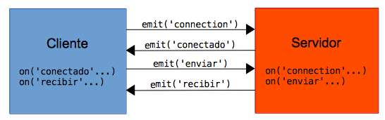
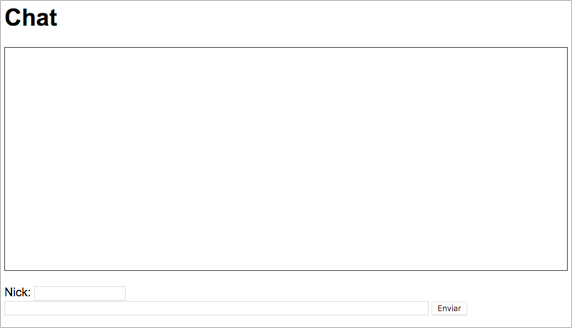
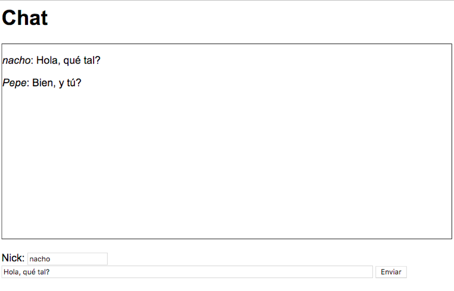

# Tema 3. Opciones avanzadas de Express.js

## 3.3. Comunicación en tiempo real con socket.io

*Socket.io* es una librería empleada para comunicaciones y gestión de eventos en tiempo real entre cliente y servidor. Esta librería se emplea en ambos lados de la comunicación (cliente y servidor) para crear un canal de comunicación entre ambos denominado *socket* (o más concretamente, *web socket*). 

La principal utilidad de esta librería consiste en poder emitir y detectar eventos desde los dos lados de la comunicación, y poder enviar datos de un lado a otro en cualquier momento. Así, un evento emitido por el cliente, por ejemplo, puede recibirse y tratarse en el servidor, y viceversa.

<div align="center">
    
</div>

De este modo, se rompe el tradicional esquema de comunicación HTTP, donde es el cliente quien tiene que solicitar un recurso al servidor para que éste le responda. Con *socket.io*, una vez establecida la conexión cliente-servidor, el servidor puede tener la iniciativa de enviar al cliente datos en cualquier momento, sin que éste los haya solicitado.

A lo largo de esta sección, vamos a desarrollar un pequeño chat utilizando *socket.io*. Debemos comenzar por descargar los "Recursos para el Ejercicio de *socket.io*" del aula virtual. Es un archivo ZIP que, al descomprimirlo, crea una carpeta llamada "*ChatSocketIO*", que deberás copiar en tu espacio de trabajo "*ProyectosNode/Ejercicios*". Sobre esta base de proyecto añadiremos los cambios necesarios para construir el chat.

### 3.3.1. Descarga e instalación

*Socket.io* es un módulo que puede utilizarse por sí mismo en una aplicación Node, o integrado en Express, dependiendo de lo que queramos hacer. En cualquiera de los dos casos, es necesario descargar con `npm install` el correspondiente módulo (*socket.io*), y hacer el correspondiente `npm init` previo para preparar el archivo `package.json`, si no se ha hecho ya previamente.

```
npm install socket.io
```

En nuestro caso, para el proyecto "*ChatSocketIO*" que deberías haber descargado siguiendo los pasos previos, ya tenemos configurado el archivo `package.json` con todo lo necesario, por lo que sólo habrá que ejecutar un comando `npm install` para instalar las dependencias de módulos (*Express* y *socket.io*, además del motor de plantillas Nunjucks, en nuestro caso).

#### 3.3.1.1. Uso en cliente y servidor**

Como hemos comentado, *socket.io* es una librería que se emplea tanto en cliente como en servidor para comunicar ambas partes. Del lado del servidor no hay problema, ya que se empleará la librería desde la carpeta correspondiente en `node_modules`, pero también será necesario instalarlo dentro del contenido estático de la parte del cliente. Para ello, podemos descargar la librería suelta de Internet (archivo `socket.io.js`), o podemos localizar este mismo archivo dentro de *node_modules/socket.io-client/dist* y copiarlo y pegarlo en nuestra carpeta de contenido estático. Este paso ya lo tienes dado en el proyecto que te has descargado (verás el archivo `socket.io.js` en la carpeta "*public/js*").

#### 3.3.1.2. Estructura del proyecto de prueba

En el proyecto descargado para este apartado veréis los siguientes contenidos:

* Carpeta "*public*", con todo el contenido estático que necesitaremos:
   * Archivo `css/estilos.css` con unos estilos básicos para que la web quede algo más "vistosa"
   * Archivo `js/socket.io.js` con la librería cliente para *socket.io*, ya preparada
   * Archivo `js/chat.js` donde colocaremos el código para conectar con el servidor desde el cliente y enviar y recibir información mediante *socket.io*. Inicialmente, este archivo está vacío.
 * Carpeta "views" con una única vista, `index.njk`, ya rellena para mostrar el formulario de chat. No será necesario tocar nada en esta vista para este proyecto.
* Archivo principal `app.js`, también vacío, donde añadiremos el código para poner en marcha el servidor, conectar con el cliente e intercambiarse información.

### 3.3.2. Enlazar cliente y servidor

Ahora que ya tenemos el proyecto preparado, vamos a escribir las primeras líneas de código para enlazar cliente y servidor

#### 3.3.2.1. Conectar desde el lado del cliente

En primer lugar (aunque no tiene por qué ser así), vamos a editar el archivo del cliente (ubicado en `public/js/chat.js`). Las siguientes líneas permiten crear una instancia de *socket.io* y conectar con el servidor en la URL especificada, que será *localhost* en nuestro ejemplo, pero podría ser una dirección remota:

```js
var socket = io('http://localhost:8080');
alert("Conectado");
```

Obviamente, la segunda línea de código no es necesaria, pero nos servirá para mostrar un mensaje en pantalla cuando se establezca la conexión.

#### 3.3.2.2. Conectar desde el lado del servidor

Vayamos ahora al lado del servidor (archivo `app.js` de la carpeta principal del proyecto), y añadamos estas líneas para establecer una conexión con el cliente. Veamos las líneas paso a paso:

1. Las primeras líneas incluyen las librerías necesarias (*http*, *express* y *socket.io*, además del motor de plantillas *nunjucks*):

```js
const express = require('express');
const http = require('http');
const socketio = require('socket.io');
const nunjucks = require('nunjucks');
```

2. Las siguientes líneas inicializan la aplicación Express y conectan *socket.io* con el servidor Express.

```js
let app = express();
let server = http.createServer(app);
let io = socketio(server);
```

> Notar que empleamos el módulo *http* como intermediario entre *socket.io* y Express, para poder comunicar una cosa con otra. Este módulo es propio del núcleo de Node, por lo que no es necesario instalarlo con `npm install`.

3. Después, inicializamos el middleware necesario: motor de plantillas para cargar el formulario de chat, y procesamiento de contenido estático:

```js
nunjucks.configure('views', {
    autoescape: true,
    express: app
});

app.set('view engine', 'njk');
app.use(express.static('./public'));
```

4. Después, definimos una ruta básica para mostrar la página principal (el formulario de chat):

```js
app.get('/', (req, res) => {
    res.render('index');
});
```

5. Ponemos a escuchar el servidor...

```js
server.listen(8080);
```

6. ... y, finalmente, definimos un evento llamado "*connection*" (predefinido en *socket.io*) para que, cuando le llegue una conexión de un cliente, haga "algo" (en este caso, de momento, nos limitaremos a mostrar por consola que se ha conectado un cliente).

```js
io.on('connection', (socket) => {
    console.log("Cliente conectado");
});
```

Dentro de este último código (del evento que hemos definido) será donde procesemos todo lo que nos llegue del cliente en cuestión, a través del socket de comunicación que se ha creado entre ambas partes.

En este punto, podemos poner en marcha el servidor Express y acceder a la URL:

```
http://localhost:8080
```

Veremos el mensaje `alert` confirmando la conexión en el cliente, y después el formulario de chat (aunque de momento no hay botón para enviar textos).

### 3.3.3. Definición, emisión y captura de eventos

Ahora que ya hemos conectado cliente y servidor, veamos el mecanismo para emitir y capturar eventos entre cliente y servidor:

* Para **capturar** eventos, utilizaremos el método `on`, pasándole como parámetros el nombre del evento en cuestión, y una función *callback* de respuesta. Es lo que hemos hecho ya en la aplicación servidor, para detectar la conexión del cliente a través del evento "*connection*":
* Para **emitir** eventos y que se puedan capturar a continuación, se utiliza el método `emit`, pasándole como parámetro el evento a emitir.

#### 3.3.3.1. Primera prueba: confirmación de la conexión

Para ver mejor cómo funciona esta secuencia de emisión y captura de eventos, vamos a aprovechar el evento `on("connection")` que ya tenemos definido en el servidor `app.js`. Dentro del código del callback, en lugar de sacar por consola un mensaje, vamos a emitir un evento (que llamaremos, por ejemplo, "conectado"), para que lo pueda capturar el cliente:

```js
io.on('connection', (socket) => {
    socket.emit('conectado');
});
```

Después, en el código del cliente (`public/js/chat.js`), definimos un método `on` para capturar el evento "conectado", y trasladamos la instrucción `alert` dentro del callback de este evento, para que se muestre al confirmar la conexión. De paso, aprovechamos este evento para haver visible la parte del formulario que estaba oculta, para enviar mensajes:

```js
var socket = io('http://localhost:8080');

socket.on('conectado', function() {
    alert("Conectado");
    document.getElementById('formulario').style.display = "";
});
```

Si ejecutamos ahora el servidor y accedemos a la URL principal, veremos el mensaje de confirmación y el formulario de chat, ya completo:

<div align="center">
    
</div>

#### 3.3.3.2. Eventos para el chat

Vamos a definir ahora los eventos y respuestas restantes para que el chat pueda funcionar:

Comenzaremos por emitir un evento en el cliente que se active cada vez que pulsemos el botón de enviar del formulario de chat. Si te fijas en el código de la plantilla `index.njk` en la carpeta de vistas, verás que al pulsar el botón de Enviar se llama a una función Javascript llamada `enviar`, que aún no hemos implementado. La implementamos en el código del cliente (`chat.js`):

```js
function enviar() {
    var nick = document.getElementById('nick').value;
    var texto = document.getElementById('texto').value;
    if (texto != "" && nick != "")
        socket.emit('enviar', {nick: nick, texto: texto});
}
```

Observad que, junto al evento "enviar", se envía un objeto Javascript con el nick del usuario que envía el mensaje, y el mensaje en sí. Este objeto se recogerá en el servidor con ese formato.

En el servidor, recogemos este evento "enviar" con el correspondiente `on` (dentro del código del evento "connected"), y lo que haremos será emitir un nuevo evento, que hemos llamado "difundir", para que lo reciban los clientes:

```js
io.on('connection', (socket) => {
    socket.emit('conectado');
    socket.on('enviar', (datos) => {
        io.emit('difundir', datos);
    });
});
```

Sobre este paso, hay algunas consideraciones a tener en cuenta:
Los datos que se recogen y envían es el objeto Javascript que se emitió al enviar el mensaje, con el nick y el mensaje a enviar. Observa que, si desde el servidor queremos emitir un evento sólo al cliente cuyo socket estamos tratando, usamos `socket.emit`, mientras que si queremos difundir el evento a TODOS los clientes conectados, emplearemos `io.emit`.

Finalmente, en el cliente "chat.js" recogemos el evento "difundir" emitido por el servidor, y mostramos en el área de chat el mensaje que nos llega:

```js
socket.on('difundir', function (datos) {
    var chat = document.getElementById('chat');
    chat.innerHTML += '<p><em>' + datos.nick + '</em>: ' + 
        datos.texto + '</p>';
});
```

Ahora ya tenemos el chat operativo. Podemos poner en marcha el servidor, y abrir un par de navegadores (o de pestañas en el mismo navegador), cada una con un nick diferente, y probar a enviar mensajes entre ellas:

<div align="center">
    
</div>

### 3.3.4. Otras opciones de socket.io

Lo visto hasta ahora nos sirve como ejemplo básico de las posibilidades que ofrece la librería. Veamos a continuación brevemente algunas de las opciones adicionales que existen.

#### 3.3.4.1. El evento de desconexión

Existe un evento, también predefinido en *socket.io*, llamado "disconnect", que podemos emplear tanto en el cliente como en el servidor para dar respuesta al hecho de que una de las dos partes se desconecte (por ejemplo, que caiga el servidor).

```js
socket.on('disconnect', () => { ... });
```

#### 3.3.4.2. Reenviar mensajes a todos menos al emisor original

Hemos visto dos mecanismos de envío de eventos en socket.io:

* `socket.emit` para emitir un evento únicamente al receptor al otro lado del socket
* `io.emit`, utilizado desde el servidor, para difundir un evento a todos los clientes conectados.

Existe una tercera alternativa, que consiste en utilizar `socket.broadcast.emit`, para emitir el evento a todos los clientes conectados, salvo al que está al otro lado del socket actual. 

#### 3.3.4.3. Agrupar comunicaciones por grupos o salas

En el caso de que queramos separar las conversaciones dentro de una misma URL o aplicación por grupos o salas, de forma que un cliente sólo puede comunicarse y ver las comunicaciones del grupo al que pertenece, debemos asociar al cliente que se conecta a un grupo, mediante el método join:

```js
io.on('connection', (socket) => {
    ...
    socket.join('nombre_grupo');
    ... 
```

Puede ser el propio cliente el que elija el grupo al que conectarse mediante un formulario, o el servidor quien le asigne un grupo, aleatoria o intencionadamente. También podemos salir de un grupo con el método leave:

```js
socket.leave('nombre_grupo');
```

Finalmente, a la hora de enviar mensajes únicamente a los miembros de ese grupo, tenemos disponible el método to, para intercalar antes de la llamada a emit:

```js
io.to('nombre_grupo').emit(...);
```

#### 3.3.4.4. Otros usos de socket.io

Se nos quedan varias cosas en el tintero en esta introducción a *socket.io*, como podréis imaginar. En general, podemos emplear esta librería para cualquier tipo de aplicación en tiempo real, como por ejemplo:

* Gestión de e-mails, donde el servidor notifica a los clientes tan pronto como un e-mail nuevo llega, y los clientes pueden enviar e-mails al servidor para que notifique a los destinatarios.
* Videojuegos donde los clientes envíen situación actualizada al servidor, y éste la notifique o difunda al resto de jugadores.
* ... etc.

