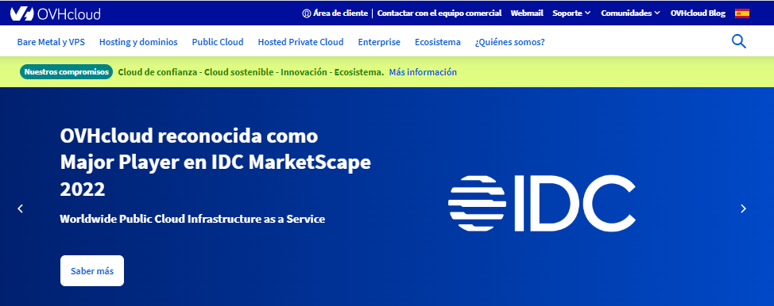

# Tema 4. Despliegue de aplicaciones

## 4.1. Despliegue de aplicaciones en servidores remotos

Una vez visto cómo funciona un servidor web local y cómo se construye una web sobre él, ya sea PHP sobre Apache, ASP.NET sobre IIS, JSP sobre Tomcat, Node o cualquier otro, conviene también saber los pasos a seguir para poner en marcha dicho servidor y dicha(s) web(s) en un entorno real, en lo que se conoce como el *paso a producción*.

Este paso requiere de algunos elementos previos que debemos tener preparados:
En primer lugar, debemos contar con alguna ubicación pública (accesible desde cualquier lugar) donde instalar el servidor y la(s) web(s). Dependiendo de las características del proyecto en sí, y de las posibilidades económicas de la empresa, existen varias opciones, que veremos a continuación.

En segundo lugar, debemos disponer de algún mecanismo para enviar y descargar información de esa ubicación, como por ejemplo una conexión SSH y/o una conexión FTP. De esta forma, podremos, entre otras cosas, subir el contenido de la web al alojamiento, o los cambios que vayamos realizando en un futuro, y por SSH instalar el software que necesitemos (servidores web, SGBD, FTP, etc.)

### 4.1.1. Tipos de alojamientos web y características

A la hora de elegir el alojamiento de nuestros proyectos web, existen diferentes opciones, unas más costosas y otras más asequibles. En general, salvo para empresas fuertes que dispongan de la infraestructura adecuada, se suele acudir a empresas especializadas en alojamiento web para ubicar estos proyectos. Ellas se encargan así del mantenimiento del servidor, medidas de seguridad, y otros elementos tales como la disponibilidad, que se garantiza mediante un acuerdo del nivel de servicio (SLA). Veamos algunos ejemplos típicos.

#### 4.1.1.1. Alojamiento en servidor dedicado

Cuando el proyecto es de envergadura, y la compañía tiene suficiente solvencia económica, se puede optar por contratar un servidor dedicado, es decir, un equipo hardware exclusivo para uso de la empresa en cuestión. Como decimos, en algunos casos este servidor está en las propias instalaciones de la empresa, con su IP propia, y es la empresa quien se encarga de mantenerlo, reiniciarlo y configurar la seguridad en su acceso. En otras ocasiones, se delega esta tarea en una empresa especializada en alojamientos web, con el correspondiente SLA acordado.

Como ejemplos de empresas de alojamiento que ofrecen estos servidores dedicados podemos nombrar, entre otras, a *Acens*, *OVH*, o *IONOS 1and1*. El precio típico de estos servidores suele partir de los 90 o 100 euros al mes, si bien en algunos casos podemos encontrar alguna oferta a partir de unos 50 o 60 euros al mes.

#### 4.1.1.2. Alojamiento o *hosting* básico

En el otro extremo, podemos encontrarnos con proyectos que requieran de pocos recursos. Hablamos de proyectos con pocas bases de datos, poca necesidad de espacio para almacenamiento, y pocos requisitos de ancho de banda o conexiones simultáneas. En estos casos, algunas empresas de alojamiento también ofrecen la posibilidad de utilizar un espacio pequeño en un servidor, que nos limita mucho ciertas cosas, tales como el ancho de banda, número de bases de datos disponibles, espacio en disco... Incluso nos limita el lenguaje o lenguajes a utilizar, siendo PHP el más habitual.

También encontramos numerosas empresas que ofrecen este tipo de alojamiento, como *IONOS 1and1*, *Servage*, *Hostalia*... Dependiendo de las características que ofrezcan (número de bases de datos, ancho de banda, almacenamiento, etc), los precios pueden rondar entre 3 y los 7 u 8 euros al mes, para este tipo de servicio.

#### 4.1.1.3. Una solución intermedia: el VPS

Como situación intermedia entre las dos anteriores, está la opción de contratar un servidor privado virtual (*VPS, Virtual Private Server*). Consiste en simular que se dispone de un servidor dedicado, pero internamente de lo que se dispone es de una parte de un equipo, con su propio disco duro, memoria RAM dedicada, procesadores, etc. De esta forma, podemos instalar cualquier tipo de software que necesitemos (teniendo únicamente en cuenta los requisitos de número de procesadores, RAM y espacio disponible), pero el coste es mucho menor que el de un servidor dedicado, al compartirlo con otras webs que utilizan un VPS sobre el mismo equipo.

Muchas de las empresas que podríamos citar en los dos casos anteriores ofrecen este tipo de servicio, como por ejemplo *OVH*, *Hostalia* o *IONOS 1and1*. El precio suele rondar los 10 euros al mes, aunque en algunos casos se ofrecen precios más competitivos para ciertos tipos básicos de VPS.

Por su versatilidad, en este tema nos vamos a basar en esta última opción. Como empresa de alojamiento, explicaremos cómo registrarnos y utilizar un VPS con OVH, auque los pasos a seguir con cualquier otra empresa de hosting serán más o menos similares.

### 4.1.2. Contratación de un VPS con OVH

Como hemos comentado antes, explicaremos los pasos a seguir para contratar un VPS básico con la empresa OVH, por ejemplo, y veremos qué características ofrece dicho VPS. Para empezar, debemos acceder a la [web](https://www.ovh.es/) de la empresa. 

<div align="center">
    
</div>

Como vamos a contratar un producto, deberemos registrarnos desde el *Área de cliente* en la parte superior, eligiendo después la opción de *Crear una cuenta*. Si ya somos clientes, podemos loguearnos desde esta misma sección de *Área de cliente*.

<div align="center">
    
</div>

Para elegir el VPS a contratar, vamos a la sección *Bare Metal y VPS* > *VPS - Servidores Privados Virtuales* de la página principal (antes de loguearnos)...

<div align="center">
    
</div>

... o bien vamos a la opción *Contratar > Servidores Privados Virtuales* desde nuestra área de cliente...
 
<div align="center">
    
</div>

En ambos casos veremos los distintos planes de VPS ofertados:

<div align="center">
    
</div>

Elegiremos la opción básica (izquierda), con un coste de unos 3,5 euros al mes (dependiendo de ofertas puntuales). Si hacemos clic en el botón correspondiente de *Seleccionar*, nos mostrarán las opciones que se ofrecen, y el botón cambiará a *Contratar* o alguna opción similar. Entre las opciones, podemos destacar las siguientes:

* SLA del 99,95% (es decir, el servicio se garantiza que estará disponible el 99,95% del tiempo)
* Ancho de banda de 100Mbps, con tráfico ilimitado
* Incluye una IPv4 y otra IPv6, con todos los puertos abiertos
* Permite elegir qué distribución de sistema operativo preinstalar. Podemos elegir entre distintas, como Linux Debian, CentOS, Ubuntu... También se ofrecen algunas distribuciones con interfaz gráfica incorporada, como KUbuntu o Windows Server.

Si contratamos el VPS, nos pedirá que especifiquemos algunas opciones más, como nuestra localización (Europa), o el sistema operativo a instalar (en nuestro caso, utilizaremos Debian 9).

Una vez completados todos los pasos, y pasadas unas horas, recibiremos un e-mail en la cuenta de correo que utilizamos para registrarnos, con los datos de acceso al VPS.

#### 4.1.2.1. Gestión básica del VPS

Una vez completado el registro, y pasado un tiempo, recibiremos un e-mail de confirmación con los datos para acceder al VPS. A través del cliente web, al que se accede con el usuario y contraseña que indicamos al registrarnos, podremos gestionar algunos aspectos: reinstalar el VPS, ampliar sus capacidades, asociar un nombre de dominio, etc. 

<div align="center">
    
</div>

Inicialmente se asignará un nombre de dominio con un código aleatorio, siguiendo el patrón *vpsXXXXXX.ovh.net*, siendo *XXXXXX* el código que se nos haya asignado. Podemos, además, contratar otros nombres de dominio y asociarlos a nuestro VPS, como veremos a continuación .

En la sección de *Inicio* podemos consultar, entre otras cosas, qué dirección IP se nos ha asignado (IPv4 e IPv6), el nombre del VPS, y en la parte izquierda hay una serie de opciones para, por ejemplo, reiniciar el servidor, o reinstalarlo de nuevo (en el caso de que alguna instalación haya resultado defectuosa y necesitemos volver a empezar, por ejemplo).

#### 4.1.2.2. Contratación de un dominio

Un paso habitual si vamos a desarrollar una aplicación web con cierta visibilidad es contratar un nombre de dominio asociado, de forma que podamos acceder a la aplicación con dicho nombre de dominio.

Desde la propia plataforma de OVH podemos contratar el dominio, con diferentes extensiones (.es, .com, .net, .org, .eu...). Podemos, no obstante, utilizar el nombre de dominio *vpsXXXXXX.ovh.net*  que nos han asignado, para hacer webs de uso privado o restringido. También podemos contratar un dominio *.ovh* si buscamos un precio económico. Estos dominios se suelen ofrecer por entre 1 y 3 euros al año, aproximadamente.

Desde la sección de *Web Cloud* en nuestra área de clientes podemos contratar el dominio.

<div align="center">
    
</div>

Buscaremos primero el dominio que queremos comprar (por ejemplo, *miweb.com*), y la plataforma nos informará de si está disponible y su precio anual. Una vez seleccionado el dominio en cuestión, los siguientes pasos son:

1. Opcionalmente, se pueden añadir otros servicios, como el DNS Anycast (que replica el DNS en otros servidores para agilizar el acceso), o DNSSEC, que protege el dominio contra el envenenamiento de DNS (es decir, que sea facilitado por fuentes DNS no autorizadas).
2. También se puede contratar un alojamiento (hosting) con el dominio. En este caso no es necesario, ya que tenemos un VPS contratado, así que podemos elegir que no necesitamos alojamiento con el dominio.
3. También podemos especificar las cuentas de correo del propietario, administrador, etc del dominio (se rellenan automáticamente con la cuenta de correo con que nos registramos). También podemos especificar el servidor DNS donde alojar el nombre de dominio (lo normal es elegir el que viene por defecto).

Cuando ya tengamos contratado el dominio con las opciones que hayamos elegido, debemos **asociar el dominio al VPS**. En la sección *Web Cloud* de nuestra área de clientes existe una subsección *Dominios*, donde podemos ver los dominios que tenemos contratados. Haciendo clic en uno de ellos veremos su configuración actual.

<div align="center">
    
</div>

En la pestaña de *Redirecciones* veremos el dominio con la IP actualmente asignada. Dicha IP corresponde a una página de bienvenida por defecto de OVH. Hacemos clic en el botón de configuración a la derecha de la IP, y elegimos *modificar registro*. Asignamos la que tenemos asignada a nuestro VPS.

<div align="center">
    
</div>

Pasados unos días tendremos disponible el dominio (de no ser así, deberemos contactar con OVH a través del soporte del panel de cliente para que lo refresquen). Podemos comprobarlo haciendo ping a dicho dominio, y viendo que la IP a la que intenta conectar corresponde con la nuestra.

```
ping nachoib.ovh
PING nachoib.ovh (54.37.159.21): 56 data bytes...
```

> **NOTA**: si pasadas 24 o 48 horas seguimos sin tener asociada la IP a nuestro dominio, siguiendo la documentación oficial de OVH, debemos acudir a la misma sección de dominios vista antes, pero en lugar de ir a *Redirecciones*, debemos ir a la sección *Zona DNS*, y hacer clic en el botón *Editar en modo texto* de la parte derecha. Aparecerá un cuadro para editar la configuración de DNS manualmente, pero basta con que enviemos esta configuración sin más para solicitar que se propague.

**Añadir subdominios**

Si queremos añadir subdominios de uno contratado (por ejemplo, *pruebas.nachoib.ovh*), bastaría con acceder a este mismo panel de redirecciones y pulsar el botón de *Crear una redirección* en la parte derecha. Pondremos el nombre del subdominio:

<div align="center">
    
</div>

Después indicaremos a qué lo vamos a redirigir (podemos redirigir a una web, o a un servidor). En este caso, redirigiríamos a un servidor:

<div align="center">
    
</div>

Después, elegimos el método de redirección (por IP), y finalmente especificamos la dirección IP, que será la que se nos ha asignado para el VPS. Tras este paso, confirmaremos los datos y quedará el subdominio registrado en las redirecciones.

<div align="center">
    
</div>

### 4.1.3. Acceso remoto al VPS

Existen diferentes formas de acceder al VPS para subir archivos, descargarlos o instalar software, entre otras cosas. Analizaremos aquí algunas de las más habituales y/o cómodas.

#### 4.1.3.1. Acceso por SSH en terminal para instalar aplicaciones

Una forma rudimentaria, pero útil, de acceder al servidor, es a través de un terminal por SSH. Para ello, tenemos que acceder al nombre del VPS indicado en el correo de confirmación. Por ejemplo, si el nombre es vps112233.ovh.net, podemos conectar por SSH con usuario root con este comando:

```
ssh root@vps112233.ovh.net
```

En el caso de tener un dominio contratado y ya enlazado con el VPS (por ejemplo, "daw.ovh"), podemos conectar así:

```
ssh root@daw.ovh
```

Vemos que se antepone el usuario a la dirección del VPS, separados por una arroba. Nos pedirá que introduzcamos la contraseña de root al conectar, y ya podremos acceder. Una vez dentro, y desde el terminal, podremos instalar el software que necesitemos (servidores web, servidores de bases de datos, etc), y también detener o reiniciar estos servicios, como veremos más adelante.

También es posible utilizar algún **cliente SSH** que recuerde los datos de la conexión para no tenerlos que indicar cada vez. En el caso de Windows y Linux, podemos utilizar [Putty](https://www.putty.org/), por ejemplo. En el caso específico de Windows también se tiene disponible una alternativa algo más avanzada como [Solar Putty](https://www.solarwinds.com/es/free-tools/solar-putty), que permite, entre otras cosas, tener varias pestañas de terminal abiertas. En lo que respecta a sistemas Mac, podemos emplear la herramienta [Termius](https://apps.apple.com/es/app/termius-ssh-client/id1176074088?mt=12), por ejemplo. La principal ventaja de estas herramientas es simplemente el recordar los datos de la conexión para no tenerlos que poner cada vez, pero podemos conectar por SSH con un simple terminal del sistema operativo.

**Descarga de aplicaciones mediante *git***

Si tenemos abierta una sesión SSH, podemos emplear la herramienta **git** para descargar aplicaciones que tengamos subidas a algún repositorio tipo GitHub, BitBucket o similar. Para ello, basta con que:

1. Instalemos `git`, si no lo hemos hecho ya:

```
sudo apt install git
```

2. Registremos de forma global en el sistema nuestros datos de la cuenta de GitHub (e-mail y usuario):

```
git config --global user.email tu_email@dominio.com
git config --global user.name tu_nick_en_github
```

3. Para descargar por primera vez un repositorio remoto, usaremos la orden `git clone`, seguida de la URL del repositorio a clonar:

```
git clone url_repositorio_git
```

> **NOTA**: se creará una subcarpeta con el nombre del repositorio en cuestión.

4. Para descargar actualizaciones sobre un proyecto previamente clonado, emplearemos el comando `git pull`, desde la carpeta del proyecto en sí:

```
git pull
```

#### 4.1.3.2. Acceso por cliente SFTP para subir/bajar archivos

Una segunda vía de acceso, aprovechando la conexión SSH citada anteriormente, consiste en utilizar un cliente gráfico que permita conectar con los parámetros anteriores, y ver de forma gráfica el sistema de archivos y carpetas remoto. De esta forma, podremos navegar hasta cualquier carpeta y subir archivos a ella o descargar información.

Uno de los clientes más útiles y cómodos de utilizar para este fin, y que también puede usarse como cliente FTP es FileZilla. Es un cliente multiplataforma que puede descargarse desde su [web oficial](https://filezilla-project.org/).

<div align="center">
    
</div>

Con el botón de la esquina superior izquierda (*Gestor de sitios*) podemos configurar una nueva conexión, estableciendo los parámetros. Deberemos indicar el nombre de dominio o servidor al que conectar, y el puerto y protocolo. En nuestro caso, utilizaremos SFTP por SSH, al puerto 22. Indicaremos además nuestro usuario (*root*) y contraseña de acceso.

<div align="center">
    
</div>

Al conectar, veremos en el panel derecho el sistema de archivos del servidor, y en el izquierdo el nuestro local. De esta forma es sencillo subir y descargar archivos.

<div align="center">
    
</div>

Podemos emplear esta opción para, por ejemplo, subir el contenido de un proyecto web a su carpeta en el servidor. Aunque no es una opción muy recomendable, porque deja al servidor muy vulnerable. El usuario con que conectamos es root, y por lo tanto tenemos permiso para alterar cualquier carpeta, con el consiguiente riesgo que eso supone.

#### 4.1.3.3. Acceso por FTP

Para intentar paliar los problemas de seguridad de la anterior opción, una alternativa consiste en instalar un servidor FTP en nuestro servidor VPS, crear usuarios virtuales con permisos restringidos a una serie de carpetas concretas, y conectar desde un cliente FTP (como el mismo FileZilla, por ejemplo), utilizando esos usuarios.

Como servidor FTP podemos elegir entre varios. Uno de los más habituales, y que no requiere interfaz gráfica para configurarse es **vsftpd**.

**Instalación y puesta en marcha de *vsftpd***

Para instalar *vsftpd*, accedemos por SSH (terminal) al VPS. Desde ese terminal SSH, escribimos el siguiente comando para instalar el servidor:

```
sudo apt-get install vsftpd
```

Tras la instalación, podemos iniciar y detener el servidor con el correspondiente comando:

```
sudo /etc/init.d/vsftpd start
sudo /etc/init.d/vsftpd stop
sudo /etc/init.d/vsftpd restart
```

**Configuración básica**

Para editar la configuración del servidor, debemos editar el archivo `/etc/vsftpd.conf`. Conviene hacer una copia de seguridad del archivo original, por si editamos algo que deje inservible el servidor.

```
sudo cp /etc/vsftpd.conf /etc/vsftpd.conf.original
```

Después, ya podemos editar la configuración

```
sudo nano /etc/vsftpd.conf
```

Algunas opciones de configuración interesantes:

* `listen=YES`. Si esta línea está configurada como NO, el servidor no se iniciará automáticamente con el sistema al arrancar. Si lo ponemos a YES, sí lo hará, pero en este caso, debemos dejar comentada esta otra línea para que no haya conflicto:. `#listen_ipv6=YES`
* `anonymous_enable=NO`. Esta opción conviene dejarla así, y sin comentar, para evitar un acceso anónimo (sin cuenta de usuario) al FTP
* `local_enable=YES` y `write_enable=YES`. Estas dos líneas permiten que los usuarios locales del sistema puedan acceder con su cuenta al servidor FTP, y modificar la estructura de carpetas y archivos de forma remota, respectivamente. Podemos dejar las líneas así, sin comentar, y luego restringir a cada usuario a su carpeta para que no altere el sistema de archivos general.
* `pam_service_name=vsftpd`. Esta opción establece el servicio que se utilizará para autenticar a los usuarios. En nuestro caso no va a depender de *vsftpd*, ya que son usuarios locales. Podemos cambiarlo por esto: `pam_service_name=ftp`
* `chroot_local_user=YES`. Esta opción limita el acceso de los usuarios a su carpeta de inicio, no pudiendo acceder al resto del sistema. Es una opción recomendable para evitar problemas de alteración de archivos y carpetas no deseados. En caso de ponerla, también conviene añadir esta otra, para que luego al conectar al servidor nos deje modificar la carpeta y sus contenidos (de lo contrario puede dar error al conectar): `allow_writeable_chroot=YES`. Existen otras opciones relacionadas con ésta, que permiten tener una lista de usuarios que sí pueden acceder a todo el sistema, pero en general no es buena idea hacer eso. El usuario *root* siempre puede acceder por SSH a todo el sistema, y el resto no tiene por qué hacerlo. Así que nos debemos asegurar de que estas dos líneas estén comentadas para que no tengan efecto: `#chroot_list_enable=YES` y 
`#chroot_list_file= (un nombre de archivo)`.

**Gestión de usuarios**

Veamos ahora cómo añadir usuarios con sus respectivas contraseñas, para que puedan conectar por FTP a su carpeta personal.

**Paso 1: crear grupo de usuarios**. Para identificar mejor a los usuarios que creemos para acceder por FTP, podemos crear un grupo de usuarios a tal efecto. Llamaremos al grupo, por ejemplo, *ftp*:

```
sudo groupadd ftp
```

**Paso 2: evitar el acceso por consola al servidor**. Para no permitir que estos usuarios encuentren la forma de entrar por terminal al servidor, y acceder así a otras carpetas, creamos lo que se denomina un "shell fantasma":

```
sudo mkdir /bin/ftp
```

Después, editamos el archivo /etc/shells (`nano /etc/shells`), y añadimos esta línea, referenciando el shell recién creado.

```
/bin/ftp
```

**Paso 3: evitar el acceso por SSH al servidor**. Por defecto, cualquier usuario del sistema puede acceder por SSH al servidor, y de este modo navegar por la estructura de carpetas y archivos. Para evitar esto, editamos el archivo `/etc/ssh/ssh_config`, y añadimos esta línea (al final, por ejemplo), para dar permiso sólo al usuario *root*:

```
AllowUsers root
```

Después, reiniciamos el servicio SSH:

```
/etc/init.d/ssh restart
```

**Paso 4: crear al usuario del grupo**. Para crear a un usuario que pertenezca a este grupo, en primer lugar le creamos su carpeta de inicio. Si por ejemplo se va a llamar *usuarioftp1*, lo haríamos así:

```
mkdir -p /home/ftp/usuarioftp1
chmod -R 777 /home/ftp/usuarioftp1
```

Después creamos el usuario propiamente dicho:

```
sudo useradd -g ftp -d /home/ftp/usuarioftp1 -c "FTP 1" usuarioftp1
```

donde el parámetro `-g ftp` indica el grupo al que pertenece el usuario, el parámetro `-d /home/ftp/usuarioftp1` indica la carpeta que tiene asignada, el parámetro `-c "FTP 1"` es el nombre del usuario, y finalmente indicamos el login del usuario.

Finalmente, creamos la contraseña del usuario:

```
sudo passwd usuarioftp1
```

**Conexión desde el cliente**

Para conectar desde el cliente a este servidor FTP, utilizamos el cliente FileZilla comentado anteriormente. En este caso, desde el Gestor de sitios creamos una nueva conexión FTP, con el usuario virtual que hayamos añadido previamente.

<div align="center">
    
</div>

Al conectar, veremos que estamos restringidos a la carpeta que se ha asignado a dicho usuario.

Esta forma de acceder y subir archivos es más segura, al no poder alterar el contenido de carpetas externas a la indicada en la configuración. Podemos emplear este método para subir archivos como imágenes, vídeos, etc. 

### 4.1.4. Instalar servidores web

En esta sección explicaremos cómo instalar distintos tipos de servidores web, y establecer su configuración básica. Deberemos elegir el/los servidor(es) que vayamos a utilizar en nuestro caso particular.

#### 4.1.4.1. Apache

Apache es, hoy por hoy, el servidor más utilizado para desarrollo de aplicaciones web. Su instalación y configuración varían ligeramente de un sistema operativo a otro, especialmente en cuanto al nombre y ubicación de los ejecutables y de los ficheros de configuración. Aquí veremos el caso que nos ocupa: instalarlo en una distribución Debian para nuestro VPS.

Para instalar Apache en Debian, escribimos este comando:

```
sudo apt-get install apache2
```

Automáticamente, Apache quedará instalado como servicio, y se iniciará con el sistema operativo. Podemos iniciar, detener o reiniciar el servidor con estos comandos (la opción `reload` es más ligera y menos profunda que `restart`, y se emplea para recargar los archivos de configuración simplemente):

```
sudo systemctl start apache2
sudo systemctl stop apache2
sudo systemctl restart apache2
sudo systemctl reload apache2
```

O también con estos otros:

```
sudo /etc/init.d/apache2 start
sudo /etc/init.d/apache2 stop
sudo /etc/init.d/apache2 reload
sudo /etc/init.d/apache2 restart
```

Por defecto, Apache queda escuchando en el puerto 80, así que para probar que está en marcha, podemos acceder a la URL que nos dieron para nuestro VPS al registrar (por ejemplo, vps112233.ovh.net). Si hemos contratado un nombre de dominio y lo hemos asociado a la IP de nuestro VPS, también lo podemos usar para acceder a Apache. Veremos una página de bienvenida similar a ésta:

<div align="center">
    
</div>

**Configuración básica**

La configuración de Apache en Linux Debian se encuentra distribuida en varios archivos, todos ellos ubicados en la carpeta `/etc/apache2`. Antes de editar cualquiera de estos archivos, conviene hacer una copia de seguridad de su estado original, por si los cambios dejan al archivo con errores, y Apache no puede iniciar. Por ejemplo:

```
sudo cp /etc/apache2/apache2.conf /etc/apache2/apache2.conf.original
```

El **archivo principal de configuración** de Apache, dentro de la carpeta anterior, es `apache2.conf`. En él existen referencias a los otros archivos de configuración, que permiten gestionar puertos, hosts virtuales y otros elementos.
Dentro de este archivo principal en sí, podemos configurar cosas como: 

* La carpeta por defecto de los archivos de configuración (parámetro `ServerRoot`),* La carpeta raíz donde se ubicarán los documentos web (parámetro `DocumentRoot`). Por defecto, el valor de este último elemento es `var/www/html`.
* Nombres de archivos por defecto a cargar si no se especifica ninguno en la URL (parámetro `DirectoryIndex`).
* Archivo donde se almacenarán los mensajes de error producidos (parámetro `ErrorLog`, cuyo valor por defecto es `/var/log/apache2/error.log`) 
* ... etc.

El **archivo de gestión de puertos** también se encuentra dentro de la carpeta `/etc/apache2`. En concreto, es el archivo `ports.conf`, y contiene los puertos que se habilitan para trabajar con Apache. Por defecto, hay dos puertos habilitados:

* El puerto 80 para conexiones HTTP
* El puerto 443 para conexiones HTTPS

Podemos editar cualquiera de estos puertos para hacer que Apache escuche estas conexiones por otros puertos, y podemos habilitar más que esos dos puertos, añadiendo más directivas `Listen` a las que ya hay.

**Definiendo hosts virtuales**

Los hosts virtuales permiten que un solo ordenador pueda alojar múltiples dominios y páginas web, de forma que una sola dirección IP puede responder a diferentes nombres de dominio. También un host virtual permite asignar un subdominio a una aplicación concreta, ubicada en una carpeta determinada. Por ejemplo, si nuestro dominio es *daw.ovh*, podemos definir un subdominio llamado *pruebas.daw.ovh*, y colocar la web en la carpeta */home/usuario/pruebas*, por ejemplo.

En la carpeta `/etc/apache2/sites-available` se tienen definidos los hosts virtuales, y en la carpeta `/etc/apache2/sites-enable` se tienen enlaces simbólicos a los hosts de la carpeta anterior que están activados o habilitados actualmente.

El servidor web Apache se instala por defecto con un host virtual ya definido. La configuración de este host la podemos encontrar en `/etc/apache2/sites-available/000-default.conf`, y alude a la carpeta de documentos por defecto `/var/www/html`. Por defecto este sitio virtual está habilitado, por lo que podemos comprobar que existe un enlace simbólico a este fichero en el directorio  `/etc/apache2/sites-enable`.

Supongamos que queremos configurar un *host* virtual para el subdominio *pruebas.nachoib.ovh* (que ya tendremos registrado previamente en OVH), de forma que atienda peticiones en el puerto 80 y cargue la web que tenemos almacenada en `/home/usuario/pruebas`. En este caso, debemos crear un archivo de configuración en `/etc/apache2/sites-available`. Podemos copiar el que ya hay y darle otro nombre:

```
cd /etc/apache2/sites-available
cp 000-default.conf 001-pruebas.conf
```

Después, editamos este nuevo archivo `001-pruebas.conf` y lo configuramos con los datos del nombre de dominio o subdominio asociado, y carpeta de la web. Añadimos también un bloque `<Directory>` para dar permisos de acceso a la carpeta en cuestión.

```
<VirtualHost *:80> 
    ServerAdmin admin@pruebas.org 
    ServerName pruebas.nachoib.ovh 
    DocumentRoot "/home/usuario/pruebas"
    <Directory "/home/usuario/pruebas">
        Require all granted
    </Directory> 
</VirtualHost>
```

Finalmente, debemos habilitar este nuevo sitio, para lo que usaremos el comando `ln` para crear un *alias* del archivo en la carpeta `/etc/apache2/sites-enabled`. El siguiente comando se escribe en una sola línea:

```
sudo ln -s /etc/apache2/sites-available/001-pruebas.conf
/etc/apache2/sites-enabled
```

Para deshabilitar el sitio simplemente tenemos que borrar el enlace simbólico de la otra carpeta.

Tras los cambios realizados, deberemos reiniciar el servidor para que los incorpore:

```
sudo systemctl reload apache2
```

#### 4.1.4.2. Nginx

Cuando uno oye hablar de servidores web, posiblemente Apache sea el primero que le viene a la mente. Y no es casualidad, ya que en torno al 30 o 35% del tráfico web se sirve actualmente con este servidor. Sin embargo, en los últimos años han surgido alternativas al mismo, y una de las que ha llegado con más fuerza es Nginx. Actualmente sirve más del 20% de las webs existentes.

Nginx es un servidor HTTP ligero, de origen ruso. Inicialmente se creó para dar soporte a una web que recibía en torno a 500 millones de visitas diarias, y actualmente también se emplea como servidor base de otros sitios web conocidos, como Reddit o Dropbox.

Entre las características que podríamos citar de Nginx, las más relevantes son:

* Está basado en un **modelo de conexiones asíncrono**. Es decir, en lugar de colapsar la memoria con cientos de procesos que gestionan los cientos de conexiones simultáneas de una web, Nginx pone en marcha un proceso por núcleo de procesador, y todos ellos gestionan a la vez miles de conexiones. Esto permite una carga mucho menor de trabajo para la CPU, y menos consumo de memoria.
* Es **open source**, y funciona en distintas plataformas, aunque para su uso en producción se aconsejan distribuciones Linux, como Ubuntu, Debian o CentOS, entre otras.
* Está basado en **módulos**, un potente y eficaz sistema de plugins que permite dotar de funcionalidades adicionales al servidor, si se requiere. El propio núcleo de Nginx ya viene con una gran variedad de módulos incorporados, pero también podemos descargar otros módulos de terceros e instalarlos. En este sentido, tiene una filosofía similar a Node.js, por ejemplo.

Con todo lo anterior, podemos concluir que Nginx es una mezcla de eficiencia, velocidad y potencia, y por ello cada día es una alternativa más sólida a Apache.

**Instalación y puesta en marcha**

Veamos cómo descargar, instalar y poner en marcha una instancia básica de Nginx. Los primeros pasos son similares a cualquier otra herramienta bajo sistemas Linux: actualizamos repositorios e instalamos el paquete:

```
sudo apt update
sudo apt install nginx
```

> **NOTA**: si ya tenemos una instancia de otro servidor (por ejemplo, Apache), corriendo en el puerto 80, es conveniente que detengamos el servicio temporalmente, para que Nginx pueda completar su instalación y puesta en marcha en dicho puerto 80. Más adelante veremos cómo podemos cambiar el puerto y hacer que cada servidor tenga el suyo, si es necesario.

Por defecto, Nginx utiliza la misma carpeta de documentos web que Apache (`/var/www/html`), por lo que, si tenemos Apache ya instalado, Nginx utilizará esta página de inicio, y dejará la suya renombrada en la misma carpeta, en un segundo plano. Si Nginx es nuestro primer servidor, entonces al conectar al puerto 80 desde nuestro dominio (por ejemplo, *vps112233.ovh.net* o similar), veremos la página de bienvenida de Nginx.

<div align="center">
    
</div>

**Configuración básica**

El archivo de configuración de Nginx es `/etc/nginx/nginx.conf`. Internamente redirige o incluye otros archivos de configuración adicionales, y de hecho, gran parte de la configuración que necesitemos la haremos en esos archivos.

**Añadir hosts virtuales**

La mecánica de Nginx para habilitar sitios web es similar a la utilizada por Apache: existe una carpeta `/etc/nginx/sites-available` donde definir archivos de configuración para los distintos hosts virtuales que tengamos (además de la propia carpeta `/var/www/html`), y luego existe una carpeta paralela `/etc/nginx/sites-enabled` con enlaces simbólicos a los sitios de la carpeta anterior que queramos tener activos en cada momento.

Para añadir un nuevo host virtual en Nginx, basta con añadir un nuevo archivo a la carpeta `/etc/nginx/sites-available`. Ya existe un archivo `default` que apunta a la carpeta por defecto `/var/www/html`, y lo podemos utilizar para crear un duplicado, por ejemplo, `misitio.com`, con una apariencia como ésta:

```
server {
    listen 80;
    listen [::]:80;

    root /home/usuario/pruebas;
    index index.html index.htm;

    server_name pruebas.vps112233.ovh.net;

    location / {
        try_files $uri $uri/ =404;
    }
}
```

* La directiva `listen` se emplea para indicar el puerto por el que escuchar. La segunda directiva `listen` con la sintaxis `[::]` se emplea para direcciones IPv6.
* La directiva `root` indica la carpeta raíz de los documentos de este host virtual
* La directiva `index` contiene las páginas que se van a cargar cuando se acceda a la carpeta de la web sin indicar ninguna. En este caso se buscará primero la página `index.html`, y si no se encuentra, se buscará `index.htm` en segundo lugar. También podríamos incluir aquí `index.php`, por ejemplo, si trabajamos con PHP.
* La directiva `server_name` es el nombre asociado al host virtual (normalmente, un alias o subdominio)
* Los grupos `location` se emplean para configuraciones particulares de ciertas rutas. En este caso, se emite un código 404 en el caso de que el archivo solicitado no se encuentre.

Una vez tenemos el sitio configurado, para hacerlo visible debemos crear un enlace simbólico de este archivo en la carpeta `sites-enabled`, con el siguiente comando (en una sola línea):

```
sudo ln -s /etc/nginx/sites-available/misitio.com 
/etc/nginx/sites-enabled
```

**Redirección de peticiones**

En algunos tipos de aplicaciones, como por ejemplo aplicaciones SPA (*Single Page Applications*), o hechas con frameworks como Angular, puede resultar interesante redirigir cualquier URL que solicite el cliente a un único recurso (por ejemplo, a la página `index.html` en la raíz de la aplicación). Para eso, podemos crear un archivo de configuración (copia de `default.conf`, como en el caso anterior), como éste. La línea con la instrucción `rewrite` se encarga de la redirección propiamente dicha.

```
server {
    listen       80;
    server_name  pruebas.nachoib.ovh;

    root /home/debian/pruebas;
    rewrite ^\/.+$ /index.html last;

    location / {
    }
    ...
```

**El archivo *favicon.ico* y los errores en el *log***

En algunos casos, al cargar una URL se tiende a buscar el archivo por defecto "favicon.ico", y si no se encuentra nos podemos encontrar con mensaje de error en el navegador, o con el correspondiente mensaje de log en el archivo de errores. Para evitar esto, podemos añadir esta directiva a la configuración de nuestro host virtual:

```
location = /favicon.ico {
    return 204;
    access_log     off;
    log_not_found  off;
}
```

Por otra parte, ante cualquier error en la ejecución de Nginx, se generarán los correspondientes mensajes en el archivo de logs, ubicado en `/var/log/nginx/error.log`. Podemos consultarlo si algo va mal para tener algo más de información sobre el error. Si es debido a un error de sintaxis en algún fichero de configuración, podemos tener alguna pista de en qué archivo y línea está el error.

#### 4.1.4.3. Node.js

A la hora de instalar Node.js, podemos emplear el gestor de versiones **NVM** (*Node Version Manager*), una herramienta que nos permite automatizar la instalación de Node, e incluso tener distintas versiones instaladas y elegir cuál activar en cualquier momento. Podemos consultar información en su [web oficial en GitHub](https://github.com/nvm-sh/nvm). 

> **NOTA**: conviene tener presente que la herramienta NVM sólo está disponible para sistemas Linux o Mac.

Para instalar NVM, debemos descargarlo con el comando `curl` o `wget`, según se explica en la propia web de GitHub. Si optamos por `wget`, el comando es como sigue (en una sola línea):

```
wget -qO- https://raw.githubusercontent.com/nvm-sh/nvm/
v0.35.2/install.sh | bash
```

> **NOTA**: el número de versión `v0.35.2` puede variar. Es preferible consultar la web de GitHub para obtener el comando actualizado.

Tras el comando anterior ya tendremos `nvm` instalado en el sistema. Aquí mostramos algunas de las opciones más interesantes que podemos utilizar:

* `nvm install node`: instala la última versión disponible de Node
* `nvm install --lts`: instala la última versión LTS disponible
* `nvm install 10.16.0`: instala la versión especificada de Node
* `nvm uninstall 10.16.0`: desinstala la versión especificada de Node
* `nvm ls-remote`: muestra todas las versiones disponibles para instalar
* `nvm list`: muestra todas las versiones instaladas localmente
* `nvm current`: muestra la versión actualmente activa
* `nvm use 10.16.0`: marca la versión indicada como actualmente activa
* `nvm use --lts`: marca como activa la última versión LTS instalada

**Definir *hosts* virtuales**

En la mayoría de ejemplos que hemos visto o veremos, realizaremos una única aplicación Node que pondremos en marcha por sí misma. Pero es posible que en un mismo servidor tengamos coexistiendo varias aplicaciones, cada una de ellas asociada a un subdominio diferente. En este caso, necesitamos dar unos pasos adicionales para poder gestionar todas estas aplicaciones desde una única instancia en ejecución de Node.

En cualquier caso, puede ser buena idea definir una carpeta donde ubicar todos los proyectos (en subcarpetas independientes). Podemos crear una carpeta llamada "ProyectosNode" dentro de nuestra carpeta de usuario, con una subcarpeta para cada proyecto.

Supongamos que definimos un primer proyecto llamado "*Principal*" en nuestra carpeta de "ProyectosNode". Instalamos Express en dicha carpeta, y dejamos un archivo `app.js` como este:

```js
const express = require('express');

let app = express();

app.get('/', (req, res) => {
    res.send('Bienvenido a la web principal');
});

module.exports.app = app;
```

Del mismo modo, podemos crear otro proyecto, llamado "*Pruebas*", por ejemplo, en nuestra carpeta de "ProyectosNode". Instalamos nuevamente Express y dejamos el archivo `app.js` así:

```js
const express = require('express');

let app = express();

app.get('/', (req, res) => {
    res.send('Bienvenido a la web de pruebas');
});

module.exports.app = app;
```

Ahora vamos a crear una tercera carpeta llamada "*Manager*", en la misma carpeta de "ProyectosNode". Instalamos también Express, y una librería adicional llamada `vhost`, que se encarga de asociar hosts virtuales con aplicaciones Express. El archivo `app.js` quedará como sigue:

```js
const express = require('express');
const vhost = require('vhost');

let app = express();

app.use(vhost('nachoib.ovh', 
              require(__dirname + '/../Principal/app').app));
app.use(vhost('pruebas.nachoib.ovh', 
              require(__dirname + '/../Pruebas/app').app));
app.listen(3000);
```

En este último caso, lo que hacemos es asociar el nombre *nachoib.ovh* con la aplicación "*Principal*", y el subdominio *pruebas.nachoib.ovh* con el proyecto de "*Pruebas*". Si ponemos en marcha esta última aplicación, podemos acceder a las dos webs por separado con las correspondientes URLS:

* *http://nachoib.ovh:3000*
* *http://sitio1.nachoib.ovh:3000*

**Automatizar la puesta en marcha del servidor con *forever***

Nos faltaría por definir algún modo de lanzar esta aplicación *Manager* de forma automática al iniciar el sistema. Para ello, seguimos estos pasos (suponiendo que los hagamos como usuario root, de lo contrario deberemos anteponer el comando `sudo`):

1. Instalamos, si no lo tenemos ya, el módulo `forever` del repositorio de NPM. Este módulo permite rearrancar de forma automática una aplicación Node, incluso cuando se produce un error que la hace finalizar.

```
npm install forever -g
```

2. Creamos un script en la carpeta `/etc/init.d`, por ejemplo: 

```
nano /etc/init.d/servidor-node
```

3. Editamos el archivo con este contenido (poniendo la carpeta donde estará el proyecto Node con el Manager, si no coincide con la que se indica a continuación):

```
#!/bin/sh
sudo forever start /home/usuario/ProyectosNode/Manager/app.js
```

4. Hacemos el script ejecutable:

```
chmod +x /etc/init.d/servidor-node
```

5. Escribimos este comando para hacer los cambios permanentes al iniciar (es decir, que con cada inicio del sistema se arrancará el manager):

```
update-rc.d /etc/init.d/servidor-node defaults
```

6. Tras esto, debemos poner en marcha el servidor (`/etc/init.d/servidor-node`) o reiniciar el servidor VPS para que acepte los cambios introducidos.

**Enlazar Node con Apache a través del servidor Passenger**

La solución anterior con *forever* puede servir si Node es el único servidor web que tenemos en nuestro servidor físico. Es habitual, por otra parte, que exista otro servidor más, como pueda ser Apache o Nginx, y tener algunas aplicaciones desarrolladas en PHP, y otras en Node.

En este caso, no es muy recomendable tener que acceder a las aplicaciones Node por un puerto distinto al puerto por defecto, salvo que sean aplicaciones de prueba o para uso particular, pero tampoco podemos dejar escuchando a Node por el puerto 80 si ya hay otro servidor ocupando ese puerto... salvo que comuniquemos ambos servidores.

*Passenger* es un servidor web que permite trabajar con aplicaciones desarrolladas en varios frameworks, como por ejemplo Ruby o Node. Al igual que *forever*, monitoriza las aplicaciones para volver a levantarlas si caen, pero ofrece algunas ventajas adicionales que no tiene *forever*, como el balanceo de carga. Además, dispone de módulos para integrarse con los servidores Apache o Nginx, de forma que, utilizando los mismos puertos, podemos hacer que estos servidores "pasen" a Passenger las aplicaciones que indiquemos en los correspondientes archivos de configuración. 

Veamos los pasos a seguir para instalar Passenger y comunicarlo con Apache.

1. Instalamos Passenger y el módulo para Apache a través del repositorio oficial. Cada comando *sudo* a continuación debe introducirse en una sola línea independiente del resto, en el mismo orden.

```
sudo apt-get install -y dirmngr gnupg

sudo apt-key adv --keyserver hkp://keyserver.ubuntu.com:80 
--recv-keys 561F9B9CAC40B2F7

sudo apt-get install -y apt-transport-https ca-certificates

sudo sh -c 'echo deb https://oss-binaries.phusionpassenger.com/
apt/passenger stretch main > /etc/apt/sources.list.d/passenger.list'

sudo apt-get update

sudo apt-get install -y libapache2-mod-passenger
```

2. Habilitamos el módulo Passenger para apache, y reiniciamos el servidor

```
sudo a2enmod passenger
sudo systemctl restart apache2
```

3. Verificar la instalación antes de continuar. 

```
sudo /usr/bin/passenger-config validate-install
```

4. Añadir un nuevo archivo de configuración de *virtual host* para nuestra aplicación Node:

```
sudo nano /etc/apache2/sites-available/appnode.conf
```

5. Editar el archivo para dejarlo con esta apariencia:

```
<VirtualHost *:80>

    ServerName tu_dominio.com

    DocumentRoot /home/usuario/web_node
    PassengerAppRoot /home/usuario/web_node

    PassengerAppType node
    PassengerStartupFile app.js

    <Directory /home/usuario/web_node>
      Allow from all
      Options -MultiViews
      Require all granted
    </Directory>

</VirtualHost>
```

> **NOTA**: obviamente, tanto el dominio de `ServerName` como las carpetas indicadas en `DocumentRoot`, `PassengerAppRoot` y `Directory` las adaptaremos a las que requiera nuestra aplicación.

> **NOTA**: las propiedades `DocumentRoot` y `PassengerAppRoot` normalmente apuntarán a la misma carpeta, donde se encuentre el archivo principal de nuestra aplicación Node.js. Si estamos utilizando algún framework especial, como Nest.js, donde no hay un archivo principal específico (en este caso, la aplicación se lanza con *npm run* y alguna opción predefinida en el archivo *package.json*), entonces debemos construir la aplicación (en el caso de Nest.js, usamos `npm run build`), y las propiedades anteriores del archivo de configuración de Apache deben apuntar a la subcarpeta `dist` dentro del proyecto, siendo el archivo principal (propiedad `PassengerStartupFile`) el archivo `main.js`, dentro de dicha carpeta.

6. Habilitar el nuevo *virtual host*, y reiniciar Apache para aceptar los cambios:

```
sudo ln -s /etc/apache2/sites-available/app.node.conf
/etc/apache2/sites-enabled

sudo systemctl reload apache2
```

7. Ahora nuestra nueva web ya debe estar visible y operativa. Podemos también comprobarlo con el comando `curl`, además del navegador:

```
curl http://www.tu_dominio.com
```

Estos pasos están sacados de la [web oficial](https://www.phusionpassenger.com/library/walkthroughs/deploy/nodejs/ownserver/integration_mode.html). También allí se puede obtener cómo instalar Passenger de forma autónoma (*standalone*), y también integrado con Nginx.


### 4.1.5. Instalar servidores de bases de datos

Veamos ahora la parte más sencilla del proceso: instalar los servidores de bases de datos. Veremos los pasos a seguir para instalar, configurar e iniciar MariaDB y MongoDB.

#### 4.1.5.1. MariaDB

Para instalar MariaDB en nuestro servidor VPS, accedemos por SSH como usuario root y escribimos el siguiente comando:

```
apt update
apt install mariadb-server
```

> **NOTA**: si queremos instalar MySQL en lugar de MariaDB, los pasos a seguir son los mismos, pero en el comando anterior cambiaremos el paquete `mariadb-server` por `mysql-server`.

Tras la instalación, podemos ejecutar con permisos de *root* el comando:

```
mysql_secure_installation
```

para asegurar algunos aspectos que quedan poco seguros en la instalación por defecto, como la contraseña de root o el acceso remoto o anónimo.

* Podemos establecer la contraseña de root en el primer paso de este asistente
* En el siguiente paso (Remove anonymous users), conviene responder que sí (Y)
* En el tercer paso (Disallow root login remotely), podemos elegir, aunque quizá convenga elegir que sí (Y)
* El siguiente paso (Remove test database and access to it), también podemos responder que sí (Y)
* Finalmente, recargamos la tabla de privilegios de los usuarios (Y) y ya está listo.

Una vez finalizada esta configuración, para iniciar, detener o reiniciar el servidor, escribiremos estos comandos, respectivamente:

/etc/init.d/mysql start
/etc/init.d/mysql stop
/etc/init.d/mysql restart

#### 4.1.5.2. MongoDB

Para instalar MongoDB en VPS, lo propio es instalarlo como servicio. Los pasos a seguir son, como usuario root:

```
apt-get update
apt-get install mongodb
```

Tras esto, ya podemos lanzar y detener Mongo con el servicio:

```
/etc/init.d/mongodb start
/etc/init.d/mongodb stop
/etc/init.d/mongodb restart
```

**Habilitar conexiones externas**

Podríamos utilizar un cliente Robo 3T para conectar a nuestro servidor remoto de MongoDB. Pero antes debemos habilitar MongoDB para aceptar conexiones remotas. Para ello, editamos el archivo `/etc/mongodb.conf` y comentamos esta línea:

```
#bind_ip = 127.0.0.1
```

Reiniciamos el servicio de MongoDB, y después iniciamos Robo3T y creamos una nueva conexión a nuestro servidor (por ejemplo, *vps112233.ovh.net*) por el puerto que sea. Recordemos que el puerto por defecto es 27017, pero se puede modificar con la directiva `port` en el archivo de configuración anterior:

```
port = 27017
```

### 4.1.6. Instalar PHP y otras funcionalidades

Finalmente, vamos a instalar los módulos de PHP para poder trabajar tanto desde Apache como desde Nginx, si fuese el caso. También instalaremos la aplicación *phpMyAdmin* para gestionar las bases de datos MariaDB de forma remota con esta aplicación web.

**Instalación de PHP**

Explicaremos a continuación cómo instalar PHP (versión 7.4) de forma global, y cómo configurarla después para el caso concreto de Nginx (la configuración con Apache es inmediata).

En primer lugar, debemos ejecutar los siguientes comandos para descargar PHP 7.4 del repositorio correspondiente:

```
sudo apt install software-properties-common
sudo add-apt-repository ppa:ondrej/php
sudo apt update
```

Después, instalamos tanto `php7.4` como `php7.4-fpm`, que es la herramienta que utiliza Nginx para tratamiento de páginas PHP.

```
sudo apt install php7.4
sudo apt install php7.4-fpm
```

Podemos consultar la versión instalada con estos comandos, respectivamente:

```
php -v
php-fpm7.4 -v
```

De forma similar a como hemos instalado FPM, podemos instalar otras extensiones que puedan ser necesarias en un momento dado, haciendo el correspondiente `sudo apt install php7.4-XXXX`, siendo XXXX la extensión en sí (por ejemplo, `php7.4-common`, o `php7.4-mysql`). Aunque en principio no son necesarias para la instalación de base.

En lo que respecta a **Nginx**, nos faltaría habilitar PHP en él. Este paso no es tan automático y sencillo como en Apache, ya que Nginx no dispone de procesamiento PHP nativo, y requiere de unos pasos a seguir, una vez hemos instalado previamente el FPM (*FastCGI Process Manager*).

1. Abrimos el archivo `/etc/php/7.x/fpm/php.ini` (siendo la x la versión que tengamos instalada de PHP). Buscamos la línea de configuración `cgi.fix_pathinfo`, y la dejamos así, guardando el archivo al finalizar:

```
cgi.fix_pathinfo=0
```

2. También puede resultar conveniente, por problemas con permisos, hacer que se atiendan las peticiones PHP por TCP, y no a través de un archivo de socket especial que tiene php-fpm. Para ello, editamos el archivo `/etc/php/7.x/fpm/pool.d/www.conf` y comentamos esta línea y añadimos la que va a continuación:

```
;listen = /run/php/php7.0-fpm.sock
listen = 127.0.0.1:9000
```

3. Reiniciamos el procesador PHP para que acepte los nuevos cambios (sustituimos nuevamente la x por la versión que tengamos de PHP):

```
sudo systemctl restart php7.x-fpm
```

4. Indicamos a Nginx que las solicitudes a páginas PHP las pase al procesador que hemos instalado. Para ello, abrimos el archivo del host virtual que queramos configurar (por ejemplo, `/etc/nginx/sites-available/default`, o cualquier otro que hayamos creado) y hacemos lo siguiente:

   * En primer lugar, añadir el archivo index.php como uno de los posibles archivos de inicio:

```
index index.php index.html ...
```

   * Descomentamos el siguiente bloque de directivas, y lo dejamos como sigue (sustituimos, de nuevo, la x por nuestra versión de PHP):

```
location ~ \.php$ {
    include /etc/nginx/fastcgi_params;
    fastcgi_param  SCRIPT_FILENAME  $document_root$fastcgi_script_name;
    fastcgi_pass 127.0.0.1:9000;
}
```

Tras estos pasos, reiniciamos Nginx y probamos a cargar algún contenido PHP básico, como la llamada a `phpinfo()`.


**Administrar MySQL/MariaDB desde phpMyAdmin**

La forma más sencilla de gestionar nuestras bases de datos MySQL (o MariaDB) quizá sea a través de la aplicación *phpMyAdmin*, el cliente web por excelencia para gestionar las bases de datos de este tipo. Se instala con el siguiente comando (en modo *root* o con permisos de superusuario):

```
apt-get install phpmyadmin
```

Durante la instalación, nos pedirá los siguientes datos:

* Si queremos configurar algún servidor automáticamente para phpMyAdmin. Nos da la opción de Apache (no la de Nginx), así que podemos elegir Apache para que lo configure automáticamente.
* Nos indicará que necesita tener una base de datos por defecto a la que acceder,y que si crea la base de datos por defecto. Podemos contestar que sí.
* Finalmente, nos pedirá el password para acceder a phpMyAdmin desde el navegador, y que lo confirmemos después.

Tras los pasos anteriores, ya podemos acceder a phpMyAdmin con el nombre de nuestro dominio y el puerto por el que esté escuchando Apache. Por ejemplo:

```
http://vps112233.ovh.net/phpmyadmin
```

En el caso de querer utilizar phpMyAdmin con **Nginx**, podemos hacer un enlace simbólico de la carpeta de instalación de phpMyAdmin (`/usr/local/phpmyadmin`) a la carpeta de nuestra aplicación web. Por ejemplo, si queremos acceder desde la carpeta general de aplicaciones de Nginx:

```
ln -s /usr/share/phpmyadmin /var/www/html
```

Después, editamos el archivo de configuración de esa carpeta (en nuestro ejemplo, sería el archivo `/etc/nginx/sites-available/default`, y añadimos la configuración para PHP, si no la tiene. También convendría dejar como globales la ruta raíz de la aplicación (*root*) y los archivos de inicio por defecto. Podría quedar algo así:

```
server {
    listen       80;
    server_name  localhost;

    root   /var/www/html;
    index  index.html index.php;

    location / {
    }

    location ~ \.php$ {
        include /etc/nginx/fastcgi_params;
        fastcgi_param  SCRIPT_FILENAME  $document_root$fastcgi_script_name;
        fastcgi_pass 127.0.0.1:9000;
    }
    ...
```
