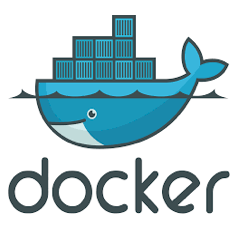
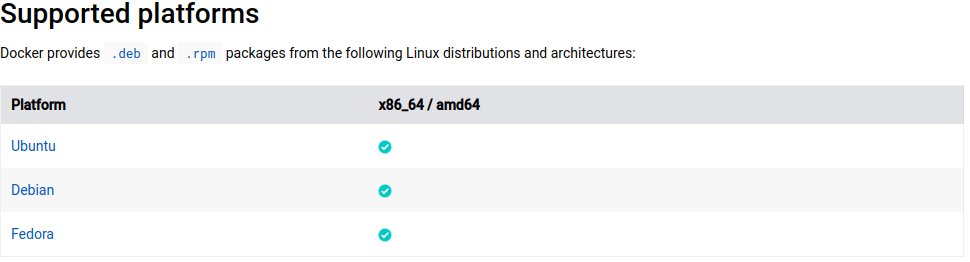
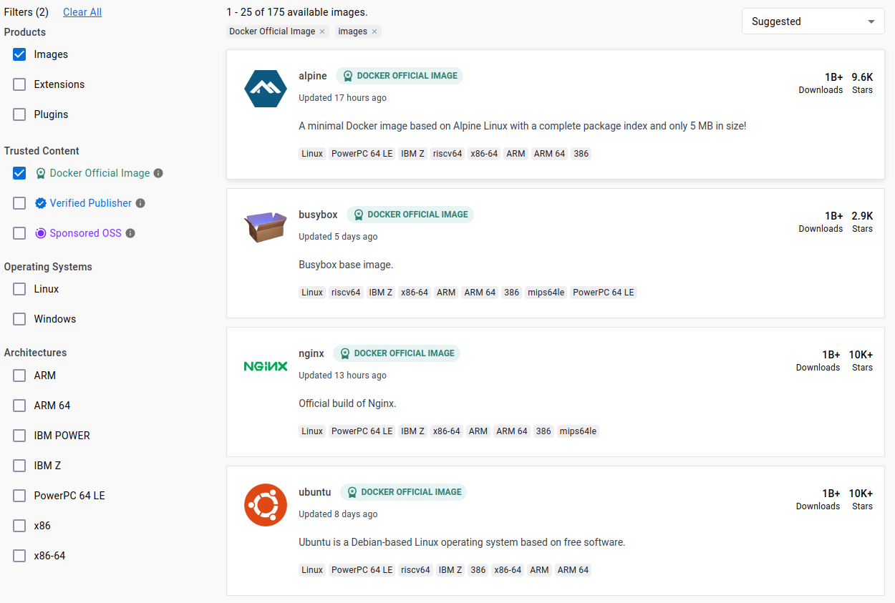

# Tema 4. Despliegue de aplicaciones

## 4.2. Uso básico de Docker

### 4.2.1. ¿Qué es Docker?

 

Docker es un gestor de contenedores open source, que automatiza el despliegue de aplicaciones en dichos contenedores. Un **contenedor** es una pieza de software con un sistema de ficheros completo, que contiene todo lo necesario para poder funcionar. Los contenedores sirven para distribuir y desplegar aplicaciones, de forma portable, estandarizada y autocontenida (sin necesidad de otras dependencias externas). Para ser más concretos, Docker permite gestionar contenedores Linux, permitiendo crear distintos entornos virtuales y ejecutar aplicaciones en ellos.

Podríamos ver Docker a priori como una alternativa a otras herramientas de virtualización, como VirtualBox o VMWare, pero existen ciertas ventajas y diferencias entre una cosa y otra, como veremos a continuación.

#### 4.2.1.1. Ventajas de usar Docker frente a máquinas virtuales

Entre las principales ventajas que ofrece Docker frente a utilizar una máquina virtual convencional, podemos citar las siguientes:

* Se tiene un **uso ligero de recursos**, al no ser necesario instalar ningún sistema operativo *guest* completo sobre el sistema anfitrión (*host*). Esto es posible gracias a que, al gestionar únicamente contenedores Linux, se pueden aislar las características básicas de dicho kernel, compartidas por varias distribuciones (Ubuntu, Red Hat, CentOS...). 
* Es **open source y multiplataforma**, puede instalarse sobre anfitriones Windows, Mac OS X e incluso algunos en la nube como AWS o Azure, aunque es preferible que dicho anfitrión sea una distribución Linux para tomar el kernel de él. En estos apuntes supondremos que vamos a utilizar Docker sobre una distribución Linux Debian.
* Es **portable**, ya que todas las dependencias de las aplicaciones se empaquetan en el propio contenedor, pudiendo llevarlo y ejecutarlo en cualquier *host*.
* La forma de **comunicar** contenedores entre sí es más sencilla que la comunicación entre máquinas virtuales. Mientras que para comunicar máquinas virtuales complejas necesitamos tener habilitados puertos entre ellas, en Docker se establecen puentes de comunicación (*bridges*), que hacen el proceso mucho más automático.

Así, por ejemplo, podríamos tener una ordenador con un sistema Debian instalado, y sobre él, mediante Docker, tener un contenedor corriendo CentOS, otro corriendo RedHat, o el mismo Debian, entre otras opciones. Pero no habrá que instalar físicamente ni CentOS, ni RedHat ni ninguna otra distribución como máquina virtual. De esta forma, el tamaño de las imágenes que se generan para los contenedores es mucho más reducido que el de una máquina virtual convencional.

#### 4.2.1.2. ¿Para qué se utiliza Docker?

El principal uso de Docker se da en arquitecturas orientadas a servicios, donde cada contenedor ofrece un servicio o aplicación, facilitando así su escalabilidad. Por ejemplo, podemos tener un contenedor ofreciendo un servidor Nginx, otro con un servidor MariaDB/MySQL, otro con MongoDB, y establecer comunicaciones entre ellos para compartir información.

**¿Quién utiliza Docker?**

Actualmente, Docker se utiliza en algunas empresas o webs de relevancia, como Ebay o Spotify. Además, tiene por detrás el soporte de empresas importantes, como Amazon o Google.

#### 4.2.1.3. Principales elementos de Docker

Antes de comenzar con la instalación y primeras pruebas con Docker, veamos qué elementos principales lo componen.

**El motor de Docker (*Docker engine*)**

Esta herramienta nos permitirá crear, ejecutar, detener o borrar contenedores. Necesita de un kernel de Linux para funcionar, e internamente se compone de una aplicación cliente y de un demonio. Con la primera, y mediante comandos, podemos comunicarnos con el segundo para enviar órdenes concretas (crear contenedor, ponerlo en marcha, etc.).

Actualmente (desde junio de 2017), a esta herramienta se le denomina *Docker CE* (*Community Edition*), y se desarrolla bajo un proyecto colaborativo llamado *Moby*. Paralelamente, existe la versión *Docker EE* (*Enterprise Edition*), más orientado a empresas grandes. Desde la versión 1.13 y la inclusión en el proyecto Moby, la numeración de las versiones de Docker ha cambiado, pasando de la 1.13 a la 17. Se han añadido nuevos comandos en las versiones recientes pero sigue habiendo compatibilidad con los comandos antiguos, que se pueden seguir utilizando.

**El archivo Dockerfile**

Para almacenar la configuración y puesta en marcha de un determinado contenedor, se utiliza un archivo de texto llamado *Dockerfile*, aunque, como veremos, también se pueden crear y lanzar contenedores sin este archivo. En él se incluyen distintas instrucciones para, entre otras cosas:

* Determinar el sistema operativo sobre el que se va a basar el contenedor
* Instalar y poner en marcha aplicaciones
* Definir ciertas variables de entorno
* ... etc.

Aquí podemos ver un ejemplo muy sencillo de archivo Dockerfile:

```
FROM ubuntu:latest
MAINTAINER Juan Pérez <juan.perez@gmail.com>
RUN apt-get update 
RUN apt-get install -y apache2
ADD 000-default.conf /etc/apache2/sites-available/
RUN chown root:root /etc/apache2/sites-available/000-default.conf
EXPOSE 80
CMD ["/usr/sbin/apache2ctl", "-D", "FOREGROUND"]
```

Analizando con algo de detalle sus líneas, podemos ver que:

* La primera línea especifica que el sistema operativo a emplear para el contenedor será Ubuntu. La versión se indica tras los dos puntos, y en este caso es la última, pero podríamos indicar alguna concreta por su nombre de pila, como por ejemplo "trusty" (versión 14) o "precise" (versión 12).
* La segunda línea alude al creador del archivo Dockerfile y su contacto, en caso de tener alguna duda o problema con el mismo.
* Las siguientes dos líneas actualizan los repositorios e instalan Apache, respectivamente. Se pueden poner comandos en líneas separadas, o enlazados en una sola línea.
* Las siguientes dos líneas añaden el virtual host por defecto a la carpeta de sitios disponibles de Apache, y le cambian su propietario a root.
* La línea con la instrucción EXPOSE hace público el puerto que se indique (el 80, en este caso), de forma que pueda ser accesible desde aplicaciones fuera del contenedor e incluso del sistema anfitrión.
* La última línea (CMD) debe ser única en cada contenedor. Indica lo que se va a ejecutar al iniciarse. En este caso, arrancamos apache en modo FOREGROUND (es decir, en primer plano). Si lo arrancáramos como servicio (por ejemplo, con CMD["service apache2 start"]), entonces el contenedor se cerraría inmediatamente, al no tener ningún proceso ejecutando en primer plano. Si hubiera más de una instrucción CMD definida en el archivo *Dockerfile*, sólo se considerará la última de ellas.

Existen otras instrucciones, como ENV para definir variables de entorno, pero la idea de la estructura y utilidad de un archivo *Dockerfile* puede haber quedado clara con este ejemplo sencillo.

### 4.2.2. Instalación y puesta en marcha

Veamos ahora cómo instalar Docker CE. La instalación puede hacerse de tres modos:

* En modo escritorio (*Docker Desktop*), que permite disponer de una interfaz gráfica para gestionar los contenedores y la configuración. Está disponible para sistemas Windows o Mac, por lo que no lo veremos aquí. Además, se necesitará alguna simulación de un kernel de Linux sobre el que apoyar Docker. Esto podrá hacerse con VirtualBox en versiones antiguas de Docker, o con otras herramientas más recientes como Hyper V o Hyper Kit. En cualquier caso, no veremos ninguna de estas opciones aquí.
* En modo servidor (*Docker Server*, a través de línea de comandos), podemos instalar Docker en distintas distribuciones de Linux, como CentOS, Debian, Fedora o Ubuntu.
* En modo *cloud*, donde podemos instalar Docker en AWS o Azure, entre otros sistemas. Los comandos Docker en este caso afectan a la infraestructura en la nube.

En el caso de las versiones CE, existe una versión estable (*Stable*) y otra última (*Edge*). Las primeras se lanzan trimestralmente, mientras que las segundas tienen una periodicidad mensual. En nuestro caso, utilizaremos la última versión estable disponible.

Trataremos el caso concreto de instalar Docker sobre un sistema Debian. Podemos encontrar más información respecto a la instalación y uso de Docker en la [documentación oficial de Docker](https://docs.docker.com/).

<div align="center">
     
</div>

Pulsando el botón de *Get Docker* podemos elegir la versión que se ajuste a nuestro sistema (Debian para Docker Server en modo servidor, en nuestro caso).

<div align="center">
     
</div>

Siguiendo los pasos de la [documentación oficial](https://docs.docker.com/install/linux/docker-ce/debian/), primero debemos desinstalar versiones antiguas de Docker (llamadas *docker*, *docker-engine* o *docker.io*), si las hubiera, con este comando:

```
sudo apt-get remove docker docker-engine docker.io containerd runc
```

Después ya podemos instalar Docker, de varias formas: desde repositorio (recomendado), instalando manualmente el paquete .deb, o desde algunos scripts que automatizan la instalación, y que suponen la única vía de instalación en sistemas como Raspberry Pi (Raspbian). 

En nuestro caso, haremos una instalación desde repositorio, y para ello seguiremos estos pasos (cada comando se escribe en una sola línea, aunque aquí aparezcan algunas cortadas en dos):

1. Actualizamos el índice de paquetes:

```
sudo apt-get update
```

2. Instalamos una serie de paquetes para permitir acceder a repositorios HTTPS:

```
sudo apt-get install apt-transport-https ca-certificates curl 
gnupg2 software-properties-common
```

3. Añadimos la clave GPG de Docker:

```
curl -fsSL https://download.docker.com/linux/debian/gpg | 
sudo apt-key add -
```

4. Tras esto, debemos verificar que tenemos la clave correctamente añadida, buscando sus últimos 8 dígitos:

```
sudo apt-key fingerprint 0EBFCD88
```

5. Añadimos el repositorio para la versión *stable*, en este caso, para sistemas x_86/amd64:

```
sudo add-apt-repository "deb [arch=amd64] 
https://download.docker.com/
linux/debian $(lsb_release -cs) stable"
```

6. Actualizamos de nuevo el índice de paquetes:

```
sudo apt-get update
```

7. E instalamos Docker:

```
sudo apt-get install docker-ce docker-ce-cli containerd.io
```

> **NOTA:** `containerd.io` es un "demonio de contenedores", un software que actúa monitorizando los contenedores que se creen, funcionando entre el sistema operativo y el software del propio contenedor, abstrayendo algunas funcionalidades para que el comportamiento del contenedor sea el mismo independientemente del sistema *host* sobre el que se está ejecutando.

Si queremos elegir una versión específica, podemos buscar las versiones disponibles con:

```
apt-cache madison docker-ce
```

Y luego establecer la versión a instalar añadiendo la cadena de versión obtenida desde el listado anterior:

```
sudo apt-get install docker-ce=17.12.0~ce-0~debian
docker-ce-cli=17.12.0~ce-0~debian containerd
```

Una vez que ya hemos instalado Docker, podemos probar que todo ha ido correctamente ejecutando la imagen de prueba `hello-world`, que mostrará un mensaje de saludo por pantalla y finalizará.

```
sudo docker run hello-world
```

También podemos verificar que esté correctamente instalado ejecutando el comando `docker` a secas (que sacará una lista con las opciones a indicar junto con el comando), o `docker version` (que mostrará la versión actualmente instalada).

Por defecto, el demonio de Docker se inicia automáticamente tras la instalación. Podemos habilitar o deshabilitar que se inicie con el sistema con estos comandos, respectivamente:

```
sudo systemctl enable docker
sudo systemctl disable docker
```

#### 4.2.2.1. Desinstalar Docker

Para desinstalar Docker del sistema, ejecutamos el comando:

```
sudo apt-get purge docker-ce 
```

También podemos eliminar las imágenes, contenedores, etc del sistema, borrando manualmente la carpeta `/var/lib/docker`:

```
sudo rm -rf /var/lib/docker
```

### 4.2.3. Creación y uso de contenedores

Ya hemos visto qué es Docker y cómo instalarlo. Veamos ahora cómo crear distintos tipos de contenedores y qué operaciones útiles podemos emplear en ellos. Conviene tener presente que la mayoría de comandos `docker` que se indican a continuación requerirán de los permisos adecuados (*root/sudo*) para poderlos utilizar.

#### 4.2.3.1. Las imágenes: el hub de Docker

Para crear un contenedor, necesitamos disponer de una imagen Docker. Existen multitud de sitios desde donde descargar imágenes de sistemas utilizables en Docker, pero quizá el lugar más interesante de todos sea el **hub de Docker** (*Docker Hub*), en [esta URL](https://hub.docker.com/).

<div align="center">
     
</div>

A modo de GitHub específico para Docker, en esta web los usuarios suben imágenes creadas o personalizadas por ellos mismos, para que el resto de la comunidad las pueda utilizar y/o adaptar. Existen algunos repositorios importantes, como el de Apache, Nginx, Node, MongoDB o MySQL, con estas aplicaciones ya instaladas y listas para poderse utilizar. Veremos más tarde algún ejemplo sobre ello.

Para buscar alguna imagen que nos pueda interesar, podemos emplear el comando `docker search` con la palabra clave (por ejemplo, "mongodb"), y ver qué imágenes hay disponibles sobre este elemento, junto con su valoración (*STARS*), si contienen archivo *Dockerfile* para construir contenedores automáticamente (*AUTOMATED*) y alguna descripción adicional. Las imágenes aparecen ordenadas por valoración:

```
docker search mongodb

NAME          DESCRIPTION           STARS  OFFICIAL AUTOMATED ...
mongo         MongoDB document...   4148   [OK]               ...
mongo-express Web-based MongoDB...  223    [OK]               ...
tutum/mongodb MongoDB Docker...     218             [OK]      ...
...
```

Desde el propio cliente/terminal de Docker podemos descargar las imágenes con:

```
docker pull nombre_imagen
```

Para ver las imágenes que tenemos disponibles en el sistema, podemos escribir:

```
docker images
```

Y aparecerá un listado con el nombre de la imagen, su versión, y el tamaño que ocupa, entre otros datos. Por ejemplo:

```
REPOSITORY    TAG      IMAGE ID      CREATED       SIZE
busybox       latest   5b0d59026729  3 weeks ago   1.15MB
alpine        latest   3fd9065eaf02  5 weeks ago   4.15MB
hello-world   latest   f2a91732366c  3 months ago  1.85kB
```

Docker permite albergar un número elevado de imágenes en local, pero aún así, si queremos eliminar una imagen del listado porque ya no la vayamos a utilizar (y siempre que no esté siendo utilizada por ningún contenedor), podemos hacerlo con `docker rmi`, seguido del id de la imagen (según el listado anterior):

```
docker rmi f2a91732366c
```

#### 4.2.3.2. Descarga de imágenes

Vamos a probar a descargar una imagen para unas primeras pruebas de comandos sencillos. Probaremos con una imagen muy ligera, llamada ***alpine***, que contiene un conjunto de herramientas básicas para trabajo sobre un kernel de Linux. Descargamos la imagen con este comando:

```
docker pull alpine
```

Al no indicar versión, nos informará por terminal de que se descargará la última (*latest*). En el caso de querer especificar versión, se puede indicar a modo de tag, poniendo dos puntos tras el nombre de la imagen, y después el nombre de la versión:

```
docker pull alpine:3.5
```

La imagen de Alpine es una imagen muy ligera (unos 4MB), que podemos comprobar que está descargada con el comando `docker images`; dicho comando muestra un listado con las imágenes descargadas, versión, *id* asignado, tamaño, etc:

```
docker images

REPOSITORY  TAG     IMAGE ID     CREATED      SIZE
alpine      latest  3fd9065eaf02 5 weeks ago  4.15MB
```

#### 4.2.3.3. Ejecución sencilla de contenedores

Veamos ahora cómo creary lanzar algún que otro contenedor sencillo a partir de las imágenes que obtengamos de los repositorios anteriores. El siguiente comando **lanza un contenedor** con la imagen *alpine* descargada previamente, **y ejecuta un comando** `echo` sobre dicho contenedor:

```
docker run alpine echo "Hola mundo"
```

> **NOTA**: si al ejecutar `docker run` la imagen no se encuentra disponible en nuestro equipo, se descargará como paso previo, antes de poner en marcha el contenedor sobre ella.

En este caso, obtendremos por pantalla "Hola mundo" y finalizará el proceso. Podemos consultar los contenedores activos con el comando `docker ps`. Si lo ejecutamos no obtendremos ninguno en la lista, puesto que el comando anterior ya finalizó. Pero podemos consultar los contenedores creados (detenidos o en ejecución) con `docker ps -a`:

```
CONTAINER ID  IMAGE   COMMAND               CREATED       ... 
3fd9065eaf02  alpine  "echo 'Hola mundo'"   2 minutes ago ...
```

Con este ejemplo que hemos visto, podemos empezar a entender cómo se usan y para qué sirven los contenedores. Su filosofía es muy sencilla: ejecutar un comando o programa y finalizar (o dejarlo en ejecución). De este modo, podemos lanzar varios contenedores sobre una misma imagen, y cada uno se encargará de ejecutar una tarea o proceso diferente (o el mismo varias veces).

Este otro ejemplo lanza un contenedor con la imagen *alpine*, y **abre un terminal interactivo** en él, de forma que podemos escribir comandos sobre el terminal que actuarán sobre la imagen almacenada en el contenedor y su sistema de archivos. Para finalizar la ejecución del contenedor, basta con que escribamos el comando `exit` en el terminal:

```
docker run -it alpine /bin/sh
```

Podemos **especificar el nombre** (*name*) que se le da, para no tener que estar buscando después el id o el nombre que Docker genera automáticamente. Para ello, utilizaremos el parámetro `--name`:

```
docker run -it --name alpine_nacho alpine /bin/sh
```

Otra opción que puede resultar útil es **ejecutar un contenedor sin almacenar su estado en la lista**, con lo que se borra automáticamente al finalizar. Esto se consigue con la opción `-rm`:

```
docker run -rm alpine echo "Hola mundo"
```

En el caso de querer **ejecutar un contenedor en segundo plano** (como si fuera un demonio), se hace con el parámetro `-d`. En este caso, no mostrará ningún resultado por pantalla, y liberará el terminal para poder hacer otras operaciones. Esta opción es útil para lanzar contenedores relacionados con servidores (bases de datos, servidores web...), y dejarlos así en marcha sin bloquear el terminal.

```
docker run -d imagen
```

Asociado con el comando anterior, si por lo que fuera se produjera algún mensaje de error o de salida, para poderlo consultar emplearemos el comando docker logs, seguido del id del contenedor ejecutado:

```
docker logs f2e
```

#### 4.2.3.4. Parada y borrado de contenedores

Para finalizar un contenedor actualmente en ejecución, podemos ejecutar el comando `docker stop` junto con el id del contenedor (o el nombre), obtenido con el propio `docker ps` anterior:

```
docker stop f2e5a1629beb
```

También podemos escribir nada más el principio del id, siempre que sirva para diferenciarlo del resto:

```
docker stop f2e
```

Podemos eliminar el contenedor de la lista de contenedores, siempre que no esté activo, con el comando `docker rm`, pasándole el id del contenedor (o el principio del mismo):

```
docker rm f2e5a1629beb
```

En el caso de que el contenedor esté en la lista de contenedores y haya finalizado su ejecución (visible con `docker ps -a`), podemos volverlo a lanzar fácilmente con el comando `docker start`, seguido del id o del nombre del contenedor:

```
docker start f2e5a1629beb
```

#### 4.2.3.5. Asociar recursos del host al contenedor

Es muy habitual en ciertas ocasiones asociar algún recurso del sistema *host* al contenedor, de forma que desde el contenedor se pueda acceder o comunicar con dicho recurso del *host*. En concreto, veremos a continuación cómo asociar puertos y carpetas.

Para lanzar un contenedor y **asociar un puerto** del sistema *host* con un puerto del contenedor, se emplea el parámetro `-p`, indicando primero el puerto del *host* que se comparte, y después, seguido de dos puntos `:`, el puerto del contenedor por el que se comunica. Podemos repetir este parámetro más de una vez para asociar más de una pareja de puertos.

Por ejemplo, el siguiente comando asocia el puerto 80 del *host* con el puerto 80 del contenedor, y el puerto 8080 del host con el 3000 del contenedor, de forma que las peticiones que lleguen al *host* por los puertos 80 y 8080, respectivamente, se enviarán al contenedor.

```
docker run -p 80:80 -p 8080:3000 alpine:apache
```

Si queremos **asociar una carpeta del *host*** a una carpeta del contenedor, se emplea el parámetro `-v`, indicando primero la carpeta del *host*, seguida de dos puntos `:`, y luego la carpeta del contenedor. Por ejemplo, el siguiente comando asocia la carpeta `~/data` del *host* con la carpeta `/data/db` del contenedor asociado a una imagen `mongo`, comunicando los dos puertos por defecto, de forma que los datos que se añadan sobre el contenedor se van a almacenar en la carpeta `~/data` de nuestro sistema *host*. Además, lanza el contenedor en segundo plano para que el servidor quede ejecutando sin bloquear el terminal.

```
docker run -d -p 27017:27017 -v ~/data:/data/db mongo
```

#### 4.2.3.6. Arrancar contenedores Docker con el sistema

Ahora que ya sabemos cómo lanzar contenedores Docker para alojar nuestros servicios (servidores web, bases de datos, etc), es conveniente también saber cómo ponerlos en marcha al arrancar el sistema, por si éste sufre cualquier reinicio inesperado. 

Para ello, haremos uso del parámetro `--restart`, pasándole la opción de reinicio que queramos:

* `no`: para no reiniciar el contenedor automáticamente (opción por defecto)
* `on-failure`: se reiniciará si se cerró debido a un error
* `always`: se reiniciará siempre que se detenga (aunque lo detengamos nosotros manualmente con `docker stop`)
* `unless-stopped`: se reiniciará siempre que no lo hayamos detenido nosotros manualmente.

Así, por ejemplo, reiniciaríamos automáticamente un contenedor con *alpine*:

```
docker run --restart unless-stopped alpine
```

> **NOTA:** si se reinicia el sistema y tenemos el demonio de `docker` habilitado como servicio, dicho demonio se reiniciará también, y pondrá en marcha todos los contenedores que tengan configurada apropiadamente su opción de `--restart`.


### 4.2.4. Creación de imágenes

En la sección anterior hemos visto cómo lanzar de distintas formas contenedores de terceras partes. Pero una interesante utilidad de Docker consiste en poder instalar el software que necesitemos sobre un contenedor, ejecutarlo, y también hacer una imagen personalizada del contenedor modificado, para poderla reutilizar las veces que queramos.

Ahora vamos a ver cómo podemos crear nuestras propias imágenes, para poderlas lanzar en contenedores, o distribuir a otros equipos. Veremos dos formas de hacerlo: ejecutando el contenedor e instalando el software necesario, o a través de archivos de configuración *Dockerfile*.

#### 4.2.4.1. Instalar aplicaciones y crear imágenes personalizadas

Vamos a hacer un ejemplo sencillo a partir de la imagen Alpine utilizada antes. Esta imagen por defecto no viene con el editor *nano* instalado, así que vamos a instalarlo, y a crear una nueva imagen con ese software ya preinstalado.

Lo primero que haremos será ejecutar la imagen original en modo interactivo, como en algún ejemplo anterior:

```
docker run -it alpine /bin/sh
```

Una vez dentro del terminal, instalamos nano con estos comandos:

```
apk update
apk upgrade
apk add nano
```

Tras esto, podemos probar a abrir el editor con el comando `nano`, y ya podemos cerrar el contenedor con exit.

Una vez definido el contenedor, para crear una imagen a partir de él emplearemos el comando `docker commit`. Este comando acepta una serie de parámetros, donde podemos especificar el autor de la imagen, la versión, etc. Antes de nada, debemos averiguar el id del contenedor que queremos utilizar para la imagen (con `docker ps -a`). Supongamos para este ejemplo que el id es f2e5a1629beb. En este caso, podemos crear una imagen del mismo con un comando como éste:

```
docker commit -a "Nacho Iborra <nachoiborra@iessanvicente.com>"  
f2e5a1629beb nacho/alpine:nano
```

En el parámetro `-a` indicamos el autor y e-mail del mismo, después indicamos el id del contenedor a utilizar, y finalmente indicamos un nombre de repositorio con unos tags opcionales que ayuden a identificar la imagen. En este caso indicamos que es una versión particular de la imagen alpine con *nano* instalado en ella.

Tras este comando, podemos localizar la imagen en el listado de imágenes con `docker images`:

```
REPOSITORY    TAG      IMAGE ID     ...
nacho/alpine  nano     1a3e882f228a ...
alpine        latest   3fd9065eaf02 ...
```

A partir de este momento, podemos utilizar esta imagen para lanzar contenedores, como en este ejemplo:

```
docker run -it nacho/alpine:nano /bin/sh
```

Así podemos crear imágenes a medida con cierto software base preinstalado.

#### 4.2.4.2. Crear imágenes a partir de archivos *Dockerfile*

Veamos en esta sección cómo emplear el archivo de configuración *Dockerfile* para crear imágenes Docker personalizadas de una forma más automatizada, sin tener que entrar por terminal en el contenedor e instalar los programas, como hemos hecho en el apartado anterior.

Vamos a crear una imagen similar a la del apartado anterior: partiendo de una base Alpine, instalaremos *nano* en ella y crearemos la imagen. En primer lugar, debemos crear un archivo llamado *Dockerfile* en nuestra carpeta de trabajo. El contenido del archivo será el siguiente:

```
FROM alpine:latest
MAINTAINER Nacho Iborra <nachoiborra@iessanvicente.com>
RUN apk update
RUN apk upgrade
RUN apk add nano
CMD ["/bin/sh"]
```

En la primera línea (FROM) indicamos la imagen base sobre la que partir (última versión de la imagen alpine), y en la segunda (MAINTAINER) los datos de contacto del creador de la imagen. Después, con la instrucción RUN podemos ejecutar comandos dentro de la imagen, como hemos hecho previamente. En este caso, actualizamos el sistema e instalamos *nano*. Finalmente, la instrucción CMD es obligatoria para crear contenedores, e indica lo que van a ejecutar (todos los contenedores deben ejecutar algo). En este caso indicamos que ejecute el terminal.

A partir de este archivo *Dockerfile*, en la misma carpeta donde está, ejecutamos el comando `docker build` para crear la imagen asociada.

```
docker build -t nacho/alpine:nano .
```

El parámetro `-t` sirve para asignar tags a la imagen. En este caso, indicamos que es la versión con *nano* incorporada de la imagen alpine. También podemos utilizar este tag múltiples veces, para asignar diferentes. Por ejemplo, indicar el número de versión, y que además es la última disponible:

```
docker build -t nacho/alpine:1.0 -t nacho/alpine:latest .
```

Una vez creada la imagen, la tendremos disponible en nuestro listado `docker images`:

```
REPOSITORY      TAG         IMAGE ID      ...
nacho/alpine    nano        6800a48a4d68  ...
alpine          latest      3fd9065eaf02  ...
```

Y podremos ejecutarla en modo interactivo. En este caso no hace falta que indiquemos el comando a ejecutar, ya que lo hemos especificado en el archivo *Dockerfile* (el terminal):

```
docker run -it nacho/alpine:nano
```

#### 4.2.4.3. Ubicación de las imágenes. Copia y restauración.

Las imágenes que descargamos, y las que creamos nosotros de forma manual, se ubican por defecto en la carpeta `/var/lib/docker`, aunque dependiendo de la fuente y el formato de la imagen, se localizan en una u otra subcarpeta, y con uno u otro formato.

La principal utilidad que puede tener conocer la ubicación de las imágenes es el poderlas llevar de una máquina *host* a otra. Para ello, podemos emplear el comando `docker save`, indicando el nombre del archivo donde guardarla, y el nombre de la imagen a guardar:

```
docker save -o <path_a_archivo> <nombre_imagen>
```

Por ejemplo:

```
docker save -o /home/alumno/mi_imagen.tar nacho/alpine:nano
```

Se generará un archivo TAR que podremos llevar a otra parte. En la nueva máquina, una vez copiado el archivo, podemos cargar la imagen que contiene en la carpeta de imágenes de Docker con `docker load`:

```
docker load -i <path_a_archivo>
```
